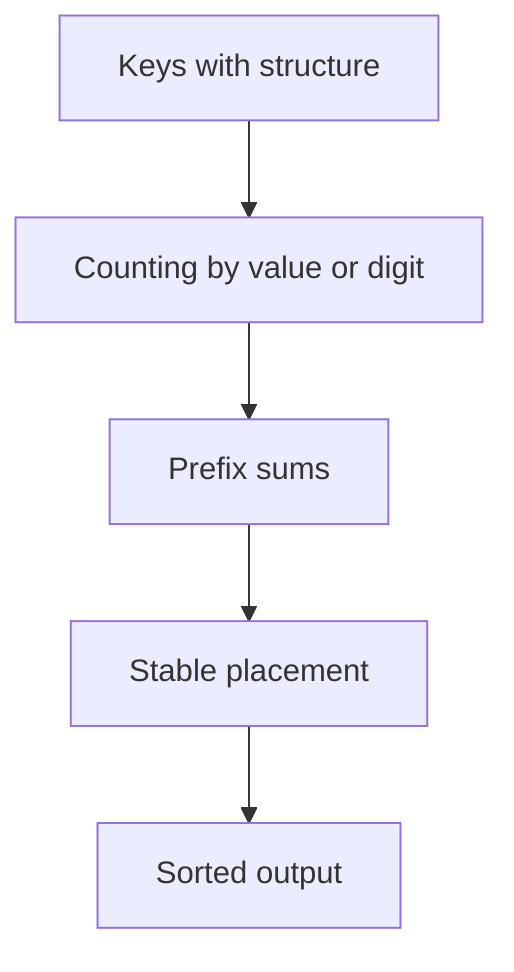
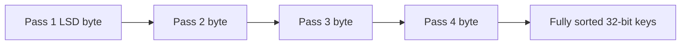
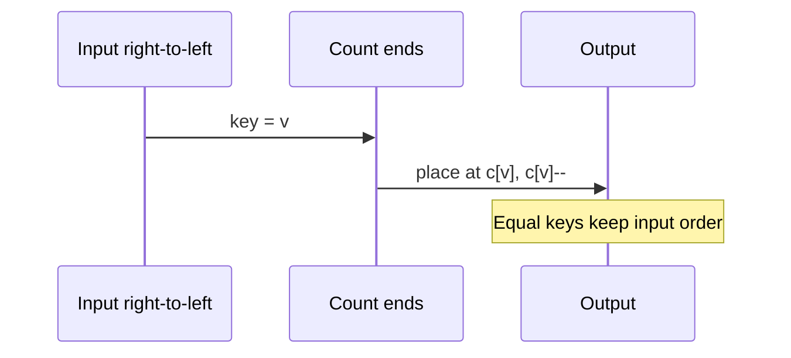

# Counting Radix and Bucket Sort

## Overview

**Distribution sorts** bypass the Ω(n log n) comparison lower bound by exploiting **key structure**: bounded integer range (counting sort), fixed-width digits (radix sort), or smooth key distribution into buckets (bucket sort). They achieve **O(n + k)** or **O(d · (n + r))** time when parameters k (range), d (digits), or r (radix) are controlled.

All can be made **stable** with careful accumulation order—critical when used as subroutines in radix sort or multi-pass pipelines.

## Learning Objectives

- Implement stable counting sort with prefix sums
- Distinguish LSD vs MSD radix sort and stability requirements
- Analyze bucket sort expected O(n) vs worst O(n²)
- Identify when distribution sorts beat comparison sorts in production
- Map key assumptions to failure modes when assumptions break

## Prerequisites

- [[05-Algorithms/03-Sorting/Sorting Contracts Stability and Adaptivity|Sorting Contracts Stability and Adaptivity]]
- [[05-Algorithms/01-Complexity-and-Analysis/Cost Models and Input Size|Cost Models and Input Size]]

## Difficulty

`intermediate`

## Estimated Time

- Reading: 2 hours
- Exercises: 3 hours
- Mini project: 5 hours

## History

Counting sort is classical in card-sorting machines. Radix sort (LSD) processes digits like card sorters. Bucket sort assumes uniform distribution—common in graphics and hashing contexts. Modern systems use radix for **fixed-width keys** (IPv4, timestamps with fixed precision, machine integers).

## Problem It Solves

Sorting n integers in `[0..k)` with k ≈ n or small: comparison sort wastes Ω(n log n). Counting/radix sorts linear in n + range. Example: sorting 10M user IDs in `[0..2³²)` is infeasible with counting (k too large) but feasible with **4-byte LSD radix** (256 buckets per byte, 4 passes).

## Internal Implementation

### Counting sort (stable)

1. Count frequencies `c[x]` for each key x.
2. Prefix sum: `c[x] += c[x−1]` → ending positions.
3. Scan input **right-to-left**, place into output at `c[key]--`.

### LSD radix sort

For each digit position (least significant first), stable sort by that digit—counting sort with r = 10 or 256 buckets.

### Bucket sort

Map key `x` to bucket `⌊n · f(x)⌋`; sort buckets individually (insertion sort); concatenate.



## Correctness

**Counting sort**

- **Invariant**: After prefix sums, `c[v]` equals count of keys ≤ v.
- **Stable placement**: Decrementing ending positions while scanning right-to-left preserves relative order for equal keys.

**Radix sort (LSD)**

- **Invariant**: After i digit passes, keys are sorted on least significant i digits.
- Requires **stable** digit sort each pass—counting sort satisfies this.

**Bucket sort**

- **Correct** if buckets partition key space and within-bucket sort correct.
- **Assumption**: `f` maps keys to buckets without collisions that break order globally.

## Complexity

| Algorithm | Time | Extra space | Stable | Key assumption |
| --- | --- | --- | --- | --- |
| Counting | O(n + k) | O(n + k) | Yes | Keys in `[0..k)` |
| LSD radix | O(d · (n + r)) | O(n + r) per pass | Yes | d digits, radix r |
| MSD radix | O(n · d) typical | O(n + r) stack | Yes | Variable length possible |
| Bucket | O(n) expected | O(n) | Yes* | Uniform distribution |

\*If bucket sort uses stable inner sort.

**Comparison barrier**: These are not comparison sorts; they require numeric/digit structure.

Worst bucket sort: all keys in one bucket → O(n²) if insertion sort inner.

## Mermaid Diagrams

### Structure: LSD radix passes



### Sequence: stable counting sort placement



## Examples

### Minimal Example

**TypeScript**:

```typescript
export function countingSort(a: number[], k: number): number[] {
  const c = new Array(k + 1).fill(0);
  for (const x of a) c[x]++;
  for (let i = 1; i <= k; i++) c[i] += c[i - 1];
  const out = new Array(a.length);
  for (let i = a.length - 1; i >= 0; i--) {
    const x = a[i];
    out[--c[x]] = x;
  }
  return out;
}

export function lsdRadixSort(a: number[]): void {
  const max = Math.max(...a, 0);
  let exp = 1;
  const base = 256;
  let buf = a.slice();
  while (max / exp >= 1) {
    countingSortByDigit(buf, a, exp, base);
    [buf, a] = [a, buf];
    exp *= base;
  }
  if (buf !== a) a.splice(0, a.length, ...buf);
}

function countingSortByDigit(
  inArr: number[],
  outArr: number[],
  exp: number,
  base: number
): void {
  const c = new Array(base).fill(0);
  for (const x of inArr) c[Math.floor(x / exp) % base]++;
  for (let i = 1; i < base; i++) c[i] += c[i - 1];
  for (let i = inArr.length - 1; i >= 0; i--) {
    const d = Math.floor(inArr[i] / exp) % base;
    outArr[--c[d]] = inArr[i];
  }
}
```

**Python**:

```python
def counting_sort(a: list[int], k: int) -> list[int]:
    c = [0] * (k + 1)
    for x in a:
        c[x] += 1
    for i in range(1, k + 1):
        c[i] += c[i - 1]
    out = [0] * len(a)
    for x in reversed(a):
        c[x] -= 1
        out[c[x]] = x
    return out


def lsd_radix_sort(a: list[int]) -> list[int]:
    if not a:
        return a
    max_val = max(a)
    exp = 1
    base = 256
    arr = a[:]
    buf = [0] * len(a)
    while max_val // exp >= 1:
        c = [0] * base
        for x in arr:
            c[(x // exp) % base] += 1
        for i in range(1, base):
            c[i] += c[i - 1]
        for x in reversed(arr):
            d = (x // exp) % base
            c[d] -= 1
            buf[c[d]] = x
        arr, buf = buf, arr
        exp *= base
    return arr
```

### Production-Shaped Example

Sorting fixed-width `(timestamp, id)` pairs: radix on timestamp bytes; use **stable** digit passes so equal timestamps preserve id order (audit requirement).

```typescript
type Event = { ts: number; id: bigint };

function sortEvents(events: Event[]): void {
  // Radix on ts only if id tie-break encoded in stable passes
  // or sort by composite 128-bit key with 16-byte radix
}
```

When k > n² or keys unbounded strings, fall back to comparison sort or specialized string sorts ([[05-Algorithms/11-String-and-Sequence-Algorithms/Suffix Arrays and LCP Concepts|Suffix Arrays and LCP Concepts]]).

## Trade-offs

| Dimension | Upside | Downside | When it matters |
| --- | --- | --- | --- |
| Time | Linear in n + range | Range explosion | ID sorting |
| Space | O(n + k) counts | k huge → impossible | Memory caps |
| Stability | Achievable | Must implement carefully | Radix passes |
| Generality | Fast for integers | Wrong for general compare | API design |
| Bucket | Simple parallel buckets | Worst case clustered | Histogram-like keys |

### When to Use

- Small integer range k = O(n)
- Fixed-width machine integers (32/64-bit radix)
- Float keys with known distribution (careful bucket design)

### When Not to Use

- Arbitrary string/locale sort without digit model
- k exponentially larger than n
- Comparison-only black-box keys

## Exercises

1. Sort `[2,5,3,2,3]` with k=5; show count array after each phase.
2. Why must LSD radix use stable digit sort?
3. Construct input making bucket sort O(n²).
4. For n=10⁶, keys uniform in `[0..10⁹)`, can counting sort work? What about 4-pass byte radix?
5. Prove counting sort is stable given right-to-left placement.

## Mini Project

Benchmark radix vs `Array.sort` on 32-bit random integers at n = 10⁵, 10⁶.

## Portfolio Project

Add integer sort lane to [[05-Algorithms/projects/Sorting and Selection Bake-Off/README|Sorting and Selection Bake-Off]] with certificate checks.

## Interview Questions

1. Why is counting sort O(n + k) not O(n log n)?
2. Explain one LSD radix pass on 3-digit decimal numbers.
3. When does bucket sort degrade to quadratic?
4. Is radix sort stable? How?
5. Compare counting sort vs merge sort for n=10⁷ keys in `[0..100]`.

### Stretch / Staff-Level

1. Design MSD radix for variable-length UTF-8 strings—what breaks stability?
2. How do GPU radix sorts relate to LSD passes (conceptual)?

## Common Mistakes

- Left-to-right placement in counting sort → instability
- Using counting sort when k is huge (memory blowup)
- Forgetting signed integer encoding (two's complement radix needs bias)
- Bucket index formula off-by-one at boundaries

## Best Practices

- Validate key range in API preconditions
- Use byte-wise radix for 32/64-bit keys in practice
- Pair with stability tests when used in multi-field sorts
- Fall back to comparison sort when key model unknown

## Summary

Counting, radix, and bucket sorts exploit key structure to beat comparison lower bounds, trading generality for O(n + parameter) time. Stable counting is the engine of LSD radix; bucket sort needs distribution assumptions. Production use demands explicit key contracts—otherwise comparison sorts remain the safe default.

## Further Reading

- [[00-References/Algorithms/README|Algorithms References]]
- [[05-Algorithms/01-Complexity-and-Analysis/Lower Bounds Decision Trees and Adversaries|Lower Bounds Decision Trees and Adversaries]]

## Related Notes

- [[05-Algorithms/03-Sorting/Sorting Contracts Stability and Adaptivity|Sorting Contracts Stability and Adaptivity]]
- [[05-Algorithms/03-Sorting/Merge Sort|Merge Sort]]
- [[05-Algorithms/03-Sorting/External Sorting Concepts and Production Selection|External Sorting Concepts and Production Selection]]
- [[05-Algorithms/01-Complexity-and-Analysis/Cost Models and Input Size|Cost Models and Input Size]]
- [[05-Algorithms/README|Algorithms Track]]

## Progress Checklist

- [ ] Explained from first principles
- [ ] Drew at least one Mermaid diagram
- [ ] Implemented a minimal version
- [ ] Documented trade-offs and non-goals
- [ ] Completed exercises
- [ ] Practiced interview questions aloud
- [ ] Linked prerequisites and dependents
