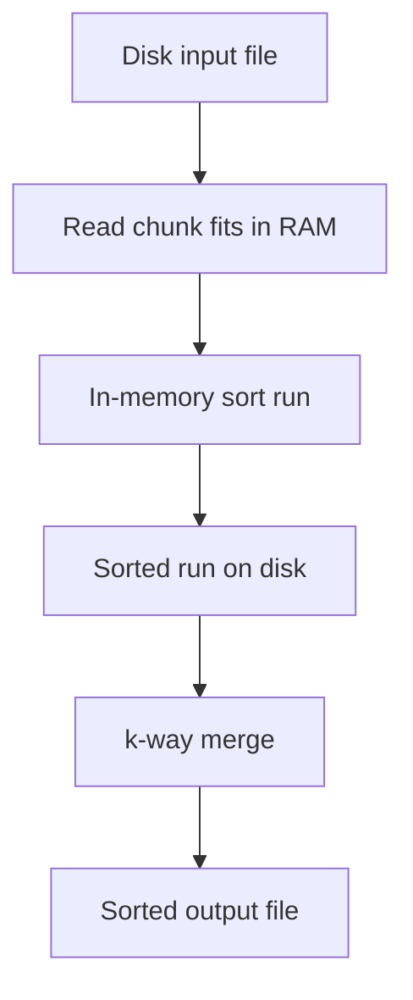
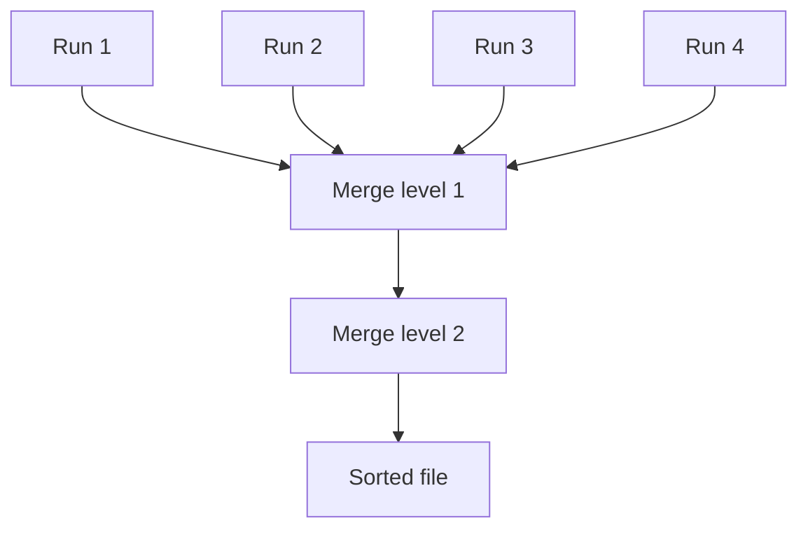
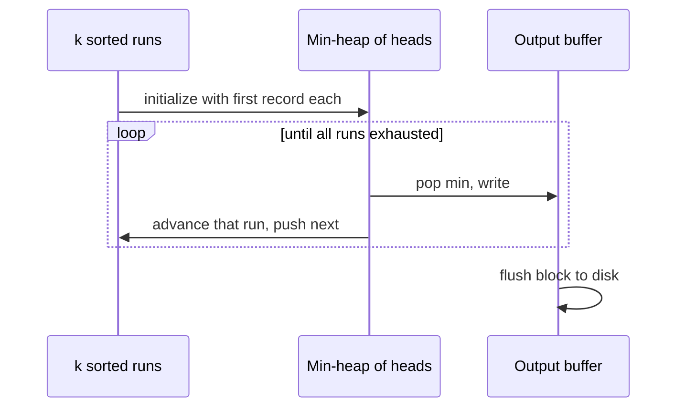

# External Sorting Concepts and Production Selection

## Overview

**External sorting** orders datasets larger than RAM using **sequential I/O** and **multi-pass merge** of sorted **runs**. The algorithmic pattern is: chunk input → in-memory sort each chunk → write runs → **k-way merge** runs to output. Complexity is analyzed in the **I/O model**: minimize block transfers between disk and memory, not just CPU comparisons.

This note covers **concepts and selection** for engineers choosing sort strategies. **Storage engine internals** ([[08-Databases/01-Storage-and-Buffer-Pool/Buffer Pool vs OS Page Cache|buffer pools]], [[08-Databases/02-WAL-Durability-and-Recovery/Write-Ahead Logging Protocol|WAL]], B-tree bulk load, [[08-Databases/04-Query-Processing-and-Planning/Parse Bind Plan Execute Pipeline|query planner sort nodes]]) belong to [[08-Databases/README|Databases]]—referenced here as handoff, not duplicated.

## Learning Objectives

- Explain the external merge sort phases and I/O cost model
- Relate memory budget M, block size B, and pass count for n records
- Choose in-memory algorithm families under stability/latency contracts
- Identify when sort is unnecessary (indexes, partial order, top-k)
- Map production symptoms to wrong sort assumptions

## Prerequisites

- [[05-Algorithms/03-Sorting/Merge Sort|Merge Sort]]
- [[05-Algorithms/03-Sorting/Sorting Contracts Stability and Adaptivity|Sorting Contracts Stability and Adaptivity]]
- [[05-Algorithms/01-Complexity-and-Analysis/Practical Constants Locality and Benchmark Design|Practical Constants Locality and Benchmark Design]]

## Difficulty

`advanced`

## Estimated Time

- Reading: 2 hours
- Exercises: 3 hours
- Mini project: 6 hours

## History

Tape-based merge sort drove early business data processing. Disk-based external sort remains central to **batch ETL**, **CREATE INDEX** operations, and **ORDER BY** spill paths—implemented inside database engines rather than application `sort()` calls.

## Problem It Solves

Loading 500GB into RAM to call quicksort fails. External sorting trades **multiple sequential passes** for bounded memory. Wrong selection causes **sort spills** (hours-long queries), unstable audit reordering, or O(n²) comparison sorts on nearly sorted runs when adaptivity was available.

## Internal Implementation

### Phase outline

1. **Run generation**: Read ≤ M bytes, sort in RAM (often merge sort or radix for keys), write sorted run file.
2. **Merge passes**: Maintain a **min-heap** of size k (one head per run)—k-way merge; write merged run or final output.
3. **Repeat** until one run remains.

**I/O cost sketch**: With memory holding ~M/B blocks, merging n/M runs may need multiple merge levels; optimized engines use **replacement selection** (conceptually: longer initial runs) and **parallel merge**—details in Databases track.



### Production selection matrix (in-memory vs external)

| Scenario | Typical choice | Contract notes |
| --- | --- | --- |
| n small, general keys | Library adaptive sort (Timsort) | Stable, in-process |
| n large, RAM fits | Introsort / radix by key type | Benchmark constants |
| n > RAM | External merge | I/O dominates; Databases |
| top-k only | Quickselect, heap of k | Avoid full sort |
| almost sorted append log | Insertion/adaptive or skip sort | See contract note |
| stable multi-key | Stable merge or decorate | Audit |

## Correctness

**External merge correctness** reduces to:

- Each run is sorted (in-memory sort postcondition).
- k-way merge outputs globally sorted sequence if merge picks minimum head each step (same merge invariant as [[05-Algorithms/03-Sorting/Merge Sort|Merge Sort]]).
- **Stability** preserved if merge prefers earlier run on equal keys.

**Permutation**: External sort must not drop/duplicate records—frame with record counts and checksums per run in production pipelines.

## Complexity

**I/O model** (simplified): Let n items, memory M blocks, block size B.

- Run creation: Θ(n/B) I/Os to read/write all data once (constant passes depending on replacement selection).
- Merge levels: O((n/B) · log_{M/B}(n/M)) block I/Os in standard analysis (Aggarwal–Vitter model intuition).

**CPU** inside memory: dominated by in-memory sort—O(r log r) per run of size r.

**Contrast**: In-memory comparison sort Ω(n log n) comparisons; external sort often **I/O-bound**—comparison counts secondary.

## Mermaid Diagrams

### Structure: merge levels



### Sequence: k-way merge with heap



Heap mechanics: [[04-Data-Structures/06-Heaps-and-Priority-Queues/Priority Queue ADT|Priority Queue ADT]].

## Examples

### Minimal Example

**TypeScript** — conceptual external sort driver (in-memory chunks only):

```typescript
async function externalSortConceptual(
  readChunk: () => Promise<number[] | null>,
  writeRun: (sorted: number[]) => Promise<void>,
  mergeRuns: (runs: AsyncIterable<number>[]) => AsyncIterable<number>
): Promise<void> {
  const runs: AsyncIterable<number>[] = [];
  for (;;) {
    const chunk = await readChunk();
    if (!chunk || chunk.length === 0) break;
    chunk.sort((a, b) => a - b);
    await writeRun(chunk);
    runs.push(async function* () { yield* chunk; }());
  }
  for await (const x of mergeRuns(runs)) {
    // write final output
    void x;
  }
}
```

**Python**:

```python
import heapq
from typing import Iterable, Iterator, List, Tuple


def k_way_merge(runs: List[Iterator[int]]) -> Iterable[int]:
    heap: List[Tuple[int, int]] = []
    for i, it in enumerate(runs):
        try:
            v = next(it)
            heapq.heappush(heap, (v, i))
        except StopIteration:
            pass
    while heap:
        v, i = heapq.heappop(heap)
        yield v
        try:
            heapq.heappush(heap, (next(runs[i]), i))
        except StopIteration:
            pass


def make_runs(data: Iterable[int], chunk_size: int) -> List[List[int]]:
    runs: List[List[int]] = []
    buf: List[int] = []
    for x in data:
        buf.append(x)
        if len(buf) >= chunk_size:
            buf.sort()
            runs.append(buf)
            buf = []
    if buf:
        buf.sort()
        runs.append(buf)
    return runs
```

### Production-Shaped Example

An analytics job sorts 200GB CSV on a 16GB machine:

- **Wrong**: `rows.sort()` after loading entire file → OOM kill.
- **Right**: streaming run generation + k-way merge; or push `ORDER BY` to [[08-Databases/04-Query-Processing-and-Planning/Parse Bind Plan Execute Pipeline|query planner]] with spill-aware planner.
- **Contract**: stable sort on `(date, eventId)` → stable merge or composite key in run sort.

Observability: bytes read/written, merge depth, spill events (engine metrics—not reimplemented in app code).

## Trade-offs

| Dimension | Upside | Downside | When it matters |
| --- | --- | --- | --- |
| External merge | Handles n >> RAM | Multi-pass latency | Batch ETL |
| k-way merge | Fewer passes | Heap CPU + memory | Large k |
| In-memory radix | Fast runs for ints | Key assumptions | Typed columns |
| DB sort | Mature spill/retry | Less control | Ad hoc SQL |
| Avoid sort | Index O(log n) seek | Index maintenance | Serving paths |

### When to Use

- Data exceeds RAM with total order requirement
- Batch preprocessing before indexed load (conceptually)
- Custom merge of **already sorted** streams (log merge)

### When Not to Use

- top-k, median → selection algorithms
- Partial order → topological sort
- Repeated queries → index in database instead of resorting

## Exercises

1. With M=4 blocks, B=1 block, n=16 blocks of data, sketch merge tree depth.
2. Why is k-way merge better than repeated pairwise merge on disk?
3. Write stability policy for k-way merge on equal keys from different runs.
4. Estimate I/O when run size doubles via replacement selection (qualitative).
5. Decision tree: 8GB RAM, 1TB file, keys 64-bit int—outline pipeline.

## Mini Project

Simulate external sort on disk files using chunked `sort` + Python `k_way_merge`; measure wall time vs in-memory sort at scaling n.

## Portfolio Project

Document sort selection flowchart in [[05-Algorithms/projects/Algorithm Workbench/README|Algorithm Workbench]] linking to Databases for spill internals.

## Interview Questions

1. Outline external merge sort phases.
2. What dominates cost: comparisons or I/O?
3. When would you not sort at all in a pipeline?
4. How does stability matter in multi-pass external sort?
5. Where do database engines handle sort spills?

### Stretch / Staff-Level

1. Explain replacement selection runs longer than memory—why?
2. Design SLA metrics for a batch sort job (I/O, idempotency, checksum).

## Common Mistakes

- Calling in-memory sort on datasets >> RAM
- Unstable run merge breaking tie semantics
- Ignoring **already sorted** or **reverse sorted** run optimization
- Reimplementing buffer pool / disk scheduler in application layer

## Best Practices

- Push large sorts to database/warehouse when possible
- Stream runs; don't accumulate all run files in memory
- Specify sort contract (stable, key fields) in job specs
- Benchmark with **disk cold cache** realism
- Hand off engine tuning to [[08-Databases/04-Query-Processing-and-Planning/Cost Models Statistics and Cardinality|Cost Models Statistics and Cardinality]]

## Summary

External sorting extends merge sort to the I/O model: sorted runs plus k-way merge under bounded memory. Production selection pairs in-memory algorithm contracts with pass structure and defers engine mechanics to Databases. Often the best sort is none—indexes, selection, or partial order beat full materialization.

## Further Reading

- [[00-References/Algorithms/README|Algorithms References]]
- [[08-Databases/04-Query-Processing-and-Planning/Parse Bind Plan Execute Pipeline|Parse Bind Plan Execute Pipeline]] — query execution, sort spill
- Aggarwal & Vitter — I/O complexity survey (conceptual)

## Related Notes

- [[05-Algorithms/03-Sorting/Merge Sort|Merge Sort]]
- [[05-Algorithms/03-Sorting/Counting Radix and Bucket Sort|Counting Radix and Bucket Sort]]
- [[05-Algorithms/03-Sorting/Sorting Contracts Stability and Adaptivity|Sorting Contracts Stability and Adaptivity]]
- [[05-Algorithms/13-Production-Selection-and-Interview-Patterns/Algorithm Selection Decision Matrix|Algorithm Selection Decision Matrix]]
- [[04-Data-Structures/06-Heaps-and-Priority-Queues/Priority Queue ADT|Priority Queue ADT]]
- [[08-Databases/01-Storage-and-Buffer-Pool/Buffer Pool vs OS Page Cache|Buffer Pool vs OS Page Cache]]
- [[05-Algorithms/README|Algorithms Track]]

## Progress Checklist

- [ ] Explained from first principles
- [ ] Drew at least one Mermaid diagram
- [ ] Implemented a minimal version
- [ ] Documented trade-offs and non-goals
- [ ] Completed exercises
- [ ] Practiced interview questions aloud
- [ ] Linked prerequisites and dependents
