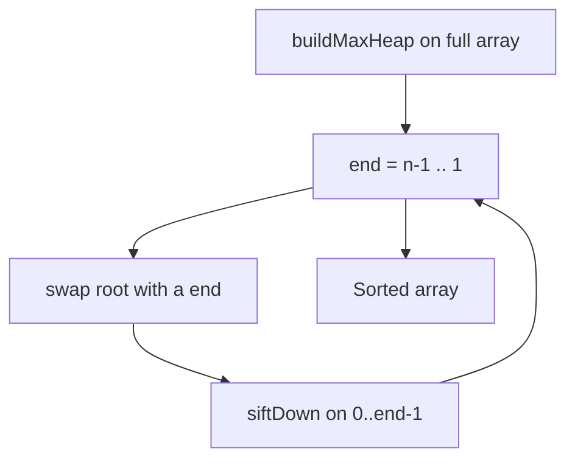
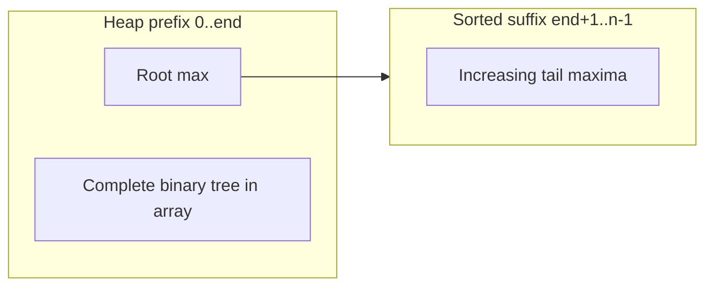
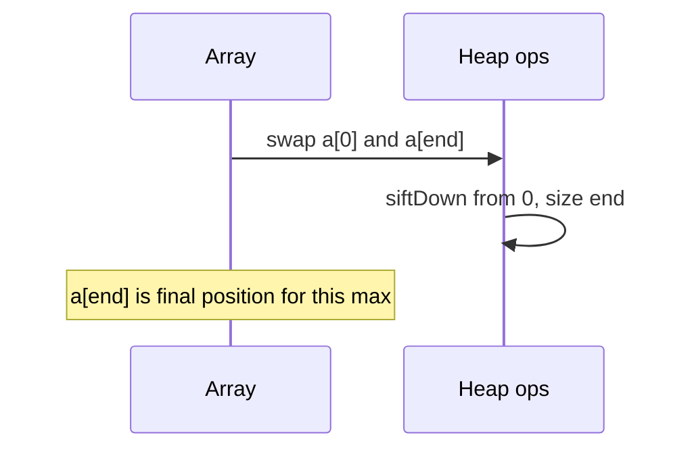

# Heapsort

## Overview

**Heapsort** sorts in place by building a **max-heap** over the array, repeatedly extracting the maximum to the end and restoring heap property on the shrinking prefix. It guarantees **O(n log n)** worst-case time and **O(1)** auxiliary space—making it the standard **introsort fallback** when quicksort recursion depth is exhausted.

Heapsort is **not stable** and typically slower in practice than well-tuned quicksort on random data due to poorer cache locality and more comparisons—but its worst-case guarantee is unconditional (no adversarial pivot).

**Heap representation** (array indexing, siftUp/siftDown) is owned by [[04-Data-Structures/06-Heaps-and-Priority-Queues/Binary Heaps and Array Layout|Binary Heaps and Array Layout]]; this note covers **algorithmic use** for sorting and introsort integration.

## Learning Objectives

- Apply Floyd's O(n) build-heap then n−1 extract-max passes
- Relate heap operations to overall O(n log n) sort complexity
- Contrast heapsort vs merge and quicksort on memory and stability contracts
- Implement heapsort segment for introsort without full-array side effects
- Identify when priority-queue sort differs from heapsort (k-way merge)

## Prerequisites

- [[04-Data-Structures/06-Heaps-and-Priority-Queues/Binary Heaps and Array Layout|Binary Heaps and Array Layout]]
- [[05-Algorithms/03-Sorting/Quicksort Partitioning and Introspective Fallbacks|Quicksort Partitioning and Introspective Fallbacks]]

## Difficulty

`intermediate`

## Estimated Time

- Reading: 1.5 hours
- Exercises: 3 hours
- Mini project: 4 hours

## History

J.W.J. Williams (1964) introduced heapsort alongside binary heaps. Floyd (1964) showed linear-time heap construction. Heapsort became the safety net in introsort (Musser, 1997) and remains the in-place worst-case comparison sort of choice when merge's O(n) space is unacceptable.

## Problem It Solves

Quicksort can degrade to O(n²). Merge sort needs O(n) extra memory. Heapsort provides **in-place** O(n log n) **worst-case** sorting—used as fallback, embedded systems with tight RAM, or when proving upper bounds matters more than average-case speed.

## Internal Implementation

### Algorithm

1. **buildMaxHeap(a, 0, n−1)** — Floyd bottom-up siftDown from last parent to root.
2. For `end` from n−1 down to 1:
   - Swap `a[0]` (max) with `a[end]`
   - **siftDown(a, 0, end−1)** on heap prefix

Result: ascending order in `a[0..n−1]` (using max-heap).



### siftDown (max-heap)

At index `i`, swap with larger child while child exceeds parent—see DS note for index formulas.

## Correctness

**Heap invariant (max-heap)**: For all nodes `i > 0`, `a[parent(i)] ≥ a[i]`.

**Loop invariant (extract phase)**: After processing `end`, suffix `[end+1..n−1]` holds the largest elements in sorted ascending order; prefix `[0..end]` satisfies max-heap property on heap size `end+1`.

**Maintenance**: Swapping root to end places global maximum in final position; siftDown restores heap on remaining prefix.

**Termination**: When `end = 0`, entire array sorted.

**Stability**: Not stable—heap swaps move elements non-locally across equal keys.

## Complexity

| Phase | Time | Notes |
| --- | --- | --- |
| buildHeap | O(n) | Floyd bottom-up |
| n−1 extractions | O(n log n) | Each siftDown O(log n) height |
| **Total** | **O(n log n)** worst | No input-dependent degradation |
| Extra space | O(1) | In-place; O(log n) recursion optional |

Comparisons: ~ 2n log₂ n in typical extract loop (constant factor higher than merge/quicksort).

## Mermaid Diagrams

### Structure: heap array layout during sort



### Sequence: one extract-max step



## Examples

### Minimal Example

**TypeScript** (uses siftDown only—refer to DS note for heap ADT):

```typescript
export function heapSort(a: number[]): void {
  const n = a.length;
  for (let i = (n >> 1) - 1; i >= 0; i--) siftDown(a, i, n - 1);
  for (let end = n - 1; end > 0; end--) {
    [a[0], a[end]] = [a[end], a[0]];
    siftDown(a, 0, end - 1);
  }
}

function siftDown(a: number[], i: number, end: number): void {
  for (;;) {
    let largest = i;
    const l = 2 * i + 1;
    const r = l + 1;
    if (l <= end && a[l] > a[largest]) largest = l;
    if (r <= end && a[r] > a[largest]) largest = r;
    if (largest === i) break;
    [a[i], a[largest]] = [a[largest], a[i]];
    i = largest;
  }
}

export function heapSortSegment(a: number[], lo: number, hi: number): void {
  // introsort fallback on a[lo..hi]
  const offset = lo;
  const n = hi - lo + 1;
  const slice = a.slice(lo, hi + 1);
  heapSort(slice);
  for (let k = 0; k < n; k++) a[offset + k] = slice[k];
}
```

**Python**:

```python
def heap_sort(a: list[int]) -> None:
    n = len(a)

    def sift_down(i: int, end: int) -> None:
        while True:
            largest = i
            l, r = 2 * i + 1, 2 * i + 2
            if l <= end and a[l] > a[largest]:
                largest = l
            if r <= end and a[r] > a[largest]:
                largest = r
            if largest == i:
                break
            a[i], a[largest] = a[largest], a[i]
            i = largest

    for i in range(n // 2 - 1, -1, -1):
        sift_down(i, n - 1)
    for end in range(n - 1, 0, -1):
        a[0], a[end] = a[end], a[0]
        sift_down(0, end - 1)
```

### Production-Shaped Example

Introsort calls **segment heapsort** only on pathological subarrays—avoid full-array heap sort in hot path:

```typescript
function introSortRec(a: number[], lo: number, hi: number, depth: number): void {
  if (hi - lo < CUTOFF) { /* insertion */ return; }
  if (depth === 0) {
    heapSortSegment(a, lo, hi);
    return;
  }
  // partition + recurse
}
```

Log when heap fallback triggers—frequent triggers suggest adversarial input or bad pivot policy.

## Trade-offs

| Dimension | Upside | Downside | When it matters |
| --- | --- | --- | --- |
| Worst-case | O(n log n) always | Slower average constants | SLA hard caps |
| Space | O(1) in-place | Poor locality vs merge | RAM caps |
| Stability | — | Not stable | Audit ties |
| vs merge | No O(n) buffer | More comparisons | Embedded |
| vs quicksort | No O(n²) pivot path | ~2× slower typical | Public sort APIs |

### When to Use

- Introsort fallback segment sort
- Proven O(n log n) in-place requirement
- Priority-queue extraction sort teaching (same sift machinery)

### When Not to Use

- Stability required
- Average-case speed paramount → introsort/quicksort primary path
- k-way external merge → different algorithm family ([[05-Algorithms/03-Sorting/External Sorting Concepts and Production Selection|External Sorting Concepts and Production Selection]])

## Exercises

1. Prove buildHeap is O(n) (aggregate analysis on node heights).
2. Trace heapSort on `[3,1,4,1,5]` step by step.
3. Why is heapsort not stable? Construct minimal counterexample.
4. Compare number of comparisons heapsort vs merge sort for n = 1024 (order of magnitude).
5. Implement in-place heapsort using iterative siftDown only (no heap class).

## Mini Project

Instrument introsort to count heap fallback invocations across input distributions.

## Portfolio Project

Document heapsort fallback path in [[05-Algorithms/projects/Sorting and Selection Bake-Off/README|Sorting and Selection Bake-Off]].

## Interview Questions

1. Complexity of buildHeap and overall heapsort?
2. Why does heapsort have O(1) extra space?
3. Compare heapsort and merge sort on stability and memory.
4. Where does heapsort appear in industrial sort implementations?
5. Is a heap sorted array a sorted array? Explain.

### Stretch / Staff-Level

1. Prove that heapsort performs at most O(n log n) comparisons in the worst case without introsort wrapper.
2. When would you choose heapsort over merge for a 1GB in-memory sort?

## Common Mistakes

- Using min-heap then wrong extraction order (need max-heap for ascending)
- Off-by-one in `end` bound during siftDown (inclusive heap size)
- Confusing **heap property** with **sorted array**
- Reimplementing heap layout instead of referencing DS invariants

## Best Practices

- Reuse siftDown from [[04-Data-Structures/06-Heaps-and-Priority-Queues/Binary Heaps and Array Layout|Binary Heaps and Array Layout]]
- Prefer introsort over raw heapsort for general arrays
- Use merge/Timsort when stability matters
- Benchmark before choosing heapsort as primary—constants matter

## Summary

Heapsort builds a max-heap and repeatedly extracts the maximum to the tail, achieving in-place O(n log n) worst-case sorting at the cost of stability and average-case speed. Its production role is primarily as introsort's safety net; heap array mechanics belong to the Data Structures track.

## Further Reading

- [[00-References/Algorithms/README|Algorithms References]]
- [[04-Data-Structures/06-Heaps-and-Priority-Queues/Binary Heaps and Array Layout|Binary Heaps and Array Layout]]

## Related Notes

- [[05-Algorithms/03-Sorting/Quicksort Partitioning and Introspective Fallbacks|Quicksort Partitioning and Introspective Fallbacks]]
- [[05-Algorithms/03-Sorting/Merge Sort|Merge Sort]]
- [[04-Data-Structures/06-Heaps-and-Priority-Queues/Priority Queue ADT|Priority Queue ADT]]
- [[05-Algorithms/03-Sorting/Sorting Contracts Stability and Adaptivity|Sorting Contracts Stability and Adaptivity]]
- [[05-Algorithms/README|Algorithms Track]]

## Progress Checklist

- [ ] Explained from first principles
- [ ] Drew at least one Mermaid diagram
- [ ] Implemented a minimal version
- [ ] Documented trade-offs and non-goals
- [ ] Completed exercises
- [ ] Practiced interview questions aloud
- [ ] Linked prerequisites and dependents
