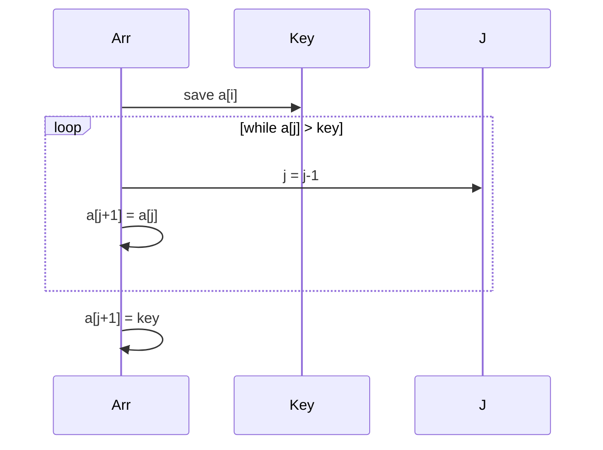

# Insertion and Selection Sort

## Overview

**Insertion sort** builds a sorted prefix by inserting each next element into its correct position—like sorting playing cards. **Selection sort** repeatedly selects the minimum of the unsuffix and swaps it into place. Both are O(n²) comparison sorts with O(1) extra space, yet they remain pedagogically essential and **production-relevant at small n** (hybrid sort bases, tiny arrays, online streams).

Insertion sort is **stable** and **adaptive** (O(n) when already sorted). Selection sort is **not stable** (swap can jump equal elements) and performs Θ(n²) comparisons even when sorted—but minimizes writes, useful when memory writes are expensive.

## Learning Objectives

- Prove correctness via loop invariants for both algorithms
- Analyze best, average, and worst cases with explicit comparison/move counts
- Explain why insertion sort appears inside Timsort and quicksort hybrids
- Implement stable insertion sort on linked structures
- Choose between insertion and selection for tiny or write-sensitive workloads

## Prerequisites

- [[05-Algorithms/03-Sorting/Sorting Contracts Stability and Adaptivity|Sorting Contracts Stability and Adaptivity]]
- [[05-Algorithms/00-Foundations-and-Correctness/Loop Invariants and Correctness Proofs|Loop Invariants and Correctness Proofs]]

## Difficulty

`beginner`

## Estimated Time

- Reading: 1.5 hours
- Exercises: 2 hours
- Mini project: 3 hours

## History

These are among the oldest sort methods—described informally long before asymptotic analysis. Insertion sort's adaptivity made it the practical choice for small tapes and cards. Modern libraries (qsort, introsort, Timsort) still switch to insertion sort below a **cutoff** (often 16–32 elements) where simplicity beats asymptotics.

## Problem It Solves

For n ≤ ~20, constant factors dominate: insertion sort's tight loops and cache-friendly sequential access often beat recursive O(n log n) sorts. Insertion sort also supports **online** sorting as elements arrive. Selection sort minimizes **writes** (~n swaps) when comparison is cheap but assignment is costly (EEPROM, remote fields).

## Internal Implementation

### Insertion sort

For `i` from 1 to n−1, slide `a[i]` left while it is smaller than predecessors.

### Selection sort

For `i` from 0 to n−2, find `minIndex` in `[i..n−1]`, swap `a[i]` and `a[minIndex]`.

```mermaid
flowchart TD
    subgraph Insertion[Insertion Sort]
        I1[Sorted prefix 0..i-1] --> I2[Insert a[i]]
        I2 --> I1
    end
    subgraph Selection[Selection Sort]
        S1[Unsorted suffix i..n-1] --> S2[Find min]
        S2 --> S3[Swap to i]
        S3 --> S1
    end
```

## Correctness

**Insertion sort**

- **Invariant**: After outer iteration `i`, subarray `a[0..i]` is sorted and contains the same multiset as the original `a[0..i]`.
- **Initialization**: `i = 1` → single element prefix is sorted.
- **Maintenance**: Inserting `a[i]` into sorted prefix preserves sortedness.
- **Termination**: At `i = n−1`, entire array sorted.
- **Stability**: Shift only when `a[j] > key`, not when equal—equal elements never cross.

**Selection sort**

- **Invariant**: `a[0..i−1]` contains the i smallest elements in sorted order; `a[i..n−1]` holds the rest.
- **Maintenance**: Placing global minimum at `i` extends sorted prefix.
- **Instability**: Swapping distant equal elements can reorder ties.

## Complexity

| Algorithm | Comparisons (worst) | Moves/swaps (worst) | Best case | Space |
| --- | --- | --- | --- | --- |
| Insertion | Θ(n²) | Θ(n²) shifts | O(n) comparisons if sorted | O(1) |
| Selection | Θ(n²) | Θ(n) swaps | Θ(n²) always | O(1) |

Average case for insertion sort with random input: Θ(n²) comparisons and moves.

**Adaptivity (insertion)**: Inversions `I` → at most 2I comparisons and I moves (O(n + I)).

## Mermaid Diagrams

### Structure: insertion pointer movement

```mermaid
flowchart LR
    P0["a[0..i-1] sorted"] --> Key[key = a[i]]
    Key --> Scan[Scan left while greater]
    Scan --> Shift[Shift right one slot]
    Shift --> P0
```

### Sequence: one insertion step



## Examples

### Minimal Example

**TypeScript**:

```typescript
export function insertionSort(a: number[]): void {
  for (let i = 1; i < a.length; i++) {
    const key = a[i];
    let j = i - 1;
    while (j >= 0 && a[j] > key) {
      a[j + 1] = a[j];
      j--;
    }
    a[j + 1] = key;
  }
}

export function selectionSort(a: number[]): void {
  for (let i = 0; i < a.length - 1; i++) {
    let min = i;
    for (let j = i + 1; j < a.length; j++) {
      if (a[j] < a[min]) min = j;
    }
    if (min !== i) [a[i], a[min]] = [a[min], a[i]];
  }
}
```

**Python**:

```python
def insertion_sort(a: list[int]) -> None:
    for i in range(1, len(a)):
        key = a[i]
        j = i - 1
        while j >= 0 and a[j] > key:
            a[j + 1] = a[j]
            j -= 1
        a[j + 1] = key


def selection_sort(a: list[int]) -> None:
    n = len(a)
    for i in range(n - 1):
        m = min(range(i, n), key=lambda k: a[k])
        a[i], a[m] = a[m], a[i]
```

### Production-Shaped Example

Hybrid quicksort switches to insertion sort below cutoff `CUTOFF = 16`:

```typescript
const CUTOFF = 16;

function introSortSlice(a: number[], lo: number, hi: number, depth: number): void {
  const n = hi - lo + 1;
  if (n <= CUTOFF) {
    for (let i = lo + 1; i <= hi; i++) {
      const key = a[i];
      let j = i - 1;
      while (j >= lo && a[j] > key) {
        a[j + 1] = a[j];
        j--;
      }
      a[j + 1] = key;
    }
    return;
  }
  // ... partition + recurse (see quicksort note)
}
```

Measure cutoff with benchmarks on target hardware—L1 cache and branch predictors matter.

## Trade-offs

| Dimension | Insertion | Selection | When it matters |
| --- | --- | --- | --- |
| Adaptivity | Excellent | None | Nearly sorted telemetry |
| Stability | Yes | No | Tie-preserving pipelines |
| Writes | O(n²) shifts | O(n) swaps | Flash / network fields |
| Comparisons | O(n²) | Always Θ(n²) | Compare-heavy remote data |
| Linked list | Natural O(1) insert | O(n) find min | Streaming merges |

### When to Use

- **Insertion**: n < ~32, nearly sorted data, online arrival, stable requirement on tiny arrays
- **Selection**: write-minimization with cheap comparisons

### When Not to Use

- General large-n sorting—use merge, introsort, or library sort
- Stability required → never raw selection sort on records with ties

## Exercises

1. Prove insertion sort invariant formally (initialization, maintenance, termination).
2. Count comparisons for insertion sort on `[1,2,...,n]` and on `[n,...,1]`.
3. Make selection sort stable via indexing or auxiliary storage—cost?
4. Implement insertion sort on a singly linked list in O(n²) time, O(1) extra space.
5. Derive expected inversion count for random permutations (n(n−1)/4).

## Mini Project

Benchmark insertion vs selection vs `Array.sort` for n ∈ {8, 16, 32, 64} on random and 90%-sorted inputs. Plot crossover point.

## Portfolio Project

Wire hybrid cutoff tuning into [[05-Algorithms/projects/Sorting and Selection Bake-Off/README|Sorting and Selection Bake-Off]].

## Interview Questions

1. State insertion sort loop invariant.
2. Why is insertion sort O(n) on sorted input but selection sort still Θ(n²)?
3. Why do industrial quicksorts fall back to insertion sort?
4. Is selection sort stable? Show a counterexample.
5. When would you prefer selection sort over insertion?

### Stretch / Staff-Level

1. Analyze binary insertion sort (binary search locate + shift)—same Θ(n²) moves, fewer comparisons?
2. Explain how Timsort exploits natural runs—relationship to insertion sort.

## Common Mistakes

- Using `>=` in shift condition, breaking stability
- Off-by-one in inner loop bounds
- Applying insertion sort to linked lists with array-style indexing
- Expecting selection sort to be adaptive on sorted input

## Best Practices

- Use sentinel optimization only when safe (duplicate max at end)
- For records, insertion sort with **move less** via binary search locate if comparisons dominate shifts
- Document stability in hybrid sorts
- Profile cutoff constants—don't copy textbook 10 blindly

## Summary

Insertion and selection sort are O(n²) comparison sorts with O(1) space. Insertion sort is stable, adaptive, and the workhorse base case of modern hybrids. Selection sort minimizes swaps at the cost of stability and adaptivity. Both teach loop invariants and remain production tools at small scale—not obsolete relics.

## Further Reading

- [[00-References/Algorithms/README|Algorithms References]]
- [[05-Algorithms/03-Sorting/Quicksort Partitioning and Introspective Fallbacks|Quicksort Partitioning and Introspective Fallbacks]]

## Related Notes

- [[05-Algorithms/03-Sorting/Sorting Contracts Stability and Adaptivity|Sorting Contracts Stability and Adaptivity]]
- [[05-Algorithms/03-Sorting/Merge Sort|Merge Sort]]
- [[05-Algorithms/01-Complexity-and-Analysis/Worst Average Expected and Amortized Cases|Worst Average Expected and Amortized Cases]]
- [[05-Algorithms/README|Algorithms Track]]

## Progress Checklist

- [ ] Explained from first principles
- [ ] Drew at least one Mermaid diagram
- [ ] Implemented a minimal version
- [ ] Documented trade-offs and non-goals
- [ ] Completed exercises
- [ ] Practiced interview questions aloud
- [ ] Linked prerequisites and dependents
