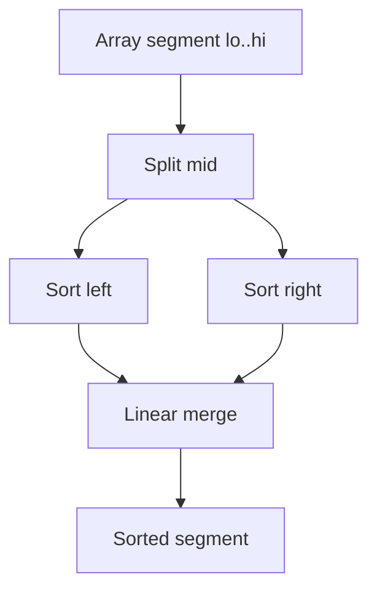
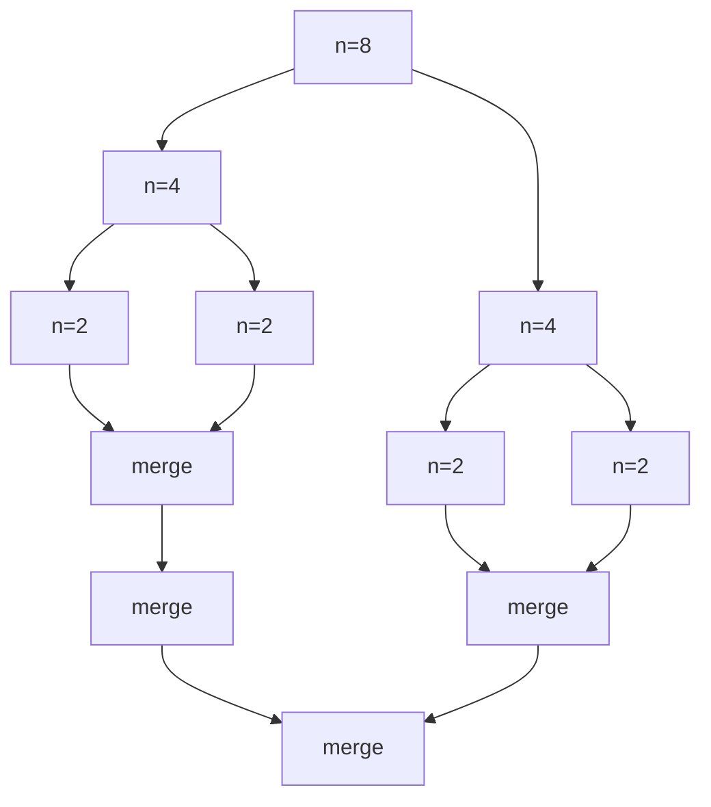
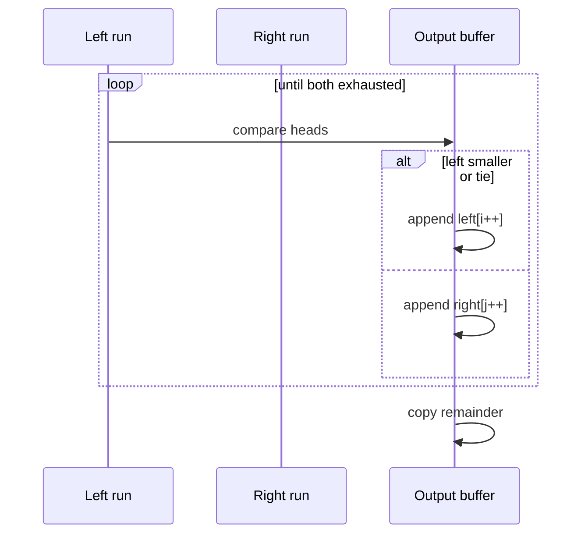

# Merge Sort

## Overview

**Merge sort** is a divide-and-conquer comparison sort: recursively split the array in half, sort each half, then **merge** two sorted runs into one sorted run. It guarantees **O(n log n)** worst-case time, is **stable** when merge prefers left run on ties, and is the conceptual backbone of **external sorting** (hand off disk merge passes to [[08-Databases/README|Databases]]).

The price is **O(n) auxiliary space** for typical array implementations—though in-place merge variants exist with higher constant factors and complexity.

## Learning Objectives

- Derive T(n) = 2T(n/2) + O(n) → O(n log n) via Master Theorem
- Implement stable linear merge with two pointers
- Analyze top-down vs bottom-up merge sort trade-offs
- Connect merge sort to stable multi-pass file sorting at concept level
- Optimize merge with sentinel, galloping (Timsort), and buffer reuse

## Prerequisites

- [[05-Algorithms/03-Sorting/Sorting Contracts Stability and Adaptivity|Sorting Contracts Stability and Adaptivity]]
- [[05-Algorithms/01-Complexity-and-Analysis/Recurrences Recursion Trees and Master Theorem|Recurrences Recursion Trees and Master Theorem]]
- [[04-Data-Structures/01-Contiguous-Sequences/Dynamic Arrays and Amortized Growth|Dynamic Arrays and Amortized Growth]]

## Difficulty

`intermediate`

## Estimated Time

- Reading: 2 hours
- Exercises: 3 hours
- Mini project: 5 hours

## History

John von Neumann (1945) is credited with merge sort for early stored-program machines. It matched **tape** storage: merge sorted runs in passes. Today merge sort underpins Timsort's run merging and distributed **map-reduce** sort-merge joins at the algorithmic level.

## Problem It Solves

Quicksort's O(n²) worst case is unacceptable for adversarial or security-sensitive inputs. Merge sort offers **predictable** O(n log n) with **stability**—required for audit logs and key-by-key card sorting. Its sequential merge access pattern also suits **streaming** and **external** phases (conceptual link to database sort-merge).

## Internal Implementation

### Top-down

```
mergeSort(a, lo, hi):
  if lo >= hi: return
  mid = (lo + hi) // 2
  mergeSort(a, lo, mid)
  mergeSort(a, mid+1, hi)
  merge(a, lo, mid, hi)
```

### Bottom-up

Iteratively merge runs of size 1, 2, 4, … — no recursion stack; good for linked lists and embedded stacks.

### Merge (stable)

Compare heads of left/right; append smaller; on tie take from **left** to preserve stability.



## Correctness

**Merge subroutine invariant**: After processing `k` output positions, output `[lo..lo+k−1]` is sorted and consists of the smallest `k` elements from left ∪ right, preserving stability for ties.

**Recursive invariant**: `mergeSort(a, lo, hi)` sorts `a[lo..hi]` in place using auxiliary buffer.

**Proof sketch**: By induction on segment length. Base n=1 trivial. Inductive step: halves sorted by IH; merge combines into fully sorted segment by merge invariant.

**Stability**: Merge takes from left when `left[i] <= right[j]` (not `<` only on right preference).

## Complexity

| Variant | Time (worst) | Time (best) | Extra space | Stable |
| --- | --- | --- | --- | --- |
| Top-down | O(n log n) | O(n log n) | O(n) buffer + O(log n) stack | Yes |
| Bottom-up | O(n log n) | O(n log n) | O(n) | Yes |
| Natural merge | O(n log n) worst | O(n) if one run | O(n) | Yes |

Recurrence: T(n) = 2T(n/2) + Θ(n) ⇒ T(n) = Θ(n log n).

Merge of total length m costs Θ(m) comparisons and moves.

## Mermaid Diagrams

### Structure: divide and merge tree



### Sequence: merge two runs



## Examples

### Minimal Example

**TypeScript**:

```typescript
export function mergeSort(a: number[]): number[] {
  const buf = a.slice();
  mergeSortRec(a, buf, 0, a.length);
  return a;
}

function mergeSortRec(a: number[], buf: number[], lo: number, hi: number): void {
  if (hi - lo <= 1) return;
  const mid = (lo + hi) >> 1;
  mergeSortRec(a, buf, lo, mid);
  mergeSortRec(a, buf, mid, hi);
  merge(a, buf, lo, mid, hi);
}

function merge(a: number[], buf: number[], lo: number, mid: number, hi: number): void {
  for (let k = lo; k < hi; k++) buf[k] = a[k];
  let i = lo, j = mid, k = lo;
  while (i < mid && j < hi) {
    if (buf[i] <= buf[j]) a[k++] = buf[i++];
    else a[k++] = buf[j++];
  }
  while (i < mid) a[k++] = buf[i++];
  while (j < hi) a[k++] = buf[j++];
}
```

**Python**:

```python
def merge_sort(a: list[int]) -> list[int]:
    if len(a) <= 1:
        return a
    mid = len(a) // 2
    left = merge_sort(a[:mid])
    right = merge_sort(a[mid:])
    return merge(left, right)


def merge(left: list[int], right: list[int]) -> list[int]:
    out: list[int] = []
    i = j = 0
    while i < len(left) and j < len(right):
        if left[i] <= right[j]:
            out.append(left[i])
            i += 1
        else:
            out.append(right[j])
            j += 1
    out.extend(left[i:])
    out.extend(right[j:])
    return out
```

### Production-Shaped Example

Reuse one scratch buffer across recursive calls to avoid allocator churn:

```typescript
class MergeSorter {
  private buf: number[];

  constructor(private a: number[]) {
    this.buf = new Array(a.length);
  }

  sort(): void {
    this.sortRange(0, this.a.length);
  }

  private sortRange(lo: number, hi: number): void {
    if (hi - lo <= 1) return;
    const mid = (lo + hi) >> 1;
    this.sortRange(lo, mid);
    this.sortRange(mid, hi);
    if (this.a[mid - 1] <= this.a[mid]) return; // skip merge if already ordered
    this.merge(lo, mid, hi);
  }

  private merge(lo: number, mid: number, hi: number): void {
    // ... same as above using this.buf
  }
}
```

Add **observability**: count merges skipped vs performed for adaptive telemetry.

## Trade-offs

| Dimension | Upside | Downside | When it matters |
| --- | --- | --- | --- |
| Worst-case time | O(n log n) guaranteed | Higher constants than quicksort | Adversarial inputs |
| Stability | Natural in merge | Extra memory | Multi-key sorts |
| Memory | Predictable O(n) | Not in-place | RAM budgets |
| Locality | Merge scans two runs | Not in-place random writes | Cache-sensitive n |
| External fit | Multi-pass merge concept | Disk details → Databases | Out-of-core sorts |

### When to Use

- Stable O(n log n) required with adversarial inputs
- Linked list sorting (O(1) space with pointer merges)
- Conceptual template for external merge phases
- Parallel sort (merge tree across workers)

### When Not to Use

- Memory-constrained in-place requirement → heapsort or introsort
- Small n → insertion sort
- Integer keys with small range → counting/radix

## Exercises

1. Solve T(n) = 2T(n/2) + cn with substitution or Master Theorem.
2. Prove merge is stable when using `<=` from left.
3. Implement bottom-up merge sort; compare stack depth vs top-down.
4. Count merges for n = 2^k; relate to tree height.
5. Implement merge on singly linked lists in O(n log n) time, O(1) extra space (excluding recursion).

## Mini Project

Build **stable sort** for `{key, payload}` records; verify stability with fuzz. Compare buffer-reuse vs allocating each merge.

## Portfolio Project

Implement parallel merge sort (worker pool) in [[05-Algorithms/projects/Sorting and Selection Bake-Off/README|Sorting and Selection Bake-Off]].

## Interview Questions

1. Write recurrence for merge sort; solve it.
2. Why is merge sort stable? Modify merge to break stability—how?
3. What is space complexity including recursion stack?
4. Compare merge vs quicksort for in-memory general sorting.
5. How does merge sort relate to external sorting (high level)?

### Stretch / Staff-Level

1. Explain Timsort's galloping merge vs plain merge—when does galloping win?
2. Design a k-way merge iterator for sorted streams (algorithm only)—complexity in k and n?

## Common Mistakes

- Using `<` instead of `<=` from left, breaking stability
- Off-by-one in mid calculation causing infinite recursion
- Allocating new arrays every merge level (GC pressure)
- Forgetting copy-back from buffer in in-place hybrid variants

## Best Practices

- Reuse auxiliary buffer; short-circuit merge when `a[mid-1] <= a[mid]`
- Prefer bottom-up for linked lists
- For production arrays, often use library Timsort unless stability+worst-case proof needed
- Document handoff to [[05-Algorithms/03-Sorting/External Sorting Concepts and Production Selection|External Sorting Concepts and Production Selection]] for disk-scale data

## Summary

Merge sort divides, sorts halves, and merges in linear time—yielding stable O(n log n) worst-case sorting at O(n) extra space. It is the reliable comparison sort when quicksort's worst case or instability is unacceptable, and it is the algorithmic skeleton of multi-pass merge sorting at scale (engine details live in Databases).

## Further Reading

- [[00-References/Algorithms/README|Algorithms References]]
- [[05-Algorithms/04-Divide-Conquer-and-Backtracking/Divide-and-Conquer Design|Divide-and-Conquer Design]]

## Related Notes

- [[05-Algorithms/03-Sorting/Sorting Contracts Stability and Adaptivity|Sorting Contracts Stability and Adaptivity]]
- [[05-Algorithms/03-Sorting/Quicksort Partitioning and Introspective Fallbacks|Quicksort Partitioning and Introspective Fallbacks]]
- [[05-Algorithms/03-Sorting/External Sorting Concepts and Production Selection|External Sorting Concepts and Production Selection]]
- [[05-Algorithms/04-Divide-Conquer-and-Backtracking/Divide-and-Conquer Design|Divide-and-Conquer Design]]
- [[04-Data-Structures/01-Contiguous-Sequences/Dynamic Arrays and Amortized Growth|Dynamic Arrays and Amortized Growth]]
- [[05-Algorithms/README|Algorithms Track]]

## Progress Checklist

- [ ] Explained from first principles
- [ ] Drew at least one Mermaid diagram
- [ ] Implemented a minimal version
- [ ] Documented trade-offs and non-goals
- [ ] Completed exercises
- [ ] Practiced interview questions aloud
- [ ] Linked prerequisites and dependents
