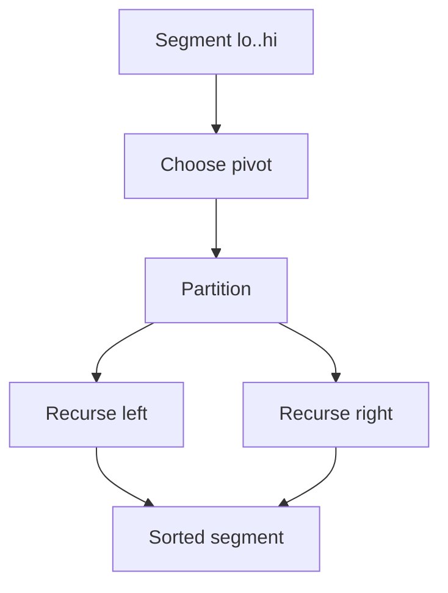
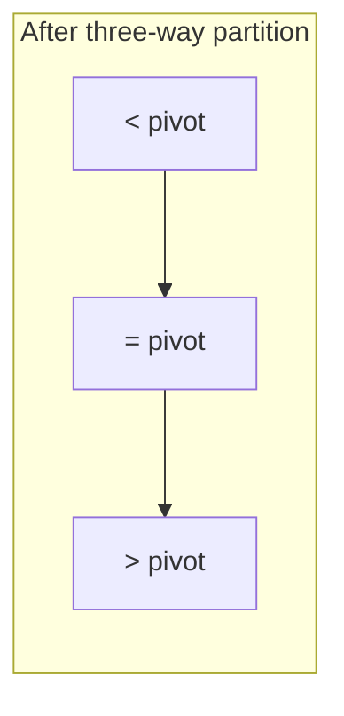
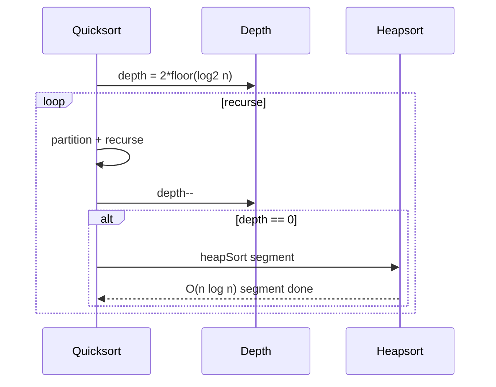

# Quicksort Partitioning and Introspective Fallbacks

## Overview

**Quicksort** selects a **pivot**, **partitions** the array into elements ≤ pivot and elements ≥ pivot (variant-dependent), then recurses on subarrays. Average time is O(n log n) with O(log n) stack; worst case is O(n²) on adversarial or sorted-with-bad-pivot inputs.

**Introsort** (introspective sort) restores worst-case guarantees: track recursion depth; fall back to **heapsort** when depth exceeds ~2⌊log₂ n⌋; use **insertion sort** on small slices. This is the pattern behind `std::sort` in many C++ standard libraries.

Partition schemes include **Lomuto**, **Hoare**, and **three-way (Dutch national flag)** for duplicate-heavy keys.

## Learning Objectives

- Implement Hoare and Lomuto partition with correct pivot placement
- Analyze expected vs worst-case complexity with pivot policy
- Build introsort with depth limit and insertion cutoff
- Apply three-way partition for fat pivots / duplicate keys
- Recognize quicksort as in-place alternative to merge sort with different contract trade-offs

## Prerequisites

- [[05-Algorithms/03-Sorting/Insertion and Selection Sort|Insertion and Selection Sort]]
- [[05-Algorithms/02-Searching-and-Selection/Quickselect and Partition-Based Selection|Quickselect and Partition-Based Selection]]
- [[05-Algorithms/01-Complexity-and-Analysis/Worst Average Expected and Amortized Cases|Worst Average Expected and Amortized Cases]]

## Difficulty

`intermediate`

## Estimated Time

- Reading: 2.5 hours
- Exercises: 4 hours
- Mini project: 5 hours

## History

Tony Hoare published quicksort in 1961. Bentley and McIlroy's engineering quicksort (1993) introduced three-way partitioning and better pivot rules. Musser's introsort (1997) added heapsort fallback for worst-case O(n log n). Dual-pivot quicksort (2009) is used in Java's `Arrays.sort` for primitives.

## Problem It Solves

Merge sort pays O(n) extra memory. Quicksort sorts **in place** with excellent cache behavior on average—dominant for general in-memory sorting when stability is not required. Partition subroutines also power **quickselect** (median, top-k) without full sort.

## Internal Implementation

### Hoare partition

Two pointers from ends; swap misplaced pairs; pivot not necessarily final position—recurse on `[lo..p]` and `[p+1..hi]`.

### Lomuto partition

Single forward scan; pivot often at end; places pivot after scan—simpler but more swaps.

### Three-way partition

Tracks `< pivot`, `= pivot`, `> pivot` regions—O(n) on all-equal input vs O(n²) naive.

### Introsort skeleton

```
sort(a, lo, hi, depth):
  if hi - lo < CUTOFF: insertionSort; return
  if depth == 0: heapSort(a, lo, hi); return
  p = partition(a, lo, hi)
  sort(a, lo, p, depth-1)
  sort(a, p+1, hi, depth-1)
```



## Correctness

**Partition postcondition** (Hoare variant): After partition at `p`, all elements in `[lo..p]` are ≤ pivot value; all in `[p+1..hi]` are ≥ pivot value (weak ordering allows duplicates in both sides).

**Quicksort invariant**: Elements outside current `[lo..hi]` are in final sorted position relative to the whole array.

**Introsort termination**: Depth counter decreases each recursion; heap fallback handles pathological depth exhaustion.

**Stability**: Standard in-place quicksort is **not stable**—document if using for records with tie semantics.

## Complexity

| Case / variant | Time | Space | Notes |
| --- | --- | --- | --- |
| Average (random) | O(n log n) | O(log n) stack | Good cache locality |
| Worst (bad pivot) | O(n²) | O(n) stack | Sorted + first pivot |
| Introsort worst | O(n log n) | O(log n) | Heap fallback |
| Three-way, all equal | O(n) | O(log n) | Fat pivot |
| Insertion cutoff | Same asymptotic | Lower constants | n < ~16 |

Expected comparisons ~ 1.39 n log₂ n for random input with median-of-three pivot (approximate).

## Mermaid Diagrams

### Structure: partition regions



### Sequence: introsort depth fallback



## Examples

### Minimal Example

**TypeScript**:

```typescript
const CUTOFF = 16;

export function introSort(a: number[]): void {
  const maxDepth = 2 * Math.floor(Math.log2(a.length + 1));
  introSortRec(a, 0, a.length - 1, maxDepth);
}

function introSortRec(a: number[], lo: number, hi: number, depth: number): void {
  const n = hi - lo + 1;
  if (n <= CUTOFF) {
    for (let i = lo + 1; i <= hi; i++) {
      const key = a[i];
      let j = i - 1;
      while (j >= lo && a[j] > key) {
        a[j + 1] = a[j];
        j--;
      }
      a[j + 1] = key;
    }
    return;
  }
  if (depth === 0) {
    heapSortSegment(a, lo, hi); // see Heapsort note — uses heap structure from DS track
    return;
  }
  const p = hoarePartition(a, lo, hi);
  introSortRec(a, lo, p, depth - 1);
  introSortRec(a, p + 1, hi, depth - 1);
}

function hoarePartition(a: number[], lo: number, hi: number): number {
  const pivot = a[(lo + hi) >> 1];
  let i = lo - 1;
  let j = hi + 1;
  for (;;) {
    do i++; while (a[i] < pivot);
    do j--; while (a[j] > pivot);
    if (i >= j) return j;
    [a[i], a[j]] = [a[j], a[i]];
  }
}
```

**Python**:

```python
CUTOFF = 16

def intro_sort(a: list[int]) -> None:
    depth = 2 * (len(a).bit_length())
    _intro(a, 0, len(a) - 1, depth)


def _intro(a: list[int], lo: int, hi: int, depth: int) -> None:
    if hi - lo + 1 <= CUTOFF:
        for i in range(lo + 1, hi + 1):
            key = a[i]
            j = i - 1
            while j >= lo and a[j] > key:
                a[j + 1] = a[j]
                j -= 1
            a[j + 1] = key
        return
    if depth == 0:
        _heap_segment(a, lo, hi)
        return
    p = hoare_partition(a, lo, hi)
    _intro(a, lo, p, depth - 1)
    _intro(a, p + 1, hi, depth - 1)


def hoare_partition(a: list[int], lo: int, hi: int) -> int:
    pivot = a[(lo + hi) // 2]
    i, j = lo - 1, hi + 1
    while True:
        i += 1
        while a[i] < pivot:
            i += 1
        j -= 1
        while a[j] > pivot:
            j -= 1
        if i >= j:
            return j
        a[i], a[j] = a[j], a[i]
```

Heap segment implementation: hand off array layout to [[04-Data-Structures/06-Heaps-and-Priority-Queues/Binary Heaps and Array Layout|Binary Heaps and Array Layout]]; algorithmic use here is introsort fallback only.

### Production-Shaped Example

Duplicate-heavy metrics (status codes, HTTP 200 floods):

```typescript
function dutchFlagPartition(a: number[], lo: number, hi: number): [number, number] {
  const pivot = a[lo + ((hi - lo) >> 1)];
  let lt = lo, i = lo, gt = hi;
  while (i <= gt) {
    if (a[i] < pivot) [a[lt], a[i]] = [a[i], a[lt]], lt++, i++;
    else if (a[i] > pivot) [a[i], a[gt]] = [a[gt], a[i]], gt--;
    else i++;
  }
  return [lt - 1, gt + 1];
}
```

Recurse only on `<` and `>` regions; middle `=` is sorted.

## Trade-offs

| Dimension | Upside | Downside | When it matters |
| --- | --- | --- | --- |
| In-place | O(log n) stack only | Not stable | RAM |
| Average speed | Excellent locality | O(n²) without introsort | General sort |
| Pivot policy | Tunable | Security (DoS on naive) | Public APIs |
| Three-way | Handles duplicates | More bookkeeping | Skewed keys |
| vs merge | Lower memory | Weaker worst-case without introsort | Latency SLAs |

### When to Use

- Unstable in-memory sort of numbers/pointers with introsort guard
- Partition-only for quickselect / top-k
- Three-way when duplicate ratio high

### When Not to Use

- Stability required → merge sort / Timsort
- Adversarial public inputs without introsort or random pivot
- Linked lists (merge sort preferred)

## Exercises

1. Construct size-n input forcing O(n²) with Lomuto + first-element pivot.
2. Prove expected O(n log n) with random pivot (sketch).
3. Implement median-of-three pivot; measure vs fixed pivot on sorted inputs.
4. Implement three-way partition; compare comparisons on all-equal array.
5. Derive introsort depth limit 2⌊log₂ n⌋ sufficiency argument (outline).

## Mini Project

Implement introsort + adversarial input generator; plot time vs merge sort and `Array.sort`.

## Portfolio Project

Add partition scheme benchmarks to [[05-Algorithms/projects/Sorting and Selection Bake-Off/README|Sorting and Selection Bake-Off]].

## Interview Questions

1. Compare Hoare vs Lomuto partition.
2. Why is quicksort O(n²) on sorted input with bad pivot? Fix?
3. What is introsort and why does it exist?
4. How does three-way partition help with duplicates?
5. Is quicksort stable? How to sort stably in O(n log n) time?

### Stretch / Staff-Level

1. Explain algorithmic complexity attacks on naive quicksort in web frameworks.
2. Compare dual-pivot quicksort (Java) to single-pivot introsort engineering trade-offs.

## Common Mistakes

- Infinite recursion from wrong pivot index with Lomuto
- Off-by-one in Hoare recursive bounds
- Forgetting insertion cutoff (10× slower on small n)
- Using unstable quicksort for multi-key UI ordering

## Best Practices

- Use introsort or library sort for production general arrays
- Median-of-three or random pivot for adversarial resistance
- Three-way partition for enum-like keys
- Separate **quickselect** path when only k-th order statistic needed
- Heap operations: see [[04-Data-Structures/06-Heaps-and-Priority-Queues/Binary Heaps and Array Layout|Binary Heaps and Array Layout]]

## Summary

Quicksort partitions around a pivot and recurses in place—fast on average but fragile without careful pivot and duplicate policies. Introsort adds heapsort fallback and insertion base cases for worst-case O(n log n) and strong constants. Partition variants are shared tooling with selection algorithms; heap layout belongs to the Data Structures track.

## Further Reading

- [[00-References/Algorithms/README|Algorithms References]]
- Bentley & McIlroy — Engineering a Sort Function

## Related Notes

- [[05-Algorithms/03-Sorting/Merge Sort|Merge Sort]]
- [[05-Algorithms/03-Sorting/Heapsort|Heapsort]]
- [[05-Algorithms/02-Searching-and-Selection/Quickselect and Partition-Based Selection|Quickselect and Partition-Based Selection]]
- [[05-Algorithms/03-Sorting/Insertion and Selection Sort|Insertion and Selection Sort]]
- [[04-Data-Structures/06-Heaps-and-Priority-Queues/Binary Heaps and Array Layout|Binary Heaps and Array Layout]]
- [[05-Algorithms/README|Algorithms Track]]

## Progress Checklist

- [ ] Explained from first principles
- [ ] Drew at least one Mermaid diagram
- [ ] Implemented a minimal version
- [ ] Documented trade-offs and non-goals
- [ ] Completed exercises
- [ ] Practiced interview questions aloud
- [ ] Linked prerequisites and dependents
