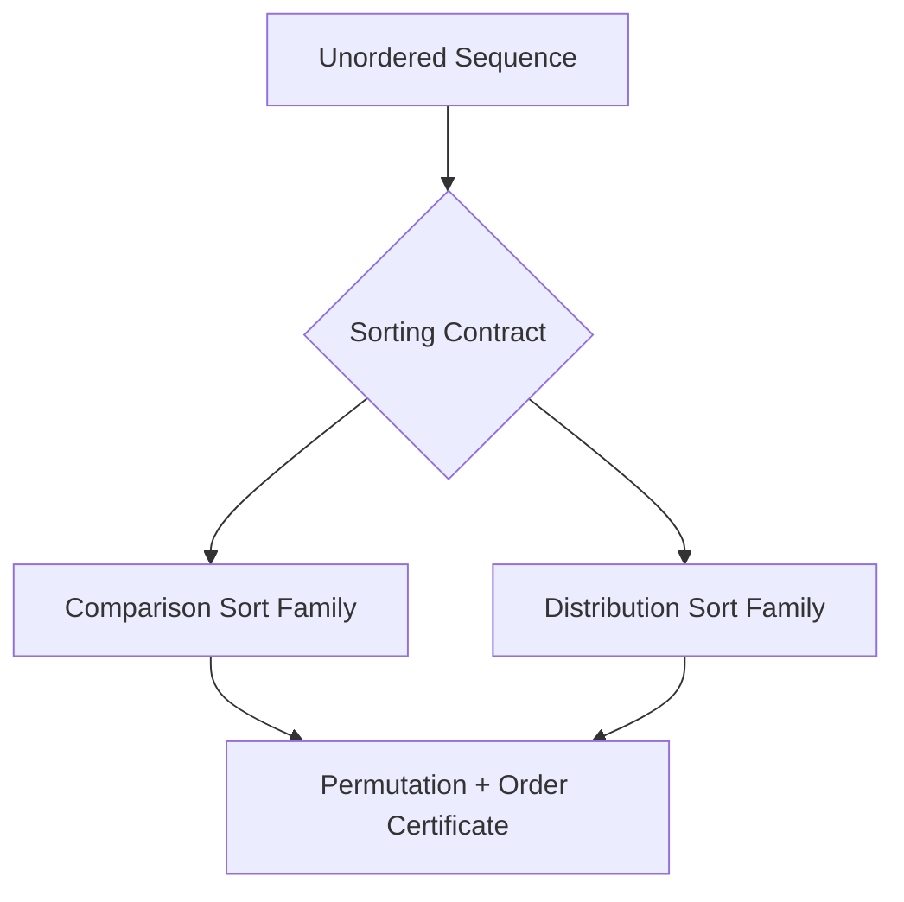
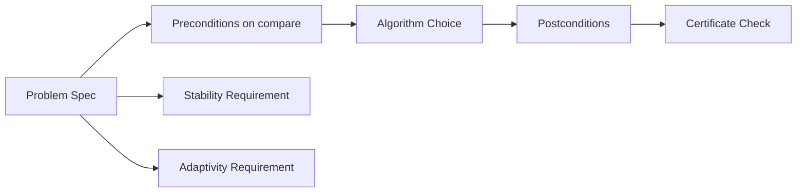
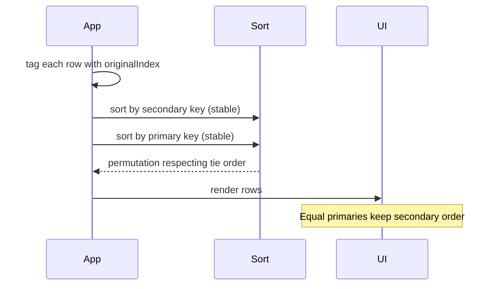

# Sorting Contracts Stability and Adaptivity

## Overview

**Sorting** rearranges a sequence so that every adjacent pair (under the chosen order) satisfies a total or weak ordering relation. Before choosing *how* to sort, specify **what** must hold afterward: the **sorting contract**—preconditions on keys and comparators, postconditions on permutation and stability, and optional **adaptivity** guarantees on nearly sorted input.

A sort is **stable** if elements equal under the primary key retain their **relative input order**. A sort is **adaptive** if its cost drops when the input is partially ordered (e.g., O(n) on already-sorted data for insertion sort or Timsort).

Production failures often trace to violated contracts: unstable sorts breaking audit trails, non-transitive comparators causing crashes, or assuming O(n log n) when keys are small integers (where counting/radix wins).

## Learning Objectives

- State preconditions, postconditions, and certificates for sorting problems
- Define stability and explain when it is a functional requirement
- Distinguish comparison sorts from distribution sorts by key assumptions
- Classify adaptivity and identify algorithms that exploit existing order
- Map language/library sort guarantees to engineering decisions

## Prerequisites

- [[05-Algorithms/01-Complexity-and-Analysis/Cost Models and Input Size|Cost Models and Input Size]]
- [[05-Algorithms/00-Foundations-and-Correctness/Problem Specifications Preconditions and Postconditions|Problem Specifications Preconditions and Postconditions]]
- [[04-Data-Structures/00-Orientation-and-Contracts/Abstract Data Types vs Concrete Structures|Abstract Data Types vs Concrete Structures]]

## Difficulty

`intermediate`

## Estimated Time

- Reading: 2 hours
- Exercises: 3 hours
- Mini project: 4 hours

## History

Early punched-card sorts required **stable** multi-pass key ordering (zip code, then name). Merge sort (von Neumann, 1945) was designed for tape stability. Quicksort (Hoare, 1960) traded stability for in-place speed. **Adaptive** merge variants (Timsort, 2002) merged real-world partially ordered logs efficiently—now default in Python and Java.

## Problem It Solves

Without an explicit contract, teams assume:

- "Sorted" means only primary key order—losing tie-break semantics
- Library `sort` is stable (JavaScript `Array.sort` was unstable until ES2019)
- Comparison-based O(n log n) is always optimal (false when key universe is bounded)

Sorting contracts prevent silent reordering in multi-key UI tables, ledger replay, and versioned event streams.

## Internal Implementation

### Contract components

| Component | Question it answers |
| --- | --- |
| **Key type** | Comparable numbers? Strings with locale? Composite records? |
| **Comparator** | Strict weak ordering? Stable tie policy? |
| **Permutation** | In-place mutation vs new array? |
| **Stability** | Must equal keys preserve input order? |
| **Adaptivity** | Performance on nearly sorted / duplicate-heavy input? |
| **Memory budget** | In-place O(1) extra vs O(n) auxiliary? |

### Comparison vs distribution sorts

**Comparison sorts** use only `compare(a,b)` outcomes. Lower bound: Ω(n log n) comparisons in the worst case ([[05-Algorithms/01-Complexity-and-Analysis/Lower Bounds Decision Trees and Adversaries|Lower Bounds Decision Trees and Adversaries]]).

**Distribution sorts** (counting, radix, bucket) exploit **bounded key range** or digit structure—see [[05-Algorithms/03-Sorting/Counting Radix and Bucket Sort|Counting Radix and Bucket Sort]].



## Correctness

**Preconditions**

- `compare` defines a **strict weak ordering**: irreflexive, transitive, and trichotomy (or equivalent three-way compare).
- Array indices valid; no concurrent mutation during sort unless documented.

**Postconditions**

- Output is a **permutation** of input (same multiset of elements).
- For all `i < j` in output: `compare(out[i], out[j]) ≤ 0` (non-decreasing).

**Stability postcondition** (when required)

- If `compare(a,b) = 0` and `a` appeared before `b` in input, then `a` appears before `b` in output.

**Loop invariant sketch** (generic insertion-style)

- Prefix `[0..i)` is sorted and stable relative to input order for equal keys.

**Certificate**: verify permutation via element counts or sort `(key, originalIndex)` pairs and check both order and index monotonicity for ties.

## Complexity

| Sort class | Worst time | Extra space | Stable | Adaptive |
| --- | --- | --- | --- | --- |
| Insertion | O(n²) | O(1) | Yes | Yes — O(n) best |
| Merge | O(n log n) | O(n) | Yes | No* |
| Quicksort | O(n²) | O(log n) stack | No† | No |
| Heapsort | O(n log n) | O(1) | No | No |
| Timsort | O(n log n) | O(n) | Yes | Yes |
| Counting | O(n + k) | O(k) | Yes | No |

\*Natural merge variants exist; standard merge sort is not input-sensitive in worst case.
†Stable quicksort variants exist but are non-standard.

**Decision-tree lower bound**: any comparison sort requires at least ⌈log₂(n!)⌉ = Ω(n log n) comparisons in the worst case.

## Mermaid Diagrams

### Structure: contract layers



### Sequence: stable multi-key sort via decoration



## Examples

### Minimal Example

**TypeScript** — verify stability by sorting records:

```typescript
type Row = { name: string; dept: string; orig: number };

function isStableSort(rows: Row[], sorted: Row[]): boolean {
  const pos = new Map(rows.map((r, i) => [r.orig, i]));
  const byDept = new Map<string, number[]>();
  for (const r of sorted) {
    const list = byDept.get(r.dept) ?? [];
    list.push(pos.get(r.orig)!);
    byDept.set(r.dept, list);
  }
  for (const indices of byDept.values()) {
    for (let i = 1; i < indices.length; i++) {
      if (indices[i] < indices[i - 1]) return false;
    }
  }
  return true;
}

const rows: Row[] = [
  { name: "Ann", dept: "Eng", orig: 0 },
  { name: "Bob", dept: "Eng", orig: 1 },
  { name: "Cal", dept: "Ops", orig: 2 },
];
const sorted = [...rows].sort((a, b) => a.dept.localeCompare(b.dept));
console.log(isStableSort(rows, sorted)); // true in ES2019+ engines
```

**Python** — `sort` is stable; demonstrate decoration:

```python
from dataclasses import dataclass

@dataclass
class Row:
    name: str
    dept: str
    orig: int

rows = [Row("Ann", "Eng", 0), Row("Bob", "Eng", 1), Row("Cal", "Ops", 2)]
sorted_rows = sorted(rows, key=lambda r: r.dept)
assert [r.orig for r in sorted_rows if r.dept == "Eng"] == [0, 1]
```

### Production-Shaped Example

An audit log replay pipeline sorts events by `(tenantId, timestamp, sequenceId)`. **Stability** is insufficient alone—you need explicit **tie keys** (`sequenceId`). If `Array.sort` comparator returns `0` for equal timestamps without consulting `sequenceId`, order is undefined even when the engine is stable.

```typescript
function compareEvents(a: Event, b: Event): number {
  return (
    a.tenantId.localeCompare(b.tenantId) ||
    a.timestamp - b.timestamp ||
    a.sequenceId - b.sequenceId
  );
}
```

Document comparator totality in API specs; fuzz with equal-key permutations in regression tests.

## Trade-offs

| Dimension | Upside | Downside | When it matters |
| --- | --- | --- | --- |
| Stability | Preserves tie semantics | Extra moves or memory in unstable algorithms | Multi-key tables, merges |
| Adaptivity | Fast on real logs | Complex implementation (Timsort) | Append-heavy timelines |
| In-place | Low memory | Harder to keep stability | Embedded / edge |
| Comparison generality | Works on any order | Ω(n log n) barrier | Large n, general keys |
| Distribution sorts | Linear for bounded keys | Needs key model | IDs, fixed-width fields |

### When to Use

- **Stable sort** when equal keys carry meaning (original order, secondary keys not in comparator)
- **Adaptive sort** (Timsort) for general-purpose in-memory sequences with partial order
- **Explicit composite comparator** instead of relying on stability alone

### When Not to Use

- Do not use unstable sort for ledger tie-breaking without composite keys
- Do not use comparison sort when keys are small integers in `[0..k)`—use counting/radix
- Do not sort when **selection** (top-k) suffices—see [[05-Algorithms/02-Searching-and-Selection/Order Statistics Median and Top-K Trade-offs|Order Statistics Median and Top-K Trade-offs]]

## Exercises

1. Prove that stability + sorting by secondary then primary key yields correct lexicographic order.
2. Construct an input where unstable quicksort breaks a secondary-key policy; fix with decoration or composite compare.
3. Show Ω(n log n) comparison lower bound via decision tree height for n = 4.
4. Classify JavaScript, Python, Rust, and Java default sort: stable? adaptive? in-place?
5. Write a certificate checker: same multiset + sorted + stable (given original indices).

## Mini Project

Implement **sort contract tests**: given `(algorithm, stableFlag)`, run equal-key permutation fuzz on shared vectors; report violations. Integrate with [[05-Algorithms/projects/Sorting and Selection Bake-Off/README|Sorting and Selection Bake-Off]].

## Portfolio Project

Add a **stability/adaptivity panel** to [[05-Algorithms/projects/Algorithm Workbench/README|Algorithm Workbench]] comparing sort families on synthetic partially ordered workloads.

## Interview Questions

1. Define stable sort. Why does JavaScript stability matter for UI lists?
2. What precondition must a comparator satisfy? What breaks if it is not transitive?
3. When is O(n log n) comparison sort not optimal?
4. Explain adaptivity with an example algorithm and its best-case complexity.
5. How would you sort 1M records by `(zip, name)` without a stable sort?

### Stretch / Staff-Level

1. Prove that any stable comparison sort requires Ω(n log n) comparisons in the worst case.
2. Design a migration plan when a service switched from unstable to stable sort—what downstream systems break?

## Common Mistakes

- Assuming `sort` stability without reading language spec
- Returning non-zero for equal keys when secondary ordering is intended
- Using floating-point keys without totalOrder semantics
- Sorting when **partial order** (DAG) applies—use topological sort instead

## Best Practices

- Encode all tie-breakers in comparator or sort keys explicitly
- Property-test: permutation + order + stability on randomized equal-key inputs
- Document sort contract in API schemas (OpenAPI `x-sort-policy`)
- Benchmark on **partially sorted** and **all-equal** adversarial inputs
- Link to [[05-Algorithms/03-Sorting/External Sorting Concepts and Production Selection|External Sorting Concepts and Production Selection]] when data exceeds RAM

## Summary

Sorting is not one algorithm—it is a **contract**: permutation, ordering, optional stability, and optional adaptivity under explicit key/comparator preconditions. Comparison sorts face an Ω(n log n) barrier; distribution sorts escape it with stronger key assumptions. Production correctness requires composite comparators and certificates, not assumptions about library defaults.

## Further Reading

- [[00-References/Algorithms/README|Algorithms References]]
- Knuth, *The Art of Computer Programming*, Vol. 3 — Sorting and Searching
- [[05-Algorithms/_exercises/README|Algorithms Exercises]]

## Related Notes

- [[05-Algorithms/03-Sorting/Insertion and Selection Sort|Insertion and Selection Sort]]
- [[05-Algorithms/03-Sorting/Merge Sort|Merge Sort]]
- [[05-Algorithms/03-Sorting/Quicksort Partitioning and Introspective Fallbacks|Quicksort Partitioning and Introspective Fallbacks]]
- [[05-Algorithms/03-Sorting/Counting Radix and Bucket Sort|Counting Radix and Bucket Sort]]
- [[05-Algorithms/01-Complexity-and-Analysis/Lower Bounds Decision Trees and Adversaries|Lower Bounds Decision Trees and Adversaries]]
- [[05-Algorithms/README|Algorithms Track]]

## Progress Checklist

- [ ] Explained from first principles
- [ ] Drew at least one Mermaid diagram
- [ ] Implemented a minimal version
- [ ] Documented trade-offs and non-goals
- [ ] Completed exercises
- [ ] Practiced interview questions aloud
- [ ] Linked prerequisites and dependents
