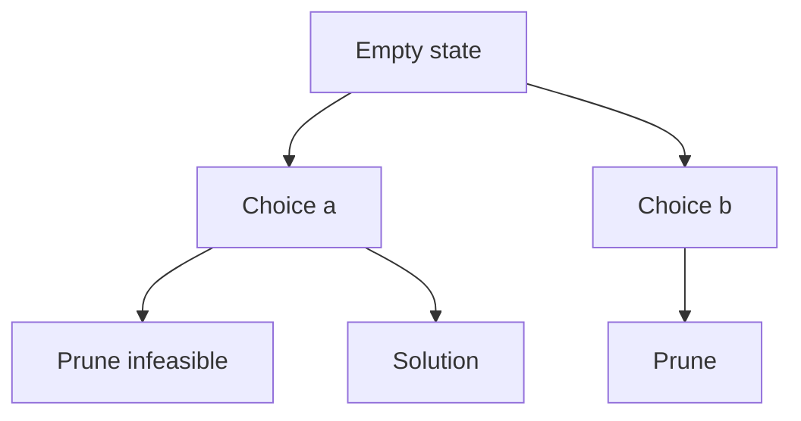
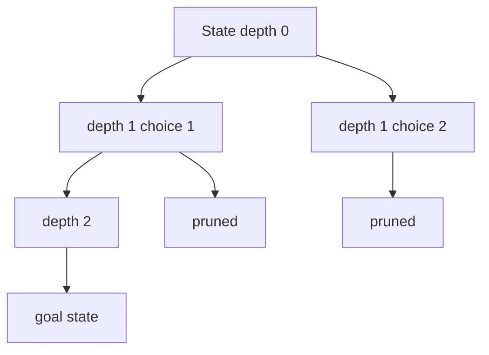
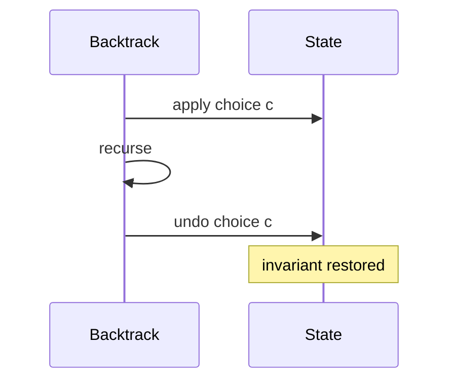

# Backtracking State Spaces and Pruning

## Overview

**Backtracking** explores a **state space tree** depth-first: extend a partial candidate, recurse, then **undo** the last choice (restore invariants). It solves constraint satisfaction, combinatorial generation, and puzzles when brute enumeration is exponential but **pruning** eliminates large subtrees early.

Backtracking is DFS on an implicit graph; correctness requires that every valid solution appears on some root-to-leaf path and pruned branches contain **no** valid completion.

## Learning Objectives

- Model problems as (state, choices, constraints, goal)
- Implement choose → explore → unchoose pattern with invariant restoration
- Apply forward checking and constraint propagation for pruning
- Analyze worst-case vs typical search with pruning strength
- Distinguish backtracking from BFS and from branch-and-bound optimization

## Prerequisites

- [[05-Algorithms/07-Graph-Traversal-and-DAGs/DFS|DFS]]
- [[05-Algorithms/00-Foundations-and-Correctness/Loop Invariants and Correctness Proofs|Loop Invariants and Correctness Proofs]]

## Difficulty

`intermediate`

## Estimated Time

- Reading: 2.5 hours
- Exercises: 4 hours
- Mini project: 6 hours

## History

Backtracking underpins early AI (DPLL SAT, chess problem solvers). Modern CP-SAT solvers extend the same ideas with nogoods and learning—but interview and tooling problems still teach explicit DFS backtracking.

## Problem It Solves

Generate all permutations/subsets satisfying constraints (N-Queens, Sudoku, regex enumeration) without storing entire level sets in BFS memory. Pruning turns O(n!) into feasible search when constraints are tight—though worst case remains exponential.

## Internal Implementation

### Template

```
function backtrack(state):
  if reject(state): return
  if accept(state): record(state); return
  for choice in choices(state):
    apply(state, choice)
    backtrack(state)
    undo(state, choice)
```

### State representation

- **Explicit**: array board, bitmask set, path list
- **Implicit**: index `i` into domain with partial assignment

### Pruning types

| Prune | When |
| --- | --- |
| **Feasibility** | Partial assignment violates constraint |
| **Optimality** (weak) | Partial cost already ≥ incumbent (see B&B note) |
| **Symmetry breaking** | Fix order to avoid duplicate permutations |



## Correctness

**Completeness**: If algorithm never prunes a branch that could extend to a valid solution, all solutions are found.

**Soundness of pruning**: `reject(state)` must be **sound**—if true, no completion of `state` satisfies constraints. Prove by contrapositive or invariant: partial violation propagates to all extensions.

**Invariant**: After `undo`, state equals snapshot before `apply` (bit-perfect restoration).

**Termination**: Finite choice tree; each path length bounded → DFS terminates.

## Complexity

| Problem | Nodes (worst) | With pruning |
| --- | --- | --- |
| Subsets | 2^n | depends |
| Permutations | n! | constraint-heavy |
| N-Queens | O(n!) naive | ~O(n) solutions only |
| Sudoku | 9^81 naive | heavy propagation |

Time often **O(b^d)** branching factor b, depth d, reduced by pruning factor.

Space: O(d) recursion stack + O(d) path storage (not O(b^d) unless storing all solutions).

## Mermaid Diagrams

### Structure: state space tree



### Sequence: choose-explore-unchoose



## Examples

### Minimal Example

**TypeScript** — N-Queens count:

```typescript
export function nQueensCount(n: number): number {
  const cols = new Array(n).fill(false);
  const diag1 = new Array(2 * n - 1).fill(false);
  const diag2 = new Array(2 * n - 1).fill(false);
  let count = 0;

  function place(row: number): void {
    if (row === n) {
      count++;
      return;
    }
    for (let c = 0; c < n; c++) {
      const d1 = row + c;
      const d2 = row - c + n - 1;
      if (cols[c] || diag1[d1] || diag2[d2]) continue;
      cols[c] = diag1[d1] = diag2[d2] = true;
      place(row + 1);
      cols[c] = diag1[d1] = diag2[d2] = false;
    }
  }

  place(0);
  return count;
}
```

**Python** — generate subsets with sum target:

```python
from typing import List


def subsets_sum(nums: List[int], target: int) -> List[List[int]]:
    out: List[List[int]] = []
    path: List[int] = []

    def dfs(i: int, rem: int) -> None:
        if rem == 0:
            out.append(path.copy())
            return
        if i == len(nums) or rem < 0:
            return
        path.append(nums[i])
        dfs(i + 1, rem - nums[i])
        path.pop()
        dfs(i + 1, rem)

    dfs(0, target)
    return out
```

### Production-Shaped Example

Feature flag combination tester: 40 flags → 2^40 naive; prune when:

- Mutually exclusive flags both set
- Required dependency missing
- Known invalid combo from prior CI run (cache nogood)

```typescript
function validPartial(flags: Map<string, boolean>): boolean {
  if (flags.get("A") && flags.get("B")) return false; // exclusive
  if (flags.get("C") && !flags.get("D")) return false; // dependency
  return true;
}
```

Log prune rate in CI to detect under-constrained models.

## Trade-offs

| Dimension | Upside | Downside | When it matters |
| --- | --- | --- | --- |
| Memory | O(depth) vs BFS frontier | May miss shortest path | All solutions |
| Pruning | Cuts exponential blowup | Wrong prune → missed solutions | Correctness critical |
| vs B&B | Simpler feasibility | Weak optimality cuts | CSP vs optimization |
| vs SAT solvers | Educational, explicit | Industrial scale needs CDCL | Tooling vs prod |

### When to Use

- Enumerate all solutions with constraints
- Decision problems with strong partial checks
- Puzzle solvers, test case generation

### When Not to Use

- Shortest path in unweighted graph → BFS
- Optimization with strong bounds → [[05-Algorithms/04-Divide-Conquer-and-Backtracking/Branch-and-Bound Concepts|Branch-and-Bound Concepts]]
- Large SAT instances → dedicated solvers

## Exercises

1. Prove N-Queens column/diag pruning is sound.
2. Count recursion calls with/without pruning on n=8 queens.
3. Solve Sudoku cell with MRV heuristic—implement forward checking.
4. Generate permutations with duplicates; avoid duplicate output via sorting + skip rule.
5. Model regex `/a?{10}/` matching as backtracking—exponential blowup demo.

## Mini Project

Build Sudoku solver with constraint propagation + backtracking; benchmark prune effectiveness.

## Portfolio Project

Integrate constraint puzzle module into [[05-Algorithms/projects/Algorithm Workbench/README|Algorithm Workbench]].

## Interview Questions

1. Template for backtracking—explain each line.
2. Difference between backtracking and DFS on explicit graph?
3. How do you avoid duplicate subsets in `[1,2,2]`?
4. What makes a prune sound?
5. N-Queens time complexity with and without pruning?

### Stretch / Staff-Level

1. Relate DPLL SAT to backtracking with unit propagation.
2. When does memoization turn backtracking into DP?

## Common Mistakes

- Forgetting undo → corrupted state
- Unsound prune skipping valid solutions
- Not sorting for duplicate handling in combination sum
- Confusing "find one" vs "find all" base cases

## Best Practices

- Copy-on-record only at goal; mutate + undo on path
- Centralize `reject`/`accept` for testability
- Add telemetry: nodes visited, pruned, depth max
- Symmetry breaking reduces redundant search

## Summary

Backtracking DFS-explores partial assignments, undoing choices to restore invariants. Sound pruning is the engineering lever on exponential state spaces. It complements BFS (shortest), branch-and-bound (optimization), and industrial constraint solvers for scale.

## Further Reading

- [[00-References/Algorithms/README|Algorithms References]]
- [[05-Algorithms/07-Graph-Traversal-and-DAGs/DFS|DFS]]

## Related Notes

- [[05-Algorithms/04-Divide-Conquer-and-Backtracking/Branch-and-Bound Concepts|Branch-and-Bound Concepts]]
- [[05-Algorithms/04-Divide-Conquer-and-Backtracking/Meet-in-the-Middle|Meet-in-the-Middle]]
- [[05-Algorithms/06-Dynamic-Programming/Memoization vs Tabulation|Memoization vs Tabulation]]
- [[05-Algorithms/07-Graph-Traversal-and-DAGs/DFS|DFS]]
- [[05-Algorithms/README|Algorithms Track]]

## Progress Checklist

- [ ] Explained from first principles
- [ ] Drew at least one Mermaid diagram
- [ ] Implemented a minimal version
- [ ] Documented trade-offs and non-goals
- [ ] Completed exercises
- [ ] Practiced interview questions aloud
- [ ] Linked prerequisites and dependents
