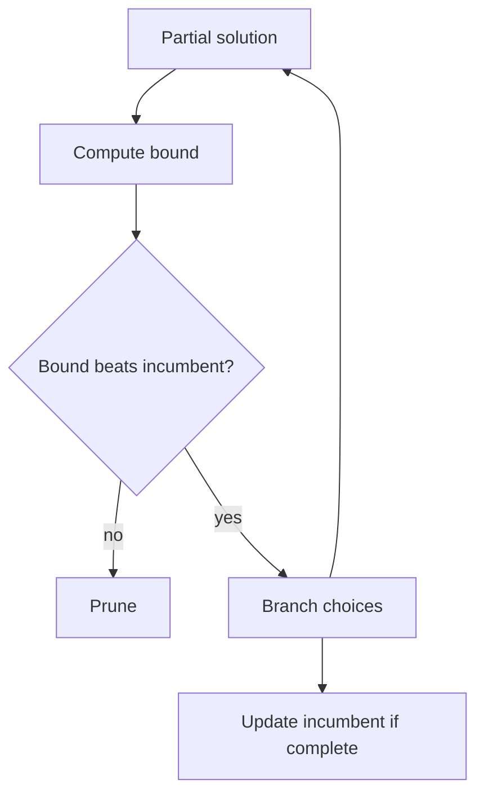
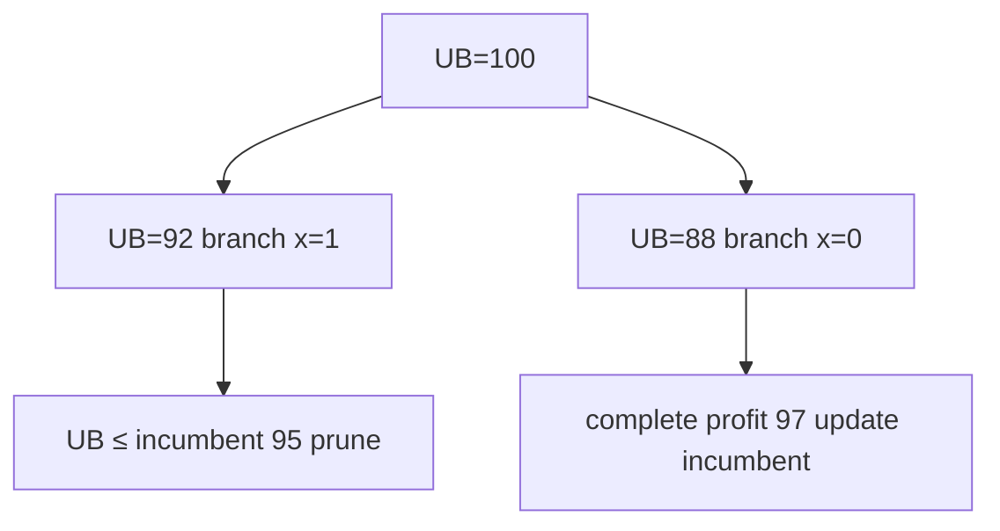
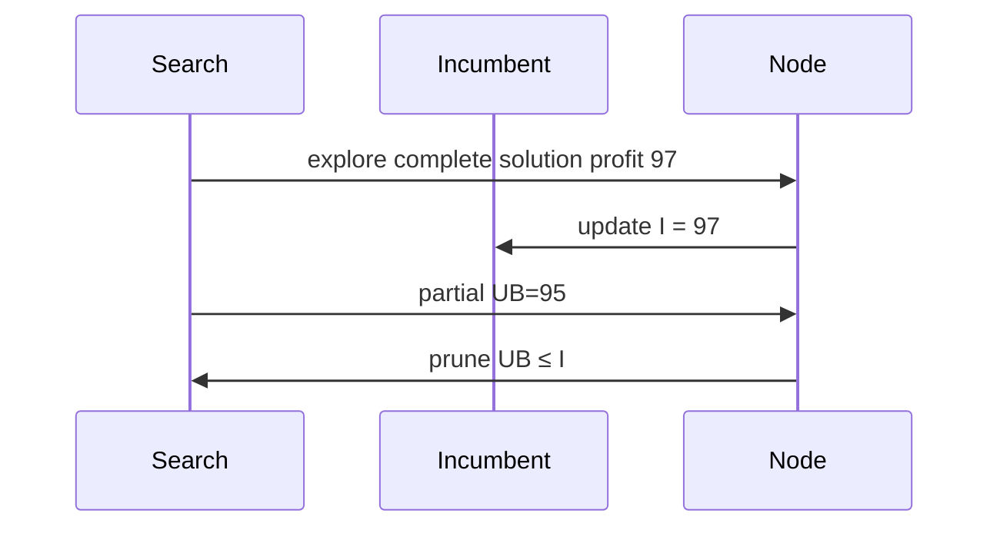

# Branch-and-Bound Concepts

## Overview

**Branch-and-bound (B&B)** searches a state space like backtracking but optimizes an **objective** by maintaining an **incumbent** (best complete solution so far) and **bounding** partial states: if a partial solution's optimistic estimate cannot beat the incumbent, **prune** the subtree.

B&B = DFS/BFS on decision tree + **sound bounds**. It solves NP-hard scheduling, TSP relaxations (concept), integer programming at small scale—production MIP solvers extend these ideas with cutting planes and heuristics.

## Learning Objectives

- Distinguish feasibility pruning (backtracking) from bound pruning (B&B)
- Design lower/upper bounds for maximization/minimization
- Compare best-first vs depth-first B&B exploration
- Prove bound soundness implies no optimal solution lost
- Relate B&B to greedy initial incumbent quality

## Prerequisites

- [[05-Algorithms/04-Divide-Conquer-and-Backtracking/Backtracking State Spaces and Pruning|Backtracking State Spaces and Pruning]]
- [[05-Algorithms/05-Greedy-Algorithms/Greedy Choice and Exchange Arguments|Greedy Choice and Exchange Arguments]]

## Difficulty

`advanced`

## Estimated Time

- Reading: 2 hours
- Exercises: 4 hours
- Mini project: 6 hours

## History

Land and Doig (1960) formalized branch-and-bound for integer programming. Branch-and-cut modern solvers dominate operations research; conceptual B&B remains the correctness backbone for custom optimizers and interviews.

## Problem It Solves

Exhaustive search for minimum tour or maximum profit is exponential. **Greedy** may be fast but suboptimal. B&B guarantees optimality when bounds are sound—pruning reduces explored nodes dramatically if bounds are tight and incumbent is good early.

## Internal Implementation

### Components

| Piece | Role |
| --- | --- |
| **Branch** | Split partial solution (choose next variable) |
| **Bound** | Optimistic best achievable from partial state |
| **Incumbent** | Best complete solution found |
| **Prune** | If bound worse than incumbent (max: upper ≤ incumbent) |

### Maximization example (0/1 knapsack branch)

At node with capacity left `C`, items remaining give **fractional knapsack upper bound** (greedy by value/weight)—if bound ≤ incumbent profit, prune.



## Correctness

**Sound upper bound (maximization)**: For any completion of partial state `s`, objective ≤ `UB(s)`.

**Sound lower bound on optimum** (via incumbent): Let `OPT` be true optimum. Incumbent `I` satisfies `I ≤ OPT` (max) once feasible.

**Prune rule safe**: If `UB(s) ≤ I`, no completion of `s` beats current incumbent; skip subtree.

**Optimality at termination**: When tree fully explored or pruned, incumbent equals `OPT` if incumbent exists and bounds sound.

## Complexity

Worst case: still exponential in problem size—B&B does not remove NP-hardness.

**Effective complexity** depends on:

- Bound tightness (fractional knapsack vs naive sum of remaining values)
- Incumbent quality (greedy warm start)
- Variable ordering (most constrained first)

Best-first search may explore fewer nodes but higher memory for priority queue.

## Mermaid Diagrams

### Structure: branch tree with bounds



### Sequence: incumbent update



## Examples

### Minimal Example

**TypeScript** — 0/1 knapsack B&B sketch:

```typescript
type Item = { w: number; v: number };

function knapsackBranchBound(items: Item[], cap: number): number {
  const sorted = [...items].sort((a, b) => b.v / b.w - a.v / a.w);
  let best = 0;

  function bound(i: number, cw: number, cv: number): number {
    if (cw > cap) return -Infinity;
    let profit = cv;
    let w = cw;
    let j = i;
    while (j < sorted.length && w + sorted[j].w <= cap) {
      w += sorted[j].w;
      profit += sorted[j].v;
      j++;
    }
    if (j < sorted.length) {
      profit += (sorted[j].v / sorted[j].w) * (cap - w);
    }
    return profit;
  }

  function dfs(i: number, cw: number, cv: number): void {
    if (cw > cap) return;
    if (cv > best) best = cv;
    if (i === sorted.length) return;
    if (bound(i, cw, cv) <= best) return;
    dfs(i + 1, cw + sorted[i].w, cv + sorted[i].v);
    dfs(i + 1, cw, cv);
  }

  dfs(0, 0, 0);
  return best;
}
```

**Python**:

```python
from dataclasses import dataclass
from typing import List


@dataclass
class Item:
    w: int
    v: int


def knapsack_bb(items: List[Item], cap: int) -> int:
    items = sorted(items, key=lambda x: x.v / x.w, reverse=True)
    best = 0

    def bound(i: int, cw: int, cv: int) -> float:
        if cw > cap:
            return float("-inf")
        profit, w, j = cv, cw, i
        while j < len(items) and w + items[j].w <= cap:
            w += items[j].w
            profit += items[j].v
            j += 1
        if j < len(items):
            profit += items[j].v / items[j].w * (cap - w)
        return profit

    def dfs(i: int, cw: int, cv: int) -> None:
        nonlocal best
        if cw > cap:
            return
        best = max(best, cv)
        if i == len(items):
            return
        if bound(i, cw, cv) <= best:
            return
        dfs(i + 1, cw + items[i].w, cv + items[i].v)
        dfs(i + 1, cw, cv)

    dfs(0, 0, 0)
    return best
```

### Production-Shaped Example

Job shop scheduling prototype: greedy heuristic sets incumbent in 100ms; B&B refines overnight with bound from LP relaxation. **Operational split**: ship greedy for online; offline prove optimality on small batches.

Log `nodes_explored`, `nodes_pruned`, `incumbent_history`.

## Trade-offs

| Dimension | Upside | Downside | When it matters |
| --- | --- | --- | --- |
| Optimality | Provable with sound bounds | Exponential worst | Small n |
| vs Greedy | Better objective | Slower | Cost vs proof |
| Bound quality | More pruning | Hard to design | Tight relaxations |
| DFS B&B | Low memory | Slow incumbent | Deep trees |
| Best-first | Good pruning early | PQ memory | Hard instances |

### When to Use

- Small n NP-hard problems needing proven optimum
- Validation oracle for heuristic tuning
- Teaching optimization correctness

### When Not to Use

- Large-scale production routing → heuristics + MIP solvers
- Feasibility-only → backtracking
- Convex problems → polynomial algorithms

## Exercises

1. Prove fractional knapsack bound is valid upper bound for 0/1 knapsack.
2. Construct instance where greedy knapsack fails but B&B finds optimum.
3. When does naive "sum of remaining values" bound fail to prune?
4. Compare DFS vs best-first node ordering on same knapsack instance.
5. Dualize: minimization with lower bounds—write prune rule.

## Mini Project

Implement B&B 0/1 knapsack; plot nodes explored vs greedy-only incumbent.

## Portfolio Project

Document B&B vs greedy decision in [[05-Algorithms/projects/Algorithm Workbench/README|Algorithm Workbench]].

## Interview Questions

1. Difference between backtracking prune and B&B prune?
2. What is an incumbent? Why warm-start with greedy?
3. Valid upper bound for max knapsack at a node?
4. Does B&B always run in polynomial time?
5. Branch-and-bound vs dynamic programming for knapsack?

### Stretch / Staff-Level

1. Outline LP relaxation bound for TSP (Held-Karp) at concept level.
2. How do MIP solvers combine cuts with B&B?

## Common Mistakes

- Unsound bound → wrong optimum
- Maximization/minimization prune direction reversed
- Forgetting to update incumbent on complete nodes
- Confusing fractional knapsack **solution** with 0/1 optimum

## Best Practices

- Always seed incumbent with greedy or historical best
- Validate bounds on random small instances vs brute force
- Instrument search tree metrics
- Defer industrial MIP to OR-tools/Gurobi for scale

## Summary

Branch-and-bound optimizes by branching on decisions and pruning subtrees whose optimistic bounds cannot beat the incumbent. Soundness of bounds is the correctness hinge; incumbent quality and bound tightness drive practical performance. It extends backtracking from feasibility to proven optimality on small hard problems.

## Further Reading

- [[00-References/Algorithms/README|Algorithms References]]
- [[05-Algorithms/05-Greedy-Algorithms/Fractional Knapsack and Scheduling|Fractional Knapsack and Scheduling]]

## Related Notes

- [[05-Algorithms/04-Divide-Conquer-and-Backtracking/Backtracking State Spaces and Pruning|Backtracking State Spaces and Pruning]]
- [[05-Algorithms/05-Greedy-Algorithms/Greedy Choice and Exchange Arguments|Greedy Choice and Exchange Arguments]]
- [[05-Algorithms/06-Dynamic-Programming/Knapsack and Subset Families|Knapsack and Subset Families]]
- [[05-Algorithms/05-Greedy-Algorithms/When Greedy Fails|When Greedy Fails]]
- [[05-Algorithms/README|Algorithms Track]]

## Progress Checklist

- [ ] Explained from first principles
- [ ] Drew at least one Mermaid diagram
- [ ] Implemented a minimal version
- [ ] Documented trade-offs and non-goals
- [ ] Completed exercises
- [ ] Practiced interview questions aloud
- [ ] Linked prerequisites and dependents
