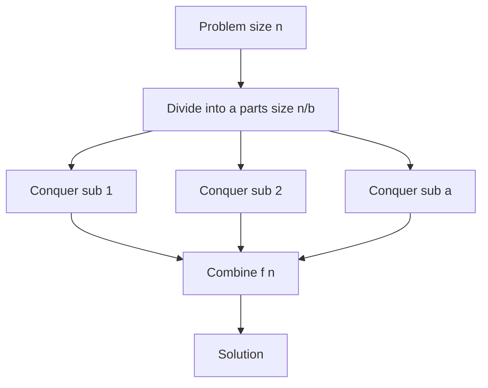
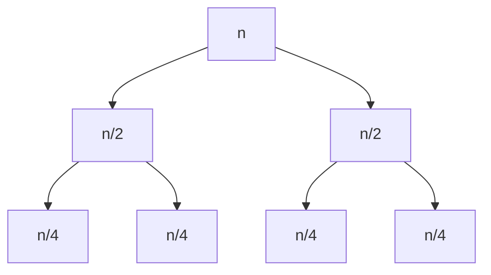
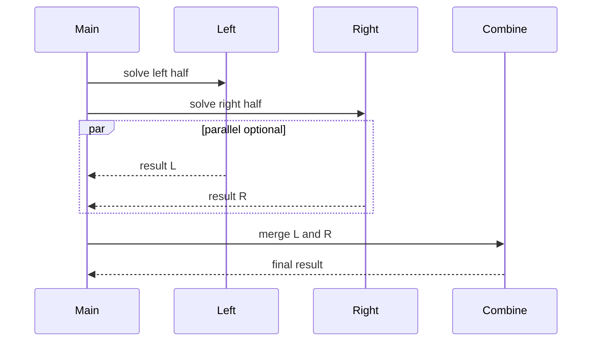

# Divide-and-Conquer Design

## Overview

**Divide-and-conquer (D&C)** solves a problem by **dividing** it into independent or overlapping subproblems of smaller size, **conquering** them recursively (or via base cases), and **combining** subproblem answers into the full solution. Correctness often follows **induction on subproblem size**; complexity from **recurrences** relating divide count, shrink factor, and combine cost.

Classic instances: merge sort, quicksort, binary search, Strassen (concept), closest pair, FFT (concept). D&C differs from [[05-Algorithms/06-Dynamic-Programming/Optimal Substructure and Overlapping Subproblems|Dynamic Programming]] when subproblems **do not overlap**—no memoization table needed.

## Learning Objectives

- Recognize D&C suitability: balanced split + efficient combine
- Set up recurrences T(n) = aT(n/b) + f(n) and solve via Master Theorem
- Prove correctness by induction on problem size
- Contrast D&C with decrease-and-conquer and brute force
- Map combine step cost to overall scalability bottlenecks

## Prerequisites

- [[05-Algorithms/01-Complexity-and-Analysis/Recurrences Recursion Trees and Master Theorem|Recurrences Recursion Trees and Master Theorem]]
- [[05-Algorithms/00-Foundations-and-Correctness/Loop Invariants and Correctness Proofs|Loop Invariants and Correctness Proofs]]

## Difficulty

`intermediate`

## Estimated Time

- Reading: 2 hours
- Exercises: 4 hours
- Mini project: 6 hours

## History

Karatsuba multiplication (1960) showed divide-and-conquer could beat naive formulas. Merge sort and FFT cemented the paradigm. Modern systems use D&C for parallel map-reduce splits—algorithmic skeleton independent of framework.

## Problem It Solves

Monolithic O(n²) or exponential algorithms on composite structures yield to **logarithmic-depth recursion** when combine is linear or O(n log n). Without explicit D&C design, teams reimplement nested loops missing logarithmic factors (e.g., naive matrix chain vs DP—but D&C wins when subproblems disjoint).

## Internal Implementation

### Template

```
function solve(problem):
  if base(problem): return direct(problem)
  parts = divide(problem)
  results = [solve(p) for p in parts]
  return combine(results)
```

### Recurrence families

| Pattern | Example | Typical T(n) |
| --- | --- | --- |
| Binary split + O(n) combine | Merge sort | O(n log n) |
| Binary split + O(1) combine | Binary search | O(log n) |
| 2 splits + O(n) combine | Closest pair | O(n log n) |
| a splits, combine O(n^c) | Master Theorem cases | varies |



## Correctness

**Structural induction**

- **Base**: For sizes ≤ threshold, direct algorithm correct (by test or proof).
- **Inductive hypothesis**: Assume `solve` correct for all sizes < n.
- **Inductive step**: `divide` produces valid subinstances whose union covers instance; `combine` reconstructs correct global answer from correct partial answers.

**Example (merge sort)**: Combine merges two sorted arrays into sorted whole—merge invariant in [[05-Algorithms/03-Sorting/Merge Sort|Merge Sort]].

**Partial correctness + termination**: Measure `size(problem)` strictly decreases in recursive calls → well-founded recursion.

## Complexity

Master Theorem (for T(n) = aT(n/b) + O(n^c), a ≥ 1, b > 1):

- If c < log_b a: T(n) = Θ(n^{log_b a})
- If c = log_b a: T(n) = Θ(n^c log n)
- If c > log_b a: T(n) = Θ(n^c)

**Space**: Often O(log n) recursion stack; merge-style combines add O(n) auxiliary.

**Parallelism**: Independent subproblems enable fork-join speedup until combine dominates (Amdahl).

## Mermaid Diagrams

### Structure: recursion tree



### Sequence: fork-join execution



## Examples

### Minimal Example

**TypeScript** — maximum subarray (divide-and-conquer variant):

```typescript
export function maxSubarrayDc(a: number[], lo: number, hi: number): number {
  if (lo === hi) return a[lo];
  const mid = (lo + hi) >> 1;
  const left = maxSubarrayDc(a, lo, mid);
  const right = maxSubarrayDc(a, mid + 1, hi);
  let cross = -Infinity;
  let sum = 0;
  for (let i = mid; i >= lo; i--) {
    sum += a[i];
    cross = Math.max(cross, sum);
  }
  sum = 0;
  for (let i = mid + 1; i <= hi; i++) {
    sum += a[i];
    cross = Math.max(cross, cross + sum - (-Infinity)); // extend cross
  }
  // cleaner cross: best suffix left + best prefix right
  let bestLeft = -Infinity, s = 0;
  for (let i = mid; i >= lo; i--) { s += a[i]; bestLeft = Math.max(bestLeft, s); }
  let bestRight = -Infinity; s = 0;
  for (let i = mid + 1; i <= hi; i++) { s += a[i]; bestRight = Math.max(bestRight, s); }
  return Math.max(left, right, bestLeft + bestRight);
}
```

**Python** — count inversions (merge sort combine):

```python
def sort_count(arr: list[int]) -> tuple[list[int], int]:
    if len(arr) <= 1:
        return arr, 0
    mid = len(arr) // 2
    left, c1 = sort_count(arr[:mid])
    right, c2 = sort_count(arr[mid:])
    merged, c3 = merge_count(left, right)
    return merged, c1 + c2 + c3


def merge_count(a: list[int], b: list[int]) -> tuple[list[int], int]:
    i = j = 0
    out: list[int] = []
    inv = 0
    while i < len(a) and j < len(b):
        if a[i] <= b[j]:
            out.append(a[i])
            i += 1
        else:
            out.append(b[j])
            inv += len(a) - i
            j += 1
    out.extend(a[i:])
    out.extend(b[j:])
    return out, inv
```

### Production-Shaped Example

Parallel file checksum: split file into chunks, hash chunks in workers, combine with Merkle tree—combine is O(k) for k chunks; D&C enables streaming verification. Wrong design: re-read entire file per verification (O(n²) I/O).

## Trade-offs

| Dimension | Upside | Downside | When it matters |
| --- | --- | --- | --- |
| Time | Often O(n log n) | Combine can dominate | Large n |
| Parallelism | Natural subproblems | Combine serial bottleneck | Multi-core ETL |
| Memory | Stack O(log n) | Merge combine O(n) | RAM |
| vs DP | Simpler, no table | Overlapping subproblems waste | Fibonacci naive |
| Implementation | Elegant recursion | Stack overflow on deep n | Iterative refactor |

### When to Use

- Problem splits into independent halves with efficient merge
- Combine is O(n) or O(n log n) while split is balanced
- Parallel map-reduce shape

### When Not to Use

- Overlapping subproblems → DP
- Unbalanced splits (degenerate quicksort) without mitigation
- Combine requires global state → consider other paradigms

## Exercises

1. Solve T(n) = 2T(n/2) + n using recursion tree.
2. Prove binary search correct by induction on interval width.
3. Implement inversion count; verify on n=5 permutations.
4. When does naive Fibonacci D&C fail? Fix with DP.
5. Design D&C for "majority element" (Boyer-Moore vs D&C merge of counts).

## Mini Project

Implement parallel merge sort (worker threads) and measure speedup vs combine-bound n.

## Portfolio Project

Add D&C pattern module to [[05-Algorithms/projects/Algorithm Workbench/README|Algorithm Workbench]] with recurrence calculator.

## Interview Questions

1. State the three D&C steps with an example.
2. Write recurrence for merge sort; solve it.
3. Difference between D&C and DP?
4. What is the combine step in counting inversions?
5. When does Master Theorem not apply?

### Stretch / Staff-Level

1. Sketch O(n log n) planar closest pair combine step—why sort by y?
2. Analyze parallel merge sort efficiency under Amdahl's law.

## Common Mistakes

- Forgetting base case → infinite recursion
- Combine step accidentally O(n²) (naive merge of unsorted lists)
- Applying D&C when subproblems overlap heavily
- Ignoring stack depth on embedded systems

## Best Practices

- Write recurrence before coding
- Validate combine independently with unit tests
- Switch to iterative bottom-up when stack depth risky
- Profile combine—it is often the scalability cap

## Summary

Divide-and-conquer splits problems, solves subproblems recursively, and merges results—correct by induction, analyzable by recurrences. It powers sorting, searching, and parallel batch processing when combine stays cheap relative to split depth. Overlapping subproblems or expensive combine push you toward DP, greedy, or different decompositions.

## Further Reading

- [[00-References/Algorithms/README|Algorithms References]]
- [[05-Algorithms/01-Complexity-and-Analysis/Recurrences Recursion Trees and Master Theorem|Recurrences Recursion Trees and Master Theorem]]

## Related Notes

- [[05-Algorithms/03-Sorting/Merge Sort|Merge Sort]]
- [[05-Algorithms/03-Sorting/Quicksort Partitioning and Introspective Fallbacks|Quicksort Partitioning and Introspective Fallbacks]]
- [[05-Algorithms/04-Divide-Conquer-and-Backtracking/Meet-in-the-Middle|Meet-in-the-Middle]]
- [[05-Algorithms/06-Dynamic-Programming/Optimal Substructure and Overlapping Subproblems|Optimal Substructure and Overlapping Subproblems]]
- [[05-Algorithms/README|Algorithms Track]]

## Progress Checklist

- [ ] Explained from first principles
- [ ] Drew at least one Mermaid diagram
- [ ] Implemented a minimal version
- [ ] Documented trade-offs and non-goals
- [ ] Completed exercises
- [ ] Practiced interview questions aloud
- [ ] Linked prerequisites and dependents
