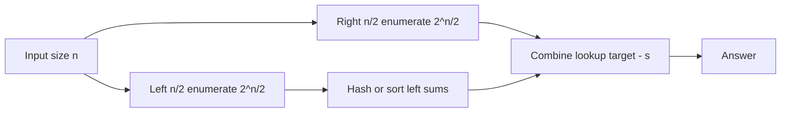
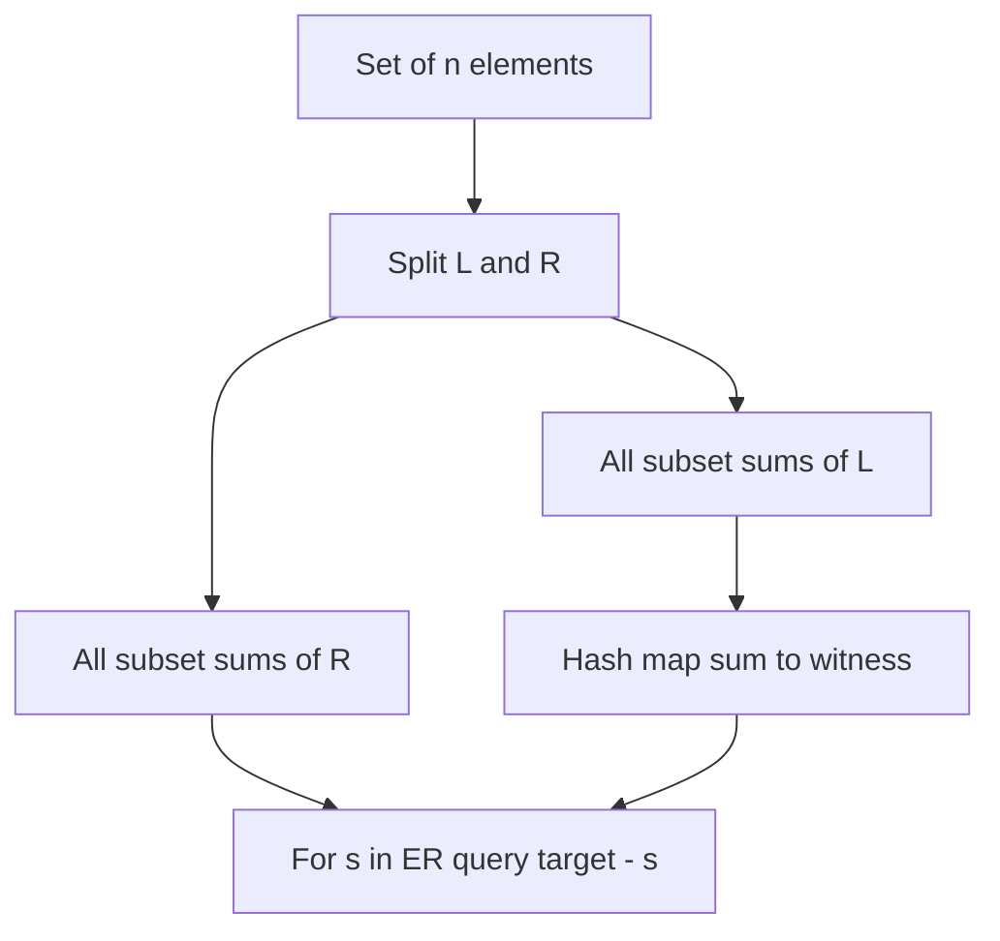
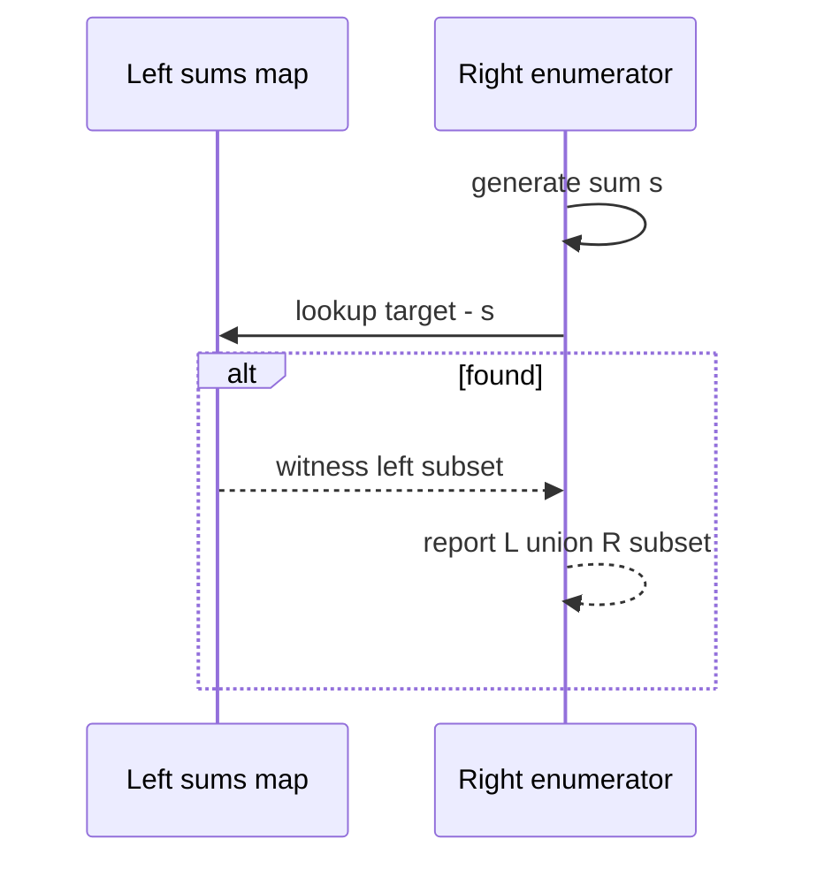

# Meet-in-the-Middle

## Overview

**Meet-in-the-middle (MITM)** splits an exponential search into **two halves**, enumerates each half separately, and **combines** results—typically via sorting or hashing—to answer the full query. It reduces O(2^n) to O(2^{n/2}) time (and often space), turning n ≈ 40 brute force into n ≈ 80 feasibility.

Classic uses: subset sum, 4-sum, path splitting, cryptanalysis sketches (concept). MITM is a **divide-and-conquer** trick on **implicit** state spaces, not geometric "two pointers."

## Learning Objectives

- Recognize problems with bilinear or split-sum structure
- Implement half-enumeration + hash/sort complement lookup
- Analyze time/space trade-offs vs plain backtracking
- Apply duplicate handling and collision correctness in hash combine
- Identify when MITM beats DP or greedy

## Prerequisites

- [[05-Algorithms/04-Divide-Conquer-and-Backtracking/Divide-and-Conquer Design|Divide-and-Conquer Design]]
- [[04-Data-Structures/03-Hash-Tables-and-Sets/Hash Table ADT|Hash Table ADT]]

## Difficulty

`intermediate`

## Estimated Time

- Reading: 1.5 hours
- Exercises: 3 hours
- Mini project: 5 hours

## History

MITM appears in subset problems since early competitive programming literature; it mirrors birthday attack structure in cryptography (conceptual parallel—production crypto belongs to security tracks). It exemplifies trading **memory for exponential time reduction**.

## Problem It Solves

Subset sum with n=40: 2^40 ≈ 1T subsets—too many. Split into two n/2 lists, enumerate 2^{20} each (~1M), hash left sums, scan right for complement—~2M operations.

## Internal Implementation

### Subset sum existence

1. Split array `a` into `L` and `R`.
2. Enumerate all subset sums of `L` → multiset/map.
3. For each subset sum `s` of `R`, check if `target - s` exists in left map.

### k-sum reduction

Reduce 4-sum to two 2-sum lists with sorting + two pointers on combined lists (variant of MITM).



## Correctness

**Completeness**: Every subset of full array decomposes uniquely into subset of `L` and subset of `R`. For each pair `(S_L, S_R)`, combined sum = sum(S_L) + sum(S_R).

**Soundness**: If complement lookup finds `t - s_R` in left sums, corresponding subsets union to solution with sum `t`.

**Duplicates**: Store counts or canonical pairs if need number of ways; sort + skip duplicates for unique solutions.

## Complexity

| Phase | Time | Space |
| --- | --- | --- |
| Enumerate left | O(2^{n/2}) | O(2^{n/2}) |
| Enumerate right | O(2^{n/2}) | O(1) streaming combine |
| **Total** | **O(2^{n/2})** | **O(2^{n/2})** |

Compare: naive backtracking O(2^n) time, O(n) stack.

Hash lookup O(1) average per right sum; sorting left adds O(2^{n/2} log 2^{n/2}) = O(n · 2^{n/2}).

## Mermaid Diagrams

### Structure: split and combine



### Sequence: complement lookup



## Examples

### Minimal Example

**TypeScript**:

```typescript
export function subsetSumExists(a: number[], target: number): boolean {
  const mid = a.length >> 1;
  const left = a.slice(0, mid);
  const right = a.slice(mid);

  const leftSums = new Set<number>();
  function gen(arr: number[], i: number, s: number, store: Set<number>): void {
    if (i === arr.length) {
      store.add(s);
      return;
    }
    gen(arr, i + 1, s, store);
    gen(arr, i + 1, s + arr[i], store);
  }
  gen(left, 0, 0, leftSums);

  let found = false;
  function check(arr: number[], i: number, s: number): void {
    if (found) return;
    if (i === arr.length) {
      if (leftSums.has(target - s)) found = true;
      return;
    }
    check(arr, i + 1, s);
    check(arr, i + 1, s + arr[i]);
  }
  check(right, 0, 0);
  return found;
}
```

**Python**:

```python
from typing import List


def subset_sum_exists(a: List[int], target: int) -> bool:
    mid = len(a) // 2
    left, right = a[:mid], a[mid:]

    left_sums: set[int] = set()

    def gen_left(i: int, s: int) -> None:
        if i == len(left):
            left_sums.add(s)
            return
        gen_left(i + 1, s)
        gen_left(i + 1, s + left[i])

    gen_left(0, 0)

    found = False

    def check_right(i: int, s: int) -> None:
        nonlocal found
        if found:
            return
        if i == len(right):
            if target - s in left_sums:
                found = True
            return
        check_right(i + 1, s)
        check_right(i + 1, s + right[i])

    check_right(0, 0)
    return found
```

### Production-Shaped Example

License/feature bitmask compatibility: 50 optional modules, check if any subset satisfies power budget `B`. MITM in offline validator—2^25 per half feasible; naive 2^50 not.

Cache left sum table across multiple budget queries (same module set, different B).

## Trade-offs

| Dimension | Upside | Downside | When it matters |
| --- | --- | --- | --- |
| Time | O(2^{n/2}) vs O(2^n) | Still exponential | n ≤ ~44 |
| Space | Hash left sums | O(2^{n/2}) memory | RAM limits |
| vs DP | Works when n large, values huge | Not pseudo-polynomial | Value range |
| Implementation | Simple split | Duplicate/bitmask details | Correctness |

### When to Use

- n ≤ ~44 and subset/partition structure
- 4-sum, 2×2-sum decomposition
- Split path length in meet-half path problems

### When Not to Use

- Small n → plain backtracking simpler
- Pseudo-polynomial DP when sum values bounded small
- Continuous optimization → branch-and-bound

## Exercises

1. Solve subset sum for n=20, target given—compare MITM vs naive timing.
2. Adapt MITM to count number of subsets hitting target exactly.
3. 4-sum: reduce to MITM with O(n²) lists per half—outline.
4. Handle duplicate array values in subset sum MITM.
5. Memory trade: sort left sums binary search vs hash—when prefer each?

## Mini Project

Implement 4-sum MITM variant; benchmark against O(n³) two-pointer on random data.

## Portfolio Project

Add exponential split module to [[05-Algorithms/projects/Algorithm Workbench/README|Algorithm Workbench]].

## Interview Questions

1. Why does meet-in-the-middle improve 2^n to 2^{n/2}?
2. Outline subset sum MITM algorithm.
3. Space complexity of MITM subset sum?
4. When is DP better than MITM for subset problems?
5. How does 4-sum use MITM idea?

### Stretch / Staff-Level

1. Meet-in-the-middle on tree paths of length k—sketch decomposition.
2. Relate MITM to birthday paradox collision probability (conceptual).

## Common Mistakes

- Off-by-one split unbalancing halves
- Forgetting empty subset sum 0 in left set
- Integer overflow in sums without BigInt
- Assuming MITM gives polynomial time—it does not

## Best Practices

- Use `BigInt` or modular checks if sums overflow 53-bit JS integers
- Store witnesses only when reconstruction needed
- Pre-size hash set to ~2^{n/2}
- Benchmark crossover n where MITM beats naive

## Summary

Meet-in-the-middle splits exponential enumeration into two halves and combines with hash or sort lookups, shaving one exponential factor from time. It is the standard upgrade when n approaches ~40 and subset or split-sum structure appears—still exponential, but practically wider.

## Further Reading

- [[00-References/Algorithms/README|Algorithms References]]
- [[05-Algorithms/04-Divide-Conquer-and-Backtracking/Divide-and-Conquer Design|Divide-and-Conquer Design]]

## Related Notes

- [[05-Algorithms/04-Divide-Conquer-and-Backtracking/Backtracking State Spaces and Pruning|Backtracking State Spaces and Pruning]]
- [[05-Algorithms/06-Dynamic-Programming/Knapsack and Subset Families|Knapsack and Subset Families]]
- [[04-Data-Structures/03-Hash-Tables-and-Sets/Hash Table ADT|Hash Table ADT]]
- [[05-Algorithms/README|Algorithms Track]]

## Progress Checklist

- [ ] Explained from first principles
- [ ] Drew at least one Mermaid diagram
- [ ] Implemented a minimal version
- [ ] Documented trade-offs and non-goals
- [ ] Completed exercises
- [ ] Practiced interview questions aloud
- [ ] Linked prerequisites and dependents
