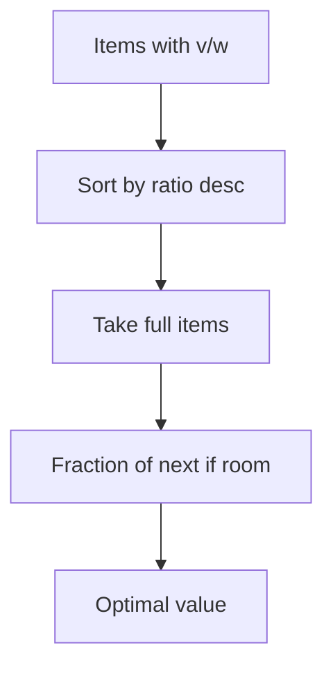
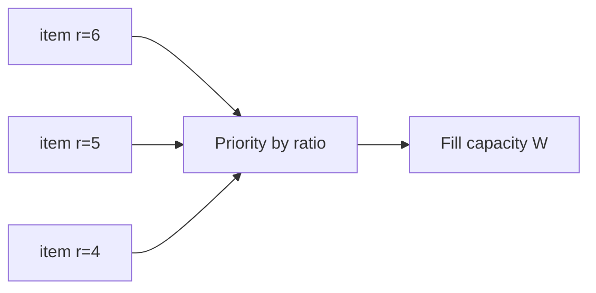
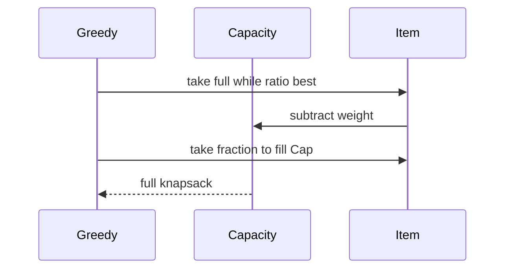

# Fractional Knapsack and Scheduling

## Overview

The **fractional knapsack** problem allows taking **fractions** of items with `(weight, value)` to maximize total value within capacity `W`. The greedy rule—sort by **value/weight ratio** descending, take fully until capacity— is **optimal**.

Related **scheduling** greeds: **Shortest Processing Time (SPT)** minimizes average completion time on one machine for equal release times; **Earliest Due Date (EDD)** minimizes maximum lateness under certain assumptions. **0/1 knapsack** (indivisible items) breaks greedy—use DP or B&B instead.

## Learning Objectives

- Prove fractional knapsack greedy via exchange on sorted ratios
- Implement greedy with fractional last item handling
- Map SPT and EDD to greedy templates with stated assumptions
- Contrast fractional vs 0/1 knapsack optimality
- Use fractional knapsack bound inside branch-and-bound for 0/1

## Prerequisites

- [[05-Algorithms/05-Greedy-Algorithms/Greedy Choice and Exchange Arguments|Greedy Choice and Exchange Arguments]]
- [[05-Algorithms/05-Greedy-Algorithms/Interval Scheduling|Interval Scheduling]]

## Difficulty

`intermediate`

## Estimated Time

- Reading: 1.5 hours
- Exercises: 3 hours
- Mini project: 5 hours

## History

Fractional knapsack is the continuous relaxation of NP-hard 0/1 knapsack—used in LP bounds and resource allocation heuristics. SPT is classic OR scheduling; weighted variants often need DP or MIP.

## Problem It Solves

Cloud burst allocation: jobs with `(cores, revenue)`—fractional model approximates divisible workloads (CPU shares). Wrong 0/1 greedy (by value alone) leaves capacity unused and suboptimal revenue.

## Internal Implementation

### Fractional knapsack

1. Compute `ratio = value/weight` for each item.
2. Sort descending by ratio.
3. Greedily take full items until next doesn't fit; take fraction of next.

### SPT (min average completion time)

Sort jobs by processing time ascending; schedule in order—optimal for identical release time, one machine, minimizing sum of completion times.

### EDD (min max lateness)

Sort by due date ascending—optimal for minimizing maximum lateness `L_max = max(C_j - d_j)` when all jobs must complete (no optional jobs).



## Correctness

**Fractional knapsack exchange**

- If optimal solution takes less than full amount of highest-ratio item while some lower-ratio item is fully taken, exchange weight from lower to higher ratio increases value—contradiction unless highest partially at capacity.

**Greedy choice**: Take max ratio item first (as much as possible).

**Optimal substructure**: Remaining capacity subproblem same type on remaining items.

**SPT proof sketch**: Adjacent swap: if longer job precedes shorter, swapping reduces sum of completion times.

**0/1 counterexample**: Items `(w,v)`: (10,60), (20,100), (30,120), W=50—greedy by ratio picks wrong set vs DP optimum.

## Complexity

| Problem | Time | Space |
| --- | --- | --- |
| Fractional knapsack | O(n log n) sort + O(n) | O(1) extra |
| SPT scheduling | O(n log n) | O(1) |
| EDD scheduling | O(n log n) | O(1) |
| 0/1 knapsack DP | O(nW) pseudo-poly | O(nW) |

## Mermaid Diagrams

### Structure: ratio sort pipeline



### Sequence: fractional fill



## Examples

### Minimal Example

**TypeScript**:

```typescript
type Item = { w: number; v: number; id?: string };

export function fractionalKnapsack(items: Item[], cap: number): number {
  const sorted = [...items].sort((a, b) => b.v / b.w - a.v / a.w);
  let rem = cap;
  let value = 0;
  for (const it of sorted) {
    if (rem <= 0) break;
    const take = Math.min(it.w, rem);
    value += it.v * (take / it.w);
    rem -= take;
  }
  return value;
}

export function sptOrder(times: number[]): number[] {
  return times
    .map((t, i) => ({ t, i }))
    .sort((a, b) => a.t - b.t)
    .map((x) => x.i);
}
```

**Python**:

```python
from dataclasses import dataclass
from typing import List


@dataclass
class Item:
    w: float
    v: float


def fractional_knapsack(items: List[Item], cap: float) -> float:
    items = sorted(items, key=lambda x: x.v / x.w, reverse=True)
    rem, value = cap, 0.0
    for it in items:
        if rem <= 0:
            break
        take = min(it.w, rem)
        value += it.v * (take / it.w)
        rem -= take
    return value


def spt_order(times: List[float]) -> List[int]:
    return sorted(range(len(times)), key=lambda i: times[i])
```

### Production-Shaped Example

Ad slot filler: divisible impressions map to fractional knapsack; **indivisible** premium bundles need 0/1 DP nightly with fractional relaxation as **upper bound** for finance forecasting (see [[05-Algorithms/04-Divide-Conquer-and-Backtracking/Branch-and-Bound Concepts|Branch-and-Bound Concepts]]).

## Trade-offs

| Dimension | Upside | Downside | When it matters |
| --- | --- | --- | --- |
| Fractional greedy | Optimal O(n log n) | Unrealistic indivisible jobs | Capacity planning bounds |
| SPT | Min avg completion | Ignores weights/due dates | Batch jobs equal priority |
| EDD | Min max lateness | All jobs mandatory | SLA deadlines |
| vs 0/1 DP | Fast | Wrong for indivisible | Product mix |

### When to Use

- Divisible resource allocation (bandwidth, CPU shares)
- Relaxation/bound for 0/1 knapsack
- SPT/EDD under documented OR assumptions

### When Not to Use

- Indivisible items without relaxation intent
- Weighted tardiness objectives
- Precedence constraints → DAG scheduling hard

## Exercises

1. Prove fractional knapsack ratio greedy optimal.
2. 0/1 counterexample with three items—show greedy fail.
3. SPT: swap argument for two jobs.
4. When does EDD fail optimality for weighted tardiness?
5. Implement fractional knapsack returning taken fractions per item id.

## Mini Project

Compare fractional greedy value vs 0/1 DP optimum on random instances; plot gap.

## Portfolio Project

Resource allocator module in [[05-Algorithms/projects/Algorithm Workbench/README|Algorithm Workbench]].

## Interview Questions

1. Fractional knapsack greedy rule?
2. Why fails for 0/1?
3. SPT minimizes what objective?
4. EDD minimizes what?
5. Use fractional solution in 0/1 context?

### Stretch / Staff-Level

1. Prove fractional knapsack LP dual interpretation (sketch).
2. Minimize weighted completion time—why SPT fails?

## Common Mistakes

- Sorting by value not ratio
- Applying fractional algorithm to 0/1 inventory
- Division by zero weight items
- EDD with optional jobs (different problem)

## Best Practices

- Validate `weight > 0` in API
- Label APIs `fractional_*` vs `discrete_*`
- Use fractional value as upper bound metric in dashboards
- Document scheduling objective function explicitly

## Summary

Fractional knapsack is optimally solved by greedy value/weight sorting; classic scheduling rules SPT and EDD are greedy under specific objectives and assumptions. Indivisible 0/1 knapsack and weighted scheduling require DP or harder methods—greedy is not interchangeable.

## Further Reading

- [[00-References/Algorithms/README|Algorithms References]]
- [[05-Algorithms/06-Dynamic-Programming/Knapsack and Subset Families|Knapsack and Subset Families]]

## Related Notes

- [[05-Algorithms/05-Greedy-Algorithms/Greedy Choice and Exchange Arguments|Greedy Choice and Exchange Arguments]]
- [[05-Algorithms/05-Greedy-Algorithms/When Greedy Fails|When Greedy Fails]]
- [[05-Algorithms/04-Divide-Conquer-and-Backtracking/Branch-and-Bound Concepts|Branch-and-Bound Concepts]]
- [[05-Algorithms/06-Dynamic-Programming/Knapsack and Subset Families|Knapsack and Subset Families]]
- [[05-Algorithms/README|Algorithms Track]]

## Progress Checklist

- [ ] Explained from first principles
- [ ] Drew at least one Mermaid diagram
- [ ] Implemented a minimal version
- [ ] Documented trade-offs and non-goals
- [ ] Completed exercises
- [ ] Practiced interview questions aloud
- [ ] Linked prerequisites and dependents
