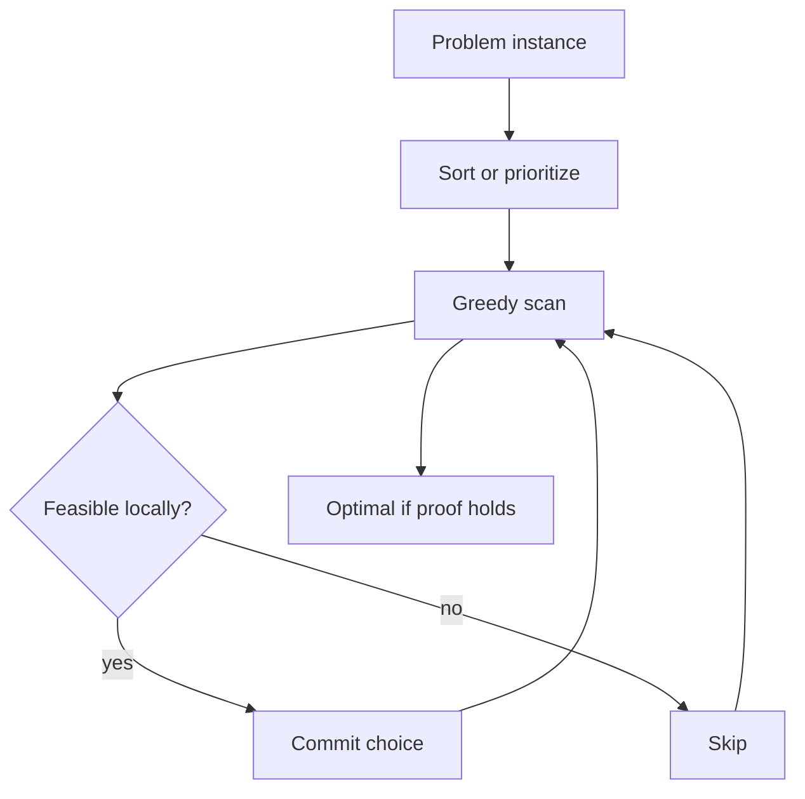
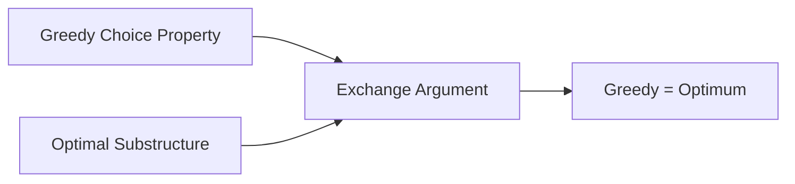

# Greedy Choice and Exchange Arguments

## Overview

A **greedy algorithm** builds a solution incrementally by repeatedly taking the **locally best** choice according to a heuristic rule, never revisiting past decisions. Greedy succeeds only when problems exhibit the **greedy choice property** (some locally optimal choice extends to a global optimum) and **optimal substructure** (optimal solution contains optimal subsolutions).

**Exchange arguments** prove greediness: show any optimal solution can be transformed—by swapping choices—into one that starts with the greedy pick without worsening objective.

When exchange fails, greedy is wrong—see [[05-Algorithms/05-Greedy-Algorithms/When Greedy Fails|When Greedy Fails]] and use DP instead.

## Learning Objectives

- State greedy choice property and optimal substructure precisely
- Construct exchange proofs for canonical problems (interval scheduling, fractional knapsack)
- Implement greedy with loop invariants tied to proof obligations
- Recognize when sorting order is the entire algorithm design
- Contrast greedy correctness with DP overlapping subproblems

## Prerequisites

- [[05-Algorithms/00-Foundations-and-Correctness/Loop Invariants and Correctness Proofs|Loop Invariants and Correctness Proofs]]
- [[05-Algorithms/06-Dynamic-Programming/Optimal Substructure and Overlapping Subproblems|Optimal Substructure and Overlapping Subproblems]]

## Difficulty

`intermediate`

## Estimated Time

- Reading: 2 hours
- Exercises: 4 hours
- Mini project: 5 hours

## History

Greedy scheduling and Huffman coding (1952) predated formal exchange proofs. Kruskal/Prim MST algorithms are greedy with cut property proofs (graph module). Greedy remains default for many production heuristics—when proven, it is also **optimal** with low overhead.

## Problem It Solves

DP can be O(n²) or worse; greedy often O(n log n) from one sort + linear scan. Teams reach for greedy for speed—but ship suboptimal or invalid solutions without proof. Exchange arguments turn "seems reasonable" into auditable correctness.

## Internal Implementation

### Greedy template

```
sort items by key derived from problem
result = empty
for item in items:
  if item compatible with result:
    add item to result
return result
```

### Exchange argument skeleton (maximization)

1. Let `G` be first greedy choice.
2. Let `O` be any optimal solution.
3. If `G ∉ O`, show ∃ `O'` optimal with `G ∈ O'` (exchange `G` for something in `O`).
4. Induct on remaining subproblem.



## Correctness

**Greedy choice property**: There exists an optimal solution that makes the first greedy choice.

**Optimal substructure**: After greedy choice, remaining subproblem is same type; optimal remainder + greedy choice = global optimum.

**Loop invariant pattern**: After processing prefix, selected set is subset of some optimal solution (or equals optimal for constructed solution).

**Exchange step obligations**: Show transformed solution remains feasible and objective ≥ original optimum (thus equal).

Without both properties, greedy may be heuristic only.

## Complexity

Typically:

- **Sort**: O(n log n) if comparison sort on keys
- **Scan**: O(n)
- **Total**: O(n log n) time, O(1)–O(n) space depending on output storage

Some greedy on priority queues (Dijkstra, Huffman) add O(log n) per operation—see respective notes.

## Mermaid Diagrams

### Structure: proof obligations



### Sequence: exchange in optimal solution

```mermaid
sequenceDiagram
    participant Opt as Optimal O
    participant Gre as Greedy G
    participant Ex as Exchange step

    Opt->>Ex: G not in O
    Ex->>Ex: swap G in, remove conflicting x
    Ex-->>Opt: O' feasible same value
    Note over Opt: Induct on remainder
```

## Examples

### Minimal Example

**TypeScript** — activity selection (by finish time):

```typescript
type Activity = { start: number; finish: number };

export function maxActivities(acts: Activity[]): Activity[] {
  const sorted = [...acts].sort((a, b) => a.finish - b.finish);
  const out: Activity[] = [];
  let lastFinish = -Infinity;
  for (const a of sorted) {
    if (a.start >= lastFinish) {
      out.push(a);
      lastFinish = a.finish;
    }
  }
  return out;
}
```

**Python**:

```python
from dataclasses import dataclass
from typing import List


@dataclass
class Activity:
    start: int
    finish: int


def max_activities(acts: List[Activity]) -> List[Activity]:
    acts = sorted(acts, key=lambda a: a.finish)
    out: List[Activity] = []
    last = float("-inf")
    for a in acts:
        if a.start >= last:
            out.append(a)
            last = a.finish
    return out
```

### Production-Shaped Example

Rate limiter token bucket refill scheduling: greedily process earliest-deadline events—proof reduces to interval scheduling when buckets independent. Document **non-greedy** coupling when shared buffer breaks exchange.

## Trade-offs

| Dimension | Upside | Downside | When it matters |
| --- | --- | --- | --- |
| Speed | Often O(n log n) | Wrong without proof | Hot paths |
| Simplicity | Few lines | Subtle sort keys | Maintenance |
| vs DP | Lower memory | No overlapping reuse | Problem structure |
| Optimality | Provable in cases | Fails silently | Revenue/scheduling |

### When to Use

- Proven greedy choice + substructure (intervals, fractional knapsack, Huffman)
- MST cut/ cycle properties (graph module)
- Heuristic when optimality not required but labeled as such

### When Not to Use

- 0/1 knapsack, weighted interval scheduling with weights
- Problems with counterexamples in [[05-Algorithms/05-Greedy-Algorithms/When Greedy Fails|When Greedy Fails]]

## Exercises

1. Prove earliest-finish-time greedy for unweighted interval scheduling via exchange.
2. Give counterexample: earliest **start** time greedy fails.
3. Write loop invariant for fractional knapsack greedy by value/weight.
4. Why is optimal substructure necessary but not sufficient for greedy?
5. Design greedy for "minimum number of coins" with denominations {1,3,4}—does it work?

## Mini Project

Build greedy proof checklist linter: sort key + feasibility + exchange notes in docstring required for `greedy_*` functions.

## Portfolio Project

Add greedy vs DP comparison lab in [[05-Algorithms/projects/Algorithm Workbench/README|Algorithm Workbench]].

## Interview Questions

1. What is an exchange argument?
2. State greedy choice property vs optimal substructure.
3. Why sort by finish time in activity selection?
4. Is every optimal substructure problem greedy-solvable?
5. Outline proof for fractional knapsack greedy.

### Stretch / Staff-Level

1. Prove cut property implies Kruskal's greedy MST step (outline).
2. Matroid generalization of greedy—one sentence definition and implication.

## Common Mistakes

- Sorting by wrong key without proof
- Assuming greedy because DP is "too slow"
- Not checking feasibility when committing choice
- Confusing greedy with local search hill-climbing

## Best Practices

- Write proof sketch in module doc before shipping
- Property-test greedy vs brute force on small n
- Name functions `greedy_*` only when proven; else `heuristic_*`
- Cross-link counterexamples note

## Summary

Greedy algorithms commit locally optimal choices once; they are correct only with greedy choice property and optimal substructure, typically proved by exchange arguments. Sort order often *is* the algorithm. Without proof, greedy is a heuristic—fast, seductive, and sometimes wrong.

## Further Reading

- [[00-References/Algorithms/README|Algorithms References]]
- Kleinberg & Tardos — greedy chapter

## Related Notes

- [[05-Algorithms/05-Greedy-Algorithms/Interval Scheduling|Interval Scheduling]]
- [[05-Algorithms/05-Greedy-Algorithms/Fractional Knapsack and Scheduling|Fractional Knapsack and Scheduling]]
- [[05-Algorithms/05-Greedy-Algorithms/When Greedy Fails|When Greedy Fails]]
- [[05-Algorithms/06-Dynamic-Programming/Optimal Substructure and Overlapping Subproblems|Optimal Substructure and Overlapping Subproblems]]
- [[05-Algorithms/README|Algorithms Track]]

## Progress Checklist

- [ ] Explained from first principles
- [ ] Drew at least one Mermaid diagram
- [ ] Implemented a minimal version
- [ ] Documented trade-offs and non-goals
- [ ] Completed exercises
- [ ] Practiced interview questions aloud
- [ ] Linked prerequisites and dependents
