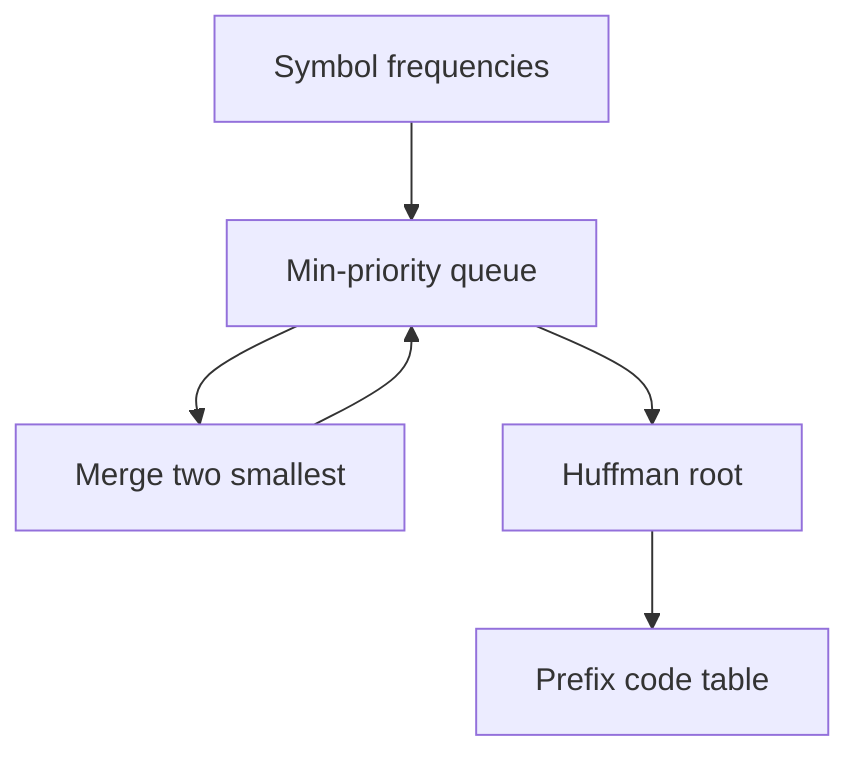
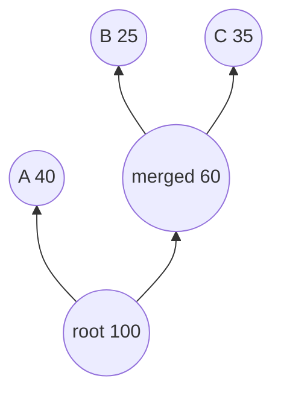
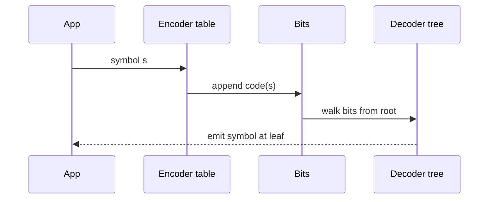

# Huffman Coding

## Overview

**Huffman coding** builds an **optimal prefix code** for a symbol alphabet given **frequencies** (or weights): no codeword is a prefix of another, and expected codeword length is minimized among prefix codes. The algorithm repeatedly merges the two **least frequent** subtrees—greedy on a min-priority queue.

Used in DEFLATE (with LZ77), JPEG (concept), and custom telemetry compression. **Tree structure** is a binary tree; **heap operations** for merge loop use [[04-Data-Structures/06-Heaps-and-Priority-Queues/Priority Queue ADT|Priority Queue ADT]] and [[04-Data-Structures/06-Heaps-and-Priority-Queues/Binary Heaps and Array Layout|Binary Heaps and Array Layout]].

## Learning Objectives

- Prove Huffman merge step via exchange/greedy argument
- Build Huffman tree with min-heap; generate prefix codes by tree walk
- Compute expected bits and compare to Shannon entropy lower bound
- Handle degenerate cases (one symbol, equal frequencies)
- Integrate Huffman with canonical code tables for production decode speed

## Prerequisites

- [[05-Algorithms/05-Greedy-Algorithms/Greedy Choice and Exchange Arguments|Greedy Choice and Exchange Arguments]]
- [[04-Data-Structures/06-Heaps-and-Priority-Queues/Priority Queue ADT|Priority Queue ADT]]
- [[01-Computer-Science/01-Information-and-Representation/Bits Bytes and Information|Bits Bytes and Information]]

## Difficulty

`intermediate`

## Estimated Time

- Reading: 2 hours
- Exercises: 4 hours
- Mini project: 6 hours

## History

David Huffman (1952) invented the algorithm as a class assignment. It remains the textbook optimal prefix code construction despite arithmetic/range coding advances for adaptive models.

## Problem It Solves

Fixed-width encoding wastes bits on skewed distributions (common ASCII letters vs rare). Huffman assigns shorter codes to frequent symbols—approaching entropy \(H(X) = -\sum p_i \log_2 p_i\) without fractional bit assignments per symbol at code level.

## Internal Implementation

### Algorithm

1. Create leaf node for each symbol with weight = frequency.
2. Insert all nodes into min-heap by weight.
3. While more than one node:
   - Pop two smallest `a`, `b`
   - Create internal node with weight `a.w + b.w`, children `a`, `b`
   - Push internal node
4. Remaining node is root; walk tree: left=0, right=1 (convention fixed in codec).



## Correctness

**Greedy choice**: There exists optimal prefix tree where two least frequent symbols are siblings at maximum depth.

**Exchange argument sketch**: In optimal tree, swap least symbols to be siblings without increasing expected length.

**Optimal substructure**: Tree on merged alphabet (with combined symbol) corresponds to subtree after merging two least nodes.

**Prefix property**: Codewords from tree edges are prefix-free—decode unambiguously left-to-right.

## Complexity

| Phase | Time | Space |
| --- | --- | --- |
| Build heap | O(n) | O(n) |
| n−1 merges | O(n log n) with heap | O(n) tree |
| Code generation | O(n) tree walk | O(n) table |

For alphabet size n (distinct symbols).

## Mermaid Diagrams

### Structure: Huffman tree merge



### Sequence: encode/decode lifecycle



## Examples

### Minimal Example

**TypeScript**:

```typescript
type Node = { w: number; s?: string; l?: Node; r?: Node };

export function buildHuffman(freq: Map<string, number>): Node | null {
  const heap: Node[] = [...freq.entries()].map(([s, w]) => ({ w, s }));
  heap.sort((a, b) => a.w - b.w);
  const push = (n: Node) => {
    let i = heap.findIndex((x) => x.w > n.w);
    if (i === -1) heap.push(n);
    else heap.splice(i, 0, n);
  };
  while (heap.length > 1) {
    const a = heap.shift()!;
    const b = heap.shift()!;
    push({ w: a.w + b.w, l: a, r: b });
  }
  return heap[0] ?? null;
}

export function codes(root: Node | null, pref = "", out: Map<string, string> = new Map()): Map<string, string> {
  if (!root) return out;
  if (root.s !== undefined) {
    out.set(root.s, pref || "0");
    return out;
  }
  codes(root.l!, pref + "0", out);
  codes(root.r!, pref + "1", out);
  return out;
}
```

**Python**:

```python
import heapq
from dataclasses import dataclass, field
from typing import Dict, Optional, Tuple


@dataclass(order=True)
class Node:
    w: int
    s: Optional[str] = field(compare=False, default=None)
    left: Optional["Node"] = field(compare=False, default=None)
    right: Optional["Node"] = field(compare=False, default=None)


def build_huffman(freq: Dict[str, int]) -> Optional[Node]:
    heap = [Node(w, s=s) for s, w in freq.items()]
    if not heap:
        return None
    heapq.heapify(heap)
    while len(heap) > 1:
        a = heapq.heappop(heap)
        b = heapq.heappop(heap)
        heapq.heappush(heap, Node(a.w + b.w, left=a, right=b))
    return heap[0]


def huffman_codes(root: Optional[Node]) -> Dict[str, str]:
    out: Dict[str, str] = {}

    def walk(n: Optional[Node], pref: str) -> None:
        if n is None:
            return
        if n.s is not None:
            out[n.s] = pref or "0"
            return
        walk(n.left, pref + "0")
        walk(n.right, pref + "1")

    walk(root, "")
    return out
```

### Production-Shaped Example

Telemetry batch: ship **canonical Huffman table once** per schema version; payloads bit-packed. Decoder uses lookup table + length-limited tree for cache-friendly decode—not pointer chasing per bit in hot loop.

Store `schemaVersion` in header; mismatch → decode error, not garbage.

## Trade-offs

| Dimension | Upside | Downside | When it matters |
| --- | --- | --- | --- |
| Expected length | Optimal prefix code | Needs frequency model | Skewed logs |
| Decode | Prefix unique | Tree walk vs table | Hot decode |
| vs arithmetic coding | Simpler integer bit ops | Less near-entropy on tiny alphabets | Embedded |
| Static vs adaptive | Simple header | Drift if frequencies change | Streaming |
| Two-symbol tree | One codeword bit | Edge case bugs | Tests |

### When to Use

- Known symbol frequencies (static or batch)
- Custom columnar compression layer
- Teaching entropy + greedy merge

### When Not to Use

- Already compressed binary (no gain)
- General text → use zstd/brotli (LZ + Huffman/ANS)
- Fractional bit needs without prefix constraint → arithmetic coding

## Exercises

1. Build Huffman tree for `{a:5,b:9,c:12,d:13,e:16,f:45}`; compute expected bits.
2. Prove two least frequent symbols are siblings in some optimal tree.
3. Compare expected length to entropy for skewed distribution.
4. Implement canonical Huffman (length-sorted codes)—why faster decode?
5. Single-symbol alphabet—what code assignment?

## Mini Project

Huffman compressor: JSON freq file → binary payload + header; round-trip property tests.

## Portfolio Project

Add compression lane to [[05-Algorithms/projects/Text Search Toolkit/README|Text Search Toolkit]] or Algorithm Workbench bit stats panel.

## Interview Questions

1. Why merge two smallest frequencies?
2. Huffman vs fixed-width encoding gain formula?
3. Prefix code definition?
4. Complexity with n symbols?
5. Why store canonical tables in DEFLATE-like formats?

### Stretch / Staff-Level

1. Prove Huffman expected length within 1 bit of entropy per symbol (theorem sketch).
2. Adaptive Huffman (Vitter) vs static—when rebuild?

## Common Mistakes

- Ambiguous code when single symbol (assign `"0"`)
- Non-stable tie-breaking causing incompatible encoder/decoder trees
- Forgetting to ship tree/canonical table with payload
- Measuring compression on already random data

## Best Practices

- Fix tie-breaking rule in spec (e.g., same weight → lexicographic symbol order)
- Canonical codes for O(1) decode tables
- Version schema separately from codec
- Compare against entropy baseline in metrics

## Summary

Huffman coding greedily merges least frequent symbols into a binary tree, yielding optimal prefix codes minimizing expected length for given frequencies. Heap-backed merges are O(n log n); correctness follows exchange arguments. Production use pairs static tables with canonical encoding; heap layout belongs to Data Structures.

## Further Reading

- [[00-References/Algorithms/README|Algorithms References]]
- [[01-Computer-Science/01-Information-and-Representation/Bits Bytes and Information|Bits Bytes and Information]]

## Related Notes

- [[05-Algorithms/05-Greedy-Algorithms/Greedy Choice and Exchange Arguments|Greedy Choice and Exchange Arguments]]
- [[04-Data-Structures/06-Heaps-and-Priority-Queues/Priority Queue ADT|Priority Queue ADT]]
- [[04-Data-Structures/06-Heaps-and-Priority-Queues/Binary Heaps and Array Layout|Binary Heaps and Array Layout]]
- [[05-Algorithms/05-Greedy-Algorithms/When Greedy Fails|When Greedy Fails]]
- [[05-Algorithms/README|Algorithms Track]]

## Progress Checklist

- [ ] Explained from first principles
- [ ] Drew at least one Mermaid diagram
- [ ] Implemented a minimal version
- [ ] Documented trade-offs and non-goals
- [ ] Completed exercises
- [ ] Practiced interview questions aloud
- [ ] Linked prerequisites and dependents
