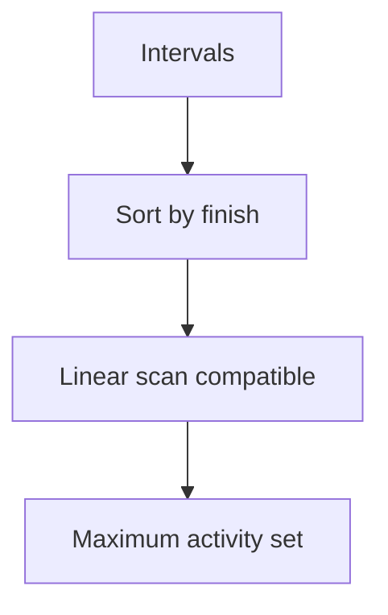
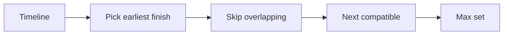
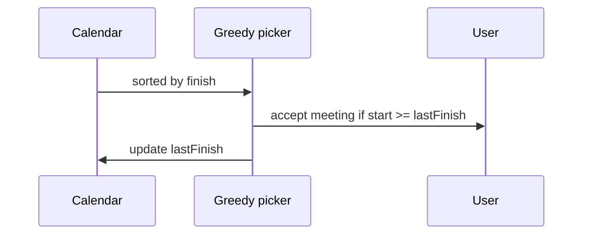

# Interval Scheduling

## Overview

**Interval scheduling** (activity selection) selects the maximum number of **mutually compatible** intervals on a line—two intervals compatible if they do not overlap (touching endpoints policy must be fixed: usually `[s,f)` half-open avoids ambiguity).

The classic **greedy by earliest finish time** achieves optimum in O(n log n). Variants add **weights** (NP-hard → DP), **resources** (multiple machines), or **minimize lateness** (different sort keys).

Production use: calendar slot packing, maintenance windows, CPU job batching, RF spectrum allocation sketches.

## Learning Objectives

- Prove earliest-finish-time greedy via exchange argument
- Implement half-open interval overlap tests consistently
- Extend to "minimum rooms" via sweep line / priority queue
- Contrast unweighted (greedy) vs weighted (DP) interval scheduling
- Map API scheduling policies to interval contracts

## Prerequisites

- [[05-Algorithms/05-Greedy-Algorithms/Greedy Choice and Exchange Arguments|Greedy Choice and Exchange Arguments]]
- [[05-Algorithms/03-Sorting/Sorting Contracts Stability and Adaptivity|Sorting Contracts Stability and Adaptivity]]

## Difficulty

`intermediate`

## Estimated Time

- Reading: 1.5 hours
- Exercises: 3 hours
- Mini project: 5 hours

## History

Activity selection is a standard CLRS greedy example. Weighted version connects to dynamic programming on sorted finish times. Meeting rooms II (min resources) appears frequently in interviews and datacenter maintenance planning.

## Problem It Solves

Given n meeting requests, maximize count scheduled on one room without overlap. Brute force 2^n subsets fails at n=30. Greedy finishes earliest compatible meeting first—freeing room for more future meetings.

## Internal Implementation

### Max activities (one resource)

1. Sort by `finish` ascending (tie-break by start if needed).
2. Scan: take interval if `start >= lastFinish` (half-open).
3. Update `lastFinish`.

### Minimum rooms (parallel resources)

Sort starts; min-heap of end times—see [[04-Data-Structures/06-Heaps-and-Priority-Queues/Priority Queue ADT|Priority Queue ADT]] for heap layout; algorithmic sweep here.



## Correctness

**Greedy choice**: Let `a` be compatible activity with earliest finish among all activities. ∃ optimal schedule including `a`.

**Exchange proof sketch**: Take optimal `O`. If `O` lacks `a`, let `b` be first activity in `O`. Since `finish(a) ≤ finish(b)` and `a` compatible with prior choices, replace `b` with `a` without reducing count.

**Optimal substructure**: After taking `a`, maximize activities among those starting after `finish(a)`—same problem type.

**Half-open convention**: Intervals `[s,f)` overlap iff `s < f' && s' < f`. Endpoint equality allowed back-to-back.

## Complexity

| Variant | Time | Space |
| --- | --- | --- |
| Max count one machine | O(n log n) sort + O(n) scan | O(1) extra |
| Min rooms | O(n log n) | O(n) heap |
| Weighted max | O(n log n) or O(n²) DP | O(n) |

## Mermaid Diagrams

### Structure: greedy scan



### Sequence: meeting room assignment



## Examples

### Minimal Example

**TypeScript**:

```typescript
export type Interval = { start: number; end: number; id?: string };

export function maxNonOverlapping(intervals: Interval[]): Interval[] {
  const sorted = [...intervals].sort((a, b) => a.end - b.end || a.start - b.start);
  const out: Interval[] = [];
  let lastEnd = -Infinity;
  for (const iv of sorted) {
    if (iv.start >= lastEnd) {
      out.push(iv);
      lastEnd = iv.end;
    }
  }
  return out;
}

export function minMeetingRooms(intervals: Interval[]): number {
  if (!intervals.length) return 0;
  const starts = [...intervals].sort((a, b) => a.start - b.start);
  const ends = [...intervals].sort((a, b) => a.end - b.end);
  let rooms = 0, maxRooms = 0, i = 0, j = 0;
  while (i < starts.length) {
    if (starts[i].start < ends[j].end) {
      rooms++;
      maxRooms = Math.max(maxRooms, rooms);
      i++;
    } else {
      rooms--;
      j++;
    }
  }
  return maxRooms;
}
```

**Python**:

```python
from dataclasses import dataclass
from typing import List


@dataclass
class Interval:
    start: int
    end: int


def max_non_overlapping(intervals: List[Interval]) -> List[Interval]:
    intervals = sorted(intervals, key=lambda x: (x.end, x.start))
    out: List[Interval] = []
    last_end = float("-inf")
    for iv in intervals:
        if iv.start >= last_end:
            out.append(iv)
            last_end = iv.end
    return out


def min_meeting_rooms(intervals: List[Interval]) -> int:
    if not intervals:
        return 0
    starts = sorted(i.start for i in intervals)
    ends = sorted(i.end for i in intervals)
    rooms = max_rooms = i = j = 0
    while i < len(starts):
        if starts[i] < ends[j]:
            rooms += 1
            max_rooms = max(max_rooms, rooms)
            i += 1
        else:
            rooms -= 1
            j += 1
    return max_rooms
```

### Production-Shaped Example

Maintenance windows `[start, end)` in UTC; greedy maximizes count of low-priority patches in one maintenance lane. **Weighted** critical patches need DP or ILP—not greedy by finish time alone.

Document overlap policy in API: inclusive vs exclusive endpoints caused P1 incidents when `end == next.start` double-booked under wrong convention.

## Trade-offs

| Dimension | Upside | Downside | When it matters |
| --- | --- | --- | --- |
| Unweighted greedy | Optimal O(n log n) | Ignores priority weights | Homogeneous jobs |
| Finish-time sort | Proven exchange | Wrong for weighted | Revenue meetings |
| Sweep min rooms | O(n log n) | Needs consistent endpoints | Capacity planning |
| vs DP weighted | Optimal weights | O(n²) or better with structure | SLA tiers |

### When to Use

- Maximize count of equal-priority non-overlapping intervals on one resource
- Min meeting rooms with sweep + heap/two-pointer

### When Not to Use

- Weighted interval scheduling with profits
- Intervals with setup/teardown gaps not modeled
- Multi-dimensional resources (2D packing)

## Exercises

1. Prove earliest-finish greedy optimal (full exchange).
2. Counterexample: earliest-start greedy fails.
3. Implement weighted interval scheduling DP; compare to greedy on random weights.
4. Min rooms: prove two-pointer sweep correctness.
5. Given half-open vs closed intervals, find input where policies differ.

## Mini Project

Calendar optimizer: read ICS-like JSON, output max compatible set + min rooms; fuzz endpoint conventions.

## Portfolio Project

Integrate scheduling module into [[05-Algorithms/projects/Dependency Planner/README|Dependency Planner]] (time windows layer).

## Interview Questions

1. Sort key for max non-overlapping intervals?
2. Prove greedy or outline exchange.
3. Min meeting rooms algorithm?
4. Weighted intervals—greedy or DP?
5. Half-open `[s,e)` overlap test?

### Stretch / Staff-Level

1. Interval partitioning with equal-length slots—reduce to graph coloring?
2. Online interval scheduling competitive ratio (brief).

## Common Mistakes

- Closed interval overlap off-by-one at shared endpoint
- Sorting by start for max-count problem
- Applying unweighted greedy to weighted SLA jobs
- Timezone-naive datetime comparisons

## Best Practices

- Standardize half-open `[start, end)` in storage
- Unit-test touching intervals
- Separate `maxCount` vs `maxWeight` APIs
- Use min-rooms for capacity; greedy set for single lane

## Summary

Unweighted interval scheduling is solved optimally by sorting on finish time and greedily accepting compatible intervals—proved by exchange argument. Minimum rooms uses sweep techniques. Weighted variants break greedy optimality and require DP or harder optimization.

## Further Reading

- [[00-References/Algorithms/README|Algorithms References]]
- [[05-Algorithms/05-Greedy-Algorithms/Greedy Choice and Exchange Arguments|Greedy Choice and Exchange Arguments]]

## Related Notes

- [[05-Algorithms/05-Greedy-Algorithms/Greedy Choice and Exchange Arguments|Greedy Choice and Exchange Arguments]]
- [[05-Algorithms/05-Greedy-Algorithms/Fractional Knapsack and Scheduling|Fractional Knapsack and Scheduling]]
- [[05-Algorithms/05-Greedy-Algorithms/When Greedy Fails|When Greedy Fails]]
- [[04-Data-Structures/06-Heaps-and-Priority-Queues/Priority Queue ADT|Priority Queue ADT]]
- [[05-Algorithms/README|Algorithms Track]]

## Progress Checklist

- [ ] Explained from first principles
- [ ] Drew at least one Mermaid diagram
- [ ] Implemented a minimal version
- [ ] Documented trade-offs and non-goals
- [ ] Completed exercises
- [ ] Practiced interview questions aloud
- [ ] Linked prerequisites and dependents
