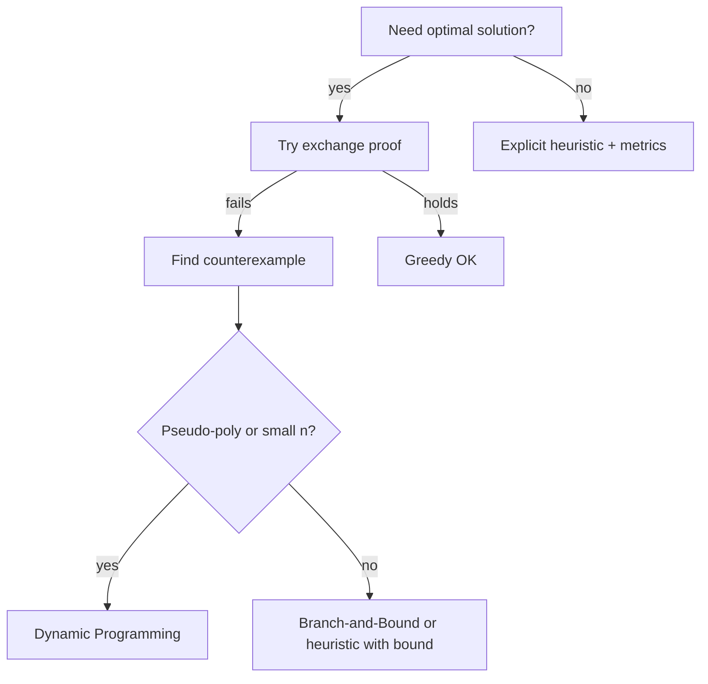
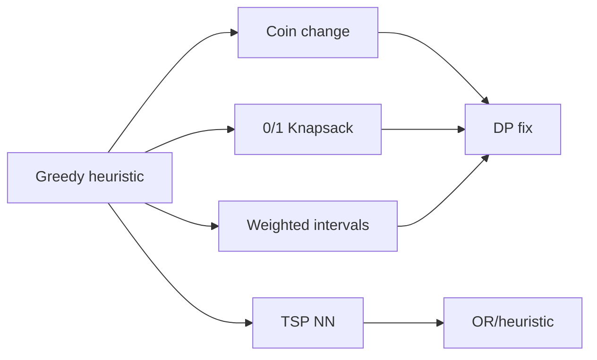
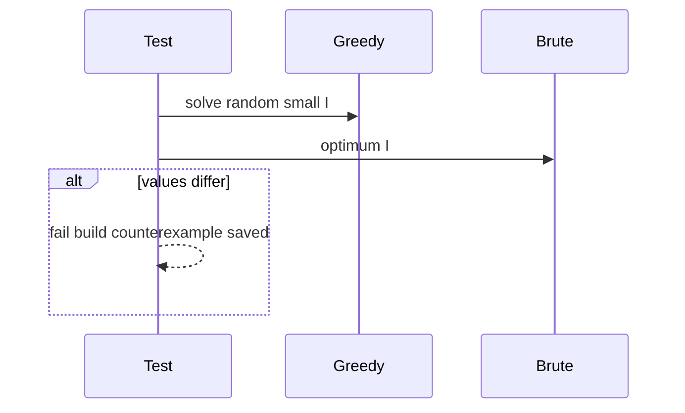

# When Greedy Fails

## Overview

Greedy algorithms fail when the **greedy choice property** does not hold: a locally optimal pick forecloses a globally better solution. Failures appear as **small counterexamples** (coin change with `{1,3,4}` for amount 6), **structural breaks** (0/1 knapsack vs fractional), or **hidden coupling** (shortest path with negative edges—greedy Dijkstra fails).

Production impact: shipping a greedy scheduler at 95% optimality may be fine if labeled a heuristic; shipping it as "optimal" when exchange proof fails causes revenue loss and incident postmortems.

This note catalogs failure modes, diagnostic tests, and escalation paths to DP, B&B, or specialized algorithms.

## Learning Objectives

- Construct minimal counterexamples for common greedy heuristics
- Diagnose missing greedy choice property vs missing optimal substructure
- Choose DP, B&B, or proven greedy after failure analysis
- Label heuristics with approximation bounds where known
- Avoid "greedy by default" in API design

## Prerequisites

- [[05-Algorithms/05-Greedy-Algorithms/Greedy Choice and Exchange Arguments|Greedy Choice and Exchange Arguments]]
- [[05-Algorithms/06-Dynamic-Programming/Optimal Substructure and Overlapping Subproblems|Optimal Substructure and Overlapping Subproblems]]

## Difficulty

`intermediate`

## Estimated Time

- Reading: 2 hours
- Exercises: 4 hours
- Mini project: 5 hours

## History

Counterexamples drive algorithm theory: Ford–Bellman for negative cycles, NP-completeness for 0/1 knapsack. Engineering culture often rediscovers failures in production (dynamic coin systems, CDN cache greedies) when proofs are skipped.

## Problem It Solves

Teams need a **decision checklist** before committing to greedy: if any standard counterexample pattern matches, escalate method. Prevents repeating textbook mistakes at scale.

## Internal Implementation

### Failure taxonomy

| Pattern | Example | Fix |
| --- | --- | --- |
| **Non-greedy choice** | 0/1 knapsack | DP O(nW) or B&B |
| **Wrong sort key** | Interval max **weight** by finish time | Weighted DP |
| **Coupled future cost** | Shortest path negative weights | Bellman-Ford |
| **Global structure** | TSP nearest neighbor | Exact/heuristic OR |
| **Canonical coins only** | Min coins `{1,3,4}`, amount 6 | DP; greedy gives 3+3 not 4+1+1 wrong count |

### Diagnostic workflow

1. Attempt exchange proof—where does swap break?
2. Brute force n ≤ 20 on random instances—find greedy mismatch
3. If optimal substructure holds but greedy fails → need DP (overlapping)
4. If NP-hard + need optimality → B&B / MIP



## Correctness

**Counterexample** to greedy rule `R`: instance `I` where greedy output `G(I)` is not optimal `OPT(I)`.

**Soundness of diagnosis**: Showing one counterexample disproves global optimality of greedy `R`—no proof obligation beyond exhibiting `I`.

**Heuristic correctness**: May still satisfy feasibility; document **approximation ratio** or empirical SLA separately from optimality.

## Complexity

Greedy failures often push to:

- **DP**: pseudo-polynomial or O(n²) state spaces
- **B&B**: exponential worst case
- **Approximation algorithms**: polynomial with proven ratio (concept—see randomized/approx module)

Staying with wrong greedy: O(n log n) but **unbounded optimality gap**.

## Mermaid Diagrams

### Structure: counterexample map



### Sequence: detect failure in CI



## Examples

### Minimal Example

**TypeScript** — coin change counterexample:

```typescript
const COINS = [1, 3, 4];

export function greedyCoins(amount: number): number[] {
  const out: number[] = [];
  let rem = amount;
  for (const c of [...COINS].sort((a, b) => b - a)) {
    while (rem >= c) {
      out.push(c);
      rem -= c;
    }
  }
  return rem === 0 ? out : [];
}

// amount=6: greedy [4,1,1] count 3; optimal [3,3] count 2

export function minCoinsDp(amount: number): number {
  const dp = Array(amount + 1).fill(Infinity);
  dp[0] = 0;
  for (let a = 1; a <= amount; a++) {
    for (const c of COINS) {
      if (c <= a) dp[a] = Math.min(dp[a], dp[a - c] + 1);
    }
  }
  return dp[amount];
}
```

**Python** — 0/1 knapsack greedy fail:

```python
from dataclasses import dataclass


@dataclass
class Item:
    w: int
    v: int


def greedy01(items: list[Item], cap: int) -> int:
    items = sorted(items, key=lambda x: x.v / x.w, reverse=True)
    w = v = 0
    for it in items:
        if w + it.w <= cap:
            w += it.w
            v += it.v
    return v


# items: (10,60), (20,100), (30,120), cap=50
# greedy picks 60+100=160; optimum 100+120=220
```

### Production-Shaped Example

Dynamic **promo stacking** greedy by highest discount first fails when exclusivity rules interact—regression test compares greedy vs ILP on sampled carts nightly; alert when gap > 1% revenue.

Document in runbook: "optimizer heuristic, not optimal."

## Trade-offs

| Dimension | Wrong greedy | DP | B&B | Labeled heuristic |
| --- | --- | --- | --- | --- |
| Dev speed | Fast | Medium | Slow | Fast |
| Optimality | Unbounded gap | Often exact | Exact small n | Bounded/unknown |
| Runtime | Low | Higher | Exponential | Low |
| Risk | Silent loss | Memory limits | Ops complexity | Managed expectations |

### When to Use (this note's lessons)

- Design reviews before greedy deployment
- CI brute-force oracle on small instances
- Interview pattern recognition

### When Not to Use

- Do not use counterexample hunt for already-proven greedy (Huffman, MST cut property)

## Exercises

1. Build coin system where greedy fails for amount ≥ 6.
2. Weighted interval scheduling: greedy by finish fails—show DP recurrence.
3. TSP nearest neighbor counterexample on 4 cities.
4. Write property test: greedy vs brute for all n ≤ 12 permutations of a toy problem.
5. Given greedy fails, decide DP vs B&B for knapsack W=10⁶, n=100.

## Mini Project

**Greedy or Not** quiz tool: problem statement → user picks greedy key → engine reveals counterexample or proof pointer.

## Portfolio Project

Failure gallery in [[05-Algorithms/projects/Algorithm Workbench/README|Algorithm Workbench]] with linked fixes.

## Interview Questions

1. Coin change `{1,3,4}` amount 6—greedy vs optimal?
2. Why 0/1 knapsack greedy by ratio fails?
3. Difference between heuristic and greedy-with-proof?
4. How to test if greedy is optimal for new problem?
5. Weighted intervals—what replaces finish-time greedy?

### Stretch / Staff-Level

1. Matroid: problems where *any* greedy extension works—examples.
2. Publish counterexample in postmortem without blame—template sections?

## Common Mistakes

- Assuming greedy because problem "looks like" interval scheduling
- Canonical coin greedy for arbitrary denominations
- Ignoring negative edge weights with Dijkstra
- No brute oracle in tests for small n

## Best Practices

- Property-based test greedy vs DP on small random instances
- Name APIs `heuristic*` unless proof linked
- Track optimality gap metrics in production
- Escalate to [[05-Algorithms/06-Dynamic-Programming/Memoization vs Tabulation|Memoization vs Tabulation]] or [[05-Algorithms/04-Divide-Conquer-and-Backtracking/Branch-and-Bound Concepts|Branch-and-Bound Concepts]]

## Summary

Greedy fails when local choices block global optima—demonstrated by small counterexamples across coins, knapsack, weighted scheduling, and TSP heuristics. Diagnosis via failed exchange proofs and brute oracles prevents shipping silent suboptimality; fixes route to DP, branch-and-bound, or honest heuristics with measured gaps.

## Further Reading

- [[00-References/Algorithms/README|Algorithms References]]
- [[05-Algorithms/05-Greedy-Algorithms/Greedy Choice and Exchange Arguments|Greedy Choice and Exchange Arguments]]

## Related Notes

- [[05-Algorithms/05-Greedy-Algorithms/Greedy Choice and Exchange Arguments|Greedy Choice and Exchange Arguments]]
- [[05-Algorithms/05-Greedy-Algorithms/Fractional Knapsack and Scheduling|Fractional Knapsack and Scheduling]]
- [[05-Algorithms/05-Greedy-Algorithms/Interval Scheduling|Interval Scheduling]]
- [[05-Algorithms/06-Dynamic-Programming/Knapsack and Subset Families|Knapsack and Subset Families]]
- [[05-Algorithms/04-Divide-Conquer-and-Backtracking/Branch-and-Bound Concepts|Branch-and-Bound Concepts]]
- [[05-Algorithms/12-Randomized-Approximation-and-Online/Approximation Ratios and Heuristics|Approximation Ratios and Heuristics]]
- [[05-Algorithms/README|Algorithms Track]]

## Progress Checklist

- [ ] Explained from first principles
- [ ] Drew at least one Mermaid diagram
- [ ] Implemented a minimal version
- [ ] Documented trade-offs and non-goals
- [ ] Completed exercises
- [ ] Practiced interview questions aloud
- [ ] Linked prerequisites and dependents
