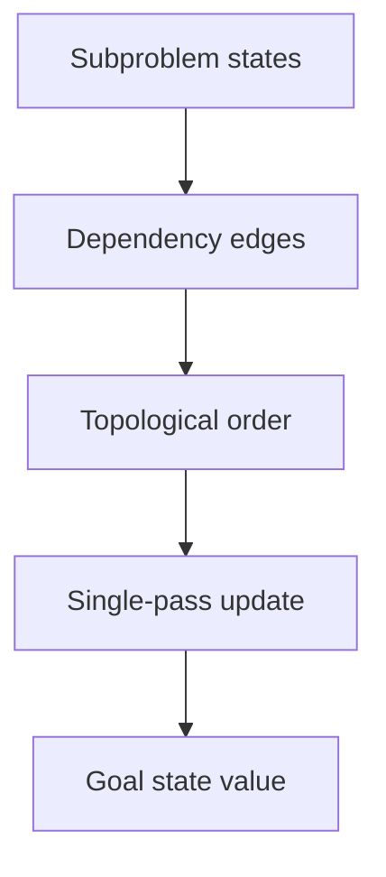
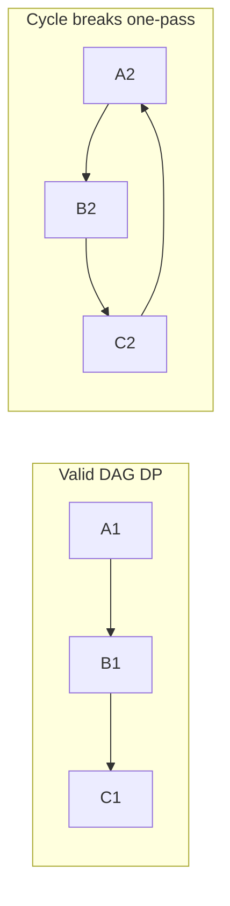
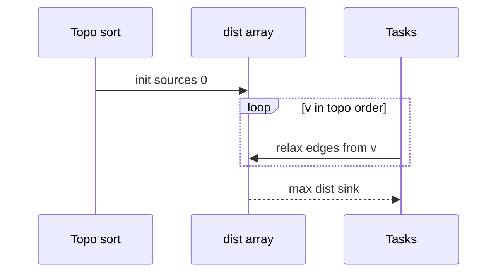

# DAG Dynamic Programming and Space Optimization

## Overview

Many DP recurrences define a **dependency DAG** over subproblem states: edges point from dependencies to dependents. When the underlying problem graph is acyclic—or you impose an order via [[05-Algorithms/07-Graph-Traversal-and-DAGs/Topological Sorting and Dependency Resolution|topological sort]]—you can compute optima by processing states once in topological order. This unifies **longest path in a DAG**, **dependency scheduling with costs**, and **grid DP** where rows depend only on previous rows.

**Space optimization** drops dimensions when only a sliding window of prior states is needed—rolling arrays, bitmask compression, and Hirschberg-style divide for sequence problems ([[05-Algorithms/06-Dynamic-Programming/Longest Common Subsequence and Edit Distance|Longest Common Subsequence and Edit Distance]]).

Graph **representation** (adjacency lists) is in [[04-Data-Structures/08-Graphs-as-Representation/Adjacency Lists|Adjacency Lists]]; this note covers algorithmic processing order and memory trade-offs.

## Learning Objectives

- Formulate DP states as nodes in a dependency DAG
- Compute table fills via topological order on state graph
- Apply rolling-array and dimension-swap techniques
- Solve longest path / weighted scheduling on task DAGs
- Analyze when space can drop without asymptotic time increase

## Prerequisites

- [[05-Algorithms/06-Dynamic-Programming/Memoization vs Tabulation|Memoization vs Tabulation]]
- [[05-Algorithms/07-Graph-Traversal-and-DAGs/Topological Sorting and Dependency Resolution|Topological Sorting and Dependency Resolution]]

## Difficulty

`advanced`

## Estimated Time

- Reading: 2 hours
- Exercises: 4 hours
- Mini project: 5 hours

## History

Scheduling with precedence constraints (PERT/CPM) is DAG longest path. Dynamic programming literature formalized state dependency graphs; Hirschberg (1975) gave linear-space LCS. Modern build systems (Bazel, Make with DAG) inherit the same ordering logic.

## Problem It Solves

**CI pipeline critical path**: tasks with durations and dependencies—find minimum completion time (= longest path if measuring time from start). **Resource DP on DAG**: each node has cost; path from source to sink maximizing reward. Naive recursion revisits nodes; topological DP is `O(V+E)` state processing when one value per vertex suffices.

## Internal Implementation

### Longest path in DAG

1. Topologically sort vertices.
2. Initialize `dist[v]` for sources.
3. Relax edges `(u→v)` in sort order: `dist[v] = max(dist[v], dist[u] + w(u,v))`.

Works because only forward edges in topo order—no cycles. **Not valid on general cyclic graphs** without different formulation.

### Grid rolling (knapsack row)

When `dp[i][*]` depends only on `dp[i-1][*]`, keep two rows or overwrite one with careful iteration direction ([[05-Algorithms/06-Dynamic-Programming/Knapsack and Subset Families|Knapsack and Subset Families]]).



## Mermaid Diagrams

### Structure: DAG DP vs cyclic



### Sequence: pipeline critical path



## Examples

### Minimal Example — Longest path in weighted DAG

```typescript
function longestPathDag(
  n: number,
  edges: [number, number, number][],
): number {
  const adj: { v: number; w: number }[][] = Array.from({ length: n }, () => []);
  const indeg = Array(n).fill(0);
  for (const [u, v, w] of edges) {
    adj[u].push({ v, w });
    indeg[v]++;
  }
  const order: number[] = [];
  const q: number[] = [];
  for (let i = 0; i < n; i++) if (indeg[i] === 0) q.push(i);
  while (q.length) {
    const u = q.shift()!;
    order.push(u);
    for (const { v } of adj[u]) if (--indeg[v] === 0) q.push(v);
  }
  if (order.length !== n) throw new Error("cycle");

  const dist = Array(n).fill(Number.NEGATIVE_INFINITY);
  dist[order[0]] = 0;
  for (const u of order) {
    if (dist[u] === Number.NEGATIVE_INFINITY) continue;
    for (const { v, w } of adj[u]) {
      dist[v] = Math.max(dist[v], dist[u] + w);
    }
  }
  return Math.max(...dist);
}
```

```python
from collections import deque


def longest_path_dag(n: int, edges: list[tuple[int, int, int]]) -> int:
    adj: list[list[tuple[int, int]]] = [[] for _ in range(n)]
    indeg = [0] * n
    for u, v, w in edges:
        adj[u].append((v, w))
        indeg[v] += 1
    q = deque(i for i in range(n) if indeg[i] == 0)
    order: list[int] = []
    while q:
        u = q.popleft()
        order.append(u)
        for v, _ in adj[u]:
            indeg[v] -= 1
            if indeg[v] == 0:
                q.append(v)
    if len(order) != n:
        raise ValueError("cycle")

    dist = [float("-inf")] * n
    dist[order[0]] = 0
    for u in order:
        if dist[u] == float("-inf"):
            continue
        for v, w in adj[u]:
            dist[v] = max(dist[v], dist[u] + w)
    return max(dist)
```

### Production-Shaped Example

**Feature rollout DAG** with `(build_ms, test_ms)` per node—critical path sets SLA. Store only `dist` and `parent` per vertex (`O(V)` space). For million-node synthetic graphs, adjacency is sparse via [[04-Data-Structures/08-Graphs-as-Representation/Adjacency Lists|Adjacency Lists]]; avoid materializing full state grid.

## Correctness

**Topological processing**: when all predecessors of `v` are processed before `v`, `dist[v]` equals optimum among paths from any source—induction on position in topo order. Cycle detection failure prevents bogus infinite "longest" loops.

**Rolling array**: if recurrence uses only previous layer, overwriting preserves correctness when update order respects dependency direction within layer.

## Complexity

| Problem | Time | Space |
| --- | --- | --- |
| DAG longest path | `O(V+E)` | `O(V)` dist |
| Grid DP with rolling | Same time | `O(second dim)` |
| Full 2D table | `O(mn)` | `O(mn)` |

Topological sort adds `O(V+E)`—dominated by relaxations.

## Trade-offs

| Dimension | Full table | Topo / rolling |
| --- | --- | --- |
| Memory | Higher | Lower |
| Reconstruction | Easier | Parent pointers |
| Implementation | Simple loops | Needs order analysis |

### When to Use

- Explicit DAG dependencies (build, workflow, permissions inheritance)
- Grid DP with narrow dependency band
- Memory-bound services (embedded planners)

### When Not to Use

- Cyclic graphs without breaking cycles first
- Need all-pairs path stats → [[05-Algorithms/08-Shortest-Paths/Floyd-Warshall and All-Pairs Trade-offs|Floyd-Warshall]]

## Exercises

1. Shortest path in DAG (min instead of max)—modify relaxation.
2. Count paths in DAG modulo `10⁹+7` with topo DP.
3. Knapsack: prove one-row space suffices; implement with rolling.
4. Detect why longest path in cyclic graph fails with positive cycle gain.
5. Given state DAG, auto-generate topo order for tabulation.

## Mini Project

Integrate topo DP into [[05-Algorithms/projects/Dependency Planner/README|Dependency Planner]] for critical path highlighting.

## Portfolio Project

Benchmark memory: full 2D LCS vs two-row on large `m`, fixed small `n`.

## Interview Questions

1. Longest path in DAG vs general graph—why different?
2. How does topo sort enable DP on dependencies?
3. When can you reduce 2D DP to 1D space?
4. Critical path method connection to DP?
5. What breaks rolling arrays in LCS reconstruction?

### Stretch / Staff-Level

1. Design incremental recomputation when one edge weight changes in large DAG.

## Common Mistakes

- Running DAG longest path on graphs with cycles
- Wrong topo order (stack-based DFS postorder on wrong graph)
- Rolling knapsack with ascending `w` in 0/1 variant

## Best Practices

- Validate DAG upfront in planners (`cycle = user error`)
- Store `parent` for explainable critical paths in UI
- Metric: `dist[sink]` vs wall-clock SLA

## Summary

When subproblem dependencies form a DAG, dynamic programming becomes a single topological pass—linear in vertices and edges for many scheduling and path problems. Space optimization discards dimensions that no longer influence future states, turning impractical tables into production-feasible planners.

## Further Reading

- [[05-Algorithms/07-Graph-Traversal-and-DAGs/Topological Sorting and Dependency Resolution|Topological Sorting and Dependency Resolution]]
- [[05-Algorithms/06-Dynamic-Programming/Longest Common Subsequence and Edit Distance|Longest Common Subsequence and Edit Distance]]

## Related Notes

- [[04-Data-Structures/08-Graphs-as-Representation/Adjacency Lists|Adjacency Lists]]
- [[05-Algorithms/08-Shortest-Paths/Shortest-Path Contracts and Relaxation|Shortest-Path Contracts and Relaxation]]
- [[05-Algorithms/README|Algorithms]]

## Progress Checklist

- [ ] Explained from first principles
- [ ] Drew at least one Mermaid diagram
- [ ] Implemented a minimal version
- [ ] Documented trade-offs and non-goals
- [ ] Completed exercises
- [ ] Practiced interview questions aloud
- [ ] Linked prerequisites and dependents
