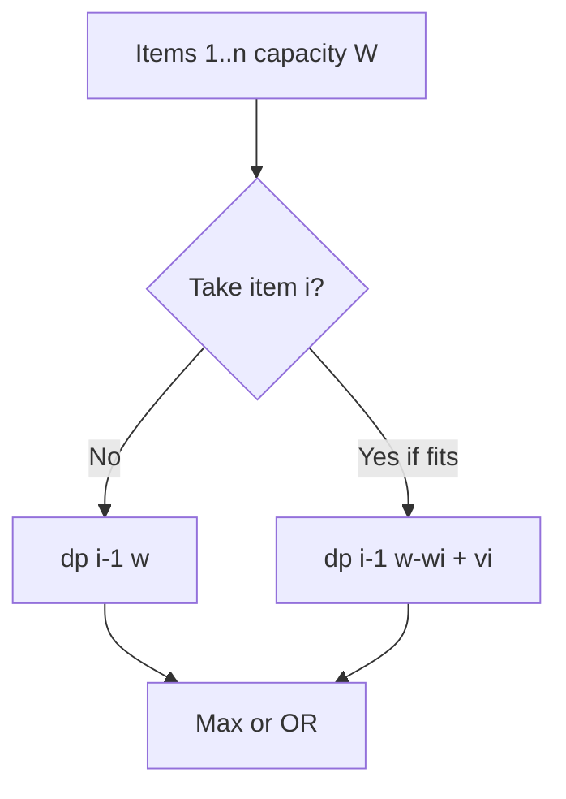
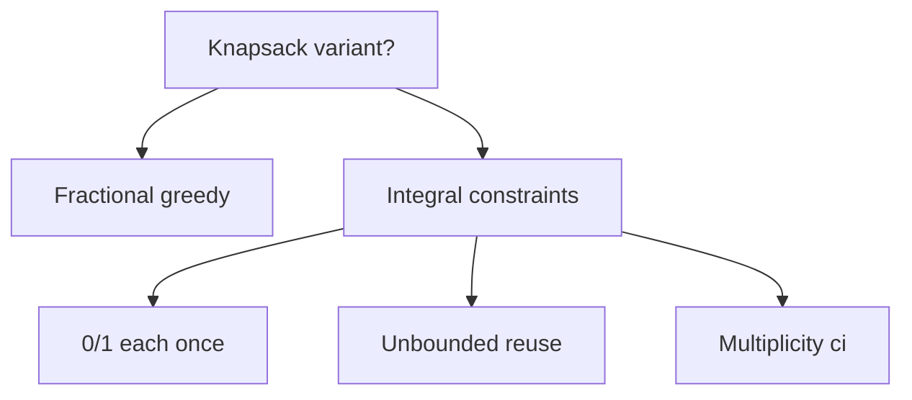
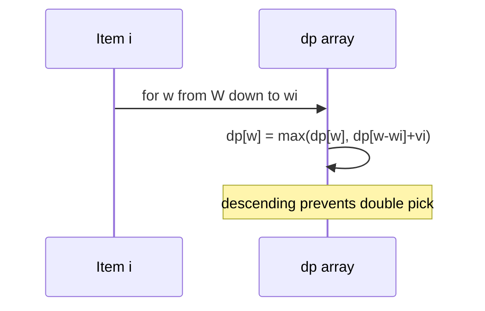

# Knapsack and Subset Families

## Overview

The **knapsack** family models selecting items with weights and values under capacity constraints. Variants differ by **reuse rules** and **objective**:

| Variant | Reuse items? | Typical state | Notes |
| --- | --- | --- | --- |
| 0/1 knapsack | No | `(i, w)` | Each item once |
| Unbounded | Yes | `(w)` | Same item unlimited |
| Bounded | Up to `c_i` | `(i, w)` or binary split | Inventory caps |
| Subset sum | Value = weight | `(w)` boolean | Decision / count |
| Partition / equal subset | Special weights | `(w)` | Target `sum/2` |

Fractional knapsack is **greedy** ([[05-Algorithms/05-Greedy-Algorithms/Fractional Knapsack and Scheduling|Fractional Knapsack and Scheduling]]); integral constraints force DP or specialized optimizations. This note covers recurrences, reconstruction, and pseudo-polynomial complexity.

## Learning Objectives

- Derive 0/1, unbounded, and subset-sum recurrences from state design
- Implement space-optimized 1D knapsack with correct iteration order
- Reconstruct chosen items via parent pointers or bitsets
- Recognize knapsack reductions in resource allocation and partitioning
- Bound runtime when capacity is large (meet-in-the-middle, greedy fallbacks)

## Prerequisites

- [[05-Algorithms/06-Dynamic-Programming/State Design and Transition Invariants|State Design and Transition Invariants]]
- [[05-Algorithms/05-Greedy-Algorithms/Fractional Knapsack and Scheduling|Fractional Knapsack and Scheduling]]

## Difficulty

`intermediate`

## Estimated Time

- Reading: 2 hours
- Exercises: 4 hours
- Mini project: 5 hours

## History

Knapsack is NP-hard in general (subset sum reduction). Pseudo-polynomial DP (1960s–70s) remains the workhorse for moderate capacities in operations research, cryptography (subset-sum problems), and capacity planning.

## Problem It Solves

**Cloud burst budgeting**: `n` workloads with `(cpu_ms, revenue)` and cluster capacity `C` per window—pick disjoint workloads maximizing revenue. **Partitioning**: split metrics shards into two bins of equal total size. Wrong greedy (by revenue density) can miss optimal integer packings.

## Internal Implementation

### 0/1 knapsack recurrence

\[
dp[i][w] = \max(dp[i-1][w],\ dp[i-1][w-w_i] + v_i)
\]

**Space optimization**: single array `dp[w]`, iterate `w` **descending** when processing item `i` to avoid reusing item twice in one row.

### Unbounded knapsack

\[
dp[w] = \max_{i: w_i \le w}(dp[w-w_i] + v_i)
\]

Iterate `w` **ascending**—same item reusable within row.

### Subset sum (decision)

Boolean `dp[w]` — can we achieve sum `w`? Transition: `dp[w] |= dp[w - a_i]`.



## Mermaid Diagrams

### Structure: variant decision tree



### Sequence: 1D rolling update



## Examples

### Minimal Example

```typescript
function knapsack01Oned(weights: number[], values: number[], cap: number): number {
  const dp = Array(cap + 1).fill(0);
  for (let i = 0; i < weights.length; i++) {
    const wt = weights[i];
    const val = values[i];
    for (let w = cap; w >= wt; w--) {
      dp[w] = Math.max(dp[w], dp[w - wt] + val);
    }
  }
  return dp[cap];
}

function subsetSum(nums: number[], target: number): boolean {
  const dp = Array(target + 1).fill(false);
  dp[0] = true;
  for (const a of nums) {
    for (let s = target; s >= a; s--) {
      dp[s] = dp[s] || dp[s - a];
    }
  }
  return dp[target];
}
```

```python
def knapsack01_oned(weights: list[int], values: list[int], cap: int) -> int:
    dp = [0] * (cap + 1)
    for wt, val in zip(weights, values):
        for w in range(cap, wt - 1, -1):
            dp[w] = max(dp[w], dp[w - wt] + val)
    return dp[cap]


def subset_sum(nums: list[int], target: int) -> bool:
    dp = [False] * (target + 1)
    dp[0] = True
    for a in nums:
        for s in range(target, a - 1, -1):
            dp[s] = dp[s] or dp[s - a]
    return dp[target]
```

### Production-Shaped Example

**License seat allocation**: 500 SKUs with `(seats, cost, contract_value)`, datacenter seat cap 10,000. Run 0/1 knapsack; if `W` is huge (>10⁷), switch to **meet-in-the-middle** ([[05-Algorithms/04-Divide-Conquer-and-Backtracking/Meet-in-the-Middle|Meet-in-the-Middle]]) on split item lists for exact optimum with `O(2^{n/2})` time—acceptable for `n ≤ 40` audit scenarios.

## Correctness

**0/1 knapsack**: induction on `i`. `dp[i][w]` optimal among first `i` items—either optimal excludes item `i` (`dp[i-1][w]`) or includes it with optimal sub-capacity (`dp[i-1][w-w_i]+v_i`). 1D descending loop maintains implicit `i-1` row semantics.

**Unbounded**: ascending loop allows multiple uses within same conceptual stage because `dp[w-w_i]` may already include item `i`.

**Subset sum**: boolean recurrence preserves "achievable sums using processed items."

## Complexity

| Problem | Time | Space |
| --- | --- | --- |
| 0/1 knapsack | `O(nW)` | `O(W)` rolling |
| Unbounded | `O(nW)` | `O(W)` |
| Subset sum | `O(nT)` | `O(T)` |

`W` and `T` are **numeric values**, not bit-length—pseudo-polynomial. NP-hardness in `n` when weights are exponential in input size encoding.

## Trade-offs

| Dimension | DP exact | Greedy / heuristics |
| --- | --- | --- |
| Optimality | Guaranteed | May miss |
| Scale | Limited by W | Large n |
| Audit | Reconstructable | Hard to certify |

### When to Use

- Moderate capacity (thousands to low millions)
- Need exact optimum or certificate
- n modest, W fits memory

### When Not to Use

- Fractional items → greedy by value/weight
- Huge W → FPTAS/approximation or ILP solvers

## Exercises

1. Implement unbounded knapsack; compare ascending vs descending bug.
2. Count number of subsets with sum `T` (mod 10⁹+7).
3. Partition array into equal sum—reduce to subset sum.
4. Reconstruct items chosen in 0/1 knapsack.
5. Bounded knapsack via binary decomposition of counts.

## Mini Project

**Capacity planner CLI**: read JSON workloads, output optimal pack + utilization chart.

## Portfolio Project

Extend [[05-Algorithms/projects/Algorithm Workbench/README|Algorithm Workbench]] knapsack module with shared vectors vs brute force.

## Interview Questions

1. 0/1 vs unbounded: how does loop direction differ?
2. Why is knapsack pseudo-polynomial?
3. Reduce partition problem to knapsack/subset sum.
4. When does value/weight greedy fail for 0/1?
5. Space optimize to `O(W)`—what information is lost for reconstruction?

### Stretch / Staff-Level

1. Outline FPTAS for knapsack and when product teams accept approximate packing.

## Common Mistakes

- Ascending loop in 0/1 (implicit unbounded)
- Using float weights without discretization plan
- Forgetting overflow on count variants

## Best Practices

- Discretize units explicitly (millicores, cents)
- Log `n`, `W`, fill ratio in production jobs
- Fall back when `nW` exceeds SLA threshold

## Summary

Knapsack and subset-sum problems share capacity-indexed DP over item prefixes or unlimited reuse rules. Master the 1D rolling trick and iteration direction, treat capacity as a pseudo-polynomial parameter, and know when to hand off to greedy, meet-in-the-middle, or approximation.

## Further Reading

- [[05-Algorithms/06-Dynamic-Programming/Memoization vs Tabulation|Memoization vs Tabulation]]
- [[05-Algorithms/04-Divide-Conquer-and-Backtracking/Meet-in-the-Middle|Meet-in-the-Middle]]
- [[05-Algorithms/05-Greedy-Algorithms/Fractional Knapsack and Scheduling|Fractional Knapsack and Scheduling]]

## Related Notes

- [[05-Algorithms/06-Dynamic-Programming/Longest Common Subsequence and Edit Distance|Longest Common Subsequence and Edit Distance]]
- [[04-Data-Structures/01-Contiguous-Sequences/Bitsets and Compact Boolean Arrays|Bitsets and Compact Boolean Arrays]] (subset bitmasks)
- [[05-Algorithms/README|Algorithms]]

## Progress Checklist

- [ ] Explained from first principles
- [ ] Drew at least one Mermaid diagram
- [ ] Implemented a minimal version
- [ ] Documented trade-offs and non-goals
- [ ] Completed exercises
- [ ] Practiced interview questions aloud
- [ ] Linked prerequisites and dependents
