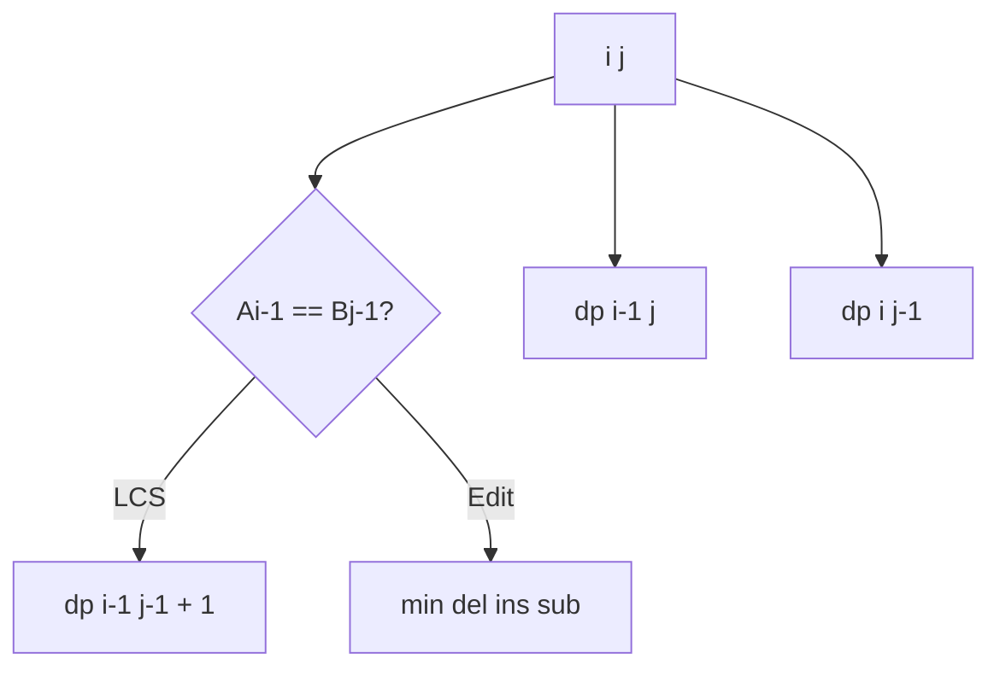
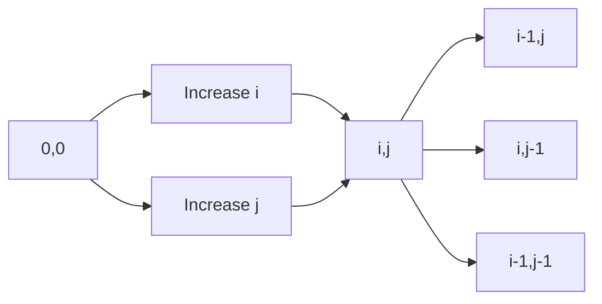
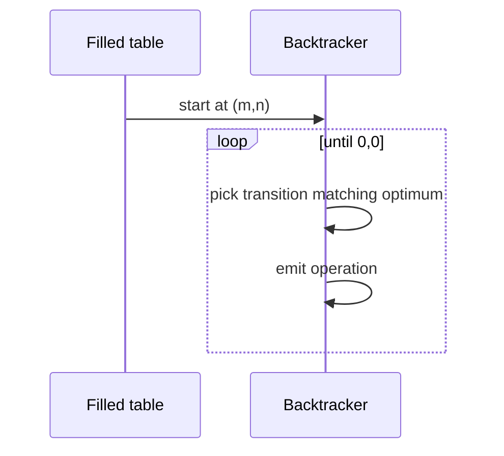

# Longest Common Subsequence and Edit Distance

## Overview

**Longest Common Subsequence (LCS)** and **edit distance** (Levenshtein and variants) are canonical **two-sequence DP** problems. State `(i, j)` summarizes prefixes `A[0..i)` and `B[0..j)`. They power `diff`, fuzzy matching, bioinformatics alignment (simplified), spell-check suggestions, and merge conflict heuristics.

Both exhibit optimal substructure on prefixes; transitions differ in cost model (match/mismatch/skip vs insert/delete/substitute). String **storage** lives in [[04-Data-Structures/README|Data Structures]]; this note owns recurrences, reconstruction, and space-optimized single-row computation.

## Learning Objectives

- Derive LCS and Levenshtein recurrences with explicit base cases
- Reconstruct alignments via parent matrix or backtracking pointers
- Reduce space from `O(mn)` to `O(min(m,n))` with rolling rows
- Extend to weighted edits, Damerau transpositions, and deletion-only variants
- Map production diff tools to DP vs Myers linear-space algorithms

## Prerequisites

- [[05-Algorithms/06-Dynamic-Programming/State Design and Transition Invariants|State Design and Transition Invariants]]
- [[05-Algorithms/06-Dynamic-Programming/Memoization vs Tabulation|Memoization vs Tabulation]]

## Difficulty

`intermediate`

## Estimated Time

- Reading: 2 hours
- Exercises: 4 hours
- Mini project: 6 hours

## History

LCS and edit distance emerged in 1970s string algorithms (Hirschberg, Wagner–Fischer). Unix `diff` popularized practical sequence comparison; modern IDEs use refined algorithms (Myers) for long files but DP remains the correctness baseline and interview standard.

## Problem It Solves

**Config drift detection**: compare normalized JSON key sequences. **i18n QA**: measure translation edit cost. **Plagiarism / log correlation**: LCS length as similarity signal. Without DP, teams use character-level diff on sorted lines—missing optimal subsequence structure across reorderings.

## Internal Implementation

### LCS recurrence

If `A[i-1] === B[j-1]`: `dp[i][j] = dp[i-1][j-1] + 1`  
Else: `dp[i][j] = max(dp[i-1][j], dp[i][j-1])`

### Levenshtein (unit costs)

\[
dp[i][j] = \min\begin{cases}
dp[i-1][j] + 1 & \text{delete} \\
dp[i][j-1] + 1 & \text{insert} \\
dp[i-1][j-1] + cost & \text{match/mismatch}
\end{cases}
\]

Base: `dp[i][0]=i`, `dp[0][j]=j`.



## Mermaid Diagrams

### Structure: DP table fill direction



### Sequence: reconstruction backtrack



## Examples

### Minimal Example

```typescript
function lcs(a: string, b: string): number {
  const m = a.length;
  const n = b.length;
  const dp = Array.from({ length: m + 1 }, () => Array(n + 1).fill(0));
  for (let i = 1; i <= m; i++) {
    for (let j = 1; j <= n; j++) {
      if (a[i - 1] === b[j - 1]) dp[i][j] = dp[i - 1][j - 1] + 1;
      else dp[i][j] = Math.max(dp[i - 1][j], dp[i][j - 1]);
    }
  }
  return dp[m][n];
}

function levenshtein(a: string, b: string): number {
  const m = a.length;
  const n = b.length;
  const dp = Array.from({ length: m + 1 }, () => Array(n + 1).fill(0));
  for (let i = 0; i <= m; i++) dp[i][0] = i;
  for (let j = 0; j <= n; j++) dp[0][j] = j;
  for (let i = 1; i <= m; i++) {
    for (let j = 1; j <= n; j++) {
      const sub = dp[i - 1][j - 1] + (a[i - 1] === b[j - 1] ? 0 : 1);
      dp[i][j] = Math.min(dp[i - 1][j] + 1, dp[i][j - 1] + 1, sub);
    }
  }
  return dp[m][n];
}
```

```python
def lcs(a: str, b: str) -> int:
    m, n = len(a), len(b)
    dp = [[0] * (n + 1) for _ in range(m + 1)]
    for i in range(1, m + 1):
        for j in range(1, n + 1):
            if a[i - 1] == b[j - 1]:
                dp[i][j] = dp[i - 1][j - 1] + 1
            else:
                dp[i][j] = max(dp[i - 1][j], dp[i][j - 1])
    return dp[m][n]


def levenshtein(a: str, b: str) -> int:
    m, n = len(a), len(b)
    dp = [[0] * (n + 1) for _ in range(m + 1)]
    for i in range(m + 1):
        dp[i][0] = i
    for j in range(n + 1):
        dp[0][j] = j
    for i in range(1, m + 1):
        for j in range(1, n + 1):
            sub = dp[i - 1][j - 1] + (0 if a[i - 1] == b[j - 1] else 1)
            dp[i][j] = min(dp[i - 1][j] + 1, dp[i][j - 1] + 1, sub)
    return dp[m][n]
```

### Production-Shaped Example

**Schema migration linter**: tokenize column names from two DB versions; compute weighted edit distance (substitute camelCase↔snake_case cost 0.5, delete 2). Threshold triggers human review. Store only two rolling rows for `O(min(m,n))` memory on wide schemas (5000 columns × 5000).

## Correctness

**Optimal substructure on prefixes**: optimal LCS of `A[0..i)` and `B[0..j)` either uses matching last chars (then optimal minus those chars) or omits one last char. Induction on `(i,j)` establishes recurrence.

**Edit distance**: any optimal edit sequence ends with insert, delete, or align on last chars—remove last op yields optimal sub-prefix solution.

**Backtracking correctness**: at each step, choose predecessor that achieves stored optimum; finite descent to `(0,0)`.

## Complexity

| Variant | Time | Space (full) | Space (optimized) |
| --- | --- | --- | --- |
| LCS | `O(mn)` | `O(mn)` | `O(min(m,n))` |
| Levenshtein | `O(mn)` | `O(mn)` | `O(min(m,n))` |

Hirschberg's algorithm computes LCS in `O(mn)` time, `O(n)` space **with reconstruction**—advanced extension.

For long files, production `diff` often uses Myers `O(ND)` where `D` is edit distance—better when sequences are similar.

## Trade-offs

| Dimension | Full table | Rolling row |
| --- | --- | --- |
| Memory | High | Low |
| Reconstruction | Easy | Needs extra pass |
| Cache | Poor on huge | Better |

### When to Use

- Moderate string lengths in memory
- Need optimal alignment score or edit cost
- Building teaching tools / golden tests for diff libs

### When Not to Use

- Megabyte-scale texts hot path → Myers / external diff
- Only need approximate similarity → hashing, n-grams

## Exercises

1. Reconstruct one LCS string from DP table.
2. Implement space-optimized Levenshtein with two rows.
3. Longest common substring (contiguous)—why isn't `(i,j)` LCS recurrence enough?
4. Weighted edits: substitute vowel→vowel cost 0.5—modify recurrence.
5. Prove LCS length equals edit distance when only insert/delete allowed.

## Mini Project

**Line diff visualizer**: LCS on lines, render unified diff with colors.

## Portfolio Project

Add to [[05-Algorithms/projects/Text Search Toolkit/README|Text Search Toolkit]] as alignment module.

## Interview Questions

1. Write LCS recurrence; how to backtrack?
2. Difference between substring and subsequence DP?
3. Space optimize edit distance—what do you lose?
4. When is edit distance a metric?
5. How does `git diff` differ from naive DP?

### Stretch / Staff-Level

1. Explain Hirschberg vs Myers trade-offs for production diff at scale.

## Common Mistakes

- Confusing LCS with longest common substring
- Off-by-one on empty prefix bases
- Backtracking tie-breaking that picks wrong path (still valid length)

## Best Practices

- Normalize inputs (case, whitespace) before distance in CI
- Cap `mn` product; bail to hashing for huge inputs
- Unit-test Unicode code points, not UTF-16 code units (surrogate pairs)

## Summary

LCS and edit distance encode two-sequence comparison as prefix DP with `(i,j)` states. They are the foundation for diff-like tooling: master recurrences, rolling space, and reconstruction—and know when industrial systems switch to Myers-class algorithms for scale.

## Further Reading

- [[05-Algorithms/11-String-and-Sequence-Algorithms/Naive Matching and Prefix Structure|Naive Matching and Prefix Structure]]
- [[05-Algorithms/06-Dynamic-Programming/DAG Dynamic Programming and Space Optimization|DAG Dynamic Programming and Space Optimization]]

## Related Notes

- [[05-Algorithms/06-Dynamic-Programming/Knapsack and Subset Families|Knapsack and Subset Families]]
- [[04-Data-Structures/07-Tries-and-Prefix-Structures/Tries|Tries]]
- [[05-Algorithms/README|Algorithms]]

## Progress Checklist

- [ ] Explained from first principles
- [ ] Drew at least one Mermaid diagram
- [ ] Implemented a minimal version
- [ ] Documented trade-offs and non-goals
- [ ] Completed exercises
- [ ] Practiced interview questions aloud
- [ ] Linked prerequisites and dependents
