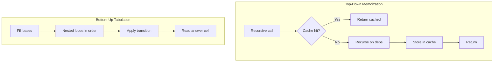
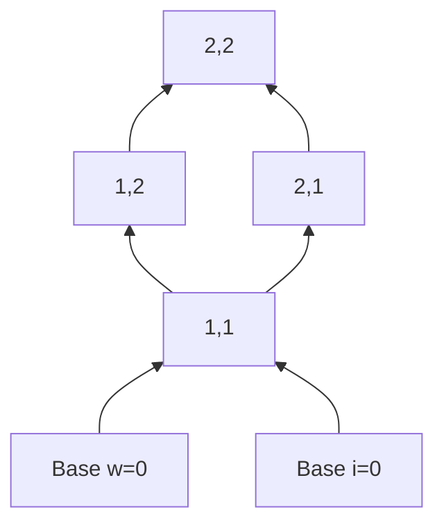
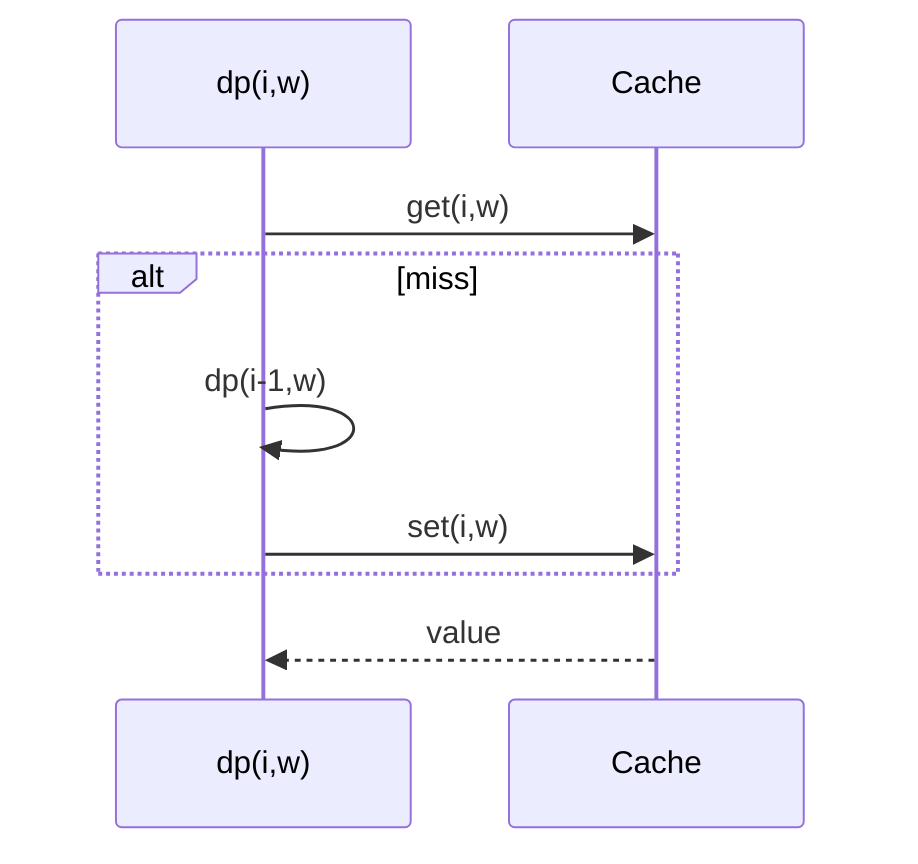

# Memoization vs Tabulation

## Overview

Once a DP recurrence is validated ([[05-Algorithms/06-Dynamic-Programming/Optimal Substructure and Overlapping Subproblems|Optimal Substructure and Overlapping Subproblems]]), two standard implementations exist:

- **Memoization (top-down)**: recursive definition + cache (`Map`, array, or [[04-Data-Structures/02-Associative-Mapping/Hash Tables Chaining and Open Addressing|hash table]]) storing results before return.
- **Tabulation (bottom-up)**: iterative loops fill a table in **dependency order** from base cases upward.

Both compute the same values if the recurrence and visit order are consistent. The engineering choice affects **stack depth**, **cache locality**, **partial computation**, **space optimization**, and **debuggability**.

## Learning Objectives

- Implement the same DP problem memoized and tabulated with identical outputs
- Choose iteration orders that respect subproblem dependencies
- Apply space rolling arrays when only recent layers matter
- Handle unreachable states in sparse memoization vs dense tables
- Instrument cache hit rate and table fill fraction in benchmarks

## Prerequisites

- [[05-Algorithms/06-Dynamic-Programming/Optimal Substructure and Overlapping Subproblems|Optimal Substructure and Overlapping Subproblems]]
- [[05-Algorithms/00-Foundations-and-Correctness/Loop Invariants and Correctness Proofs|Loop Invariants and Correctness Proofs]]

## Difficulty

`intermediate`

## Estimated Time

- Reading: 1.5 hours
- Exercises: 3 hours
- Mini project: 4 hours

## History

Top-down memoization mirrors the mathematical recurrence literally—early Lisp and ML cultures favored it. Bottom-up tabulation aligns with FORTRAN-era array programs and GPU-friendly loop nests. Modern production mixes both: memo for sparse implicit graphs, tabulation for dense knapsack-style grids.

## Problem It Solves

Recursion without memo blows up runtime; naive iteration without order fills cells before dependencies exist. Memoization gives **lazy** evaluation—only needed states compute. Tabulation gives **predictable** memory access and avoids stack overflow on deep instances (e.g., `n = 10⁵` Fibonacci-style chains).

## Internal Implementation

### Memoization pattern

1. Check cache for state key.
2. If miss, compute from recurrence recursively.
3. Store and return.

Cache key must **canonicalize** state (tuple of ints, bitmask, string hash).

### Tabulation pattern

1. Allocate table indexed by state coordinates.
2. Initialize base cases.
3. Nested loops in topological order of state DAG.
4. Answer at goal coordinate.



### Dependency order example (knapsack)

State `(i, w)` depends on `(i-1, w)` and `(i-1, w-weight[i])`. Loop `i` increasing, `w` any order per row—rows only depend on previous row → enables **1D rolling** (see [[05-Algorithms/06-Dynamic-Programming/DAG Dynamic Programming and Space Optimization|DAG Dynamic Programming and Space Optimization]]).

## Mermaid Diagrams

### Structure: same DAG, two visit strategies



Top-down may never visit `S12` if unreachable; bottom-up often iterates full rectangle unless pruned.

### Sequence: memo cache lifecycle



## Examples

### Minimal Example — Coin Change (min coins)

```typescript
function coinChangeMemo(coins: number[], amount: number): number {
  const memo = new Map<number, number>();
  const INF = amount + 1;

  function dp(rem: number): number {
    if (rem === 0) return 0;
    if (rem < 0) return INF;
    const hit = memo.get(rem);
    if (hit !== undefined) return hit;
    let best = INF;
    for (const c of coins) best = Math.min(best, 1 + dp(rem - c));
    memo.set(rem, best);
    return best;
  }

  const ans = dp(amount);
  return ans === INF ? -1 : ans;
}

function coinChangeTab(coins: number[], amount: number): number {
  const INF = amount + 1;
  const dp = Array(amount + 1).fill(INF);
  dp[0] = 0;
  for (let a = 1; a <= amount; a++) {
    for (const c of coins) {
      if (c <= a) dp[a] = Math.min(dp[a], dp[a - c] + 1);
    }
  }
  return dp[amount] === INF ? -1 : dp[amount];
}
```

```python
def coin_change_memo(coins: list[int], amount: int) -> int:
    memo: dict[int, int] = {}
    INF = amount + 1

    def dp(rem: int) -> int:
        if rem == 0:
            return 0
        if rem < 0:
            return INF
        if rem in memo:
            return memo[rem]
        best = min(1 + dp(rem - c) for c in coins)
        memo[rem] = best
        return best

    ans = dp(amount)
    return -1 if ans >= INF else ans


def coin_change_tab(coins: list[int], amount: int) -> int:
    INF = amount + 1
    dp = [INF] * (amount + 1)
    dp[0] = 0
    for a in range(1, amount + 1):
        for c in coins:
            if c <= a:
                dp[a] = min(dp[a], dp[a - c] + 1)
    return -1 if dp[amount] >= INF else dp[amount]
```

### Production-Shaped Example

**Feature flag rollout planner**: states `(service, day)` with sparse valid transitions (maintenance windows). Memoization with `Map<string, number>` avoids allocating a dense `services × days` grid when only 5% of pairs are reachable—typical in orchestration DAGs ([[05-Algorithms/06-Dynamic-Programming/DAG Dynamic Programming and Space Optimization|DAG Dynamic Programming and Space Optimization]]). Tabulation wins when 95% dense and vectorization matters (batch nightly replan).

## Correctness

**Memoization**: structural induction on recursion depth. If cache returns previously computed optimal values, and uncached computation uses only cached subcalls, each state computed once matches recurrence optimum from [[05-Algorithms/06-Dynamic-Programming/Optimal Substructure and Overlapping Subproblems|optimal substructure]].

**Tabulation**: loop invariant—after processing state `s` in topological order, table entry `T[s]` equals optimum for subproblem `s`. Initialization establishes bases; transition step applies recurrence using already-finalized dependencies.

**Equivalence**: if state space `S` is finite and both visit all reachable `s ∈ S` with same recurrence, outputs match.

## Complexity

Identical asymptotic time when all states computed: `O(|S| · work per state)`.

| Aspect | Memoization | Tabulation |
| --- | --- | --- |
| Time | `O(|S|·T)` reachable | `O(|S|·T)` if full table scanned |
| Extra space | Recursion stack `O(depth)` | No stack; often better cache |
| Partial queries | Computes only needed ancestors | Often fills full table |
| Sparse states | Natural with hash memo | Must skip or compress |

**Python recursion limit / JS stack**: deep `(n)` chains favor tabulation or explicit stack.

## Trade-offs

| Dimension | Memoization | Tabulation |
| --- | --- | --- |
| Code shape | Mirrors math | Loop order discipline |
| Performance | Hash overhead, cold cache | Sequential memory access |
| Debugging | Call tree introspection | Table dumps |
| Space opt | Harder rolling | Easier row rotation |

### When to Use

- **Memo**: sparse state space, on-demand queries, quick prototype
- **Tabulation**: dense grids, stack limits, need predictable latency, space rolling

### When Not to Use

- Neither helps if state space is exponential without structure
- Do not memoize without canonical keys—silent cache misses recompute

## Exercises

1. Implement LCS both ways; compare memory on `m=n=500`.
2. Modify coin change tab order (coins outer, amount inner)—does min coins break? Why?
3. Add hit/miss counters to memo; report ratio on random knapsack instances.
4. Convert recursive DFS-on-DAG memo to topological tabulation.
5. Implement bottom-up with explicit stack (no recursion) for same recurrence.

## Mini Project

**Dual-mode DP runner**: one recurrence spec (YAML), emit memo and tab implementations in TS/Python, diff outputs on shared vectors.

## Portfolio Project

Integrate into [[05-Algorithms/projects/Algorithm Workbench/README|Algorithm Workbench]] with flamegraphs comparing memo vs tab on knapsack benchmarks.

## Interview Questions

1. When is top-down strictly better than bottom-up?
2. How do you pick loop order in tabulation?
3. Can tabulation use less memory than memoization for the same problem?
4. What breaks if you iterate states in wrong order?
5. How do Python's `@lru_cache` and manual dict memo differ in production?

### Stretch / Staff-Level

1. Design a DP engine that auto-derives tabulation order from dependency graph topological sort.

## Common Mistakes

- Non-canonical memo keys (mutating arrays used as keys)
- Filling tabulation before dependencies (reading stale cells)
- Assuming `@lru_cache` on methods without understanding `self` in key

## Best Practices

- Property-test memo ≡ tab on random small instances
- Document state key serialization for distributed memo (Redis)
- Cap memo size in production services—evict LRU with metrics

## Summary

Memoization and tabulation are dual views of the same DP recurrence: lazy recursion with cache versus eager iteration in dependency order. Choose based on sparsity, stack limits, memory layout, and whether you need all states or ad hoc queries—not based on interview fashion.

## Further Reading

- [[05-Algorithms/06-Dynamic-Programming/State Design and Transition Invariants|State Design and Transition Invariants]]
- [[05-Algorithms/06-Dynamic-Programming/DAG Dynamic Programming and Space Optimization|DAG Dynamic Programming and Space Optimization]]
- [[05-Algorithms/01-Complexity-and-Analysis/Practical Constants Locality and Benchmark Design|Practical Constants Locality and Benchmark Design]]

## Related Notes

- [[04-Data-Structures/02-Associative-Mapping/Hash Tables Chaining and Open Addressing|Hash Tables Chaining and Open Addressing]]
- [[05-Algorithms/06-Dynamic-Programming/Knapsack and Subset Families|Knapsack and Subset Families]]
- [[05-Algorithms/README|Algorithms]]

## Progress Checklist

- [ ] Explained from first principles
- [ ] Drew at least one Mermaid diagram
- [ ] Implemented a minimal version
- [ ] Documented trade-offs and non-goals
- [ ] Completed exercises
- [ ] Practiced interview questions aloud
- [ ] Linked prerequisites and dependents
