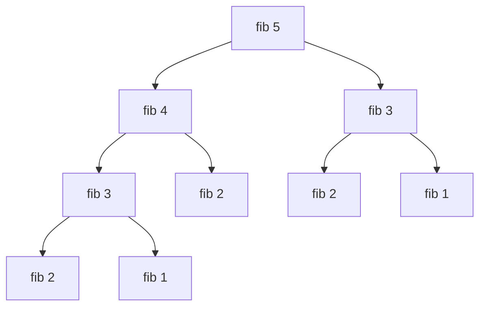
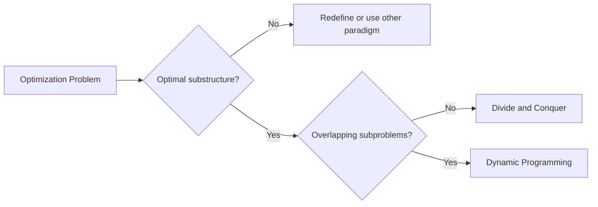
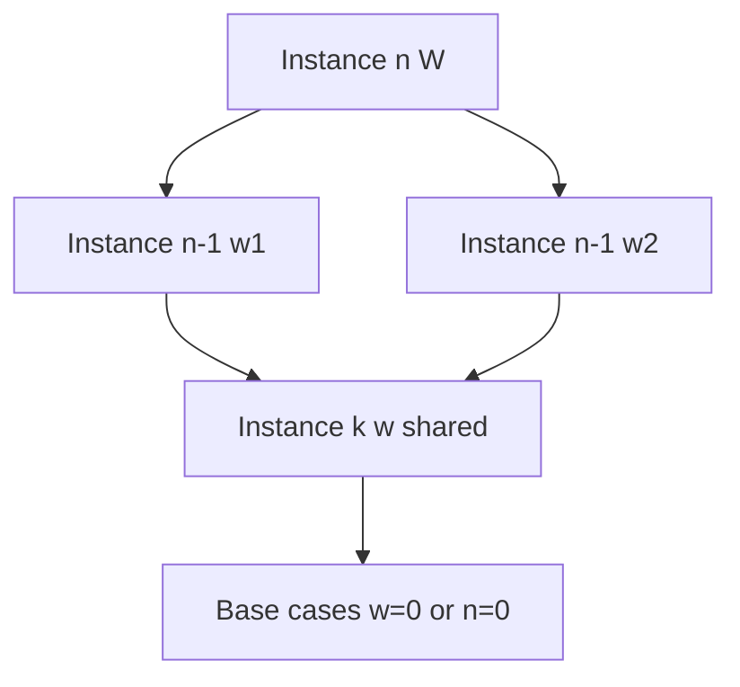

# Optimal Substructure and Overlapping Subproblems

## Overview

**Dynamic programming (DP)** solves optimization and counting problems by reusing answers to **subproblems** instead of recomputing them. Two structural preconditions distinguish DP from naive recursion and from greedy shortcuts:

1. **Optimal substructure** — an optimal solution to the whole problem is composed of optimal solutions to its subproblems (after you define subproblems correctly).
2. **Overlapping subproblems** — the same subproblem appears in many branches of the recursion tree; without overlap, divide-and-conquer ([[05-Algorithms/04-Divide-Conquer-and-Backtracking/Divide-and-Conquer Design|Divide-and-Conquer Design]]) suffices and DP adds no asymptotic win.

This note establishes the **recognition contract** before [[05-Algorithms/06-Dynamic-Programming/Memoization vs Tabulation|Memoization vs Tabulation]] and [[05-Algorithms/06-Dynamic-Programming/State Design and Transition Invariants|State Design and Transition Invariants]]. Representation choices (arrays, hash maps) remain in [[04-Data-Structures/README|Data Structures]]; this track owns **when** DP applies and **what** must be true for correctness.

## Learning Objectives

- State optimal substructure formally for minimization and maximization problems
- Distinguish overlapping subproblems from independent subproblems in recursion trees
- Contrast DP with greedy ([[05-Algorithms/05-Greedy-Algorithms/Greedy Choice and Exchange Arguments|Greedy Choice and Exchange Arguments]]) and divide-and-conquer
- Identify broken substructure (e.g., longest simple path) before coding
- Sketch a recurrence from subproblem definition and justify its validity

## Prerequisites

- [[05-Algorithms/00-Foundations-and-Correctness/Problem Specifications Preconditions and Postconditions|Problem Specifications Preconditions and Postconditions]]
- [[05-Algorithms/04-Divide-Conquer-and-Backtracking/Divide-and-Conquer Design|Divide-and-Conquer Design]]
- [[01-Computer-Science/08-Languages-and-Computation/Computational Complexity Primer|Computational Complexity Primer]]

## Difficulty

`intermediate`

## Estimated Time

- Reading: 2 hours
- Exercises: 3 hours
- Mini project: 4 hours

## History

Richard Bellman coined "dynamic programming" (1950s) for multistage decision processes in operations research. The modern interview and engineering pattern—tabulate overlapping subproblems—emerged as computers made exhaustive recursion impractical. Fibonacci memoization became the pedagogical anchor; production uses the same idea in route optimization, bioinformatics alignment, and resource allocation.

## Problem It Solves

Naive recursion on combinatorial problems often exhibits **exponential** time because identical sub-instances are solved repeatedly. Example: computing `fib(n)` without memo revisits `fib(k)` for many `k < n`. DP collapses the recursion tree into a **DAG of subproblems**, trading memory for time. Without checking optimal substructure first, teams build tables that encode **wrong decompositions**—correct-looking code with silent optimality bugs.

## Internal Implementation

### Optimal substructure (minimization)

Let `OPT(I)` be the minimum cost for instance `I`. Instance `I` decomposes into choices that yield sub-instances `I₁, …, I_k`. **Optimal substructure** holds if:

\[
OPT(I) = \min_{c \in \text{choices}(I)} \left\{ cost(c) + \sum_j OPT(I_j(c)) \right\}
\]

For **maximization**, replace `min` with `max`. For **counting**, sum over disjoint cases instead of taking min/max.

**Critical nuance**: subproblem definition must match the problem's constraints. Longest **simple** path in a general graph lacks optimal substructure: an optimal path through `v` may require forbidding vertices used elsewhere—subpaths are not independent "same problem, smaller graph."

### Overlapping subproblems

Draw the recursion tree for `fib(5)`:



Nodes like `fib(3)` and `fib(2)` repeat—**overlap**. Merge sort subcalls on disjoint halves—**no overlap**; memoization does not improve asymptotic complexity.

### DP vs greedy vs divide-and-conquer

| Paradigm | Needs optimal substructure | Needs overlap | Typical extra structure |
| --- | --- | --- | --- |
| Divide-and-conquer | Often yes | No | Independent subcalls |
| Greedy | Local choice + exchange proof | N/A | No table |
| DP | Yes | Yes (for time win) | Recurrence + table |



## Mermaid Diagrams

### Structure: subproblem DAG



Knapsack-style problems share `(i, remaining capacity)` states—see [[05-Algorithms/06-Dynamic-Programming/Knapsack and Subset Families|Knapsack and Subset Families]].

### Sequence: recognition workflow

```mermaid
sequenceDiagram
    participant Eng as Engineer
    participant Spec as Problem Spec
    participant Rec as Recurrence Sketch
    participant Table as DP Table

    Eng->>Spec: Define objective and constraints
    Eng->>Rec: Propose subproblem parameterization
    Rec-->>Eng: Optimal substructure holds / fails
    Eng->>Table: Enumerate states; count overlaps
    Table-->>Eng: State space size drives feasibility
```

## Examples

### Minimal Example

**Fibonacci** (pedagogical overlap; not a production optimization target):

```typescript
function fib(n: number, memo = new Map<number, number>()): number {
  if (n <= 1) return n;
  const hit = memo.get(n);
  if (hit !== undefined) return hit;
  const v = fib(n - 1, memo) + fib(n - 2, memo);
  memo.set(n, v);
  return v;
}
```

```python
def fib(n: int, memo: dict[int, int] | None = None) -> int:
    if memo is None:
        memo = {}
    if n <= 1:
        return n
    if n in memo:
        return memo[n]
    memo[n] = fib(n - 1, memo) + fib(n - 2, memo)
    return memo[n]
```

**0/1 Knapsack** exhibits both properties: optimal value for `(i, w)` uses optimal `(i-1, w')` sub-instances.

```typescript
function knapsack01(
  weights: number[],
  values: number[],
  capacity: number,
): number {
  const n = weights.length;
  const dp = Array.from({ length: n + 1 }, () =>
    Array(capacity + 1).fill(0),
  );
  for (let i = 1; i <= n; i++) {
    const wt = weights[i - 1];
    const val = values[i - 1];
    for (let w = 0; w <= capacity; w++) {
      dp[i][w] = dp[i - 1][w];
      if (wt <= w) {
        dp[i][w] = Math.max(dp[i][w], dp[i - 1][w - wt] + val);
      }
    }
  }
  return dp[n][capacity];
}
```

```python
def knapsack01(weights: list[int], values: list[int], capacity: int) -> int:
    n = len(weights)
    dp = [[0] * (capacity + 1) for _ in range(n + 1)]
    for i in range(1, n + 1):
        wt, val = weights[i - 1], values[i - 1]
        for w in range(capacity + 1):
            dp[i][w] = dp[i - 1][w]
            if wt <= w:
                dp[i][w] = max(dp[i][w], dp[i - 1][w - wt] + val)
    return dp[n][capacity]
```

### Production-Shaped Example

A **rate limiter budget allocator** assigns daily API quota across `n` services with per-service min/max and penalty costs for unmet demand. Subproblem `(day, remaining budget)` overlaps when multiple services compete for the same residual budget in different orderings—DP beats exponential enumeration. Contract: penalties are **additive** (optimal substructure); if penalties were supermodular coupling services, DP state would need joint service tuples—state explosion.

## Correctness

**Theorem (optimal substructure ⇒ recurrence validity).** Suppose subproblem `S` parameterizes instances `P(s)` for `s ∈ S`, and for every instance `I` there exists a finite set of **exclusive** choices `c` such that every feasible global solution for `I` contains exactly one choice's sub-solutions, and costs combine additively (or via the counting/product rule for enumeration). If for every `I`, some optimal solution's cost equals the optimum over choices of `cost(c) + Σ OPT(sub(I,c))`, then the Bellman recurrence computes `OPT(I)`.

**Proof sketch:**

1. **Base**: boundary states defined with correct values (often 0/∞/empty).
2. **Inductive step**: assume table entries for strictly smaller instances (by measure on state, e.g., `(i,w)` lex order) are optimal.
3. For state `s`, any optimal solution must pick some first decision `c`; removing `c` leaves optimal sub-instances by optimal substructure; inductive hypothesis gives their costs; minimization over `c` yields `OPT(s)`.

**When it fails**: longest simple path—subpath of optimal path may not be optimal among simple paths with same endpoints because revisiting vertices is forbidden globally but not in the sub-call.

## Complexity

Let `|S|` be number of distinct subproblem states, `T(s)` work per state excluding recursive calls.

| Model | Time | Space (typical) |
| --- | --- | --- |
| Naive recursion | Often exponential | `O(depth)` stack |
| Memoized DP | `O(|S| · T)` | `O(|S|)` table + stack |
| Tabulation | `O(|S| · T)` | `O(|S|)` table |

Fibonacci with memo: `|S| = n`, `T = O(1)` → `O(n)` time. 0/1 knapsack: `|S| = (n+1)(W+1)`, `T = O(1)` → `O(nW)` **pseudo-polynomial**—not polynomial in input bit length when `W` is encoded in binary.

**Overlap test**: if distinct recursive calls ≈ total calls, overlap factor ≈ `total/distinct` — large factor ⇒ DP wins.

## Trade-offs

| Dimension | Upside | Downside | When it matters |
| --- | --- | --- | --- |
| Time | Polynomial when state space manageable | State design errors → wrong answer | Large n, moderate parameters |
| Space | Table enables reconstruction | `O(|S|)` memory | Embedded / stream processing |
| Engineering | Deterministic, testable | Harder to explain than greedy | Audit-heavy domains |
| vs Greedy | Handles global coupling | More implementation effort | When greedy exchange fails |

### When to Use

- Recurrence tree shows repeated nodes
- Proof (or strong evidence) of optimal substructure
- Parameter count stays feasible (often ≤ 2–3 dimensions)

### When Not to Use

- Independent subproblems → divide-and-conquer
- Greedy exchange proof exists → prefer [[05-Algorithms/05-Greedy-Algorithms/Greedy Choice and Exchange Arguments|Greedy Choice and Exchange Arguments]]
- State space exponential in input → [[05-Algorithms/04-Divide-Conquer-and-Backtracking/Backtracking State Spaces and Pruning|Backtracking State Spaces and Pruning]] or approximation

## Exercises

1. Prove Fibonacci memoization visits `O(n)` distinct states. Draw the recursion tree for `fib(6)` and count duplicates.
2. Show why longest path in a **DAG** has optimal substructure but longest simple path in a cyclic graph may not.
3. Coin change (unbounded coins): write recurrence for min coins; argue optimal substructure.
4. Give a problem with overlap but **no** optimal substructure for a naive subproblem definition; refine the state.
5. Estimate state count for edit distance on strings of length `m` and `n`.

## Mini Project

Implement a **DP recognition linter**: given a Python/TS function with recursive calls, log duplicate argument tuples at runtime and report overlap ratio. Test on Fibonacci, merge sort, and knapsack.

## Portfolio Project

Extend [[05-Algorithms/projects/Algorithm Workbench/README|Algorithm Workbench]] with a "subproblem DAG visualizer" for memoized functions.

## Interview Questions

1. Define optimal substructure and overlapping subproblems. Must both hold for DP to help?
2. Why doesn't merge sort use DP despite recursion?
3. Is coin change always a DP problem? When does greedy work?
4. Longest increasing subsequence: what is the state? Why?
5. How do you detect pseudo-polynomial complexity?

### Stretch / Staff-Level

1. Formalize optimal substructure for stochastic DP (Markov decision processes) vs deterministic tables.

## Common Mistakes

- Assuming any recursion + cache is DP without substructure proof
- Using wrong subproblem (e.g., `(i,j)` interval without guaranteeing independent sub-interval optimality)
- Ignoring state explosion when adding dimensions "because DP"

## Best Practices

- Write the recurrence before code; identify state, transition, base cases
- Sanity-check with brute force on tiny inputs
- Document state meaning in function docstrings—tables outlive authors

## Summary

Dynamic programming applies when optimal solutions compose from optimal sub-solutions **and** the composition tree reuses the same sub-instances many times. Recognizing these properties—before choosing memo or tabulation—prevents building expensive tables that neither optimize correctly nor asymptotically beat brute force. The engineering artifact is a **verified recurrence** over an explicit finite state space.

## Further Reading

- [[05-Algorithms/06-Dynamic-Programming/Memoization vs Tabulation|Memoization vs Tabulation]]
- [[05-Algorithms/06-Dynamic-Programming/State Design and Transition Invariants|State Design and Transition Invariants]]
- [[01-Computer-Science/08-Languages-and-Computation/Computational Complexity Primer|Computational Complexity Primer]]

## Related Notes

- [[05-Algorithms/05-Greedy-Algorithms/When Greedy Fails|When Greedy Fails]]
- [[05-Algorithms/04-Divide-Conquer-and-Backtracking/Divide-and-Conquer Design|Divide-and-Conquer Design]]
- [[04-Data-Structures/02-Associative-Mapping/Hash Tables Chaining and Open Addressing|Hash Tables Chaining and Open Addressing]] (memo keys)
- [[05-Algorithms/README|Algorithms]]

## Progress Checklist

- [ ] Explained from first principles
- [ ] Drew at least one Mermaid diagram
- [ ] Implemented a minimal version
- [ ] Documented trade-offs and non-goals
- [ ] Completed exercises
- [ ] Practiced interview questions aloud
- [ ] Linked prerequisites and dependents
