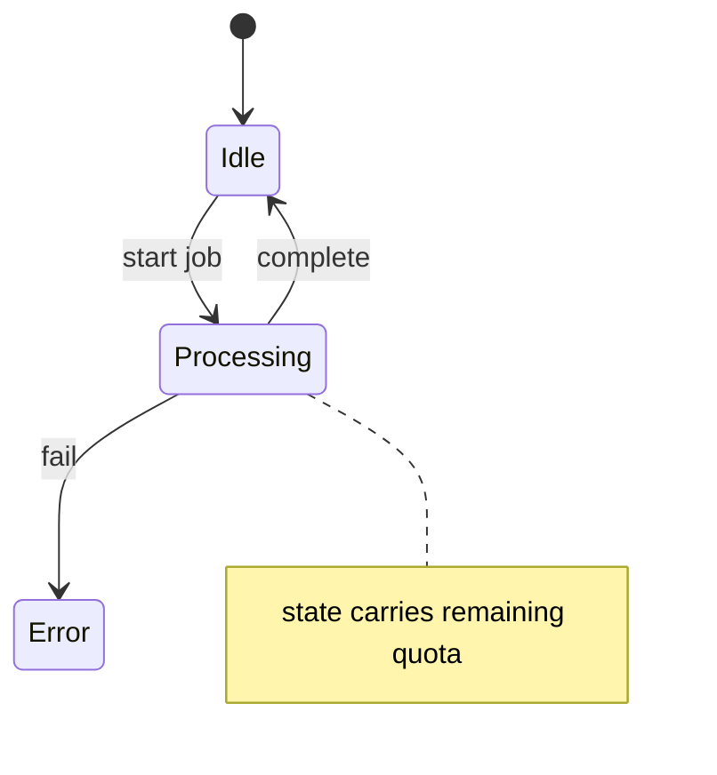

# State Design and Transition Invariants

## Overview

DP correctness lives or dies on **state design**: a finite encoding of partial progress such that (1) the optimum for the full problem is readable from a goal state, (2) transitions depend only on the state and problem inputs, and (3) **transition invariants** preserve feasibility and optimality. A state is too small if it forgets constraints needed for valid future choices; too large if it explodes the table without changing the answer.

This note is the engineering bridge between recognizing DP ([[05-Algorithms/06-Dynamic-Programming/Optimal Substructure and Overlapping Subproblems|Optimal Substructure and Overlapping Subproblems]]) and implementing families like [[05-Algorithms/06-Dynamic-Programming/Knapsack and Subset Families|Knapsack and Subset Families]] or [[05-Algorithms/06-Dynamic-Programming/Longest Common Subsequence and Edit Distance|Longest Common Subsequence and Edit Distance]].

## Learning Objectives

- Define state as sufficient statistic for remaining subproblem
- Write transitions with explicit pre/postconditions
- Prove transition invariants preserve feasibility
- Compress states (bitmasks, rolling dimensions) without breaking optimality
- Debug wrong DP by minimal counterexample on state axes

## Prerequisites

- [[05-Algorithms/06-Dynamic-Programming/Optimal Substructure and Overlapping Subproblems|Optimal Substructure and Overlapping Subproblems]]
- [[05-Algorithms/06-Dynamic-Programming/Memoization vs Tabulation|Memoization vs Tabulation]]
- [[05-Algorithms/00-Foundations-and-Correctness/Loop Invariants and Correctness Proofs|Loop Invariants and Correctness Proofs]]

## Difficulty

`advanced`

## Estimated Time

- Reading: 2.5 hours
- Exercises: 4 hours
- Mini project: 5 hours

## History

Bellman's "principle of optimality" is fundamentally a **state sufficiency** claim. Competitive programming popularized bitmask DP for TSP subsets; production schedulers encode machine modes in explicit automata. Wrong state design caused real billing bugs when "remaining budget" ignored per-tenant caps—a hidden dimension.

## Problem It Solves

Teams jump to `(i,j)` tables because interviews do. Without invariants, transitions silently allow impossible moves or double-count resources. Explicit state design turns DP into a **finite automaton** with weighted transitions—testable like protocol state machines ([[01-Computer-Science/09-Correctness-and-Reliability/Invariants Assertions and Contracts|Invariants Assertions and Contracts]]).

## Internal Implementation

### State template

| Component | Question |
| --- | --- |
| Parameters | What must we remember? |
| Domain | Finite bounds per parameter |
| Semantics | What does `dp(s)` optimize/count? |
| Base | Boundary states and values |
| Goal | Which `s` answers the query? |

### Transition invariant pattern

For each edge `s → s'` with cost `w`:

- **Pre**: `feasible(s)` and action `a` legal in `s`
- **Post**: `feasible(s')` and objective updates per recurrence
- **Invariant**: global constraints (capacity, uniqueness) encoded in `s` remain satisfied



DP state is similar: `(items considered, capacity left, mode)`.

### Example: 0/1 knapsack state

- **State**: `(i, w)` — among first `i` items, best value with capacity exactly ≤ `w` tracked via max over ≤w.
- **Invariant**: solution uses subset of `{1..i}` only once each.
- **Transition**: skip item `i` or take if `weight[i] ≤ w`.

Wrong state `(i)` only—cannot enforce capacity.

## Mermaid Diagrams

### Structure: state compression pipeline


### Sequence: invariant check in loop

```mermaid
sequenceDiagram
    participant Loop
    participant Inv as Invariant checker
    participant Table
    Loop->>Inv: assert feasible(s)
    Loop->>Table: T[s] = opt over transitions
    Loop->>Inv: assert feasible(s') for deps
```

## Examples

### Minimal Example — House Robber (linear state)

```typescript
function rob(nums: number[]): number {
  let prev2 = 0; // dp[i-2]
  let prev1 = 0; // dp[i-1]
  for (const x of nums) {
    const cur = Math.max(prev1, prev2 + x);
    prev2 = prev1;
    prev1 = cur;
  }
  return prev1;
}
```

State sufficiency: at index `i`, only need best excluding vs including previous house—Markov property on `{robbed i-1?}` collapsed to two rolling values.

```python
def rob(nums: list[int]) -> int:
    prev2, prev1 = 0, 0
    for x in nums:
        cur = max(prev1, prev2 + x)
        prev2, prev1 = prev1, cur
    return prev1
```

### Production-Shaped Example — Batch job scheduling with cooldown

Jobs `(duration, profit)`; mandatory cooldown `k` slots after each job. **State** must include `last_end_time mod (k+1)` or days since last job—not just `(day, profit)`. Transition invariant: no two jobs overlap and gap ≥ `k`. Missing cooldown in state schedules illegal batches in CI runners.

```typescript
type State = { day: number; cooldown: number }; // cooldown slots remaining

function maxProfit(
  jobs: { d: number; p: number }[],
  horizon: number,
  k: number,
): number {
  const memo = new Map<string, number>();
  function key(s: State): string {
    return `${s.day},${s.cooldown}`;
  }
  function dp(s: State): number {
    if (s.day >= horizon) return 0;
    const hit = memo.get(key(s));
    if (hit !== undefined) return hit;
    let best = dp({ day: s.day + 1, cooldown: Math.max(0, s.cooldown - 1) });
    if (s.cooldown === 0) {
      for (const j of jobs) {
        if (s.day + j.d <= horizon) {
          best = Math.max(
            best,
            j.p + dp({ day: s.day + j.d, cooldown: k }),
          );
        }
      }
    }
    memo.set(key(s), best);
    return best;
  }
  return dp({ day: 0, cooldown: 0 });
}
```

## Correctness

**Definition (sufficient state).** State encoding `φ(partial)` is sufficient if for any two partial constructions with `φ(a) = φ(b)`, optimal completions of the full problem from `a` and `b` have identical optimal value and compatible optimal policies (for the quantities tracked).

**Transition invariant theorem.** If base states satisfy feasibility invariant `I`, and every transition preserves `I` while updating the objective via the Bellman operator derived from optimal substructure, then tabulation/memo over reachable states yields globally optimal feasible solutions.

Proof uses induction on topological level of state DAG—same skeleton as [[05-Algorithms/00-Foundations-and-Correctness/Loop Invariants and Correctness Proofs|Loop Invariants and Correctness Proofs]].

## Complexity

State space size `|S| = ∏_k domain_k`. Adding one binary dimension doubles `|S|`. **Bitmask** over `n` items: `2^n`—feasible only for `n ≤ 20` roughly.

| Technique | Effect |
| --- | --- |
| Drop redundant dimension | Divide `\|S\|` |
| Aggregate by equivalence class | Collapse symmetries |
| Coordinate compression | Sparse indices |
| Rolling array | Space not time |

## Trade-offs

| Dimension | Rich state | Minimal state |
| --- | --- | --- |
| Correctness | Easier to satisfy invariants | Risk missing constraint |
| Memory | High | Low |
| Dev velocity | Faster to ship | Harder to prove |

### When to Use

- Multiple interacting constraints (time, capacity, mode)
- Need reconstruction of decisions
- Automaton view aids team communication

### When Not to Use

- Greedy sufficient with proof
- State explosion with no compression insight

## Exercises

1. Design state for "delete exactly k chars to form palindrome" on a string.
2. Prove `(i,w)` sufficient for 0/1 knapsack; show `(w)` alone fails with counterexample.
3. TSP on `n` cities: write bitmask state; estimate `|S|`.
4. Add invariant assertions to a buggy `(i,j)` grid DP; find failing cell.
5. Compress 2D LCS to 1D—what order invariant is required?

## Mini Project

Build a **state validator**: DSL declares dimensions and transitions; fuzz random walks checking invariants.

## Portfolio Project

Document state machines for [[05-Algorithms/projects/Dependency Planner/README|Dependency Planner]] rollout DP.

## Interview Questions

1. What makes a DP state " sufficient"?
2. House robber II (circle): how does state change?
3. Stock with cooldown: minimum state dimensions?
4. When does bitmask DP work and when is it reckless?
5. How do you debug wrong DP tables?

### Stretch / Staff-Level

1. Relate sufficient statistics in DP to POMDP belief states—what carries over?

## Common Mistakes

- Encoding history unnecessarily (use summary statistics)
- Forgetting parity/mod constraints (alternate days)
- Off-by-one in `i` meaning (processed vs next)

## Best Practices

- Name states in types (`type KnapsackState = { i: number; w: number }`)
- Table comments: row = ?, column = ?
- Keep transition functions pure for unit tests

## Summary

State design is the core engineering act in DP: choose a finite summary of partial progress that makes transitions local and optimal substructure honest. Transition invariants tie DP to correctness culture—assert feasibility before and after each update, and treat the table as a labeled state graph, not a magic grid.

## Further Reading

- [[05-Algorithms/06-Dynamic-Programming/Knapsack and Subset Families|Knapsack and Subset Families]]
- [[05-Algorithms/06-Dynamic-Programming/Longest Common Subsequence and Edit Distance|Longest Common Subsequence and Edit Distance]]
- [[01-Computer-Science/09-Correctness-and-Reliability/Invariants Assertions and Contracts|Invariants Assertions and Contracts]]

## Related Notes

- [[05-Algorithms/04-Divide-Conquer-and-Backtracking/Backtracking State Spaces and Pruning|Backtracking State Spaces and Pruning]]
- [[05-Algorithms/06-Dynamic-Programming/DAG Dynamic Programming and Space Optimization|DAG Dynamic Programming and Space Optimization]]
- [[05-Algorithms/README|Algorithms]]

## Progress Checklist

- [ ] Explained from first principles
- [ ] Drew at least one Mermaid diagram
- [ ] Implemented a minimal version
- [ ] Documented trade-offs and non-goals
- [ ] Completed exercises
- [ ] Practiced interview questions aloud
- [ ] Linked prerequisites and dependents
