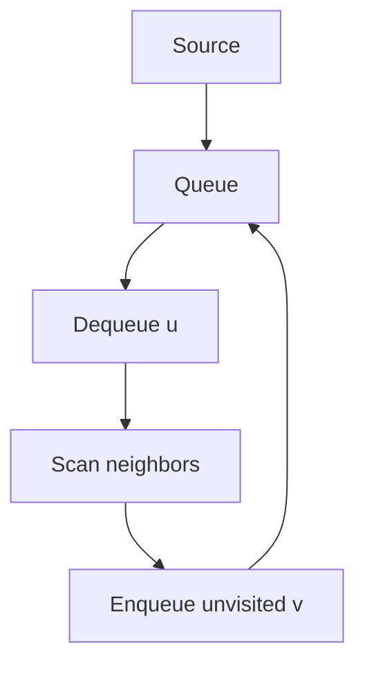
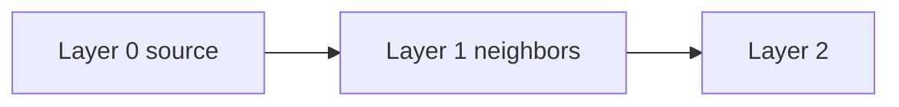
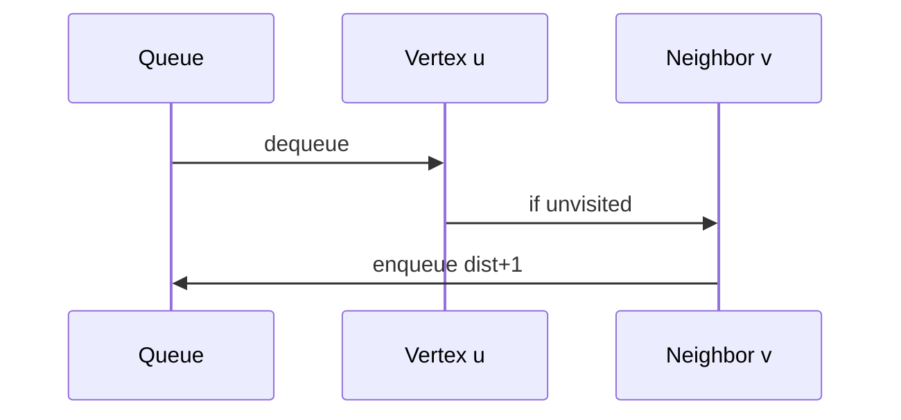

# BFS

## Overview

**Breadth-first search (BFS)** explores a graph layer by layer from a source vertex, visiting all vertices at distance `d` before any at distance `d+1`. On **unweighted** graphs (or uniform edge weight), BFS computes **shortest path distances** in edges. It uses a [[04-Data-Structures/03-Stacks-Queues-and-Deques/Queues|FIFO queue]] and `visited`/`distance` arrays.

This note covers the **algorithm** only—graph storage is in [[04-Data-Structures/08-Graphs-as-Representation/Adjacency Lists|Adjacency Lists]]. BFS underpins unweighted shortest paths, bipartite tests, and level-synchronous propagation in production systems.

## Learning Objectives

- Implement BFS on directed and undirected graphs via neighbor iteration
- Prove BFS distance labels are minimum hop counts in unweighted graphs
- Handle multi-source BFS and implicit graphs
- Bound memory and choose queue structures for large frontiers
- Map BFS to web crawlers, RPC fan-out, and cache warming patterns

## Prerequisites

- [[04-Data-Structures/08-Graphs-as-Representation/Graph ADT Vertices Edges and Labels|Graph ADT Vertices Edges and Labels]]
- [[04-Data-Structures/08-Graphs-as-Representation/Adjacency Lists|Adjacency Lists]]
- [[04-Data-Structures/03-Stacks-Queues-and-Deques/Queues|Queues]]

## Difficulty

`intermediate`

## Estimated Time

- Reading: 1.5 hours
- Exercises: 3 hours
- Mini project: 4 hours

## History

BFS is classical graph theory (Moore, Lee). It became foundational in AI (shallowest goal search) and networking (flooding, TTL expansion). Modern service meshes use BFS-like wavefronts for health propagation with caps.

## Problem It Solves

**Shortest hops** in social graphs, **minimum edits** in state spaces with unit moves, **nearest replica** discovery when latency is uniform per hop. DFS may dive deep and miss shorter routes; BFS finds the closest layer first.

## Internal Implementation

### Algorithm

1. Initialize queue with source; `dist[s]=0`, mark visited.
2. Dequeue `u`; for each neighbor `v` not visited: set `dist[v]=dist[u]+1`, enqueue `v`.
3. Continue until queue empty or goal found.



### Multi-source BFS

Seed queue with all sources at distance 0—computes nearest source per vertex (Voronoi on graphs).

## Mermaid Diagrams

### Structure: layer expansion



### Sequence: dequeue and relax



## Examples

### Minimal Example

```typescript
function bfs(
  n: number,
  adj: number[][],
  source: number,
): { dist: number[]; parent: number[] } {
  const dist = Array(n).fill(-1);
  const parent = Array(n).fill(-1);
  const q: number[] = [source];
  dist[source] = 0;
  for (let qi = 0; qi < q.length; qi++) {
    const u = q[qi];
    for (const v of adj[u]) {
      if (dist[v] !== -1) continue;
      dist[v] = dist[u] + 1;
      parent[v] = u;
      q.push(v);
    }
  }
  return { dist, parent };
}
```

```python
from collections import deque


def bfs(n: int, adj: list[list[int]], source: int) -> tuple[list[int], list[int]]:
    dist = [-1] * n
    parent = [-1] * n
    q = deque([source])
    dist[source] = 0
    while q:
        u = q.popleft()
        for v in adj[u]:
            if dist[v] != -1:
                continue
            dist[v] = dist[u] + 1
            parent[v] = u
            q.append(v)
    return dist, parent
```

### Production-Shaped Example

**Incident blast radius**: services as vertices, dependency edges directed downstream. Multi-source BFS from failed node set yields affected tiers within `k` hops—cap `k` to avoid full graph sweep; use bitmap visited for 100k nodes. Pair with [[05-Algorithms/07-Graph-Traversal-and-DAGs/Cycle Detection|Cycle Detection]] before assuming DAG layering in rollout tools.

## Correctness

**Invariant**: when dequeuing `u`, `dist[u]` equals minimum unweighted path length from source.

**Proof sketch**: induction on dequeue order. All vertices at distance `d` enqueued before any at `d+1` (FIFO). First visit of `v` is via shortest prefix path—later paths are ≥ same length.

**Termination**: finite `V`, each vertex enqueued once → `O(V+E)`.

## Complexity

| Resource | Bound |
| --- | --- |
| Time | `O(V + E)` |
| Space | `O(V)` queue + arrays |

Implicit graphs: pay neighbor generation cost per edge explored.

## Trade-offs

| Dimension | BFS | DFS |
| --- | --- | --- |
| Shortest hops | Yes | No |
| Memory frontier | Can be wide | Path stack |
| Implementation | Queue needed | Stack/recursion |

### When to Use

- Unweighted shortest path / fewest steps
- Level-order processing (sync rounds)
- Bipartite coloring ([[05-Algorithms/07-Graph-Traversal-and-DAGs/Connected Components and Bipartite Testing|Connected Components and Bipartite Testing]])

### When Not to Use

- Weighted graphs → [[05-Algorithms/08-Shortest-Paths/Dijkstra with Indexed Heaps|Dijkstra]]
- Deep narrow graphs with tiny memory → DFS may suffice if path not shortest

## Exercises

1. Reconstruct shortest path using `parent` array.
2. Multi-source BFS: nearest warehouse for each customer node.
3. BFS on grid with obstacles; 4-direction moves.
4. Count nodes at exactly distance `k`.
5. Why does BFS fail on weighted edges without modification?

## Mini Project

Add BFS layer visualization to [[05-Algorithms/projects/Pathfinding Lab/README|Pathfinding Lab]].

## Portfolio Project

Simulate failure propagation with capped BFS waves in a service graph.

## Interview Questions

1. BFS vs DFS—when is BFS required?
2. Complexity on adjacency list vs matrix?
3. Multi-source BFS use cases?
4. How to avoid `O(V²)` queue shift in naive array queue?
5. BFS on infinite implicit graph—how to bound?

### Stretch / Staff-Level

1. Bidirectional BFS for shortest path—when does it win?

## Common Mistakes

- Not marking visited before enqueue (duplicate queue entries)
- Using BFS for weighted graphs without 0-1 structure
- Confusing `dist=-1` unreachable with distance zero

## Best Practices

- Use `deque` in Python; ring buffer or linked queue in TS for large graphs
- Cap iterations in production explorers
- Log max frontier width for capacity planning

## Summary

BFS is the canonical layer-by-layer graph traversal: FIFO order guarantees minimum hop distance on unweighted graphs. Master visited discipline, multi-source seeding, and `O(V+E)` analysis—then delegate weighted and all-pairs problems to dedicated shortest-path modules.

## Further Reading

- [[05-Algorithms/07-Graph-Traversal-and-DAGs/DFS|DFS]]
- [[05-Algorithms/08-Shortest-Paths/Zero-One BFS and Specialized Weights|Zero-One BFS and Specialized Weights]]

## Related Notes

- [[04-Data-Structures/08-Graphs-as-Representation/Implicit Graphs and On-the-Fly Neighbors|Implicit Graphs and On-the-Fly Neighbors]]
- [[05-Algorithms/07-Graph-Traversal-and-DAGs/Connected Components and Bipartite Testing|Connected Components and Bipartite Testing]]
- [[05-Algorithms/README|Algorithms]]

## Progress Checklist

- [ ] Explained from first principles
- [ ] Drew at least one Mermaid diagram
- [ ] Implemented a minimal version
- [ ] Documented trade-offs and non-goals
- [ ] Completed exercises
- [ ] Practiced interview questions aloud
- [ ] Linked prerequisites and dependents
