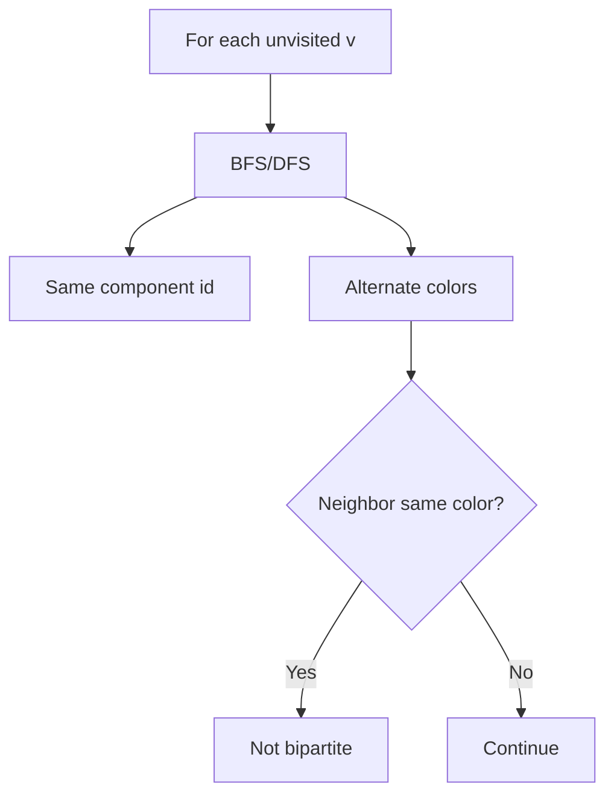
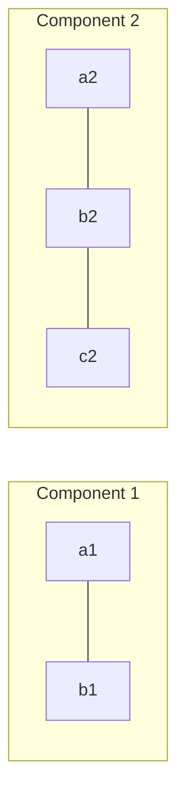
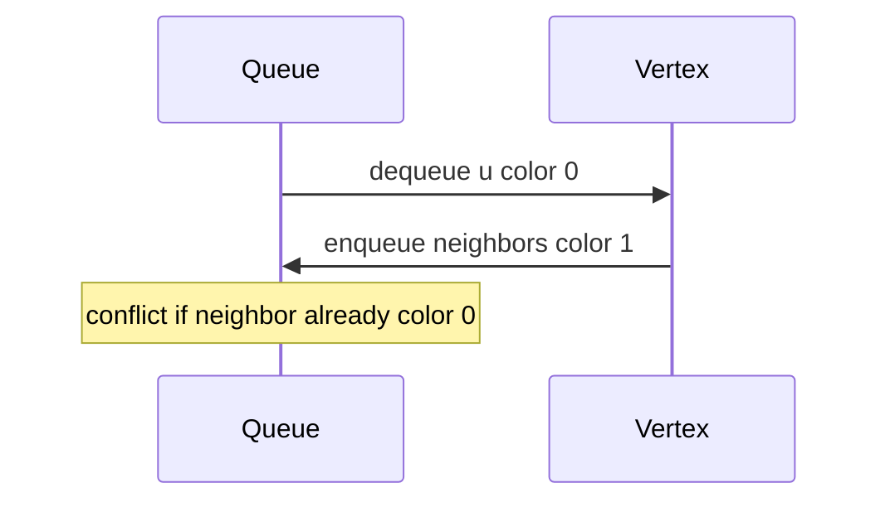

# Connected Components and Bipartite Testing

## Overview

In an **undirected** graph, a **connected component** is a maximal set of vertices mutually reachable. Counting and labeling components answers "how many isolated islands?" and enables per-component processing. A graph is **bipartite** if vertices partition into two sets with every edge crossing sets—equivalently, **2-colorable** with no odd cycles.

Both problems reduce to [[05-Algorithms/07-Graph-Traversal-and-DAGs/BFS|BFS]] or [[05-Algorithms/07-Graph-Traversal-and-DAGs/DFS|DFS]] traversals (or [[04-Data-Structures/09-Disjoint-Set/Union-Find Structure|Union-Find]] for components in dynamic settings). This note focuses on algorithmic contracts, not adjacency storage ([[04-Data-Structures/08-Graphs-as-Representation/Adjacency Lists|Adjacency Lists]]).

## Learning Objectives

- Label connected components with BFS/DFS in `O(V+E)`
- Test bipartiteness via alternating colors on traversal
- Relate bipartite structure to matching and scheduling problems
- Compare static component labeling vs union-find for incremental edges
- Handle disconnected graphs by looping all vertices

## Prerequisites

- [[05-Algorithms/07-Graph-Traversal-and-DAGs/BFS|BFS]]
- [[05-Algorithms/07-Graph-Traversal-and-DAGs/DFS|DFS]]

## Difficulty

`intermediate`

## Estimated Time

- Reading: 1.5 hours
- Exercises: 3 hours
- Mini project: 4 hours

## History

Component analysis appears in network reliability and image labeling (connected pixels). Bipartite graphs model user-item interactions (recommendation), conflict-free scheduling, and parity constraints in combinatorics.

## Problem It Solves

**Microservice isolation**: enumerate independent failure domains. **Conflict graphs**: tasks sharing a resource cannot share a time slot—2-colorable ⇔ schedulable into two tracks. **Database shard sanity**: ensure no cross-shard edge connects components intended to split.

## Internal Implementation

### Connected components

Outer loop over vertices; each unvisited start launches BFS/DFS, assigning incrementing `componentId`.

### Bipartite test

Attempt 2-coloring: BFS/DFS assigns color `c` to start; neighbors must be `1-c`. Conflict on same color adjacent ⇒ not bipartite (odd cycle exists in undirected graph).



## Mermaid Diagrams

### Structure: two components



### Sequence: BFS 2-coloring



## Examples

### Minimal Example

```typescript
function components(n: number, edges: [number, number][]): number[] {
  const adj: number[][] = Array.from({ length: n }, () => []);
  for (const [u, v] of edges) {
    adj[u].push(v);
    adj[v].push(u);
  }
  const comp = Array(n).fill(-1);
  let id = 0;
  for (let s = 0; s < n; s++) {
    if (comp[s] !== -1) continue;
    const q = [s];
    comp[s] = id;
    for (let qi = 0; qi < q.length; qi++) {
      const u = q[qi];
      for (const v of adj[u]) {
        if (comp[v] === -1) {
          comp[v] = id;
          q.push(v);
        }
      }
    }
    id++;
  }
  return comp;
}

function isBipartite(n: number, edges: [number, number][]): boolean {
  const adj: number[][] = Array.from({ length: n }, () => []);
  for (const [u, v] of edges) {
    adj[u].push(v);
    adj[v].push(u);
  }
  const color = Array(n).fill(-1);
  for (let s = 0; s < n; s++) {
    if (color[s] !== -1) continue;
    color[s] = 0;
    const q = [s];
    for (let qi = 0; qi < q.length; qi++) {
      const u = q[qi];
      for (const v of adj[u]) {
        if (color[v] === -1) {
          color[v] = color[u] ^ 1;
          q.push(v);
        } else if (color[v] === color[u]) return false;
      }
    }
  }
  return true;
}
```

```python
from collections import deque


def components(n: int, edges: list[tuple[int, int]]) -> list[int]:
    adj: list[list[int]] = [[] for _ in range(n)]
    for u, v in edges:
        adj[u].append(v)
        adj[v].append(u)
    comp = [-1] * n
    cid = 0
    for s in range(n):
        if comp[s] != -1:
            continue
        q = deque([s])
        comp[s] = cid
        while q:
            u = q.popleft()
            for v in adj[u]:
                if comp[v] == -1:
                    comp[v] = cid
                    q.append(v)
        cid += 1
    return comp


def is_bipartite(n: int, edges: list[tuple[int, int]]) -> bool:
    adj: list[list[int]] = [[] for _ in range(n)]
    for u, v in edges:
        adj[u].append(v)
        adj[v].append(u)
    color = [-1] * n
    for s in range(n):
        if color[s] != -1:
            continue
        color[s] = 0
        q = deque([s])
        while q:
            u = q.popleft()
            for v in adj[u]:
                if color[v] == -1:
                    color[v] = color[u] ^ 1
                    q.append(v)
                elif color[v] == color[u]:
                    return False
    return True
```

### Production-Shaped Example

**Shard graph validator**: nodes are tables; undirected edges are FK relationships. Components define migration batches; bipartite check on `table ↔ job-type` conflict graph ensures two-window maintenance schedule exists.

## Correctness

**Components**: each traversal marks exactly reachable set from seed; maximality because traversal stops only when no new neighbors; partition because each vertex assigned once.

**Bipartite test**: if algorithm succeeds, coloring is valid 2-partition. If fails, found edge within same color class implies odd cycle (standard graph theorem). Conversely, bipartite graphs always admit 2-coloring discovered by BFS order.

## Complexity

| Task | Time | Space |
| --- | --- | --- |
| Components | `O(V+E)` | `O(V)` |
| Bipartite test | `O(V+E)` | `O(V)` |

Union-find components on static edges also `O(E α(V))`—see [[04-Data-Structures/09-Disjoint-Set/Union by Rank and Path Compression|Union by Rank and Path Compression]].

## Trade-offs

| Approach | Components | Notes |
| --- | --- | --- |
| BFS/DFS | Static batch | Simple labels |
| Union-Find | Dynamic edges | [[05-Algorithms/09-MST-and-Connectivity/Kruskal with Union-Find|Kruskal]] glue |

### When to Use

- Preprocess graph into independent workloads
- Parity / two-track scheduling feasibility
- Feature flag rollout per isolated subgraph

### When Not to Use

- Directed reachability → weak vs strong components ([[05-Algorithms/07-Graph-Traversal-and-DAGs/Strongly Connected Components|Strongly Connected Components]])
- `k`-coloring for `k>2`—NP-complete in general

## Exercises

1. Count components and sizes histogram.
2. Return odd cycle witness when not bipartite.
3. Components on directed graph treating edges as undirected—when misleading?
4. Implement components with union-find; compare to BFS.
5. Grid `0/1` islands as implicit graph—count components.

## Mini Project

Component visualizer coloring each island in [[05-Algorithms/projects/Network Connectivity and MST Lab/README|Network Connectivity and MST Lab]].

## Portfolio Project

Integrate bipartite checker in scheduling API with cycle witness export.

## Interview Questions

1. How to count connected components?
2. Prove: bipartite ⇔ no odd cycle (undirected).
3. BFS vs DFS for 2-coloring—differences?
4. Is single vertex with self-loop bipartite?
5. When use union-find instead of BFS?

### Stretch / Staff-Level

1. Dynamic bipartiteness under edge insertions—what breaks?

## Common Mistakes

- Forgetting disconnected outer loop
- Testing bipartite on directed graphs without conversion
- Self-loop immediately violates bipartite (unless isolated handling)

## Best Practices

- Return `componentId[]` parallel to vertices for O(1) lookup
- Log largest component ratio for skew monitoring
- Document undirected assumption in API contracts

## Summary

Connected components partition undirected graphs into reachable islands; bipartite testing is simultaneous 2-coloring during traversal. Both are linear-time BFS/DFS applications that precede matching, scheduling, and connectivity tooling in production pipelines.

## Further Reading

- [[05-Algorithms/07-Graph-Traversal-and-DAGs/Strongly Connected Components|Strongly Connected Components]]
- [[05-Algorithms/10-Advanced-Graph-Algorithms/Bipartite Matching|Bipartite Matching]]

## Related Notes

- [[04-Data-Structures/09-Disjoint-Set/Union-Find Structure|Union-Find Structure]]
- [[05-Algorithms/09-MST-and-Connectivity/Bridges Articulation Points and Connectivity Failure|Bridges Articulation Points and Connectivity Failure]]
- [[05-Algorithms/README|Algorithms]]

## Progress Checklist

- [ ] Explained from first principles
- [ ] Drew at least one Mermaid diagram
- [ ] Implemented a minimal version
- [ ] Documented trade-offs and non-goals
- [ ] Completed exercises
- [ ] Practiced interview questions aloud
- [ ] Linked prerequisites and dependents
