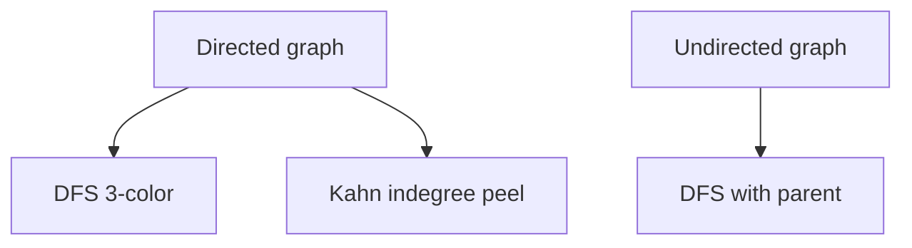
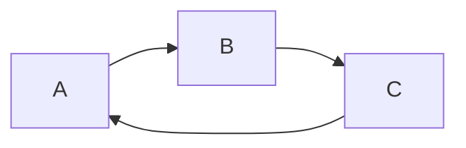
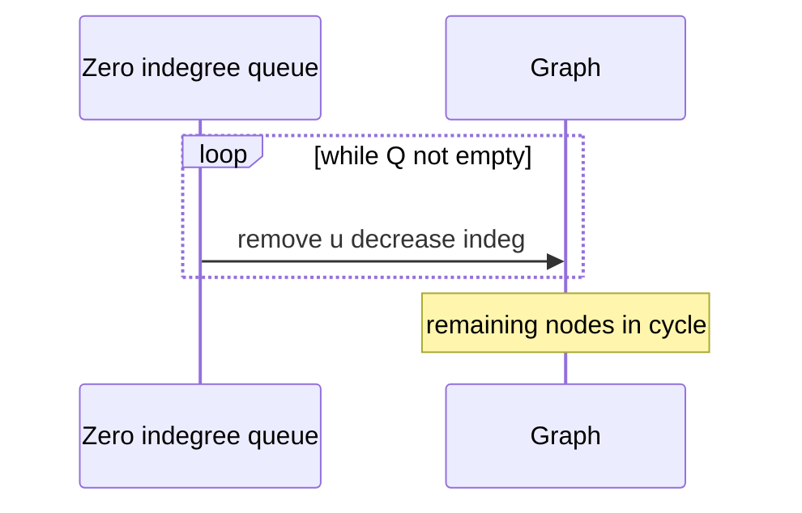

# Cycle Detection

## Overview

A **cycle** is a path that starts and ends at the same vertex without repeating edges (definitions vary for directed vs undirected). **Cycle detection** answers whether such a loop exists—critical before [[05-Algorithms/07-Graph-Traversal-and-DAGs/Topological Sorting and Dependency Resolution|topological sorting]], [[05-Algorithms/06-Dynamic-Programming/DAG Dynamic Programming and Space Optimization|DAG DP]], and dependency-driven deployments.

Standard methods: **DFS three-color** (directed), **DFS with parent** (undirected), **Kahn's indegree BFS** (directed—if topo incomplete, cycle exists). Graph storage: [[04-Data-Structures/08-Graphs-as-Representation/Adjacency Lists|Adjacency Lists]].

## Learning Objectives

- Detect cycles in directed and undirected graphs correctly
- Extract a cycle witness path for error messages
- Relate cycle existence to topological sort failure
- Choose DFS vs Kahn based on need for witness vs order
- Apply detection in config/CI dependency validators

## Prerequisites

- [[05-Algorithms/07-Graph-Traversal-and-DAGs/DFS|DFS]]
- [[05-Algorithms/00-Foundations-and-Correctness/Loop Invariants and Correctness Proofs|Loop Invariants and Correctness Proofs]]

## Difficulty

`intermediate`

## Estimated Time

- Reading: 1.5 hours
- Exercises: 3 hours
- Mini project: 4 hours

## History

Cycle detection prevents deadlock in dependency systems (Make, npm before acyclic guarantees). Compiler SSA and CFG analyses rely on cycle structure differently (loops vs bad recursion). Infrastructure-as-code tools surface cycles as hard errors.

## Problem It Solves

**Circular dependencies** break build order and DP on DAGs. **Financial settlement nets** must avoid cyclic obligations. Detect early with `O(V+E)`—not at runtime stack overflow.

## Internal Implementation

### Directed: DFS gray back edge

Active gray stack ⇒ back edge to ancestor ⇒ cycle.

### Directed: Kahn topological

Repeatedly remove indegree-zero nodes. If removed count `< V`, cycle exists.

### Undirected: DFS parent

Skip edge back to immediate parent; any other visited neighbor ⇒ cycle.



## Mermaid Diagrams

### Structure: directed cycle witness



### Sequence: Kahn peel failure



## Examples

### Minimal Example

```typescript
function hasCycleDirected(n: number, adj: number[][]): boolean {
  const WHITE = 0,
    GRAY = 1,
    BLACK = 2;
  const state = Array(n).fill(WHITE);
  function dfs(u: number): boolean {
    state[u] = GRAY;
    for (const v of adj[u]) {
      if (state[v] === GRAY) return true;
      if (state[v] === WHITE && dfs(v)) return true;
    }
    state[u] = BLACK;
    return false;
  }
  for (let i = 0; i < n; i++) {
    if (state[i] === WHITE && dfs(i)) return true;
  }
  return false;
}

function hasCycleUndirected(n: number, edges: [number, number][]): boolean {
  const adj: number[][] = Array.from({ length: n }, () => []);
  for (const [u, v] of edges) {
    adj[u].push(v);
    adj[v].push(u);
  }
  const vis = Array(n).fill(false);
  function dfs(u: number, p: number): boolean {
    vis[u] = true;
    for (const v of adj[u]) {
      if (!vis[v]) {
        if (dfs(v, u)) return true;
      } else if (v !== p) return true;
    }
    return false;
  }
  for (let i = 0; i < n; i++) {
    if (!vis[i] && dfs(i, -1)) return true;
  }
  return false;
}
```

```python
WHITE, GRAY, BLACK = 0, 1, 2


def has_cycle_directed(n: int, adj: list[list[int]]) -> bool:
    state = [WHITE] * n

    def dfs(u: int) -> bool:
        state[u] = GRAY
        for v in adj[u]:
            if state[v] == GRAY:
                return True
            if state[v] == WHITE and dfs(v):
                return True
        state[u] = BLACK
        return False

    return any(state[i] == WHITE and dfs(i) for i in range(n))


def has_cycle_undirected(n: int, edges: list[tuple[int, int]]) -> bool:
    adj: list[list[int]] = [[] for _ in range(n)]
    for u, v in edges:
        adj[u].append(v)
        adj[v].append(u)
    vis = [False] * n

    def dfs(u: int, p: int) -> bool:
        vis[u] = True
        for v in adj[u]:
            if not vis[v]:
                if dfs(v, u):
                    return True
            elif v != p:
                return True
        return False

    return any(not vis[i] and dfs(i, -1) for i in range(n))
```

### Production-Shaped Example

**Terraform module graph**: on `plan`, run Kahn; if `processed < modules`, extract subgraph induced by remaining nodes and print SCC-ish cycle snippet for engineers—blocks apply. Pair with [[05-Algorithms/07-Graph-Traversal-and-DAGs/Strongly Connected Components|Strongly Connected Components]] for precise cycle grouping.

## Correctness

**Directed DFS**: gray neighbor on active stack forms closed walk using tree path + back edge.

**Undirected DFS**: non-tree edge to visited non-parent closes cycle (multi-edges need careful handling).

**Kahn**: invariant—removed vertices only when all incoming from remaining eliminated; cyclic core never gets indegree zero.

## Complexity

All standard methods: **Time** `O(V+E)`, **Space** `O(V)`.

## Trade-offs

| Method | Directed | Witness | Also yields |
| --- | --- | --- | --- |
| DFS 3-color | Yes | Path with stack | Finish times |
| Kahn | Yes | Remaining set | Topo if acyclic |
| Union-Find | Undirected only | No | Components |

### When to Use

- Pre-flight validation of DAG assumptions
- CI gates on dependency manifests
- Before scheduling DP/toposort

### When Not to Use

- Enumerate *all* cycles—exponential output
- Functional recursion cycles (different analysis)

## Exercises

1. Return explicit cycle list from directed DFS.
2. Implement Kahn; compare processed count to `V`.
3. Self-loop detection edge case.
4. Multi-edge undirected—parent trick still works?
5. Detect cycle in functional dependency graph with 100k nodes—choose method.

## Mini Project

Cycle witness formatter for [[05-Algorithms/projects/Dependency Planner/README|Dependency Planner]].

## Portfolio Project

Pre-commit hook running cycle detection on monorepo package graph.

## Interview Questions

1. Directed vs undirected cycle detection differences?
2. Why does gray node mean cycle in directed DFS?
3. Kahn vs DFS for topo—cycle signal?
4. Can BFS detect cycles?
5. How to find one cycle in directed graph?

### Stretch / Staff-Level

1. Johnson's algorithm for enumerating elementary cycles—when worth it?

## Common Mistakes

- Using undirected rule on directed graphs
- Forgetting outer loop over disconnected parts
- Treating multi-edge `(u,v)` twice as cycle in undirected

## Best Practices

- Fail closed: cycle ⇒ hard error with witness
- Metric: cycle count found in CI over time
- Document self-loop policy explicitly

## Summary

Cycle detection is a linear-time prerequisite for treating graphs as DAGs. Directed graphs need back-edge or indegree reasoning; undirected graphs need parent-aware DFS. Production systems must return actionable cycle witnesses, not boolean failures alone.

## Further Reading

- [[05-Algorithms/07-Graph-Traversal-and-DAGs/Topological Sorting and Dependency Resolution|Topological Sorting and Dependency Resolution]]
- [[05-Algorithms/07-Graph-Traversal-and-DAGs/Strongly Connected Components|Strongly Connected Components]]

## Related Notes

- [[05-Algorithms/06-Dynamic-Programming/DAG Dynamic Programming and Space Optimization|DAG Dynamic Programming and Space Optimization]]
- [[04-Data-Structures/08-Graphs-as-Representation/Graph ADT Vertices Edges and Labels|Graph ADT Vertices Edges and Labels]]
- [[05-Algorithms/README|Algorithms]]

## Progress Checklist

- [ ] Explained from first principles
- [ ] Drew at least one Mermaid diagram
- [ ] Implemented a minimal version
- [ ] Documented trade-offs and non-goals
- [ ] Completed exercises
- [ ] Practiced interview questions aloud
- [ ] Linked prerequisites and dependents
