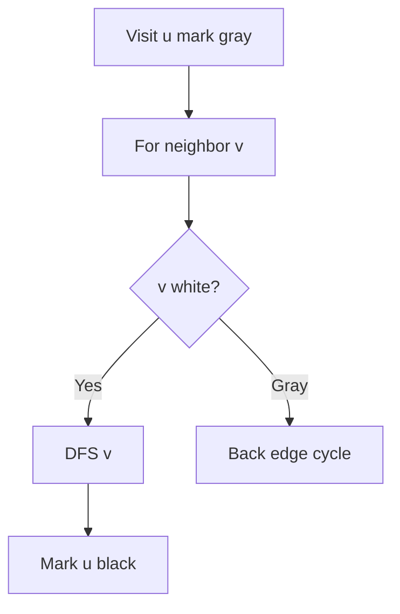
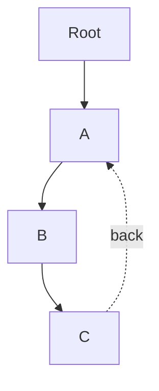
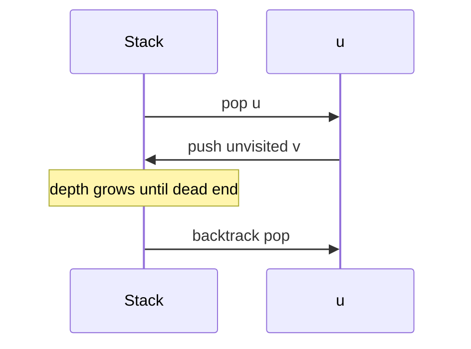

# DFS

## Overview

**Depth-first search (DFS)** explores as far as possible along each branch before backtracking. Implementation uses recursion or an explicit [[04-Data-Structures/03-Stacks-Queues-and-Deques/Stacks|stack]]. DFS yields **discovery/finish times**, **parent tree**, and structure for [[05-Algorithms/07-Graph-Traversal-and-DAGs/Cycle Detection|Cycle Detection]], [[05-Algorithms/07-Graph-Traversal-and-DAGs/Topological Sorting and Dependency Resolution|Topological Sorting]], and [[05-Algorithms/07-Graph-Traversal-and-DAGs/Strongly Connected Components|SCC]] algorithms.

Graph representation remains in [[04-Data-Structures/08-Graphs-as-Representation/Adjacency Lists|Adjacency Lists]]; this note owns traversal order and correctness contracts.

## Learning Objectives

- Implement iterative and recursive DFS with color marking (white/gray/black)
- Classify tree/back/forward/cross edges in directed graphs
- Apply DFS for reachability, path existence, and connected components
- Avoid stack overflow via explicit stacks on deep graphs
- Connect DFS to backtracking ([[05-Algorithms/04-Divide-Conquer-and-Backtracking/Backtracking State Spaces and Pruning|Backtracking State Spaces and Pruning]])

## Prerequisites

- [[04-Data-Structures/08-Graphs-as-Representation/Graph ADT Vertices Edges and Labels|Graph ADT Vertices Edges and Labels]]
- [[04-Data-Structures/08-Graphs-as-Representation/Adjacency Lists|Adjacency Lists]]
- [[04-Data-Structures/03-Stacks-Queues-and-Deques/Stacks|Stacks]]

## Difficulty

`intermediate`

## Estimated Time

- Reading: 1.5 hours
- Exercises: 3 hours
- Mini project: 4 hours

## History

DFS underpins Tarjan's SCC (1972) and topological sort. Compiler CFG analysis, filesystem walks, and maze solving use DFS patterns. Production systems favor iterative DFS when recursion depth is unbounded (deep dependency chains).

## Problem It Solves

**Reachability** without needing shortest path; **detect cycles** in config graphs; **enumerate paths** with pruning; **compute finish order** for scheduling. BFS uses more memory on wide graphs; DFS stack depth equals longest path explored.

## Internal Implementation

### Recursive DFS with colors

- **White**: unvisited  
- **Gray**: on recursion stack (active)  
- **Black**: finished  

Edge `(u,v)`: if `v` white → tree edge; gray → back edge (cycle in directed); black → forward/cross.



### Iterative DFS

Push `(u, nextNeighborIndex)` frames; pop when all neighbors processed—mirrors recursion without call stack limit.

## Mermaid Diagrams

### Structure: DFS tree vs back edge



### Sequence: iterative stack frames



## Examples

### Minimal Example

```typescript
enum Color {
  White,
  Gray,
  Black,
}

function dfs(
  n: number,
  adj: number[][],
  start = 0,
): { order: number[]; hasCycle: boolean } {
  const color = Array(n).fill(Color.White);
  const order: number[] = [];
  let hasCycle = false;

  function visit(u: number): void {
    color[u] = Color.Gray;
    for (const v of adj[u]) {
      if (color[v] === Color.White) visit(v);
      else if (color[v] === Color.Gray) hasCycle = true;
    }
    color[u] = Color.Black;
    order.push(u);
  }

  for (let i = 0; i < n; i++) {
    if (color[i] === Color.White) visit(i);
  }
  return { order, hasCycle };
}
```

```python
WHITE, GRAY, BLACK = 0, 1, 2


def dfs(n: int, adj: list[list[int]], start: int = 0) -> tuple[list[int], bool]:
    color = [WHITE] * n
    order: list[int] = []
    has_cycle = False

    def visit(u: int) -> None:
        nonlocal has_cycle
        color[u] = GRAY
        for v in adj[u]:
            if color[v] == WHITE:
                visit(v)
            elif color[v] == GRAY:
                has_cycle = True
        color[u] = BLACK
        order.append(u)

    for i in range(n):
        if color[i] == WHITE:
            visit(i)
    return order, has_cycle
```

### Production-Shaped Example

**Permission inheritance resolver**: DFS from user node along `grants` edges, cycle detection via gray nodes—reject configs that create circular role inheritance. Cap depth at 64; switch to iterative stack with explicit path for error messages listing cycle participants.

## Correctness

**Visit invariant**: all vertices reachable from start are eventually black; gray nodes form a path from current root.

**Cycle detection (directed)**: back edge to gray node closes cycle on active stack.

**Finish time order**: for DAG, reverse finish order is topological sort ([[05-Algorithms/07-Graph-Traversal-and-DAGs/Topological Sorting and Dependency Resolution|Topological Sorting and Dependency Resolution]]).

**Termination**: each vertex moves white→gray→black once → `O(V+E)`.

## Complexity

| Resource | Bound |
| --- | --- |
| Time | `O(V + E)` |
| Space | `O(V)` colors + `O(V)` stack worst case |

Recursion depth = longest path—can be `O(V)` (path graph).

## Trade-offs

| Dimension | DFS | BFS |
| --- | --- | --- |
| Shortest path | No | Unweighted yes |
| Memory | O depth | O width |
| Topological/SCC | Natural | Awkward |

### When to Use

- Cycle detection, topological sort, SCC preprocessing
- Exhaustive search with backtracking
- Deep narrow graphs

### When Not to Use

- Unweighted shortest path → [[05-Algorithms/07-Graph-Traversal-and-DAGs/BFS|BFS]]
- Very deep graphs without iterative stack guard

## Exercises

1. Iterative DFS matching recursive finish order.
2. Count connected components in undirected graph.
3. Detect cycle in undirected graph (parent pointer trick).
4. Classify edges in small directed example.
5. DFS order on tree vs graph with cross edges.

## Mini Project

Visualize DFS discovery/finish times on [[05-Algorithms/projects/Dependency Planner/README|Dependency Planner]] graphs.

## Portfolio Project

Build cycle reporter with human-readable path for config repos.

## Interview Questions

1. DFS vs BFS—memory profile?
2. Detect cycle directed vs undirected?
3. What is a back edge?
4. Stack overflow mitigation?
5. How does DFS relate to topological sort?

### Stretch / Staff-Level

1. Tarjan SCC high-level—what does DFS provide?

## Common Mistakes

- Checking only `visited` boolean—misses directed cycle nuance (need gray)
- Infinite recursion on cyclic undirected without parent check
- Assuming DFS order is topological without reversing finishes

## Best Practices

- Prefer iterative DFS in production parsers
- Track `parent` for path reconstruction
- Separate **directed** vs **undirected** cycle rules in APIs

## Summary

DFS plunges depth-first, using a stack or recursion, and exposes edge types that power cycle detection and topological ordering. It trades shortest-path optimality for low memory on narrow graphs and tight integration with backtracking and advanced graph decompositions.

## Further Reading

- [[05-Algorithms/07-Graph-Traversal-and-DAGs/Cycle Detection|Cycle Detection]]
- [[05-Algorithms/07-Graph-Traversal-and-DAGs/Strongly Connected Components|Strongly Connected Components]]

## Related Notes

- [[05-Algorithms/04-Divide-Conquer-and-Backtracking/Backtracking State Spaces and Pruning|Backtracking State Spaces and Pruning]]
- [[04-Data-Structures/08-Graphs-as-Representation/Graph Storage Trade-offs and Dynamic Updates|Graph Storage Trade-offs and Dynamic Updates]]
- [[05-Algorithms/README|Algorithms]]

## Progress Checklist

- [ ] Explained from first principles
- [ ] Drew at least one Mermaid diagram
- [ ] Implemented a minimal version
- [ ] Documented trade-offs and non-goals
- [ ] Completed exercises
- [ ] Practiced interview questions aloud
- [ ] Linked prerequisites and dependents
