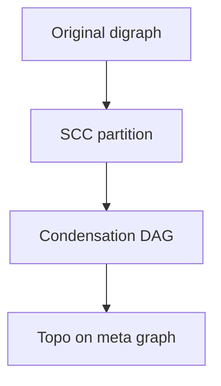
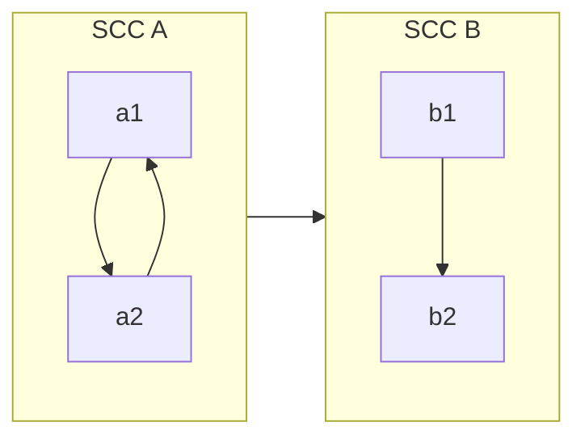
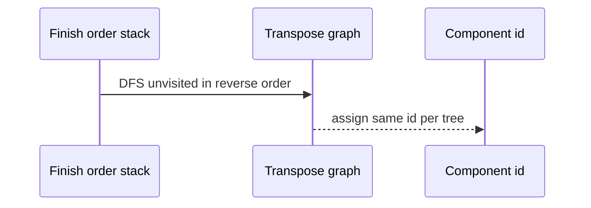

# Strongly Connected Components

## Overview

In a **directed** graph, a **strongly connected component (SCC)** is a maximal set of vertices where every pair is mutually reachable. SCC decomposition partitions the graph into **condensation DAG** nodes—each SCC collapsed to one super-vertex with edges between components only forward in some topological sense.

Algorithms: **Kosaraju** (two DFS passes + transpose) and **Tarjan** (single DFS with lowlink). Used for cycle structure analysis, 2-SAT, and simplifying dependency graphs. Representation via [[04-Data-Structures/08-Graphs-as-Representation/Adjacency Lists|Adjacency Lists]].

## Learning Objectives

- Define strong connectivity vs weak connectivity
- Implement Kosaraju and Tarjan SCC algorithms
- Build condensation graph and topo sort SCC DAG
- Extract meaningful cycle groups for error reporting
- Analyze `O(V+E)` time and stack usage

## Prerequisites

- [[05-Algorithms/07-Graph-Traversal-and-DAGs/DFS|DFS]]
- [[05-Algorithms/07-Graph-Traversal-and-DAGs/Topological Sorting and Dependency Resolution|Topological Sorting and Dependency Resolution]]

## Difficulty

`advanced`

## Estimated Time

- Reading: 2.5 hours
- Exercises: 4 hours
- Mini project: 5 hours

## History

Tarjan (1972) and Kosaraju (1970s) gave linear SCC algorithms. SCCs appear in model checking, call graph analysis, and web graph structure studies.

## Problem It Solves

**Dependency cycles** often form SCCs—not single loops. Collapsing SCCs yields acyclic macro graph for scheduling partial order. **2-SAT** implication graphs require SCC checks for satisfiability.

## Internal Implementation

### Kosaraju

1. DFS on `G`, record finish order.
2. DFS on `G^T` (transpose) in reverse finish order—each DFS tree is an SCC.

### Tarjan

DFS with `disc[u]`, `low[u]`; pop stack when `low[u]==disc[u]` to form SCC.



## Mermaid Diagrams

### Structure: condensation



### Sequence: Kosaraju pass 2



## Examples

### Minimal Example — Kosaraju

```typescript
function kosaraju(n: number, adj: number[][]): number[] {
  const order: number[] = [];
  const seen = Array(n).fill(false);
  function dfs1(u: number): void {
    seen[u] = true;
    for (const v of adj[u]) if (!seen[v]) dfs1(v);
    order.push(u);
  }
  for (let i = 0; i < n; i++) if (!seen[i]) dfs1(i);

  const radj: number[][] = Array.from({ length: n }, () => []);
  for (let u = 0; u < n; u++) {
    for (const v of adj[u]) radj[v].push(u);
  }
  const comp = Array(n).fill(-1);
  let cid = 0;
  seen.fill(false);
  function dfs2(u: number): void {
    seen[u] = true;
    comp[u] = cid;
    for (const v of radj[u]) if (!seen[v]) dfs2(v);
  }
  for (let i = n - 1; i >= 0; i--) {
    const u = order[i];
    if (!seen[u]) {
      dfs2(u);
      cid++;
    }
  }
  return comp;
}
```

```python
def kosaraju(n: int, adj: list[list[int]]) -> list[int]:
    order: list[int] = []
    seen = [False] * n

    def dfs1(u: int) -> None:
        seen[u] = True
        for v in adj[u]:
            if not seen[v]:
                dfs1(v)
        order.append(u)

    for i in range(n):
        if not seen[i]:
            dfs1(i)

    radj: list[list[int]] = [[] for _ in range(n)]
    for u in range(n):
        for v in adj[u]:
            radj[v].append(u)

    comp = [-1] * n
    cid = 0
    seen = [False] * n

    def dfs2(u: int) -> None:
        seen[u] = True
        comp[u] = cid
        for v in radj[u]:
            if not seen[v]:
                dfs2(v)

    for u in reversed(order):
        if not seen[u]:
            dfs2(u)
            cid += 1
    return comp
```

### Production-Shaped Example

**Package manager cycle report**: SCCs group mutually dependent packages; display each SCC as a blob with suggested break edges (minimum feedback arc set heuristics—NP-hard exact). Condensation topo orders install layers between SCC blobs.

## Correctness

**Kosaraju**: first DFS finish order ensures when processing transpose in reverse, first reached in `G^T` from a head of SCC forms exactly that SCC—standard proof via reachability equivalence.

**Tarjan**: lowlink captures highest reachable ancestor; root of SCC when low equals disc.

Both `O(V+E)`.

## Complexity

| Algorithm | Time | Space |
| --- | --- | --- |
| Kosaraju | `O(V+E)` | `O(V)` + transpose |
| Tarjan | `O(V+E)` | `O(V)` stack |

## Trade-offs

| Dimension | Kosaraju | Tarjan |
| --- | --- | --- |
| Passes | 2 DFS | 1 DFS |
| Transpose storage | Yes | No |
| Implementation | Easier | Tricky lowlink |

### When to Use

- Directed cycle grouping
- Condensation DAG for macro scheduling
- 2-SAT implication graph check

### When Not to Use

- Undirected components → [[05-Algorithms/07-Graph-Traversal-and-DAGs/Connected Components and Bipartite Testing|Connected Components]]
- Need only yes/no cycle → [[05-Algorithms/07-Graph-Traversal-and-DAGs/Cycle Detection|Cycle Detection]]

## Exercises

1. Build condensation graph from component labels.
2. Implement Tarjan; compare outputs to Kosaraju.
3. 2-SAT tiny example: build implication graph, SCC test.
4. Count SCCs in random digraph.
5. Single-vertex SCC with self-loop—component id?

## Mini Project

SCC visualizer with collapse/expand in [[05-Algorithms/projects/Dependency Planner/README|Dependency Planner]].

## Portfolio Project

npm-like lockfile analyzer reporting SCC blobs.

## Interview Questions

1. Define SCC vs connected component.
2. Outline Kosaraju steps.
3. Why condensation graph is a DAG?
4. Tarjan lowlink intuition?
5. Application of SCC in 2-SAT?

### Stretch / Staff-Level

1. Minimum feedback arc set vs SCC—operational heuristics?

## Common Mistakes

- Confusing weak connectivity with strong
- Wrong transpose edge direction
- Off-by-one in reverse finish processing

## Best Practices

- Return `comp[]` and condensation adjacency for downstream topo
- Humanize SCC reports with package names
- Test on single-node and two-node cycle graphs

## Summary

Strongly connected components partition directed graphs into mutual reachability classes; the condensation DAG turns cyclic mess into acyclic macro structure for scheduling and analysis. Kosaraju trades transpose memory for clarity; Tarjan stays in one pass—both linear and production-critical for dependency diagnostics.

## Further Reading

- [[05-Algorithms/07-Graph-Traversal-and-DAGs/Cycle Detection|Cycle Detection]]
- [[05-Algorithms/10-Advanced-Graph-Algorithms/Graph Algorithm Selection and Scaling Boundaries|Graph Algorithm Selection and Scaling Boundaries]]

## Related Notes

- [[04-Data-Structures/08-Graphs-as-Representation/Graph Storage Trade-offs and Dynamic Updates|Graph Storage Trade-offs and Dynamic Updates]]
- [[05-Algorithms/07-Graph-Traversal-and-DAGs/Topological Sorting and Dependency Resolution|Topological Sorting and Dependency Resolution]]
- [[05-Algorithms/README|Algorithms]]

## Progress Checklist

- [ ] Explained from first principles
- [ ] Drew at least one Mermaid diagram
- [ ] Implemented a minimal version
- [ ] Documented trade-offs and non-goals
- [ ] Completed exercises
- [ ] Practiced interview questions aloud
- [ ] Linked prerequisites and dependents
