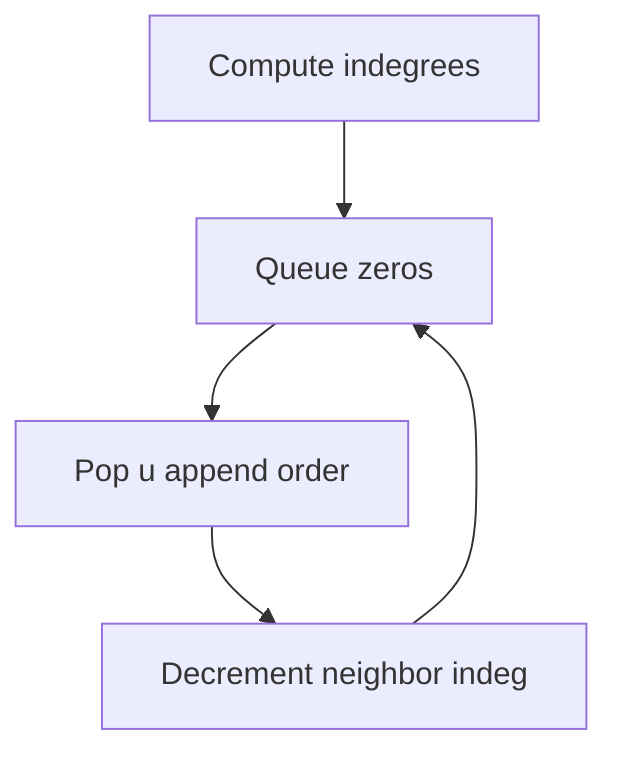
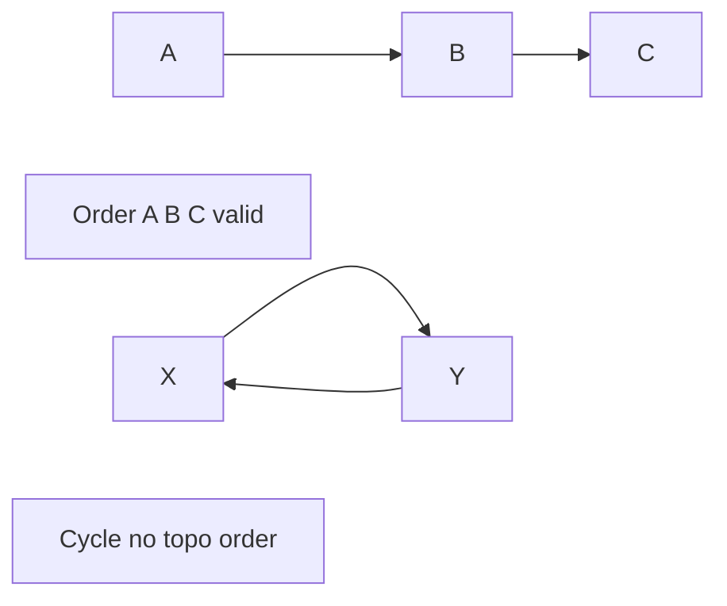
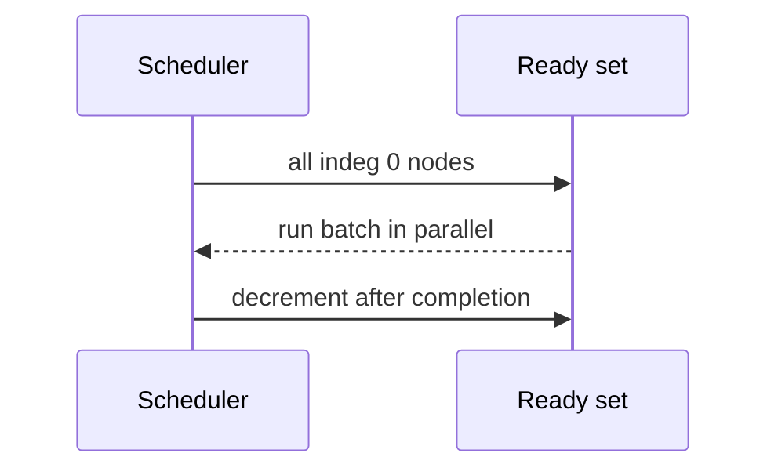

# Topological Sorting and Dependency Resolution

## Overview

A **topological order** of a **DAG** is a linear ordering of vertices where every edge `u → v` has `u` before `v`. It models **dependency resolution**: tasks, modules, migrations, and data pipelines execute respecting precedence. If cycles exist, no topological order exists ([[05-Algorithms/07-Graph-Traversal-and-DAGs/Cycle Detection|Cycle Detection]]).

Two classic algorithms: **Kahn's algorithm** (BFS on indegree-zero peel) and **DFS finish-time reversal**. Graph adjacency is consumed via [[04-Data-Structures/08-Graphs-as-Representation/Adjacency Lists|Adjacency Lists]]; this note owns ordering semantics and production scheduling contracts.

## Learning Objectives

- Produce valid topological order via Kahn and DFS methods
- Detect non-DAG inputs and surface cycle witnesses
- Handle parallel batches (all indegree-zero ready set)
- Apply stable tie-breaking for reproducible builds
- Connect topo order to [[05-Algorithms/06-Dynamic-Programming/DAG Dynamic Programming and Space Optimization|DAG DP]] and critical path

## Prerequisites

- [[05-Algorithms/07-Graph-Traversal-and-DAGs/Cycle Detection|Cycle Detection]]
- [[05-Algorithms/07-Graph-Traversal-and-DAGs/DFS|DFS]]

## Difficulty

`intermediate`

## Estimated Time

- Reading: 2 hours
- Exercises: 3 hours
- Mini project: 5 hours

## History

Topological sort formalized in Knuth (1960s). Make (1976), npm, Bazel, and Airflow DAGs are industrial instantiations. Incorrect ordering caused real outages when migrations ran before schema dependencies.

## Problem It Solves

**Build orchestration**, **DB migration sequencing**, **feature flag dependency rollout**, **ETL stage planning**. Without topo sort, teams use ad hoc recursive installs that stack-overflow or partially apply on cycles.

## Internal Implementation

### Kahn's algorithm

1. Compute indegrees; enqueue all zero-indegree vertices.
2. Pop `u`, append to order, decrement indegree of successors; enqueue new zeros.
3. If `|order| < V`, graph has cycle.

### DFS method

DFS from each unvisited; append vertex on **finish** (postorder); reverse final list for topological order (only on DAG).



## Mermaid Diagrams

### Structure: valid vs invalid



### Sequence: parallel ready set



## Examples

### Minimal Example

```typescript
function topoKahn(n: number, adj: number[][]): number[] | null {
  const indeg = Array(n).fill(0);
  for (let u = 0; u < n; u++) {
    for (const v of adj[u]) indeg[v]++;
  }
  const q: number[] = [];
  for (let i = 0; i < n; i++) if (indeg[i] === 0) q.push(i);
  const order: number[] = [];
  for (let qi = 0; qi < q.length; qi++) {
    const u = q[qi];
    order.push(u);
    for (const v of adj[u]) {
      if (--indeg[v] === 0) q.push(v);
    }
  }
  return order.length === n ? order : null;
}

function topoDfs(n: number, adj: number[][]): number[] | null {
  const state = Array(n).fill(0);
  const order: number[] = [];
  let cycle = false;
  function dfs(u: number): void {
    state[u] = 1;
    for (const v of adj[u]) {
      if (state[v] === 1) cycle = true;
      else if (state[v] === 0) dfs(v);
    }
    state[u] = 2;
    order.push(u);
  }
  for (let i = 0; i < n; i++) {
    if (state[i] === 0) dfs(i);
  }
  if (cycle) return null;
  order.reverse();
  return order;
}
```

```python
from collections import deque


def topo_kahn(n: int, adj: list[list[int]]) -> list[int] | None:
    indeg = [0] * n
    for u in range(n):
        for v in adj[u]:
            indeg[v] += 1
    q = deque(i for i in range(n) if indeg[i] == 0)
    order: list[int] = []
    while q:
        u = q.popleft()
        order.append(u)
        for v in adj[u]:
            indeg[v] -= 1
            if indeg[v] == 0:
                q.append(v)
    return order if len(order) == n else None


def topo_dfs(n: int, adj: list[list[int]]) -> list[int] | None:
    WHITE, GRAY, BLACK = 0, 1, 2
    state = [WHITE] * n
    order: list[int] = []
    cycle = False

    def dfs(u: int) -> None:
        nonlocal cycle
        state[u] = GRAY
        for v in adj[u]:
            if state[v] == GRAY:
                cycle = True
            elif state[v] == WHITE:
                dfs(v)
        state[u] = BLACK
        order.append(u)

    for i in range(n):
        if state[i] == WHITE:
            dfs(i)
    if cycle:
        return None
    order.reverse()
    return order
```

### Production-Shaped Example

**Migration runner**: each migration is vertex; `depends_on` edges. Kahn yields serial order; ready set size > 1 allows parallel apply on sharded replicas only when migrations commute—document **non-commuting** pairs separately (not pure topo). Stable sort ready set by migration id for reproducibility.

## Correctness

**Kahn**: each edge `u→v` processed when `u` removed before `v` enters queue—`u` appears earlier in order. If cycle, nodes in cycle never reach indegree zero.

**DFS reverse finish**: every edge goes from earlier finish to later finish in DFS tree on DAG; reversing finishes yields valid order.

## Complexity

Time `O(V+E)`, space `O(V)` for indegree/queue/stack.

## Trade-offs

| Method | Parallel ready set | Cycle witness | Code style |
| --- | --- | --- | --- |
| Kahn | Natural | Remaining nodes | Iterative |
| DFS | Harder | Back edge | Recursive |

### When to Use

- Any DAG dependency resolution
- Preprocessing for DAG DP / longest path
- CI pipeline stage generation

### When Not to Use

- Cyclic graphs without breaking SCCs first
- Total order required when only partial order needed—use poset tools

## Exercises

1. All topological orders via backtracking (small n).
2. Lexicographically smallest topo order (priority queue of ready).
3. Count number of valid topo orders mod prime.
4. Map Make file to graph; run Kahn.
5. Prove DFS reverse finish works iff DAG.

## Mini Project

Core engine for [[05-Algorithms/projects/Dependency Planner/README|Dependency Planner]] with parallel layer export.

## Portfolio Project

Visual timeline of topo layers with critical path overlay.

## Interview Questions

1. Two ways to topo sort?
2. How detect cycle during topo?
3. Is topo order unique?
4. Lexicographically smallest topo—how?
5. Relation to DFS finish times?

### Stretch / Staff-Level

1. Dynamic topo order under edge insertions—complexity?

## Common Mistakes

- Using topo on undirected graphs
- Forgetting to reverse DFS finish list
- Unstable ready ordering causing flaky CI

## Best Practices

- Stable tie-break keys (name, hash)
- Export **layers** for parallel execution audit
- Integrate cycle witness from [[05-Algorithms/07-Graph-Traversal-and-DAGs/Cycle Detection|Cycle Detection]]

## Summary

Topological sorting linearizes DAG dependencies—Kahn for iterative peel with parallel ready sets, DFS finish reversal for compact code. Production dependency systems must fail on cycles, stabilize tie-breaking, and treat ordering as a contract, not an implicit side effect of recursion.

## Further Reading

- [[05-Algorithms/06-Dynamic-Programming/DAG Dynamic Programming and Space Optimization|DAG Dynamic Programming and Space Optimization]]
- [[05-Algorithms/07-Graph-Traversal-and-DAGs/Strongly Connected Components|Strongly Connected Components]]

## Related Notes

- [[04-Data-Structures/08-Graphs-as-Representation/Implicit Graphs and On-the-Fly Neighbors|Implicit Graphs and On-the-Fly Neighbors]]
- [[05-Algorithms/07-Graph-Traversal-and-DAGs/BFS|BFS]]
- [[05-Algorithms/README|Algorithms]]

## Progress Checklist

- [ ] Explained from first principles
- [ ] Drew at least one Mermaid diagram
- [ ] Implemented a minimal version
- [ ] Documented trade-offs and non-goals
- [ ] Completed exercises
- [ ] Practiced interview questions aloud
- [ ] Linked prerequisites and dependents
