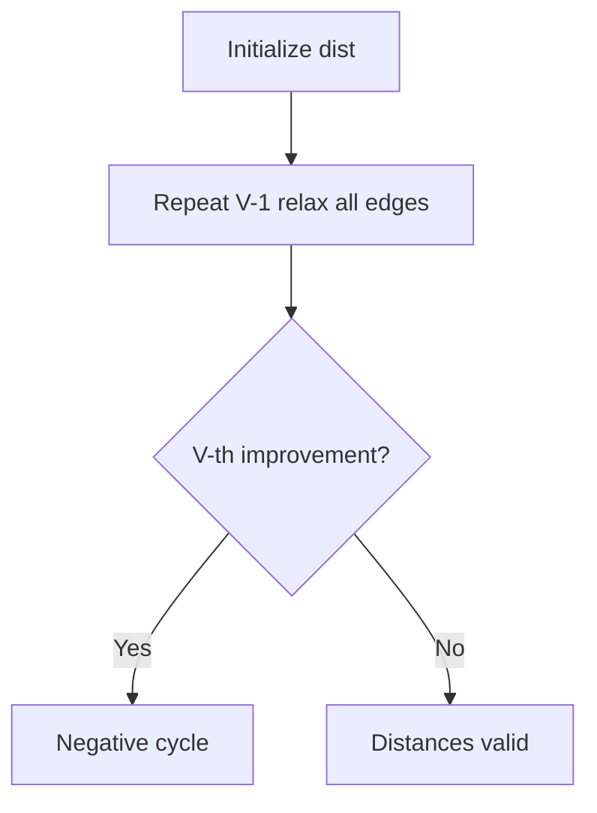
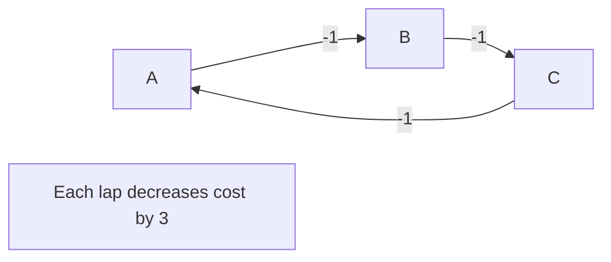
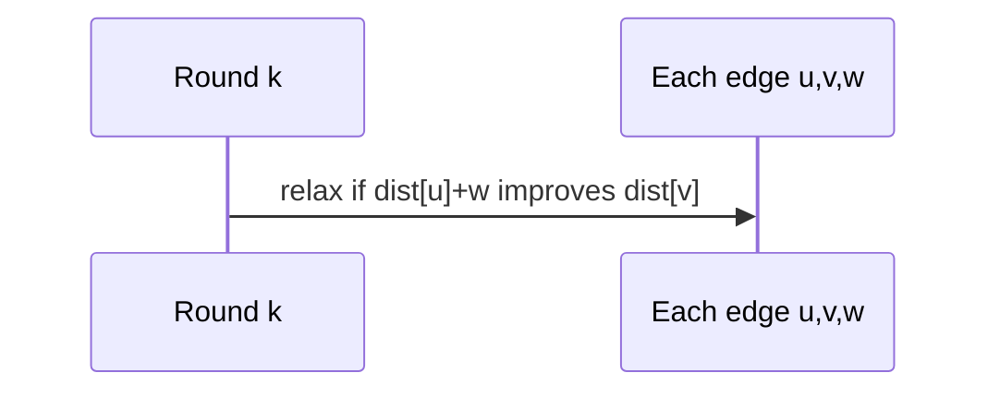

# Bellman-Ford and Negative Cycles

## Overview

**Bellman-Ford** computes single-source shortest paths in graphs with **general edge weights** (including negatives) by relaxing **all edges** repeatedly for `V-1` rounds. A **`V`-th round** that still improves some distance proves a **negative cycle reachable from the source**—shortest path cost is unbounded below (−∞).

Unlike [[05-Algorithms/08-Shortest-Paths/Dijkstra with Indexed Heaps|Dijkstra]], no greedy settlement; unlike [[05-Algorithms/08-Shortest-Paths/Floyd-Warshall and All-Pairs Trade-offs|Floyd-Warshall]], single-source focus. Graph edges from [[04-Data-Structures/08-Graphs-as-Representation/Adjacency Lists|Adjacency Lists]].

## Learning Objectives

- Implement Bellman-Ford with early termination on no-change rounds
- Detect and optionally locate negative cycles
- Explain `-∞` semantics for nodes downstream of negative cycles
- Choose Bellman-Ford vs Dijkstra under sparse vs dense constraints
- Apply to difference constraints and currency arbitrage detection

## Prerequisites

- [[05-Algorithms/08-Shortest-Paths/Shortest-Path Contracts and Relaxation|Shortest-Path Contracts and Relaxation]]
- [[05-Algorithms/07-Graph-Traversal-and-DAGs/Cycle Detection|Cycle Detection]]

## Difficulty

`intermediate`

## Estimated Time

- Reading: 2 hours
- Exercises: 3 hours
- Mini project: 4 hours

## History

Richard Bellman and Lester Ford (1958) developed the method. Finance uses it (modulo modeling) for arbitrage cycle detection; routing protocols use other tools but BF remains the teaching baseline for negative edges.

## Problem It Solves

**FX arbitrage** (log-rate edges), **constraint systems** `x_j - x_i ≤ w`, **graphs with promotions/credits** modeled as negative cost when Dijkstra invalid. Production must **fail closed** on negative cycles rather than return finite wrong distances.

## Internal Implementation

### Algorithm

1. `dist[s]=0`, others `∞`.
2. Repeat `V-1` times: relax every edge `(u,v,w)`.
3. Optional round `V`: any improvement ⇒ negative cycle reachable.



## Mermaid Diagrams

### Structure: negative cycle effect



### Sequence: relaxation round



## Examples

### Minimal Example

```typescript
function bellmanFord(
  n: number,
  edges: [number, number, number][],
  source: number,
): { dist: number[]; hasNegCycle: boolean } {
  const dist = Array(n).fill(Number.POSITIVE_INFINITY);
  dist[source] = 0;
  for (let i = 0; i < n - 1; i++) {
    let changed = false;
    for (const [u, v, w] of edges) {
      if (dist[u] === Number.POSITIVE_INFINITY) continue;
      const nd = dist[u] + w;
      if (nd < dist[v]) {
        dist[v] = nd;
        changed = true;
      }
    }
    if (!changed) break;
  }
  for (const [u, v, w] of edges) {
    if (dist[u] !== Number.POSITIVE_INFINITY && dist[u] + w < dist[v]) {
      return { dist, hasNegCycle: true };
    }
  }
  return { dist, hasNegCycle: false };
}
```

```python
def bellman_ford(
    n: int,
    edges: list[tuple[int, int, float]],
    source: int,
) -> tuple[list[float], bool]:
    dist = [float("inf")] * n
    dist[source] = 0.0
    for _ in range(n - 1):
        changed = False
        for u, v, w in edges:
            if dist[u] == float("inf"):
                continue
            nd = dist[u] + w
            if nd < dist[v]:
                dist[v] = nd
                changed = True
        if not changed:
            break
    for u, v, w in edges:
        if dist[u] != float("inf") and dist[u] + w < dist[v]:
            return dist, True
    return dist, False
```

### Production-Shaped Example

**Promo stacking graph**: edges are discounts (negative weight) between cart states. Run Bellman-Ford on checkout graph; if negative cycle, block transaction and log cycle SKUs—prevents infinite discount loops.

## Correctness

**Lemma**: after `k` rounds, `dist[v]` ≤ length of any path using at most `k` edges.

With no negative cycles, shortest simple path has ≤ `V-1` edges ⇒ `V-1` rounds suffice.

**Negative cycle detection**: if round `V` improves, exists path with `V` edges improving—pigeonhole on path ⇒ negative cycle reachable.

## Complexity

Time `O(VE)` worst case; space `O(V)`.

SPFA (queue-based) average faster, worst case still exponential—document risk.

## Trade-offs

| Dimension | Bellman-Ford | Dijkstra |
| --- | --- | --- |
| Weights | Any | Non-negative |
| Time | `O(VE)` | `O(E log V)` |
| Cycle detect | Built-in | No |

### When to Use

- Negative edges possible
- Need arbitrage / difference constraints
- Small `V` (hundreds) sparse OK

### When Not to Use

- Non-negative large sparse → Dijkstra
- All-pairs tiny V → Floyd-Warshall

## Exercises

1. Construct graph where early termination saves rounds.
2. Find vertex on negative cycle after detection pass.
3. Model `x2 - x1 ≤ 3` as edge; solve system.
4. FX rates to log edges—arbitrage condition?
5. Why SPFA is not worst-case safe for adversarial graphs?

## Mini Project

Arbitrage detector CLI on CSV rate pairs.

## Portfolio Project

Add negative-cycle guard to [[05-Algorithms/projects/Pathfinding Lab/README|Pathfinding Lab]].

## Interview Questions

1. Bellman-Ford steps and complexity?
2. How detect negative cycle?
3. Why V-1 rounds?
4. Difference constraints reduction?
5. When prefer BF over Dijkstra?

### Stretch / Staff-Level

1. Minimum mean cycle problem—relation to BF?

## Common Mistakes

- Returning finite dist after negative cycle
- Forgetting unreachable nodes stay INF
- Using BF on huge dense graphs without timeout

## Best Practices

- Return `{dist, hasNegCycle, witnessEdge?}`
- Propagate `-∞` to descendants of cycle (extra pass)
- Cap rounds in production with SLA

## Summary

Bellman-Ford is the general SSSP algorithm: `V-1` global relaxation rounds plus an optional detection round for negative cycles. It trades performance for a wider contract—essential when negative weights model credits, constraints, or arbitrage.

## Further Reading

- [[05-Algorithms/08-Shortest-Paths/Shortest-Path Contracts and Relaxation|Shortest-Path Contracts and Relaxation]]
- [[05-Algorithms/08-Shortest-Paths/Floyd-Warshall and All-Pairs Trade-offs|Floyd-Warshall and All-Pairs Trade-offs]]

## Related Notes

- [[05-Algorithms/07-Graph-Traversal-and-DAGs/Cycle Detection|Cycle Detection]]
- [[04-Data-Structures/08-Graphs-as-Representation/Graph ADT Vertices Edges and Labels|Graph ADT Vertices Edges and Labels]]
- [[05-Algorithms/README|Algorithms]]

## Progress Checklist

- [ ] Explained from first principles
- [ ] Drew at least one Mermaid diagram
- [ ] Implemented a minimal version
- [ ] Documented trade-offs and non-goals
- [ ] Completed exercises
- [ ] Practiced interview questions aloud
- [ ] Linked prerequisites and dependents
