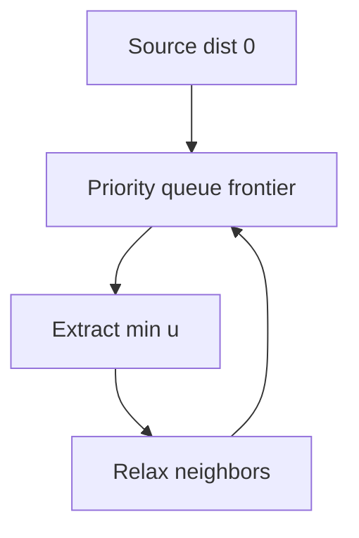
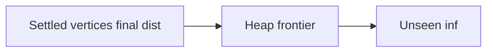
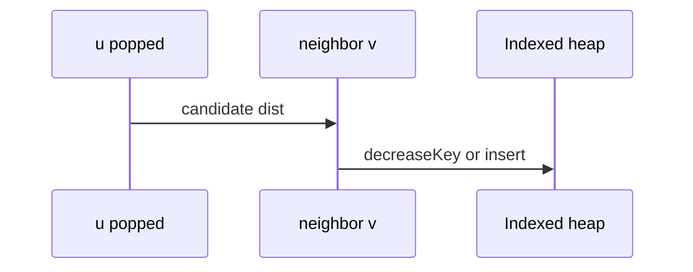

# Dijkstra with Indexed Heaps

## Overview

**Dijkstra's algorithm** solves **single-source shortest paths** on graphs with **non-negative edge weights** by repeatedly extracting the unsettled vertex with minimum tentative distance and relaxing its outgoing edges. A [[04-Data-Structures/06-Heaps-and-Priority-Queues/Priority Queue ADT|priority queue]] implements the frontier; an **indexed heap** ([[04-Data-Structures/06-Heaps-and-Priority-Queues/Decrease-Key and Indexed Heaps|Decrease-Key and Indexed Heaps]]) supports `decreaseKey` in `O(log V)` when a shorter path to a queued vertex is found.

This note covers algorithm mechanics and correctness—not heap array layout (Data Structures track).

## Learning Objectives

- Implement Dijkstra with binary heap and with indexed decrease-key
- Prove non-negative weight prerequisite via counterexample
- Compare lazy deletion vs indexed heap trade-offs
- Reconstruct shortest-path tree via `parent[]`
- Profile constants vs [[05-Algorithms/08-Shortest-Paths/Bellman-Ford and Negative Cycles|Bellman-Ford]] on sparse graphs

## Prerequisites

- [[05-Algorithms/08-Shortest-Paths/Shortest-Path Contracts and Relaxation|Shortest-Path Contracts and Relaxation]]
- [[04-Data-Structures/06-Heaps-and-Priority-Queues/Priority Queue ADT|Priority Queue ADT]]
- [[04-Data-Structures/06-Heaps-and-Priority-Queues/Decrease-Key and Indexed Heaps|Decrease-Key and Indexed Heaps]]

## Difficulty

`intermediate`

## Estimated Time

- Reading: 2 hours
- Exercises: 4 hours
- Mini project: 5 hours

## History

Edsger Dijkstra published the algorithm in 1956. Indexed heaps sharpen practical performance for dense decrease-key workloads (network routing, game maps).

## Problem It Solves

**GPS routing** (non-negative times), **network latency paths**, **state machine least-cost transitions**. Wrong use on negative latency adjustments causes incorrect routing—use Bellman-Ford instead.

## Internal Implementation

### Algorithm

1. `dist[s]=0`, others `∞`; push all or lazy push on discovery.
2. Pop min `u`; if stale skip (lazy).
3. For edge `(u,v,w)`: if `dist[u]+w < dist[v]`, update and decrease-key / push.



## Mermaid Diagrams

### Structure: settled vs frontier



### Sequence: decrease-key



## Examples

### Minimal Example — binary heap + lazy deletion

```typescript
function dijkstra(
  n: number,
  adj: { v: number; w: number }[][],
  source: number,
): number[] {
  const dist = Array(n).fill(Number.POSITIVE_INFINITY);
  dist[source] = 0;
  const heap: [number, number][] = [[0, source]];
  while (heap.length) {
    heap.sort((a, b) => a[0] - b[0]);
    const [du, u] = heap.shift()!;
    if (du !== dist[u]) continue;
    for (const { v, w } of adj[u]) {
      const nd = du + w;
      if (nd < dist[v]) {
        dist[v] = nd;
        heap.push([nd, v]);
      }
    }
  }
  return dist;
}
```

```python
import heapq


def dijkstra(n: int, adj: list[list[tuple[int, float]]], source: int) -> list[float]:
    dist = [float("inf")] * n
    dist[source] = 0.0
    heap: list[tuple[float, int]] = [(0.0, source)]
    while heap:
        du, u = heapq.heappop(heap)
        if du != dist[u]:
            continue
        for v, w in adj[u]:
            nd = du + w
            if nd < dist[v]:
                dist[v] = nd
                heapq.heappush(heap, (nd, v))
    return dist
```

### Production-Shaped Example

**Game server zone routing**: 50k nodes, sparse adjacency lists ([[04-Data-Structures/08-Graphs-as-Representation/Adjacency Lists|Adjacency Lists]]). Use indexed heap from [[04-Data-Structures/06-Heaps-and-Priority-Queues/Decrease-Key and Indexed Heaps|Decrease-Key and Indexed Heaps]] when decrease-key rate high; profile lazy heap if graph mostly tree-like. Cap `dist` at `1e15` to avoid float noise.

## Correctness

**Invariant**: when `u` is extracted with minimum key among unsettled, `dist[u]` is optimal (non-negative weights ensure no future path can improve `u` via negative edge chains).

**Proof sketch**: suppose shorter path exists; must leave settled set via edge into `u` with contradiction on minimality at extraction.

**Requires** `w ≥ 0`. Single negative edge can break greedy settlement.

## Complexity

| Implementation | Time | Notes |
| --- | --- | --- |
| Binary heap lazy | `O(E log V)` | Stale entries |
| Indexed heap | `O(E log V)` | True decrease-key |
| Array scan | `O(V²)` | Dense small V |

Space `O(V + E)` graph + `O(V)` heap.

## Trade-offs

| Dimension | Lazy heap | Indexed heap |
| --- | --- | --- |
| Code complexity | Lower | Higher |
| Constants | Extra pushes | Fewer nodes |
| Dependencies | stdlib heap | custom index map |

### When to Use

- Non-negative weights, sparse graphs, single-source
- Need path tree for tracing

### When Not to Use

- Negative edges → [[05-Algorithms/08-Shortest-Paths/Bellman-Ford and Negative Cycles|Bellman-Ford]]
- Unweighted → [[05-Algorithms/07-Graph-Traversal-and-DAGs/BFS|BFS]]
- All-pairs small V → [[05-Algorithms/08-Shortest-Paths/Floyd-Warshall and All-Pairs Trade-offs|Floyd-Warshall]]

## Exercises

1. Counterexample: one negative edge breaks Dijkstra.
2. Reconstruct path with `parent[]`.
3. Implement indexed heap Dijkstra referencing DS module API.
4. Compare visits on grid vs random sparse graph.
5. Early exit when target `t` popped—still correct?

## Mini Project

Benchmark lazy vs indexed in [[05-Algorithms/projects/Pathfinding Lab/README|Pathfinding Lab]].

## Portfolio Project

Latency router using adjacency lists + Dijkstra with tracing headers.

## Interview Questions

1. Why non-negative weights?
2. Complexity with binary heap?
3. Lazy deletion stale entries—why safe?
4. Dijkstra vs BFS?
5. When is array Dijkstra `O(V²)` acceptable?

### Stretch / Staff-Level

1. Dial's algorithm for integer weights—bucket queue trade-offs.

## Common Mistakes

- Negative weights silently
- Forgetting stale check in lazy heap
- Using Dijkstra on implicit graphs without bounding open set (A* separate topic)

## Best Practices

- Assert non-negative weights in debug builds
- Return `{dist, parent}` struct
- Metric: heap size peak, relax count

## Summary

Dijkstra is the standard non-negative SSSP algorithm: greedy settlement order from a priority queue. Indexed heaps optimize decrease-key; lazy heaps simplify code—both achieve `O(E log V)` on sparse graphs when contracts are honored.

## Further Reading

- [[05-Algorithms/08-Shortest-Paths/Zero-One BFS and Specialized Weights|Zero-One BFS and Specialized Weights]]
- [[05-Algorithms/01-Complexity-and-Analysis/Practical Constants Locality and Benchmark Design|Practical Constants Locality and Benchmark Design]]

## Related Notes

- [[04-Data-Structures/08-Graphs-as-Representation/Adjacency Lists|Adjacency Lists]]
- [[05-Algorithms/08-Shortest-Paths/Shortest-Path Contracts and Relaxation|Shortest-Path Contracts and Relaxation]]
- [[05-Algorithms/README|Algorithms]]

## Progress Checklist

- [ ] Explained from first principles
- [ ] Drew at least one Mermaid diagram
- [ ] Implemented a minimal version
- [ ] Documented trade-offs and non-goals
- [ ] Completed exercises
- [ ] Practiced interview questions aloud
- [ ] Linked prerequisites and dependents
