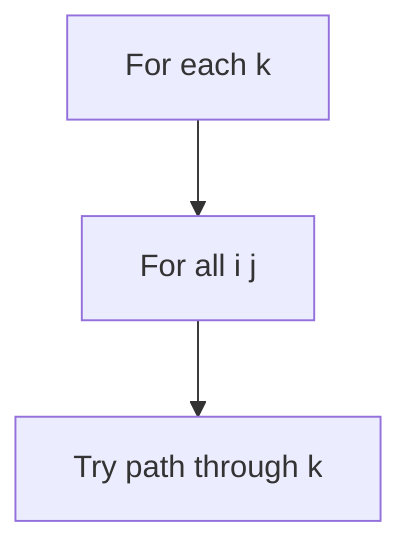
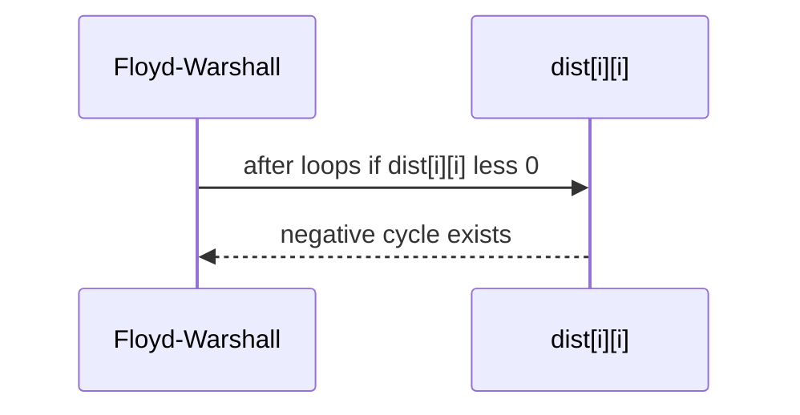

# Floyd-Warshall and All-Pairs Trade-offs

## Overview

**Floyd-Warshall** computes **all-pairs shortest paths (APSP)** in `O(V³)` dynamic programming: allow intermediate vertices `{0..k}` progressively. It handles negative edges (no negative cycles) and dense graphs simply—three nested loops, no priority queue.

Trade-offs vs running [[05-Algorithms/08-Shortest-Paths/Dijkstra with Indexed Heaps|Dijkstra]] from every source: Floyd wins on **dense small V**; multi-source Dijkstra wins on **large sparse** graphs. Representation may use adjacency matrix ([[04-Data-Structures/08-Graphs-as-Representation/Adjacency Matrices and Edge Lists|Adjacency Matrices and Edge Lists]]) for Floyd-friendly layout.

## Learning Objectives

- Implement Floyd-Warshall with path reconstruction via `next` matrix
- Detect negative cycles via diagonal `dist[i][i] < 0`
- Analyze when `O(V³)` beats `O(V E log V)` multi-Dijkstra
- Relate Floyd to DP on intermediate set (`k` dimension)
- Choose APSP method for production graph sizes

## Prerequisites

- [[05-Algorithms/08-Shortest-Paths/Shortest-Path Contracts and Relaxation|Shortest-Path Contracts and Relaxation]]
- [[05-Algorithms/01-Complexity-and-Analysis/Cost Models and Input Size|Cost Models and Input Size]]

## Difficulty

`intermediate`

## Estimated Time

- Reading: 2 hours
- Exercises: 3 hours
- Mini project: 4 hours

## History

Floyd (1962) and Warshall (1962) published the method. Transitive closure variant predates modern routing tables; today used in small graph analytics, game AI distance tables, and offline preprocessing.

## Problem It Solves

**Precompute distance matrix** for 500-node service mesh analytics, **transitive closure** of reachability costs, **min-plus matrix** closure in some OR pipelines. Running Dijkstra `V` times on dense 500² graph may be worse than cubic Floyd with low constants.

## Internal Implementation

### Recurrence

\[
dist[i][j] \leftarrow \min(dist[i][j],\ dist[i][k] + dist[k][j])
\]

Loop `k` outermost (allow intermediate `k`).



## Mermaid Diagrams

### Structure: k-layer DP


### Sequence: negative cycle check



## Examples

### Minimal Example

```typescript
function floydWarshall(dist: number[][]): {
  dist: number[][];
  hasNegCycle: boolean;
} {
  const n = dist.length;
  const d = dist.map((row) => row.slice());
  for (let k = 0; k < n; k++) {
    for (let i = 0; i < n; i++) {
      for (let j = 0; j < n; j++) {
        if (d[i][k] === Number.POSITIVE_INFINITY || d[k][j] === Number.POSITIVE_INFINITY) continue;
        const nd = d[i][k] + d[k][j];
        if (nd < d[i][j]) d[i][j] = nd;
      }
    }
  }
  const hasNegCycle = d.some((row, i) => row[i] < 0);
  return { dist: d, hasNegCycle };
}
```

```python
def floyd_warshall(dist: list[list[float]]) -> tuple[list[list[float]], bool]:
    n = len(dist)
    d = [row[:] for row in dist]
    for k in range(n):
        for i in range(n):
            if d[i][k] == float("inf"):
                continue
            for j in range(n):
                if d[k][j] == float("inf"):
                    continue
                nd = d[i][k] + d[k][j]
                if nd < d[i][j]:
                    d[i][j] = nd
    has_neg = any(d[i][i] < 0 for i in range(n))
    return d, has_neg
```

### Production-Shaped Example

**Offline traffic matrix** for 300 POPs: nightly Floyd-Warshall on latency matrix, store top-k paths table. Daytime queries O(1) lookup. If `V` grows past 2000, switch to sampled Dijkstra batches—`O(V³)` SLA breach.

## Correctness

**Optimal substructure on allowed intermediates**: after processing `k`, `dist[i][j]` is shortest path using vertices from `{0..k}` only. Induction on `k` establishes APSP if no negative cycles.

**Negative cycle**: negative `dist[i][i]` means beneficial loop using allowed intermediates.

## Complexity

Time `O(V³)`, space `O(V²)` for matrix.

Compare multi-source Dijkstra: `O(V E log V)`.

Break-even roughly when `E ≈ V² / log V` (rough heuristic—benchmark).

| V | E sparse | Prefer |
| --- | --- | --- |
| 200 | 2k | Multi-Dijkstra |
| 200 | 40k | Floyd |
| 5000 | sparse | Multi-Dijkstra + pruning |

## Trade-offs

| Dimension | Floyd-Warshall | V × Dijkstra |
| --- | --- | --- |
| Dense small V | Simple cubic | Heap overhead |
| Sparse large V | Wastes work | Near linear in E per source |
| Negative edges | Yes (no cycle) | Need Bellman-Ford per source |
| Memory | `V²` | `O(V)` per run |

### When to Use

- Small `V` (≤ few thousand) needing full matrix
- Transitive closure + distance together
- Simple implementation priority

### When Not to Use

- Million-node graphs
- Single-pair queries only → point Dijkstra

## Exercises

1. Reconstruct path using `next[i][j]` matrix.
2. Transitive closure boolean variant—modify recurrence.
3. Break-even V where Floyd beats Dijkstra on random `p=0.1` graph.
4. Detect negative cycle without diagonal—alternative?
5. Space-optimize row-by-row—possible?

## Mini Project

APSP benchmark suite in [[05-Algorithms/projects/Pathfinding Lab/README|Pathfinding Lab]].

## Portfolio Project

Nightly distance matrix job with algorithm auto-selection by density.

## Interview Questions

1. Floyd-Warshall recurrence and complexity?
2. Why k outermost loop?
3. Negative cycle detection?
4. Floyd vs V Dijkstra?
5. DP interpretation of Floyd?

### Stretch / Staff-Level

1. Johnson's APSP: potentials + Dijkstra—when wins?

## Common Mistakes

- Wrong loop order (i-k-j breaks)
- Not initializing missing edges to INF
- Using Floyd on large V in hot path

## Best Practices

- Store matrix row-major for cache
- Snapshot version for stale matrix reads
- Auto-pick algorithm from `V,E` thresholds

## Summary

Floyd-Warshall is cubic all-pairs DP—elegant for dense small graphs and negative edges without cycles. For large sparse production graphs, multiply Dijkstra instead; choose with explicit `V,E` models not dogma.

## Further Reading

- [[05-Algorithms/08-Shortest-Paths/Bellman-Ford and Negative Cycles|Bellman-Ford and Negative Cycles]]
- [[05-Algorithms/08-Shortest-Paths/Dijkstra with Indexed Heaps|Dijkstra with Indexed Heaps]]

## Related Notes

- [[04-Data-Structures/08-Graphs-as-Representation/Adjacency Matrices and Edge Lists|Adjacency Matrices and Edge Lists]]
- [[05-Algorithms/06-Dynamic-Programming/Optimal Substructure and Overlapping Subproblems|Optimal Substructure and Overlapping Subproblems]]
- [[05-Algorithms/README|Algorithms]]

## Progress Checklist

- [ ] Explained from first principles
- [ ] Drew at least one Mermaid diagram
- [ ] Implemented a minimal version
- [ ] Documented trade-offs and non-goals
- [ ] Completed exercises
- [ ] Practiced interview questions aloud
- [ ] Linked prerequisites and dependents
