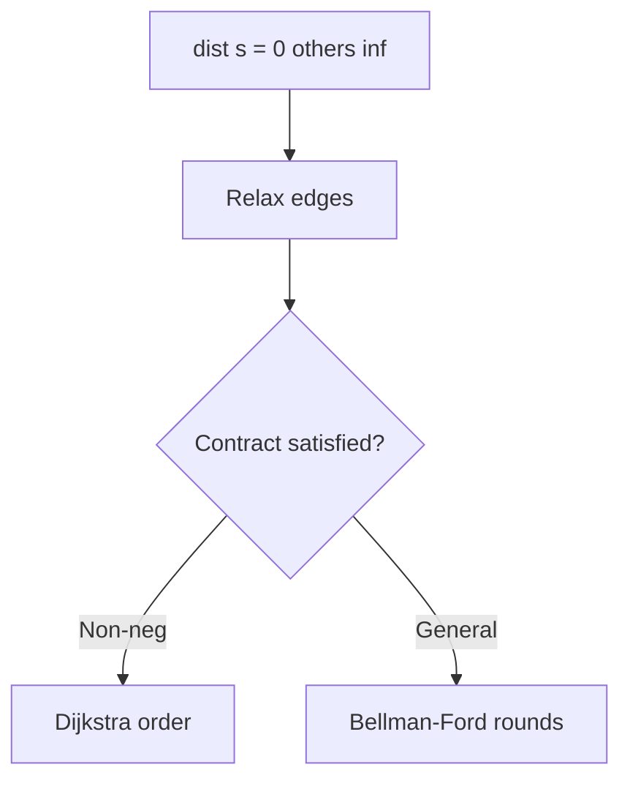
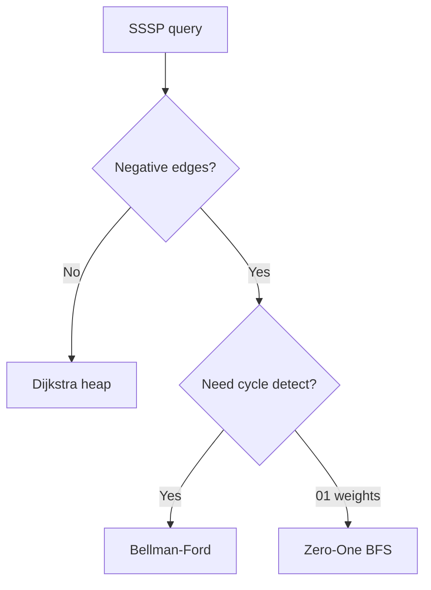
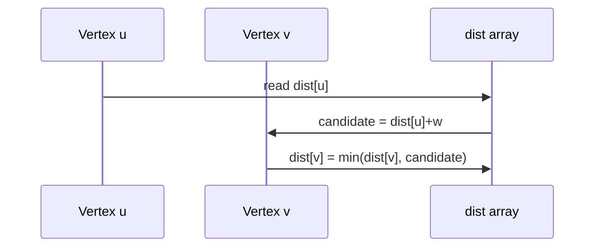

# Shortest-Path Contracts and Relaxation

## Overview

The **single-source shortest path (SSSP)** problem: given weighted graph `G`, source `s`, compute minimum-cost paths to all reachable vertices under non-negative or general weight rules. The unifying algorithmic primitive is **relaxation**:

\[
dist[v] \leftarrow \min(dist[v],\ dist[u] + w(u,v))
\]

Different algorithms differ in **edge visit order** and **weight assumptions**. Graph weights and adjacency come from [[04-Data-Structures/08-Graphs-as-Representation/Graph ADT Vertices Edges and Labels|Graph ADT]]; this note defines contracts, certificates, and relaxation invariants shared by [[05-Algorithms/08-Shortest-Paths/Dijkstra with Indexed Heaps|Dijkstra]], [[05-Algorithms/08-Shortest-Paths/Bellman-Ford and Negative Cycles|Bellman-Ford]], and specialized variants.

## Learning Objectives

- Specify SSSP preconditions (non-negative vs general weights)
- Prove relaxation invariants and distance label interpretations
- Distinguish shortest path distance vs hop count ([[05-Algorithms/07-Graph-Traversal-and-DAGs/BFS|BFS]])
- Detect contract violations (negative cycles, missing bounds)
- Choose algorithm family from weight structure

## Prerequisites

- [[05-Algorithms/07-Graph-Traversal-and-DAGs/BFS|BFS]]
- [[05-Algorithms/00-Foundations-and-Correctness/Problem Specifications Preconditions and Postconditions|Problem Specifications Preconditions and Postconditions]]

## Difficulty

`intermediate`

## Estimated Time

- Reading: 2 hours
- Exercises: 3 hours
- Mini project: 4 hours

## History

Shortest paths formalized in operations research and routing (1950s). Dijkstra (1956), Bellman-Ford (1958), Floyd-Warshall (1962) remain the core toolkit behind GPS, network routing (OSPF/IS-IS with modifications), and game AI path costs.

## Problem It Solves

**Latency routing**, **shipping cost minimization**, **min-cost workflow transitions**. Production failures: running Dijkstra on graphs with negative feedback edges; treating missing edges as zero cost; overflow on `dist` accumulation.

## Internal Implementation

### Problem contract

| Variant | Edge weights | Negative cycles | Output |
| --- | --- | --- | --- |
| Non-negative SSSP | `w ≥ 0` | N/A | Finite distances |
| General SSSP | Any | Must detect | `-∞` or error if reachable |
| All-pairs | Any (small V) | Detect | Distance matrix |

### Relaxation invariant (Dijkstra-style)

When extracting `u` with final `dist[u]`, for all processed `u`, `dist[u]` is optimal.

### Triangle inequality (optimal distances)

For true shortest path distances: `dist[u] + w(u,v) ≥ dist[v]` with equality on shortest-path edges.



## Mermaid Diagrams

### Structure: algorithm selection



### Sequence: one relaxation step



## Examples

### Minimal Example

```typescript
function relax(
  u: number,
  v: number,
  w: number,
  dist: number[],
): boolean {
  if (dist[u] === Number.POSITIVE_INFINITY) return false;
  const cand = dist[u] + w;
  if (cand < dist[v]) {
    dist[v] = cand;
    return true;
  }
  return false;
}

function ssspTemplate(
  n: number,
  edges: [number, number, number][],
  source: number,
): number[] {
  const dist = Array(n).fill(Number.POSITIVE_INFINITY);
  dist[source] = 0;
  // Placeholder: algorithm chooses edge order — see Dijkstra/Bellman-Ford
  for (const [u, v, w] of edges) relax(u, v, w, dist);
  return dist;
}
```

```python
def relax(u: int, v: int, w: float, dist: list[float]) -> bool:
    if dist[u] == float("inf"):
        return False
    cand = dist[u] + w
    if cand < dist[v]:
        dist[v] = cand
        return True
    return False


def sssp_template(
    n: int,
    edges: list[tuple[int, int, float]],
    source: int,
) -> list[float]:
    dist = [float("inf")] * n
    dist[source] = 0
    for u, v, w in edges:
        relax(u, v, w, dist)
    return dist
```

### Production-Shaped Example

**Service mesh edge weights** = p99 latency + penalty × error rate. Contract requires non-negative weights after clamping; document that negative penalties must not be raw—use offset. Monitor `dist` overflow and `Infinity` unreachable nodes separately in dashboards.

## Correctness

**Relaxation lemma**: if `dist[u]` is the length of some `s→u` path, after relaxing `(u,v)`, `dist[v]` is length of some `s→v` path (possibly non-shortest).

**Optimality** requires additional structure: acyclic order (DAG DP), non-negative + greedy extraction (Dijkstra), or `V-1` rounds (Bellman-Ford).

**Certificate**: shortest-path tree `parent[]` where each edge satisfies `dist[parent[v]] + w = dist[v]`.

## Complexity

Relaxation alone without order: up to `O(E)` per naive pass; Dijkstra `O(E log V)` with heap; Bellman-Ford `O(VE)`.

Space `O(V)` for `dist` + `parent`.

## Trade-offs

| Assumption | Algorithm | Risk if violated |
| --- | --- | --- |
| `w ≥ 0` | Dijkstra | Wrong distances |
| General | Bellman-Ford | Slower |
| Unweighted | BFS | Overkill |
| All-pairs dense | Floyd-Warshall | `O(V³)` |

### When to Use

- Any weighted reachability with explicit contract check
- Shared relaxation helper in pathfinding library

### When Not to Use

- Hop count only → BFS
- Negative cycle needs different semantics (min mean cycle—advanced)

## Exercises

1. Show one Dijkstra step where early greedy fails with negative edge.
2. Build parent tree from final dist (requires algorithm-specific finality).
3. Detect violated triangle inequality in buggy output.
4. Map unweighted graph to BFS as special case.
5. Write postconditions for SSSP API.

## Mini Project

Contract linter: given graph + algorithm name, verify weight preconditions.

## Portfolio Project

Integrate into [[05-Algorithms/projects/Pathfinding Lab/README|Pathfinding Lab]] shared relaxation module.

## Interview Questions

1. What is edge relaxation?
2. When is Dijkstra correct?
3. Difference shortest path vs minimum spanning tree?
4. How represent unreachable nodes?
5. What is a negative cycle?

### Stretch / Staff-Level

1. Generic SSSP framework with potential transformation (Johnson)—outline.

## Common Mistakes

- Initializing unreachable as 0
- Using `dist[u]+w` without overflow check
- Confusing shortest path tree with MST

## Best Practices

- Type `dist` as float with explicit INF sentinel
- Log algorithm name + contract in traces
- Unit-test negative edge rejection for Dijkstra

## Summary

Shortest-path algorithms are disciplined relaxation schedules under explicit weight contracts. Master the relaxation primitive, invariants, and selection table—then delegate implementation details to Dijkstra, Bellman-Ford, and specialized weight variants.

## Further Reading

- [[05-Algorithms/08-Shortest-Paths/Dijkstra with Indexed Heaps|Dijkstra with Indexed Heaps]]
- [[05-Algorithms/08-Shortest-Paths/Bellman-Ford and Negative Cycles|Bellman-Ford and Negative Cycles]]

## Related Notes

- [[04-Data-Structures/06-Heaps-and-Priority-Queues/Priority Queue ADT|Priority Queue ADT]]
- [[05-Algorithms/09-MST-and-Connectivity/Minimum Spanning Tree Contracts and Cut Property|Minimum Spanning Tree Contracts and Cut Property]]
- [[05-Algorithms/README|Algorithms]]

## Progress Checklist

- [ ] Explained from first principles
- [ ] Drew at least one Mermaid diagram
- [ ] Implemented a minimal version
- [ ] Documented trade-offs and non-goals
- [ ] Completed exercises
- [ ] Practiced interview questions aloud
- [ ] Linked prerequisites and dependents
