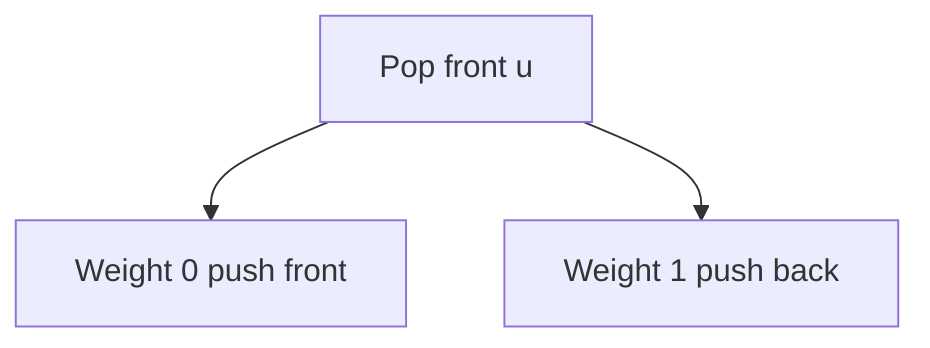
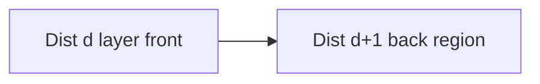
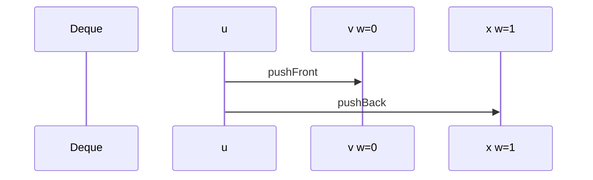

# Zero-One BFS and Specialized Weights

## Overview

When edge weights are only **0 or 1**, **0-1 BFS** computes SSSP in **`O(V+E)`** using a [[04-Data-Structures/03-Stacks-Queues-and-Deques/Deques|deque]]: push weight-0 neighbors to the **front**, weight-1 to the **back**. It generalizes [[05-Algorithms/07-Graph-Traversal-and-DAGs/BFS|BFS]] (all zero) and avoids [[05-Algorithms/08-Shortest-Paths/Dijkstra with Indexed Heaps|Dijkstra]] heap overhead.

Similar specialized structures exist for **small integer weights** (Dial's bucket queue). Graph adjacency from [[04-Data-Structures/08-Graphs-as-Representation/Adjacency Lists|Adjacency Lists]].

## Learning Objectives

- Implement 0-1 BFS with deque discipline
- Prove correctness via layered distance invariant
- Recognize 0-1 structure in grid problems (move vs penalty)
- Compare vs Dijkstra on binary-weight graphs
- Extend conceptually to bounded integer weights

## Prerequisites

- [[05-Algorithms/07-Graph-Traversal-and-DAGs/BFS|BFS]]
- [[05-Algorithms/08-Shortest-Paths/Dijkstra with Indexed Heaps|Dijkstra with Indexed Heaps]]
- [[04-Data-Structures/03-Stacks-Queues-and-Deques/Deques|Deques]]

## Difficulty

`intermediate`

## Estimated Time

- Reading: 1.5 hours
- Exercises: 3 hours
- Mini project: 4 hours

## History

0-1 BFS is folklore in competitive programming; structurally equivalent to treating weight-0 edges as DFS-like front push. Dial's algorithm (1969) generalizes to weights `0..C` with bucket queues.

## Problem It Solves

**Grid with toll tiles** (step cost 0 on normal, 1 on toll), **state toggles** with free vs paid transitions, **network hops** with zero-latency peering vs paid transit. Using Dijkstra works but adds log factor unnecessarily.

## Internal Implementation

### Algorithm

1. `dist[s]=0`, deque `[s]`.
2. Pop front `u`; skip if stale.
3. For `(u,v,w)`: if `dist[u]+w < dist[v]`, update; push front if `w=0` else back.



## Mermaid Diagrams

### Structure: deque layers



### Sequence: push discipline



## Examples

### Minimal Example

```typescript
function zeroOneBfs(
  n: number,
  adj: { v: number; w: 0 | 1 }[][],
  source: number,
): number[] {
  const dist = Array(n).fill(Number.POSITIVE_INFINITY);
  dist[source] = 0;
  const dq: number[] = [source];
  for (let qi = 0; qi < dq.length; qi++) {
    const u = dq[qi];
    for (const { v, w } of adj[u]) {
      const nd = dist[u] + w;
      if (nd < dist[v]) {
        dist[v] = nd;
        if (w === 0) dq.unshift(v);
        else dq.push(v);
      }
    }
  }
  return dist;
}
```

```python
from collections import deque


def zero_one_bfs(
    n: int,
    adj: list[list[tuple[int, int]]],
    source: int,
) -> list[int]:
    dist = [10**9] * n
    dist[source] = 0
    dq = deque([source])
    while dq:
        u = dq.popleft()
        for v, w in adj[u]:
            nd = dist[u] + w
            if nd < dist[v]:
                dist[v] = nd
                if w == 0:
                    dq.appendleft(v)
                else:
                    dq.append(v)
    return dist
```

### Production-Shaped Example

**CDN routing**: peering edges weight 0, paid transit weight 1 (hop penalty). 0-1 BFS on region graph for real-time path pick under 5ms SLA—avoid heap allocation in hot loop.

## Correctness

**Invariant**: deque holds vertices grouped by nondecreasing `dist`; front vertices have minimal current distance among deque (similar to Dijkstra with special queue).

Non-negative weights `{0,1}` ensure settled order when popping from front with stale check—or first assignment optimal for 0-1 BFS without stale if each vertex dequeued once when using proper SLF—production code uses stale guard like Dijkstra lazy.

Standard proof: distances computed are shortest because edges only increase by 0 or 1 and processing order respects nondecreasing dist layers.

## Complexity

Time `O(V+E)`, space `O(V)`.

## Trade-offs

| Weights | Algorithm | Time |
| --- | --- | --- |
| 0 only | BFS | `O(V+E)` |
| 0,1 | 0-1 BFS | `O(V+E)` |
| 0..C small | Dial buckets | `O(E + C V)` |
| General non-neg | Dijkstra | `O(E log V)` |

### When to Use

- Binary edge weights
- Grid with move vs wall break cost 1

### When Not to Use

- Weight 2 without transformation
- Negative weights

## Exercises

1. Grid shortest path with at most k toll tiles—reduce to BFS on expanded state?
2. Prove 0-1 BFS on all-1 edges equals BFS distances.
3. Implement stale-check variant; test duplicate deque entries.
4. When does weight-2 graph need Dijkstra?
5. Dial's algorithm for weights 0..3—sketch bucket array size.

## Mini Project

Grid pathfinder using 0-1 BFS in [[05-Algorithms/projects/Pathfinding Lab/README|Pathfinding Lab]].

## Portfolio Project

Compare 0-1 BFS vs Dijkstra timings on synthetic binary graphs.

## Interview Questions

1. 0-1 BFS deque rules?
2. Complexity vs Dijkstra?
3. Grid toll problem formulation?
4. Can weights be 0 and 1 only—what if 2?
5. Relation to BFS?

### Stretch / Staff-Level

1. Multi-level bucket queue for latency tiers 0,1,2,5,10 ms.

## Common Mistakes

- Pushing all neighbors to back (breaks 0-layer)
- Using on non-binary weights without discretization
- Missing visited/stale on graphs with zero-weight cycles (dist stays finite but deque churn)

## Best Practices

- Validate weights ∈ {0,1} in debug
- Prefer array+head index deque in TS hot paths
- Fall back to Dijkstra if weight set changes at runtime

## Summary

0-1 BFS is the optimal linear-time SSSP for binary non-negative weights—a deque encodes Dijkstra's frontier without a heap. Recognize binary structure in grids and routing to shave log factors and allocation overhead.

## Further Reading

- [[05-Algorithms/08-Shortest-Paths/Dijkstra with Indexed Heaps|Dijkstra with Indexed Heaps]]
- [[04-Data-Structures/03-Stacks-Queues-and-Deques/Deques|Deques]]

## Related Notes

- [[05-Algorithms/08-Shortest-Paths/Shortest-Path Contracts and Relaxation|Shortest-Path Contracts and Relaxation]]
- [[04-Data-Structures/08-Graphs-as-Representation/Implicit Graphs and On-the-Fly Neighbors|Implicit Graphs and On-the-Fly Neighbors]]
- [[05-Algorithms/README|Algorithms]]

## Progress Checklist

- [ ] Explained from first principles
- [ ] Drew at least one Mermaid diagram
- [ ] Implemented a minimal version
- [ ] Documented trade-offs and non-goals
- [ ] Completed exercises
- [ ] Practiced interview questions aloud
- [ ] Linked prerequisites and dependents
