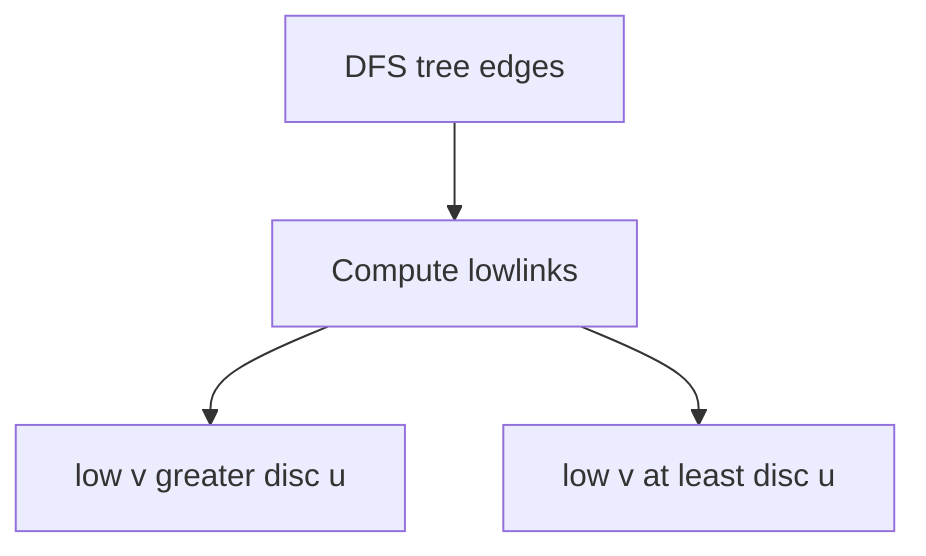
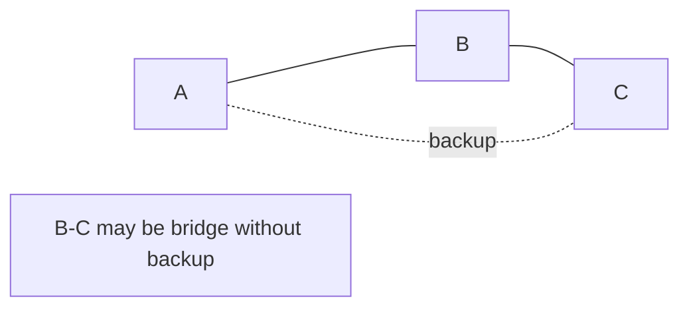
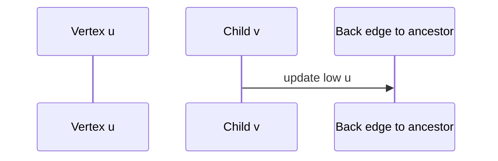

# Bridges Articulation Points and Connectivity Failure

## Overview

A **bridge** (cut edge) is an edge whose removal increases the number of connected components. An **articulation point** (cut vertex) is a vertex whose removal disconnects the graph. Identifying them answers **single point of failure** questions beyond MST skeletons ([[05-Algorithms/09-MST-and-Connectivity/Minimum Spanning Tree Contracts and Cut Property|Minimum Spanning Tree Contracts and Cut Property]]).

**Tarjan's DFS** algorithm computes bridges and articulation points in **`O(V+E)`** using discovery times `disc[u]` and **lowlinks** `low[u]`—similar spirit to [[05-Algorithms/07-Graph-Traversal-and-DAGs/Strongly Connected Components|Strongly Connected Components]]. Graph via [[04-Data-Structures/08-Graphs-as-Representation/Adjacency Lists|Adjacency Lists]].

## Learning Objectives

- Define bridges and articulation points precisely
- Implement Tarjan lowlink DFS for both
- Distinguish root special case in articulation detection
- Relate bridges to MST leaves and network redundancy planning
- Output failure certificates for SRE runbooks

## Prerequisites

- [[05-Algorithms/07-Graph-Traversal-and-DAGs/DFS|DFS]]
- [[05-Algorithms/09-MST-and-Connectivity/Minimum Spanning Tree Contracts and Cut Property|Minimum Spanning Tree Contracts and Cut Property]]

## Difficulty

`advanced`

## Estimated Time

- Reading: 2.5 hours
- Exercises: 4 hours
- Mini project: 5 hours

## History

Robert Tarjan (1974) unified linear connectivity algorithms. Network reliability engineering uses cut sets; bridges are the simplest cut edges.

## Problem It Solves

**Redundancy planning**: MST tells minimum cost connect; bridges tell **mandatory** edges in any spanning tree—if only one path exists, add backup link. **Articulation points** flag critical routers or services whose outage partitions the system.

## Internal Implementation

### Lowlink intuition

`low[u]` = earliest `disc` reachable from subtree of `u` using zero or more tree edges plus one back edge.

**Bridge** `(u,v)` tree edge: `low[v] > disc[u]` (no back edge bypass).

**Articulation** non-root `u`: exists child `v` with `low[v] >= disc[u]`. Root: articulation if ≥2 tree children.



## Mermaid Diagrams

### Structure: bridge vs redundant edge



### Sequence: DFS back edge lowers low



## Examples

### Minimal Example

```typescript
function bridgesAndArticulation(n: number, edges: [number, number][]): {
  bridges: [number, number][];
  articulation: number[];
} {
  const adj: number[][] = Array.from({ length: n }, () => []);
  for (const [u, v] of edges) {
    adj[u].push(v);
    adj[v].push(u);
  }
  const disc = Array(n).fill(-1);
  const low = Array(n).fill(0);
  const ap = new Set<number>();
  const bridges: [number, number][] = [];
  let timer = 0;

  function dfs(u: number, parent: number): void {
    disc[u] = low[u] = timer++;
    let childCount = 0;
    for (const v of adj[u]) {
      if (disc[v] === -1) {
        childCount++;
        dfs(v, u);
        low[u] = Math.min(low[u], low[v]);
        if (low[v] > disc[u]) bridges.push([u, v]);
        if (parent !== -1 && low[v] >= disc[u]) ap.add(u);
      } else if (v !== parent) {
        low[u] = Math.min(low[u], disc[v]);
      }
    }
    if (parent === -1 && childCount >= 2) ap.add(u);
  }

  for (let i = 0; i < n; i++) {
    if (disc[i] === -1) dfs(i, -1);
  }
  return { bridges, articulation: [...ap] };
}
```

```python
def bridges_and_articulation(
    n: int,
    edges: list[tuple[int, int]],
) -> tuple[list[tuple[int, int]], list[int]]:
    adj: list[list[int]] = [[] for _ in range(n)]
    for u, v in edges:
        adj[u].append(v)
        adj[v].append(u)
    disc = [-1] * n
    low = [0] * n
    ap: set[int] = set()
    bridges: list[tuple[int, int]] = []
    timer = 0

    def dfs(u: int, parent: int) -> None:
        nonlocal timer
        disc[u] = low[u] = timer
        timer += 1
        child_count = 0
        for v in adj[u]:
            if disc[v] == -1:
                child_count += 1
                dfs(v, u)
                low[u] = min(low[u], low[v])
                if low[v] > disc[u]:
                    bridges.append((u, v))
                if parent != -1 and low[v] >= disc[u]:
                    ap.add(u)
            elif v != parent:
                low[u] = min(low[u], disc[v])
        if parent == -1 and child_count >= 2:
            ap.add(u)

    for i in range(n):
        if disc[i] == -1:
            dfs(i, -1)
    return bridges, sorted(ap)
```

### Production-Shaped Example

**Service dependency graph** (undirected for mutual HA pairs): nightly job lists bridges—each bridge edge gets automatic ticket for redundant link. Articulation services trigger chaos-game eligibility. Cross-check with [[05-Algorithms/07-Graph-Traversal-and-DAGs/Connected Components and Bipartite Testing|Connected Components]] counts pre/post simulated failure.

## Correctness

**Bridge condition**: no back edge from subtree of `v` to `u` or above ⇔ `low[v] > disc[u]`.

**Articulation**: removing `u` separates `v`'s subtree if `v` cannot reach outside without `u` ⇔ `low[v] >= disc[u]`. Root with multiple DFS children is cut vertex separating subtrees.

DFS visits each edge once → linear time.

## Complexity

Time `O(V+E)`, space `O(V)` for DFS stacks/arrays.

## Trade-offs

| Analysis | Bridges | Articulation |
| --- | --- | --- |
| Edge failure | Critical link | N/A |
| Vertex failure | Endpoints may be AP | Critical node |
| vs MST | MST may use bridges | Redundancy separate objective |

### When to Use

- Resilience review after MST design
- Identify mandatory chokepoints
- Game level design (single rope edges)

### When Not to Use

- Directed connectivity → strong bridges advanced
- Weighted min-cut → flow algorithms ([[05-Algorithms/10-Advanced-Graph-Algorithms/Maximum Flow and Residual Networks|Maximum Flow]])

## Exercises

1. Graph with no bridges—every edge on a cycle.
2. Tree: every edge is bridge; internal nodes are articulation.
3. Single cycle—no articulation, all edges non-bridge?
4. Implement edge biconnected component decomposition outline.
5. Simulate removing each bridge—component count increases by 1?

## Mini Project

Failure simulator highlighting bridges/AP in [[05-Algorithms/projects/Network Connectivity and MST Lab/README|Network Connectivity and MST Lab]].

## Portfolio Project

SRE dashboard: top-k articulation services by downstream size.

## Interview Questions

1. Define bridge and articulation point.
2. Tarjan lowlink bridge condition?
3. Why root DFS special for articulation?
4. All bridges in MST?
5. Complexity?

### Stretch / Staff-Level

1. 2-edge-connected components—beyond bridges.

## Common Mistakes

- Directed graph without adapting definitions
- Forgetting root articulation rule
- Treating self-loops/multi-edges naively

## Best Practices

- Sort bridge output `(min(u,v), max(u,v))` for stable diffs
- Map vertex ids to human service names in reports
- Pair with redundancy budget optimizer (outside scope)

## Summary

Bridges and articulation points expose fragile edges and nodes in connectivity—linear-time Tarjan DFS complements MST cost minimization with failure-mode clarity. Production resilience uses both: MST to connect cheaply, cut analysis to know what breaks when parts fail.

## Further Reading

- [[05-Algorithms/07-Graph-Traversal-and-DAGs/Strongly Connected Components|Strongly Connected Components]]
- [[05-Algorithms/09-MST-and-Connectivity/Kruskal with Union-Find|Kruskal with Union-Find]]

## Related Notes

- [[04-Data-Structures/09-Disjoint-Set/Union-Find Structure|Union-Find Structure]]
- [[05-Algorithms/07-Graph-Traversal-and-DAGs/Connected Components and Bipartite Testing|Connected Components and Bipartite Testing]]
- [[05-Algorithms/README|Algorithms]]

## Progress Checklist

- [ ] Explained from first principles
- [ ] Drew at least one Mermaid diagram
- [ ] Implemented a minimal version
- [ ] Documented trade-offs and non-goals
- [ ] Completed exercises
- [ ] Practiced interview questions aloud
- [ ] Linked prerequisites and dependents
