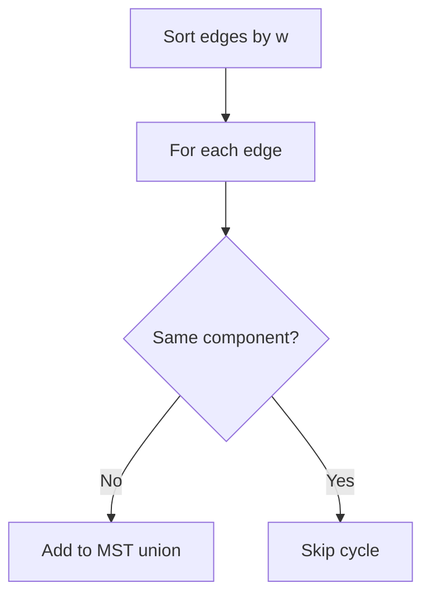
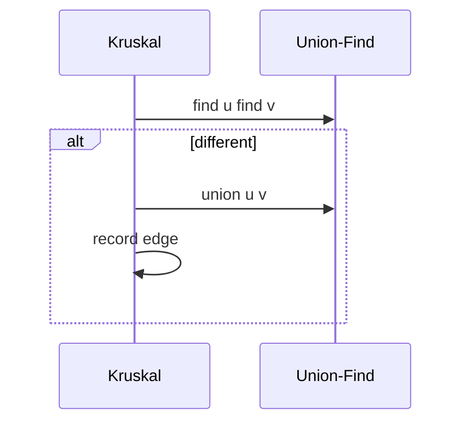

# Kruskal with Union-Find

## Overview

**Kruskal's algorithm** builds an MST by sorting edges by weight ascending and adding each edge that **connects two different components**—cycle avoidance via [[04-Data-Structures/09-Disjoint-Set/Union-Find Structure|Union-Find]] (`find`/`union`). Correctness follows the **cut property** ([[05-Algorithms/09-MST-and-Connectivity/Minimum Spanning Tree Contracts and Cut Property|Minimum Spanning Tree Contracts and Cut Property]]).

Union-find optimizations ([[04-Data-Structures/09-Disjoint-Set/Union by Rank and Path Compression|Union by Rank and Path Compression]]) yield near-linear `O(E α(V))` after sort. This note is the **algorithm**; DSU internals stay in Data Structures.

## Learning Objectives

- Implement Kruskal with union-find connectivity tests
- Analyze `O(E log E)` sort + almost-linear unions
- Handle disconnected graphs (forest per component)
- Compare Kruskal vs [[05-Algorithms/09-MST-and-Connectivity/Prim with Priority Queues|Prim]] on sparse vs dense graphs
- Return MST edge list and total weight certificate

## Prerequisites

- [[05-Algorithms/09-MST-and-Connectivity/Minimum Spanning Tree Contracts and Cut Property|Minimum Spanning Tree Contracts and Cut Property]]
- [[04-Data-Structures/09-Disjoint-Set/Union-Find Structure|Union-Find Structure]]
- [[04-Data-Structures/09-Disjoint-Set/Union by Rank and Path Compression|Union by Rank and Path Compression]]

## Difficulty

`intermediate`

## Estimated Time

- Reading: 1.5 hours
- Exercises: 3 hours
- Mini project: 4 hours

## History

Joseph Kruskal (1956). Union-find made Kruskal practical on sparse graphs—still default in many network design tools and competitive programming libraries.

## Problem It Solves

**Sparse graphs** with millions of edges but reasonable `V`: sort once, linear scan with DSU. Easier than Prim when graph stored as **edge list** ([[04-Data-Structures/08-Graphs-as-Representation/Adjacency Matrices and Edge Lists|Adjacency Matrices and Edge Lists]]).

## Internal Implementation

### Algorithm

1. Sort edges by weight.
2. Initialize union-find on `V` vertices.
3. For each edge `(u,v,w)`: if `find(u) ≠ find(v)`, add edge, `union(u,v)`.
4. Stop when `V-1` edges chosen (per component).



## Mermaid Diagrams

### Structure: components merge


### Sequence: union-find check



## Examples

### Minimal Example

```typescript
class DSU {
  parent: number[];
  rank: number[];
  constructor(n: number) {
    this.parent = Array.from({ length: n }, (_, i) => i);
    this.rank = Array(n).fill(0);
  }
  find(x: number): number {
    if (this.parent[x] !== x) this.parent[x] = this.find(this.parent[x]);
    return this.parent[x];
  }
  union(a: number, b: number): boolean {
    let ra = this.find(a),
      rb = this.find(b);
    if (ra === rb) return false;
    if (this.rank[ra] < this.rank[rb]) [ra, rb] = [rb, ra];
    this.parent[rb] = ra;
    if (this.rank[ra] === this.rank[rb]) this.rank[ra]++;
    return true;
  }
}

function kruskal(n: number, edges: [number, number, number][]): {
  weight: number;
  mst: [number, number, number][];
} {
  const sorted = [...edges].sort((a, b) => a[2] - b[2]);
  const dsu = new DSU(n);
  const mst: [number, number, number][] = [];
  let weight = 0;
  for (const e of sorted) {
    if (dsu.union(e[0], e[1])) {
      mst.push(e);
      weight += e[2];
      if (mst.length === n - 1) break;
    }
  }
  return { weight, mst };
}
```

```python
class DSU:
    def __init__(self, n: int) -> None:
        self.parent = list(range(n))
        self.rank = [0] * n

    def find(self, x: int) -> int:
        while self.parent[x] != x:
            self.parent[x] = self.parent[self.parent[x]]
            x = self.parent[x]
        return x

    def union(self, a: int, b: int) -> bool:
        ra, rb = self.find(a), self.find(b)
        if ra == rb:
            return False
        if self.rank[ra] < self.rank[rb]:
            ra, rb = rb, ra
        self.parent[rb] = ra
        if self.rank[ra] == self.rank[rb]:
            self.rank[ra] += 1
        return True


def kruskal(n: int, edges: list[tuple[int, int, float]]) -> tuple[float, list[tuple[int, int, float]]]:
    sorted_edges = sorted(edges, key=lambda e: e[2])
    dsu = DSU(n)
    mst: list[tuple[int, int, float]] = []
    weight = 0.0
    for u, v, w in sorted_edges:
        if dsu.union(u, v):
            mst.append((u, v, w))
            weight += w
            if len(mst) == n - 1:
                break
    return weight, mst
```

### Production-Shaped Example

**Cross-region link planner**: 10k sites, 50k candidate fiber edges as CSV edge list. Kruskal + path compression completes in seconds; emit MST for capex approval. Run per connected component separately if graph fragmented.

## Correctness

Each accepted edge is lightest crossing some cut between current components—cut property. Rejected edges would close cycle with heavier or equal choice already in forest—cycle property.

Process stops with `V-1` edges iff graph connected.

## Complexity

Sort: `O(E log E)` (or `O(E log V)` if sort by weight with index).

Union-find: `O(E α(V))`.

Space: `O(V + E)`.

## Trade-offs

| Dimension | Kruskal | Prim |
| --- | --- | --- |
| Graph form | Edge list natural | Adjacency + heap |
| Sparse E | Excellent | Good with heap |
| Dense | Sort dominates | Fibonacci heap theory |

### When to Use

- Sparse graphs, edge list input
- Need MST edges sorted by addition order

### When Not to Use

- Online dynamic MST (advanced)
- Directed arborescence

## Exercises

1. MST for disconnected graph—output forest.
2. Count edges rejected by DSU.
3. Tie weights—multiple MSTs; enumerate?
4. Borůvka vs Kruskal high level.
5. Verify MST weight with cut property spot checks.

## Mini Project

Kruskal visualizer merging components in [[05-Algorithms/projects/Network Connectivity and MST Lab/README|Network Connectivity and MST Lab]].

## Portfolio Project

Edge CSV ingest → MST report PDF for infra team.

## Interview Questions

1. Kruskal steps and complexity?
2. Role of union-find?
3. Kruskal vs Prim?
4. Why sort edges?
5. What if graph disconnected?

### Stretch / Staff-Level

1. Parallel Kruskal (Borůvka phases)—sketch.

## Common Mistakes

- Forgetting to sort
- Using union without find check
- Assuming MST exists for disconnected without looping components

## Best Practices

- Reuse tested DSU from [[04-Data-Structures/09-Disjoint-Set/Union-Find Structure|Union-Find Structure]] labs
- Stable tie-break `(w,u,v)` lex order
- Validate `mst.length === n-1` per component

## Summary

Kruskal's MST algorithm is edge-sort greedy plus union-find cycle prevention—ideal for sparse edge-list graphs with near-linear connectivity operations after the sort.

## Further Reading

- [[05-Algorithms/09-MST-and-Connectivity/Prim with Priority Queues|Prim with Priority Queues]]
- [[04-Data-Structures/09-Disjoint-Set/Disjoint-Set Applications as Glue|Disjoint-Set Applications as Glue]]

## Related Notes

- [[04-Data-Structures/08-Graphs-as-Representation/Adjacency Matrices and Edge Lists|Adjacency Matrices and Edge Lists]]
- [[05-Algorithms/07-Graph-Traversal-and-DAGs/Connected Components and Bipartite Testing|Connected Components and Bipartite Testing]]
- [[05-Algorithms/README|Algorithms]]

## Progress Checklist

- [ ] Explained from first principles
- [ ] Drew at least one Mermaid diagram
- [ ] Implemented a minimal version
- [ ] Documented trade-offs and non-goals
- [ ] Completed exercises
- [ ] Practiced interview questions aloud
- [ ] Linked prerequisites and dependents
