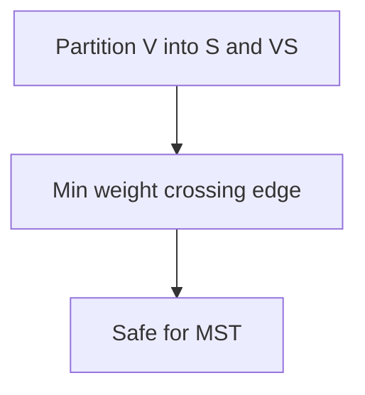
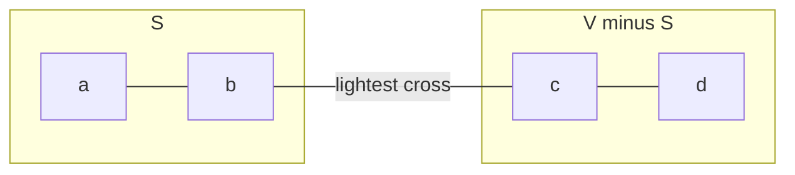
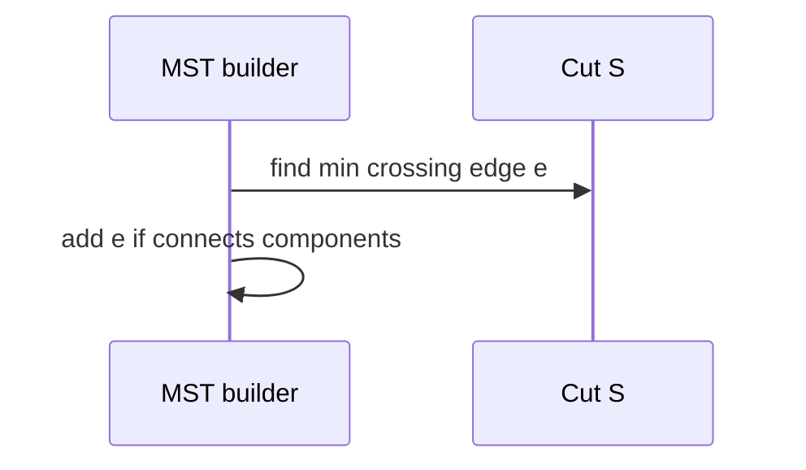

# Minimum Spanning Tree Contracts and Cut Property

## Overview

A **spanning tree** of connected undirected graph `G` connects all vertices with `V-1` edges and no cycles. A **minimum spanning tree (MST)** minimizes total edge weight sum. MST problems underpin network backbone design, cluster wiring, and redundancy-minimal connectivity.

Correctness rests on **cut property** and **cycle property**—greedy edge choices that respect these are valid ([[05-Algorithms/05-Greedy-Algorithms/Greedy Choice and Exchange Arguments|Greedy Choice and Exchange Arguments]]). Algorithms: [[05-Algorithms/09-MST-and-Connectivity/Kruskal with Union-Find|Kruskal]] and [[05-Algorithms/09-MST-and-Connectivity/Prim with Priority Queues|Prim]]. Graph storage: [[04-Data-Structures/08-Graphs-as-Representation/Graph ADT Vertices Edges and Labels|Graph ADT]].

**MST ≠ shortest-path tree** ([[05-Algorithms/08-Shortest-Paths/Shortest-Path Contracts and Relaxation|Shortest-Path Contracts and Relaxation]]).

## Learning Objectives

- Define MST problem contract (connected, undirected, unique weights tie-break)
- Prove cut property and apply exchange arguments
- Distinguish MST from min-hop spanning tree
- Identify when greedy on sorted edges succeeds
- Map MST to facility location and network design constraints

## Prerequisites

- [[05-Algorithms/07-Graph-Traversal-and-DAGs/Connected Components and Bipartite Testing|Connected Components and Bipartite Testing]]
- [[05-Algorithms/05-Greedy-Algorithms/Greedy Choice and Exchange Arguments|Greedy Choice and Exchange Arguments]]

## Difficulty

`intermediate`

## Estimated Time

- Reading: 2 hours
- Exercises: 3 hours
- Mini project: 4 hours

## History

Borůvka (1926), Kruskal (1956), Prim (1957) solved MST. Modern LAN design and cloud VPC minimal connectivity still echo MST heuristics (often with degree constraints beyond pure MST).

## Problem It Solves

**Connect all sites** with minimal total cable cost; **skeleton network** before adding redundant paths ([[05-Algorithms/09-MST-and-Connectivity/Bridges Articulation Points and Connectivity Failure|Bridges Articulation Points and Connectivity Failure]]). Wrong objective (min diameter vs min weight) yields different trees.

## Internal Implementation

### Cut property

For any cut `(S, V\S)`, the **lightest edge crossing the cut** belongs to some MST (if unique weights, belongs to **the** MST).

### Cycle property

For any cycle, the **heaviest edge** on the cycle is **not** in any MST (unless tied).



## Mermaid Diagrams

### Structure: cut crossing edges



### Sequence: greedy safe edge add



## Examples

### Minimal Example — cut property intuition

```typescript
// Contract check: graph must be connected undirected weighted
type Edge = { u: number; v: number; w: number };

function mstWeightHint(edges: Edge[], n: number): number {
  // Full algorithms in Kruskal/Prim notes — sort for greedy intuition
  const sorted = [...edges].sort((a, b) => a.w - b.w);
  // Kruskal completes with union-find — see dedicated note
  return sorted.slice(0, n - 1).reduce((s, e) => s + e.w, 0); // NOT correct alone
}
```

```python
# Illustrative: MST requires Kruskal/Prim — this validates contract only
def assert_mst_preconditions(n: int, edges: list[tuple[int, int, float]]) -> None:
    parent = list(range(n))

    def find(x: int) -> int:
        while parent[x] != x:
            parent[x] = parent[parent[x]]
            x = parent[x]
        return x

    comps = n
    for u, v, _ in edges:
        pu, pv = find(u), find(v)
        if pu != pv:
            parent[pu] = pv
            comps -= 1
    if comps != 1:
        raise ValueError("graph not connected")
```

### Production-Shaped Example

**VPC peering skeleton**: edge weight = monthly cost; MST gives cheapest connected overlay before adding redundancy edges for SLA. Document that latency constraints may violate pure MST—use constrained Steiner variants (outside scope).

## Correctness

**Cut property proof (exchange)**: suppose lightest crossing edge `e` not in MST `T`. Adding `e` to `T` creates cycle with another crossing edge `f`; swap `f` out for `e` does not increase weight—contradiction unless ties.

**Cycle property**: heaviest cycle edge cannot be in MST—else removing it leaves spanning structure no heavier.

Kruskal/Prim are cut-property greedy realizations.

## Complexity

MST algorithms: `O(E log E)` or `O(E log V)` with proper heaps—not this note's focus.

Decision problem on general graphs with MST definition is polynomial; this note establishes **greedy certificate**.

## Trade-offs

| Objective | MST | Shortest-path tree |
| --- | --- | --- |
| Minimize | Total edge weight | Root distances |
| Use case | Backbone cost | Routing from hub |

### When to Use

- Need minimum total connection cost spanning all nodes
- Preprocessing before analyzing bridges

### When Not to Use

- Need bounded diameter or degree
- Directed graphs ( arborescence—different problem)

## Exercises

1. Prove cut property from exchange argument.
2. Graph where MST differs from BFS tree from same root.
3. Unique weight assumption—why tie-breaking matters?
4. Identify heaviest edge not in MST on a cycle.
5. Connected graph with equal weights—how many MSTs?

## Mini Project

Visualize cut and cycle property counterexamples interactively.

## Portfolio Project

[[05-Algorithms/projects/Network Connectivity and MST Lab/README|Network Connectivity and MST Lab]] contract module.

## Interview Questions

1. Define MST; cut property?
2. MST vs shortest path tree?
3. Why greedy on sorted edges works (Kruskal intuition)?
4. Cycle property statement?
5. Must graph be connected?

### Stretch / Staff-Level

1. Minimum bottleneck spanning tree vs MST—different objective?

## Common Mistakes

- Running MST on disconnected graph without components loop
- Confusing MST weight with min-max edge (bottleneck tree)
- Using directed edges without conversion

## Best Practices

- Validate connectivity per component
- Stable sort edges `(w, u, v)`
- Return both weight and edge list certificate

## Summary

The MST contract is minimum total weight spanning connectivity, certified by cut and cycle properties. These greedy-safe rules underpin Kruskal and Prim—separate algorithms from the distinct shortest-path problem.

## Further Reading

- [[05-Algorithms/09-MST-and-Connectivity/Kruskal with Union-Find|Kruskal with Union-Find]]
- [[05-Algorithms/09-MST-and-Connectivity/Prim with Priority Queues|Prim with Priority Queues]]

## Related Notes

- [[04-Data-Structures/09-Disjoint-Set/Union-Find Structure|Union-Find Structure]]
- [[05-Algorithms/08-Shortest-Paths/Shortest-Path Contracts and Relaxation|Shortest-Path Contracts and Relaxation]]
- [[05-Algorithms/README|Algorithms]]

## Progress Checklist

- [ ] Explained from first principles
- [ ] Drew at least one Mermaid diagram
- [ ] Implemented a minimal version
- [ ] Documented trade-offs and non-goals
- [ ] Completed exercises
- [ ] Practiced interview questions aloud
- [ ] Linked prerequisites and dependents
