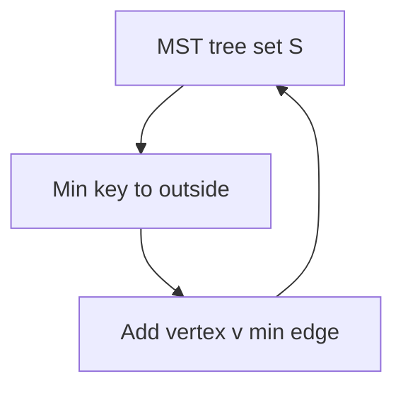
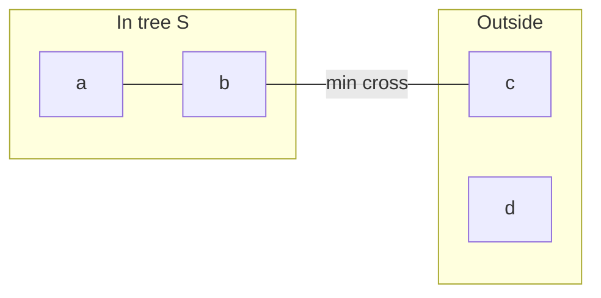
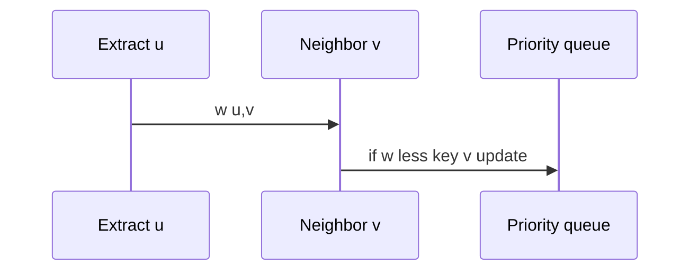

# Prim with Priority Queues

## Overview

**Prim's algorithm** grows an MST from a start vertex by repeatedly adding the **minimum-weight edge** connecting the current tree to a vertex outside it. Implementation mirrors [[05-Algorithms/08-Shortest-Paths/Dijkstra with Indexed Heaps|Dijkstra]]: [[04-Data-Structures/06-Heaps-and-Priority-Queues/Priority Queue ADT|priority queue]] keyed by cheapest connection cost `key[v]`.

Correctness via **cut property** ([[05-Algorithms/09-MST-and-Connectivity/Minimum Spanning Tree Contracts and Cut Property|Minimum Spanning Tree Contracts and Cut Property]]). Prefer Prim on **dense adjacency** representations ([[04-Data-Structures/08-Graphs-as-Representation/Adjacency Lists|Adjacency Lists]]); compare [[05-Algorithms/09-MST-and-Connectivity/Kruskal with Union-Find|Kruskal]] on sparse edge lists.

## Learning Objectives

- Implement Prim with binary heap and lazy decrease-key
- Relate Prim loops to Dijkstra with different key semantics
- Analyze `O(E log V)` with binary heap
- Start from arbitrary vertex in each connected component
- Return MST edges and total weight

## Prerequisites

- [[05-Algorithms/09-MST-and-Connectivity/Minimum Spanning Tree Contracts and Cut Property|Minimum Spanning Tree Contracts and Cut Property]]
- [[04-Data-Structures/06-Heaps-and-Priority-Queues/Priority Queue ADT|Priority Queue ADT]]
- [[05-Algorithms/08-Shortest-Paths/Dijkstra with Indexed Heaps|Dijkstra with Indexed Heaps]]

## Difficulty

`intermediate`

## Estimated Time

- Reading: 1.5 hours
- Exercises: 3 hours
- Mini project: 4 hours

## History

Robert Prim (1957); independently Dijkstra noted similarity. Prim remains default when graph is adjacency-list and online growth matches UI visualization.

## Problem It Solves

**Incremental network rollout**: start datacenter hub, always connect cheapest next site to current fiber footprint—Prim's growth order matches operational narrative.

## Internal Implementation

### Algorithm

1. Pick start `s`; `key[s]=0`, others `∞`.
2. PQ min on `key`; extract `u`, add edge from `parent[u]`.
3. For neighbors `v`: if `w(u,v) < key[v]`, update `key[v]`, `parent[v]=u`, push/decrease.



## Mermaid Diagrams

### Structure: growing cut



### Sequence: key update



## Examples

### Minimal Example

```typescript
function prim(
  n: number,
  adj: { v: number; w: number }[][],
  start = 0,
): { weight: number; edges: [number, number, number][] } {
  const key = Array(n).fill(Number.POSITIVE_INFINITY);
  const parent = Array(n).fill(-1);
  const inMst = Array(n).fill(false);
  key[start] = 0;
  const heap: [number, number][] = [[0, start]];
  const mstEdges: [number, number, number][] = [];
  let weight = 0;

  while (heap.length) {
    heap.sort((a, b) => a[0] - b[0]);
    const [k, u] = heap.shift()!;
    if (inMst[u]) continue;
    inMst[u] = true;
    if (parent[u] !== -1) {
      mstEdges.push([parent[u], u, k]);
      weight += k;
    }
    for (const { v, w } of adj[u]) {
      if (!inMst[v] && w < key[v]) {
        key[v] = w;
        parent[v] = u;
        heap.push([w, v]);
      }
    }
  }
  return { weight, edges: mstEdges };
}
```

```python
import heapq


def prim(
    n: int,
    adj: list[list[tuple[int, float]]],
    start: int = 0,
) -> tuple[float, list[tuple[int, int, float]]]:
    key = [float("inf")] * n
    parent = [-1] * n
    in_mst = [False] * n
    key[start] = 0.0
    heap: list[tuple[float, int]] = [(0.0, start)]
    mst_edges: list[tuple[int, int, float]] = []
    weight = 0.0

    while heap:
        k, u = heapq.heappop(heap)
        if in_mst[u]:
            continue
        in_mst[u] = True
        if parent[u] != -1:
            mst_edges.append((parent[u], u, k))
            weight += k
        for v, w in adj[u]:
            if not in_mst[v] and w < key[v]:
                key[v] = w
                parent[v] = u
                heapq.heappush(heap, (w, v))
    return weight, mst_edges
```

### Production-Shaped Example

**Live map UI**: highlight next cheapest link as Prim extracts—adjacency from [[04-Data-Structures/08-Graphs-as-Representation/Adjacency Lists|Adjacency Lists]]. For `V=5000`, lazy heap acceptable; profile indexed heap if decrease-key churn high.

## Correctness

Each step adds lightest edge crossing cut `(S, V\S)` where `S` is current tree—cut property. Inductively tree remains subset of some MST.

## Complexity

Binary heap: `O(E log V)` time, `O(V)` heap + arrays.

Dense array scan Prim: `O(V²)`—can win on very dense small graphs.

## Trade-offs

| Dimension | Prim | Kruskal |
| --- | --- | --- |
| Input | Adjacency list | Edge list |
| Growth narrative | Local expansion | Global sort |
| Similar to | Dijkstra | Union-find |

### When to Use

- Adjacency-list graph already in memory
- Visual incremental connection
- Dense graphs (with array variant)

### When Not to Use

- Pure edge stream without adjacency
- Disconnected without outer loop on components

## Exercises

1. Modify Prim to list MST edges in extraction order.
2. Compare runtime Prim vs Kruskal on same graph.
3. Run Prim from each vertex—same total weight?
4. Implement array-scan `O(V²)` Prim for dense graphs.
5. Draw parallel to Dijkstra—what differs in key?

## Mini Project

Side-by-side Prim/Kruskal animation in [[05-Algorithms/projects/Network Connectivity and MST Lab/README|Network Connectivity and MST Lab]].

## Portfolio Project

Hub-spoke rollout planner using Prim extraction order.

## Interview Questions

1. Prim vs Kruskal?
2. Prim vs Dijkstra similarity?
3. Complexity with binary heap?
4. Cut property in Prim step?
5. Disconnected graph handling?

### Stretch / Staff-Level

1. Fibonacci heap Prim `O(E + V log V)`—when theoretical win matters?

## Common Mistakes

- Adding all edges to heap without inMst check
- Confusing key with dist (Dijkstra)
- Missing component restart on disconnected graph

## Best Practices

- Mark `inMst` before neighbor relax like Dijkstra settled set
- Return certificate edge list for audit
- Share heap utilities with pathfinding module

## Summary

Prim grows an MST by cheapest frontier edge—priority-queue driven like Dijkstra but optimizing tree weight not path distance. Choose it when adjacency lists and incremental growth match the product story.

## Further Reading

- [[05-Algorithms/09-MST-and-Connectivity/Kruskal with Union-Find|Kruskal with Union-Find]]
- [[04-Data-Structures/06-Heaps-and-Priority-Queues/Decrease-Key and Indexed Heaps|Decrease-Key and Indexed Heaps]]

## Related Notes

- [[05-Algorithms/08-Shortest-Paths/Dijkstra with Indexed Heaps|Dijkstra with Indexed Heaps]]
- [[04-Data-Structures/08-Graphs-as-Representation/Graph Storage Trade-offs and Dynamic Updates|Graph Storage Trade-offs and Dynamic Updates]]
- [[05-Algorithms/README|Algorithms]]

## Progress Checklist

- [ ] Explained from first principles
- [ ] Drew at least one Mermaid diagram
- [ ] Implemented a minimal version
- [ ] Documented trade-offs and non-goals
- [ ] Completed exercises
- [ ] Practiced interview questions aloud
- [ ] Linked prerequisites and dependents
