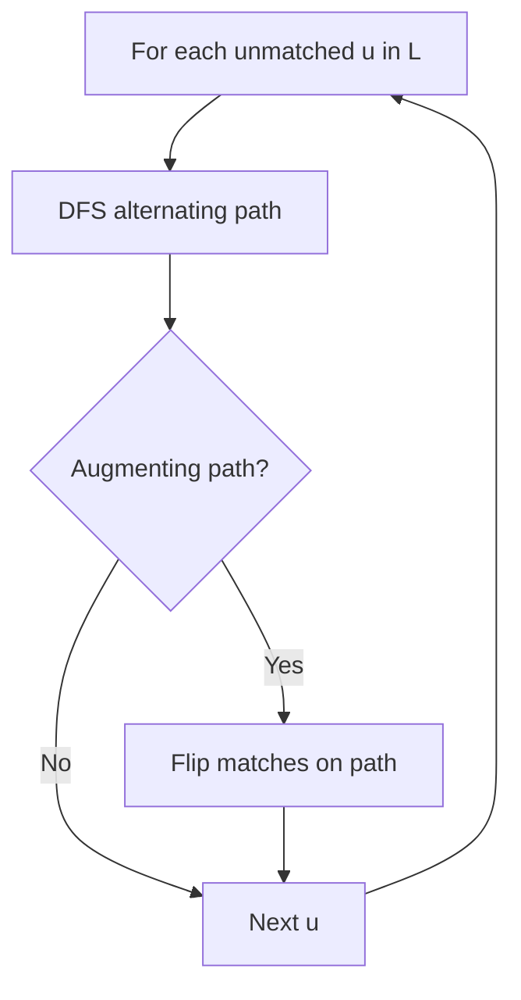
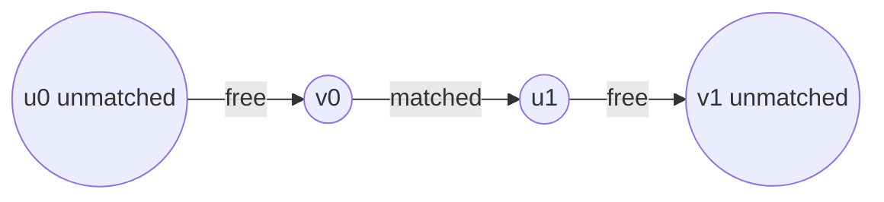
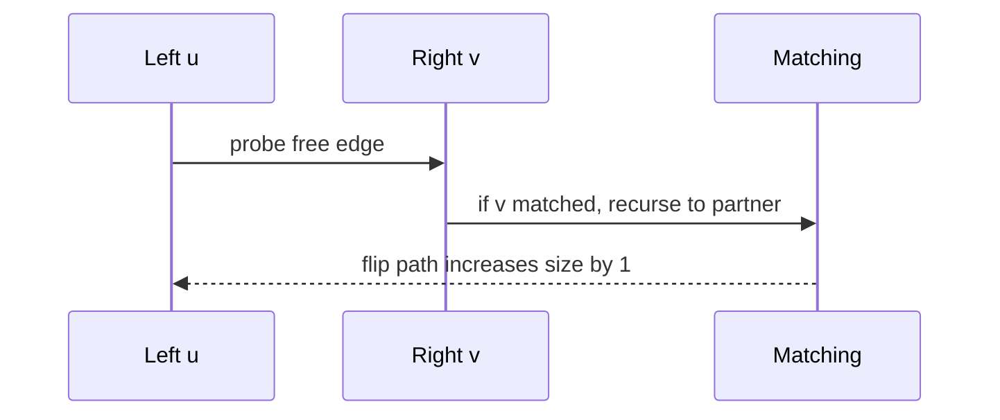

# Bipartite Matching

## Overview

A **matching** in a graph is a set of edges no two of which share a vertex. In a **bipartite** graph with partitions `L` and `R`, a **maximum matching** pairs as many `L`–`R` vertices as possible—modeling job assignment, roommate pairing, ad slot allocation, and resource reservation. Algorithms include augmenting-path DFS (`O(VE)`) and Hopcroft–Karp layered BFS (`O(E √V)`), equivalent to unit-capacity max-flow on a transformed network.

This note focuses on matching algorithms and correctness—not bipartite testing ([[05-Algorithms/07-Graph-Traversal-and-DAGs/Connected Components and Bipartite Testing|Connected Components and Bipartite Testing]]) or flow implementation internals.

## Learning Objectives

- Reduce maximum matching to max-flow with unit capacities
- Implement augmenting-path matching with `matchL`, `matchR` arrays
- State Hopcroft–Karp phase structure and complexity
- Recognize when weighted matching needs Hungarian algorithm (different problem)
- Apply matching to scheduling and allocation with cardinality constraints

## Prerequisites

- [[05-Algorithms/07-Graph-Traversal-and-DAGs/Connected Components and Bipartite Testing|Connected Components and Bipartite Testing]]
- [[05-Algorithms/10-Advanced-Graph-Algorithms/Maximum Flow and Residual Networks|Maximum Flow and Residual Networks]]

## Difficulty

`advanced`

## Estimated Time

- Reading: 2 hours
- Exercises: 4 hours
- Mini project: 5 hours

## History

Matching theory dates to König (1931) and Hall's marriage theorem. Hopcroft and Karp (1973) achieved `O(E √V)`. Production systems often use max-flow libraries or specialized assignment solvers for weighted variants.

## Problem It Solves

**Shift assignment**: workers (left) to shifts (right) with eligibility edges—maximize filled shifts. **Ad serving**: impressions to campaigns without double-booking. **Stable roommate is different**—this note covers **maximum cardinality** matching only.

## Internal Implementation

### Augmenting path definition

An **alternating path** starts at unmatched `u ∈ L`, alternates unmatched/matched edges, and ends at unmatched `v ∈ R`. Flipping edges along it increases matching size by 1.

### DFS augmenting (Kuhn algorithm)

For each unmatched `u ∈ L`, DFS for augmenting path; on success, flip assignments along path.



## Mermaid Diagrams

### Structure: alternating path



### Sequence: one augmentation



## Examples

### Minimal Example — augmenting DFS

```typescript
function maxMatching(nL: number, nR: number, adjL: number[][]): number {
  const matchR = Array(nR).fill(-1);
  let size = 0;

  function dfs(u: number, seen: boolean[]): boolean {
    for (const v of adjL[u]) {
      if (seen[v]) continue;
      seen[v] = true;
      if (matchR[v] === -1 || dfs(matchR[v], seen)) {
        matchR[v] = u;
        return true;
      }
    }
    return false;
  }

  for (let u = 0; u < nL; u++) {
    if (dfs(u, Array(nR).fill(false))) size++;
  }
  return size;
}
```

```python
def max_matching(n_l: int, adj_l: list[list[int]]) -> tuple[int, list[int]]:
    match_r = [-1] * max((max(nei, default=-1) for nei in adj_l), default=-1) + 1
    if not adj_l:
        return 0, match_r
    n_r = len(match_r)
    size = 0

    def dfs(u: int, seen: list[bool]) -> bool:
        for v in adj_l[u]:
            if seen[v]:
                continue
            seen[v] = True
            if match_r[v] == -1 or dfs(match_r[v], seen):
                match_r[v] = u
                return True
        return False

    for u in range(n_l):
        if dfs(u, [False] * n_r):
            size += 1
    return size, match_r
```

### Production-Shaped Example

**On-call rotation matcher**: left = engineers, right = weekly slots, edges = availability. Run augmenting matching nightly; if size < required slots, alert staffing. For **weighted** preferences (minimize dissatisfaction), use Hungarian `O(V³)`—do not pretend cardinality DFS optimizes weights. At scale (>10⁵ edges), Hopcroft–Karp or unit max-flow with Dinic.

## Correctness

**Invariant**: matched edges always form a valid matching (each vertex incident to at most one chosen edge).

**Augmentation lemma**: flipping edges along an augmenting path increases matching size by exactly 1 while preserving validity.

**Optimality**: when no augmenting path exists, matching is maximum (Hall's theorem / max-flow equivalence).

**Bipartite requirement**: odd cycles in general graphs need blossom algorithm—not covered here.

## Complexity

| Algorithm | Time | Space |
| --- | --- | --- |
| DFS augmenting | `O(V E)` | `O(V + E)` |
| Hopcroft–Karp | `O(E √V)` | `O(V + E)` |
| Unit max-flow | `O(E √V)` on unit networks | Flow adjacency |

## Trade-offs

| Dimension | DFS augmenting | Hopcroft–Karp / max-flow |
| --- | --- | --- |
| Code size | Small | Larger |
| Scaling | Fine for small dense | Better on large sparse |
| Weighted extension | No | Hungarian / min-cost flow |
| Debuggability | High | Moderate |

### When to Use

- Cardinality assignment on bipartite eligibility graphs
- Intermediate step in min-cost flow reductions
- Verifying feasibility of perfect matching (`|M| = |L|`)

### When Not to Use

- General graph matching (non-bipartite) → blossom algorithm
- Weighted optimal assignment → Hungarian / min-cost max-flow
- Stable matching with preferences → Gale–Shapley (different contract)

## Exercises

1. Manually find augmenting paths in a 3×3 bipartite example until maximal.
2. Reduce matching to max-flow: draw source, sink, unit edges.
3. Prove each augmentation increases matching size by 1.
4. Construct a case where greedy edge picking fails without augmenting paths.
5. State Hall's marriage condition in terms of neighbor sets `N(S)`.

## Mini Project

Integrate matching into [[05-Algorithms/projects/Dependency Planner/README|Dependency Planner]] for worker–task assignment.

## Portfolio Project

Staffing dashboard: max matching + unassigned reason codes (no augmenting path witness).

## Interview Questions

1. Define augmenting path in bipartite matching.
2. Complexity of basic DFS matching?
3. How reduce to max-flow?
4. Difference between maximum matching and perfect matching?
5. When does weighted assignment need Hungarian?

### Stretch / Staff-Level

1. Outline Hopcroft–Karp layering and why `O(E √V)` beats `O(VE)` on large sparse graphs.

## Common Mistakes

- Running matching on non-bipartite graphs without blossoms
- Confusing maximum cardinality with minimum weight assignment
- Reusing `seen` array across DFS calls without reset per outer `u`
- Forgetting to handle unmatched vertices on both sides

## Best Practices

- Verify bipartiteness first ([[05-Algorithms/07-Graph-Traversal-and-DAGs/Connected Components and Bipartite Testing|Connected Components and Bipartite Testing]])
- Return `{size, matchL, matchR}` for downstream scheduling
- Switch to Hopcroft–Karp when profiling shows `O(VE)` bottleneck
- Document unweighted vs weighted problem contracts explicitly

## Summary

Maximum bipartite matching pairs as many cross-partition vertices as eligibility allows. Augmenting paths increase matching size by flipping alternating edges; termination yields optimality equivalent to unit-capacity max-flow. Choose DFS augmenting for clarity and small inputs; Hopcroft–Karp or flow solvers for production scale.

## Further Reading

- [[05-Algorithms/10-Advanced-Graph-Algorithms/Maximum Flow and Residual Networks|Maximum Flow and Residual Networks]]
- [[05-Algorithms/10-Advanced-Graph-Algorithms/Min-Cut Duality|Min-Cut Duality]]

## Related Notes

- [[05-Algorithms/07-Graph-Traversal-and-DAGs/Connected Components and Bipartite Testing|Connected Components and Bipartite Testing]]
- [[05-Algorithms/10-Advanced-Graph-Algorithms/Maximum Flow and Residual Networks|Maximum Flow and Residual Networks]]
- [[05-Algorithms/05-Greedy-Algorithms/Interval Scheduling|Interval Scheduling]]
- [[05-Algorithms/README|Algorithms]]

## Progress Checklist

- [ ] Explained from first principles
- [ ] Drew at least one Mermaid diagram
- [ ] Implemented a minimal version
- [ ] Documented trade-offs and non-goals
- [ ] Completed exercises
- [ ] Practiced interview questions aloud
- [ ] Linked prerequisites and dependents
