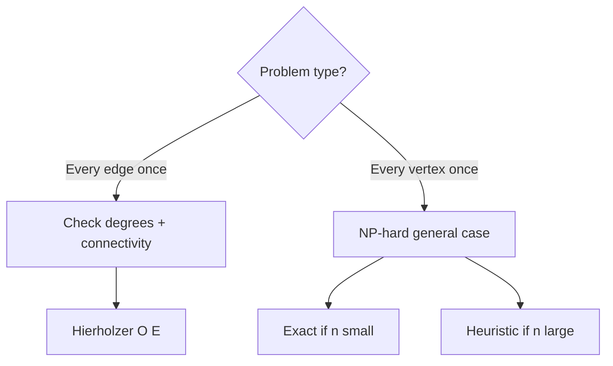
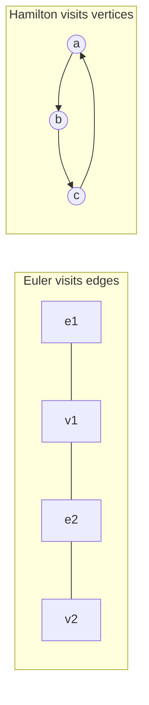
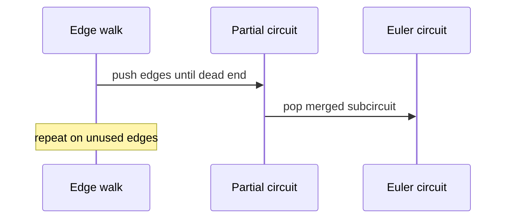

# Eulerian and Hamiltonian Distinctions

## Overview

An **Euler trail** uses every **edge** exactly once; an **Euler circuit** is a closed Euler trail. A **Hamilton path** visits every **vertex** exactly once; a **Hamilton circuit** closes the path. Euler conditions reduce to degree parity and connectivity—decidable in linear time. Hamilton problems are NP-complete in general—exact solvers use backtracking or DP on small instances; production uses heuristics or approximations.

This note teaches **invariants and certificates** with diagrams; full TSP solvers are optional implementations.

## Learning Objectives

- State necessary and sufficient conditions for Euler trails and circuits
- Construct Euler trails with Hierholzer's algorithm
- Explain why Hamiltonicity lacks simple local invariants
- Choose exact vs heuristic approaches by graph size and problem contract
- Map real problems (route inspection vs salesperson tour) to correct variant

## Prerequisites

- [[05-Algorithms/07-Graph-Traversal-and-DAGs/DFS|DFS]]
- [[05-Algorithms/07-Graph-Traversal-and-DAGs/Cycle Detection|Cycle Detection]]
- [[05-Algorithms/07-Graph-Traversal-and-DAGs/Connected Components and Bipartite Testing|Connected Components and Bipartite Testing]]

## Difficulty

`intermediate`

## Estimated Time

- Reading: 1.5 hours
- Exercises: 3 hours
- Mini project: 4 hours

## History

Euler's Königsberg bridges (1736) founded graph theory via an impossible Euler walk. Hamilton's icosahedron game (1857) popularized vertex tours. Modern logistics still separates **edge-covering** inspection routes from **vertex-covering** delivery tours.

## Problem It Solves

**Postal route planning**: traverse every street once (Euler) vs visit every stop once (Hamilton). **PCB probe paths**: test every trace (edge) vs every pad (vertex). Misclassification leads to exponential solvers on problems with linear-time certificates—or false "impossible" when only Euler structure was needed.

## Internal Implementation

### Euler (undirected connected graph)

| Type | Degree condition |
| --- | --- |
| Euler circuit | All vertices even degree |
| Euler trail (not circuit) | Exactly two odd-degree vertices (start/end) |
| None | More than two odd vertices |

Directed graphs: balance in-degree and out-degree per vertex (with source/sink exceptions for trails).

### Hierholzer's algorithm

DFS-like edge deletion, merging sub-circuits into one trail.

### Hamilton

No known linear-time certificate. Exact: backtracking, Held–Karp DP `O(n² 2ⁿ)` for TSP on small `n`. Production: Christofides heuristic, local search, ILP solvers.



## Mermaid Diagrams

### Structure: Euler vs Hamilton focus



### Sequence: Hierholzer circuit merge



## Examples

### Minimal Example — Euler feasibility + Hierholzer sketch

```typescript
function hasEulerCircuitUndirected(n: number, edges: [number, number][]): boolean {
  const deg = Array(n).fill(0);
  for (const [u, v] of edges) {
    deg[u]++;
    deg[v]++;
  }
  const odd = deg.filter((d) => d % 2 === 1).length;
  if (odd !== 0) return false;
  // connectivity on positive-degree vertices required (exercise)
  return true;
}

function hierholzerTrail(adj: Map<number, number[]>): number[] {
  const circuit: number[] = [];
  const stack = [adj.keys().next().value as number];
  while (stack.length) {
    const u = stack[stack.length - 1];
    const neighbors = adj.get(u);
    if (!neighbors || neighbors.length === 0) {
      circuit.push(stack.pop()!);
    } else {
      const v = neighbors.pop()!;
      // remove reverse edge in undirected multigraph representation
      const rev = adj.get(v)!;
      const idx = rev.lastIndexOf(u);
      if (idx !== -1) rev.splice(idx, 1);
      stack.push(v);
    }
  }
  return circuit.reverse();
}
```

```python
def has_euler_circuit_undirected(n: int, edges: list[tuple[int, int]]) -> bool:
    deg = [0] * n
    for u, v in edges:
        deg[u] += 1
        deg[v] += 1
    return sum(d % 2 for d in deg) == 0


def hamilton_path_backtracking(adj: list[list[int]], n: int) -> list[int] | None:
    path = [0]
    visited = {0}

    def dfs() -> bool:
        if len(path) == n:
            return True
        u = path[-1]
        for v in adj[u]:
            if v in visited:
                continue
            visited.add(v)
            path.append(v)
            if dfs():
                return True
            path.pop()
            visited.remove(v)
        return False

    return path if dfs() else None
```

### Production-Shaped Example

**Snow plow routing** (Euler): verify odd-degree count ≤ 2, run Hierholzer, duplicate minimal odd-pair edges for circuit if needed (Chinese Postman—weighted extension). **Last-mile delivery tour** (Hamilton/TSP): for >20 stops use OR-Tools heuristic with time windows; exact DP only for nightly batch ≤15 cities. Never run Held–Karp on 50-vertex graphs in API request path.

## Correctness

**Euler (undirected)**: connected graph on edges with positive degree satisfies circuit condition iff all degrees even; trail iff exactly zero or two odd vertices—and trail exists between odd pair when connected.

**Hierholzer**: each popped vertex completes a subcircuit; merging visits every edge exactly once when all degrees satisfied.

**Hamilton**: backtracking correct but exponential; heuristics **unverified** unless optimality gap documented ([[05-Algorithms/12-Randomized-Approximation-and-Online/Approximation Ratios and Heuristics|Approximation Ratios and Heuristics]]).

## Complexity

| Problem | Decision | Construction |
| --- | --- | --- |
| Euler trail/circuit | `O(V + E)` | Hierholzer `O(E)` |
| Hamilton path/circuit | NP-complete | Backtracking exponential |
| TSP (weighted Hamilton cycle) | NP-hard | Held–Karp `O(n² 2ⁿ)` exact small n |

## Trade-offs

| Dimension | Euler | Hamilton |
| --- | --- | --- |
| Certificate | Local degrees | None simple |
| Algorithm | Polynomial | Exact exponential / heuristic |
| Problem mislabel cost | Low | High (timeouts) |
| Production pattern | Route coverage | TSP solvers + bounds |

### When to Use

- Euler: edge traversal, inspection, drawing without retracing
- Hamilton exact: tiny graphs, offline optimality proofs
- Hamilton heuristic: large routing with documented approximation

### When Not to Use

- Hamilton exact on large `n` in latency-sensitive APIs
- Euler on directed graphs without checking in/out balance
- Assuming NP-hard tour is "just DFS"

## Exercises

1. Königsberg bridges: prove no Euler trail exists using degree counts.
2. Construct Euler trail on a connected graph with two odd vertices; identify start/end.
3. Draw a graph with Hamilton path but no Euler trail.
4. Bound backtracking nodes for `n=8` complete graph Hamilton search.
5. Directed Euler: state in/out degree conditions for a circuit.

## Mini Project

Visualize Hierholzer trail on street grid in [[05-Algorithms/projects/Pathfinding Lab/README|Pathfinding Lab]].

## Portfolio Project

Route classifier tool: input problem description → recommend Euler vs TSP pipeline with complexity warning.

## Interview Questions

1. Difference between Euler and Hamilton paths?
2. When does an undirected graph have an Euler circuit?
3. Why is Hamilton NP-complete while Euler is easy?
4. What is Hierholzer's algorithm for?
5. How would you solve TSP for n=12 vs n=1200?

### Stretch / Staff-Level

1. Chinese Postman: minimum-weight augmentation to Eulerian—reduction sketch.

## Common Mistakes

- Checking Hamilton when problem is edge-covering (Euler)
- Ignoring connectivity among positive-degree vertices for Euler
- Running exponential Hamilton on production-sized inputs without timeout
- Confusing trail (edges may repeat?) — Euler trail does **not** repeat edges

## Best Practices

- Classify problem by **edge vs vertex** coverage first
- For Euler, verify connectivity on non-isolated vertices
- For Hamilton at scale, return heuristic tour + lower bound if available
- Cross-link NP-hardness to approximation module when deploying heuristics

## Summary

Euler and Hamilton problems differ by whether edges or vertices must be covered exactly once. Euler trails admit fast degree-and-connectivity certificates and Hierholzer construction; Hamilton paths lack simple local rules and require exponential exact methods or approximation heuristics at scale. Production routing fails when these contracts are confused.

## Further Reading

- [[05-Algorithms/12-Randomized-Approximation-and-Online/Approximation Ratios and Heuristics|Approximation Ratios and Heuristics]]
- [[05-Algorithms/04-Divide-Conquer-and-Backtracking/Backtracking State Spaces and Pruning|Backtracking State Spaces and Pruning]]

## Related Notes

- [[05-Algorithms/07-Graph-Traversal-and-DAGs/DFS|DFS]]
- [[05-Algorithms/07-Graph-Traversal-and-DAGs/Cycle Detection|Cycle Detection]]
- [[05-Algorithms/10-Advanced-Graph-Algorithms/Graph Algorithm Selection and Scaling Boundaries|Graph Algorithm Selection and Scaling Boundaries]]
- [[05-Algorithms/04-Divide-Conquer-and-Backtracking/Branch-and-Bound Concepts|Branch-and-Bound Concepts]]
- [[05-Algorithms/README|Algorithms]]

## Progress Checklist

- [ ] Explained from first principles
- [ ] Drew at least one Mermaid diagram
- [ ] Implemented a minimal version
- [ ] Documented trade-offs and non-goals
- [ ] Completed exercises
- [ ] Practiced interview questions aloud
- [ ] Linked prerequisites and dependents
