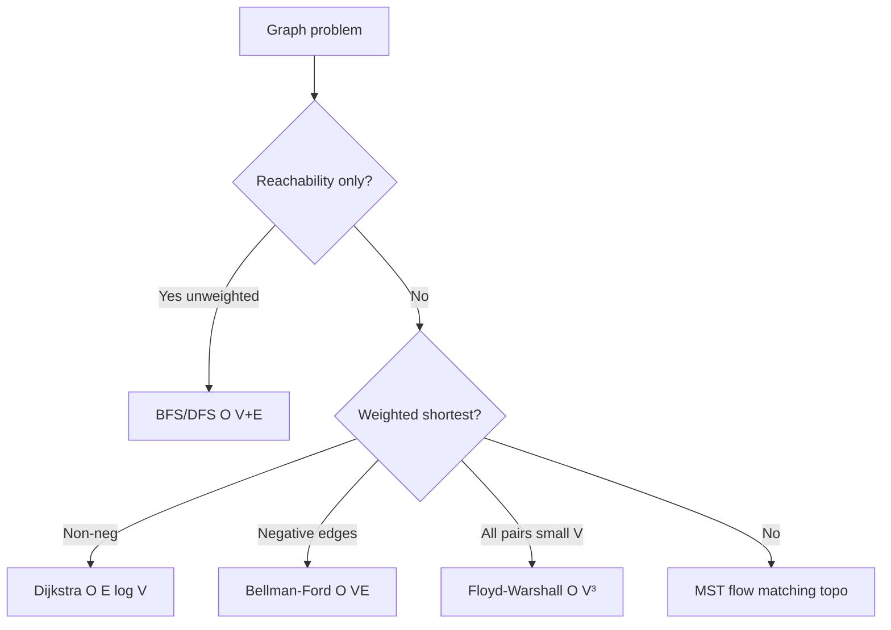
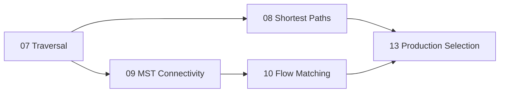
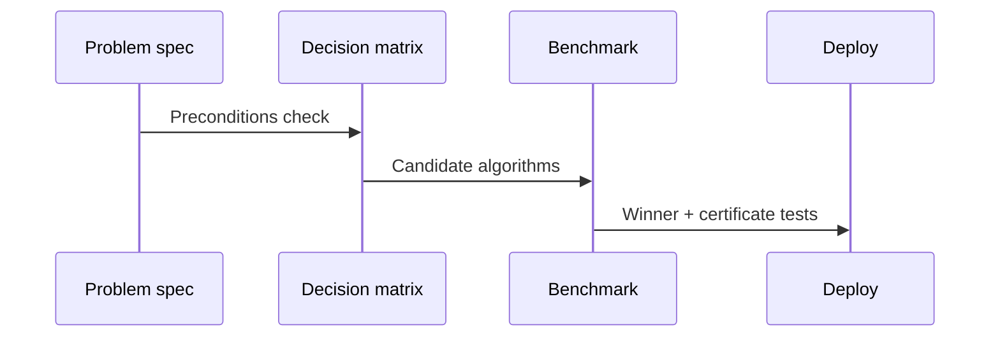

# Graph Algorithm Selection and Scaling Boundaries

## Overview

Graph problems share notation but differ by **contract**: unweighted vs weighted, directed vs undirected, single-source vs all-pairs, acyclic vs cyclic, optimization objective (shortest, spanning, max flow, matching). This note synthesizes **when** to apply each algorithm family and **where** asymptotics break against real hardware—without re-deriving every algorithm (see modules 07–10).

Handoffs: graph storage → [[04-Data-Structures/08-Graphs-as-Representation/Graph ADT Vertices Edges and Labels|Graph ADT]]; distributed graph processing → [[09-System-Design/04-Partitioning-Sharding-and-Placement/Partition Keys Hotspots and Skew|Partition Keys Hotspots and Skew]].

## Learning Objectives

- Map problem statements to algorithm families using a decision flow
- Identify scaling cliffs (`V`, `E`, weight types, density)
- Choose implicit vs explicit graph representations safely
- Document adversarial cases (negative weights, dense decrease-key)
- Align benchmark methodology with [[05-Algorithms/01-Complexity-and-Analysis/Practical Constants Locality and Benchmark Design|Practical Constants]]

## Prerequisites

- [[05-Algorithms/07-Graph-Traversal-and-DAGs/BFS|BFS]]
- [[05-Algorithms/08-Shortest-Paths/Shortest-Path Contracts and Relaxation|Shortest-Path Contracts and Relaxation]]
- [[05-Algorithms/09-MST-and-Connectivity/Minimum Spanning Tree Contracts and Cut Property|Minimum Spanning Tree Contracts and Cut Property]]
- [[05-Algorithms/10-Advanced-Graph-Algorithms/Maximum Flow and Residual Networks|Maximum Flow and Residual Networks]]

## Difficulty

`advanced`

## Estimated Time

- Reading: 2 hours
- Exercises: 3 hours
- Mini project: 4 hours

## History

As graphs scaled from textbook sizes to internet routing and social networks, the bottleneck shifted from Big-O to **constants, cache locality, and problem mis-specification**. Production postmortems often cite "used Dijkstra" when the graph had negative edges or "ran Floyd–Warshall" on sparse million-node maps.

## Problem It Solves

**Architecture review**: prevent `$O(V³)` all-pairs on sparse road networks. **On-call**: diagnose timeout—wrong algorithm vs wrong representation vs implicit graph explosion. **Interview-to-production gap**: name the algorithm **and** state preconditions before coding.

## Internal Implementation

### Decision axes

1. **Task**: reachability, shortest path, MST, connectivity, flow, matching, ordering
2. **Graph shape**: `V`, `E`, directed, weighted, negative edges, DAG
3. **Query pattern**: one-shot, many queries, dynamic updates
4. **Resource budget**: memory, latency, exact vs approximate



## Mermaid Diagrams

### Structure: module map



### Sequence: selection workflow



## Examples

### Minimal Example — selection helper

```typescript
type GraphSpec = {
  v: number;
  e: number;
  directed: boolean;
  weighted: boolean;
  negative: boolean;
  task: "sssp" | "apsp" | "mst" | "flow" | "match" | "reach";
};

function recommend(spec: GraphSpec): string {
  if (spec.task === "reach") return "BFS or DFS O(V+E)";
  if (spec.task === "sssp") {
    if (!spec.weighted) return "BFS O(V+E)";
    if (spec.negative) return "Bellman-Ford O(VE)";
    return "Dijkstra O(E log V)";
  }
  if (spec.task === "apsp") {
    return spec.v <= 400 ? "Floyd-Warshall O(V³)" : "Repeated Dijkstra or Johnson";
  }
  if (spec.task === "mst") return "Kruskal O(E log E) or Prim O(E log V)";
  if (spec.task === "flow") return "Edmonds-Karp O(VE²) or Dinic for scale";
  if (spec.task === "match") return "Hopcroft-Karp O(E√V) bipartite";
  return "Clarify problem contract";
}
```

```python
def recommend(spec: dict) -> str:
    task = spec["task"]
    if task == "reach":
        return "BFS/DFS O(V+E)"
    if task == "sssp":
        if not spec.get("weighted"):
            return "BFS O(V+E)"
        if spec.get("negative"):
            return "Bellman-Ford O(VE)"
        return "Dijkstra O(E log V)"
    if task == "apsp":
        v = spec["v"]
        return "Floyd-Warshall O(V³)" if v <= 400 else "Repeated Dijkstra / Johnson"
    if task == "mst":
        return "Kruskal or Prim O(E log V)"
    if task == "flow":
        return "Edmonds-Karp or Dinic"
    if task == "match":
        return "Hopcroft-Karp bipartite"
    return "Clarify problem contract"
```

### Production-Shaped Example

**Ride-share ETA graph**: 500k nodes, 2M edges, non-negative drive times, millions of SSSP queries/day → preprocess with [[05-Algorithms/08-Shortest-Paths/Dijkstra with Indexed Heaps|Dijkstra]] + hub labeling or contraction hierarchies (advanced, System Design)—not Floyd–Warshall. **Dependency deploy order** on 8k services → topological sort ([[05-Algorithms/07-Graph-Traversal-and-DAGs/Topological Sorting and Dependency Resolution|Topological Sorting]]). **Firewall max throughput** → max-flow ([[05-Algorithms/10-Advanced-Graph-Algorithms/Maximum Flow and Residual Networks|Maximum Flow]]).

## Correctness

Selection correctness means **honoring preconditions** of the chosen algorithm:

- Dijkstra requires non-negative weights
- Bellman-Ford detects negative cycles reachable from source
- Kruskal/Prim require connected undirected input (or run per component)
- Topological sort requires DAG
- Bipartite matching requires bipartite graph

Violating preconditions yields wrong answers—not merely slow performance.

## Complexity

| Family | Typical time | Scaling boundary (rule of thumb) |
| --- | --- | --- |
| BFS/DFS | `O(V + E)` | Default first pass |
| Dijkstra | `O(E log V)` | Sparse SSSP to ~10⁷ edges in memory |
| Bellman-Ford | `O(VE)` | Small V or few negative checks |
| Floyd–Warshall | `O(V³)` | `V ≤ few hundred` in memory |
| Kruskal/Prim | `O(E log V)` | MST on sparse networks |
| Edmonds-Karp | `O(VE²)` | Small/medium flow; else Dinic |
| SCC (Kosaraju/Tarjan) | `O(V + E)` | Dependency cycle analysis |

Constants and cache matter: profile before switching families ([[05-Algorithms/13-Production-Selection-and-Interview-Patterns/Profiling Correctness and Regression Gates|Profiling Correctness and Regression Gates]]).

## Trade-offs

| Dimension | Explicit adjacency | Implicit graph generation |
| --- | --- | --- |
| Memory | `O(V + E)` stored | Lower if sparse generator |
| Risk | Predictable | State-space explosion |
| Algorithm fit | Standard libs | Needs on-the-fly BFS caps |
| Debuggability | High | Harder |

### When to Use

- Greenfield service: write decision table in ADR before coding
- Performance regression: verify algorithm family still matches spec
- Code review checklist for graph PRs

### When Not to Use

- Distributed graph analytics at cluster scale → [[09-System-Design/04-Partitioning-Sharding-and-Placement/Partition Keys Hotspots and Skew|Partition Keys Hotspots and Skew]]
- SQL join order optimization → [[08-Databases/README|Databases]]
- Replacing domain-specific spatial indexes with generic Dijkstra

## Exercises

1. For each scenario (route map, CI DAG, matching interns), pick algorithm + cite preconditions.
2. Construct graph where Bellman-Ford beats Dijkstra on **correctness** grounds.
3. Estimate memory for Floyd on `V=5000` with 64-bit distances.
4. When does `O(V²)` array-Dijkstra beat `O(E log V)` binary heap?
5. Write regression test that fails if negative edge added to Dijkstra path.

## Mini Project

Extend [[05-Algorithms/projects/Network Connectivity and MST Lab/README|Network Connectivity and MST Lab]] with `recommend(spec)` CLI and golden vectors.

## Portfolio Project

Graph algorithm linter: static analysis rules flagging Dijkstra on possibly negative weights.

## Interview Questions

1. Walk through choosing SSSP algorithm given weight constraints.
2. Why is Floyd–Warshall rarely used on road networks?
3. Difference between connectivity and shortest path problems?
4. When would you use max-flow instead of matching directly?
5. What breaks when graph is implicit and branching factor huge?

### Stretch / Staff-Level

1. Design benchmark suite comparing Dijkstra heap variants on your hardware—report crossover points.

## Common Mistakes

- Skipping precondition checklist
- Using traversal when optimization required
- All-pairs on sparse giant graphs
- Ignoring directed vs undirected in MST/flow reductions
- Confusing module 10 flow with distributed consensus

## Best Practices

- Document `{task, V, E, weights, queries}` in API spec
- Pair algorithm choice with **certificate tests** (negative cycle detection, cut equality)
- Profile on production-shaped distributions, not random Erdős–Rényi only
- Link to [[05-Algorithms/13-Production-Selection-and-Interview-Patterns/Algorithm Selection Decision Matrix|Algorithm Selection Decision Matrix]] for cross-family synthesis

## Summary

Graph algorithm selection begins with the problem contract—not the most famous algorithm name. Traversal handles reachability; specialized families handle shortest paths, spanning trees, flows, and matchings under distinct preconditions. Scaling boundaries combine asymptotics with memory, query patterns, and implicit-graph risk; violations produce wrong answers or production timeouts.

## Further Reading

- [[05-Algorithms/13-Production-Selection-and-Interview-Patterns/Algorithm Selection Decision Matrix|Algorithm Selection Decision Matrix]]
- [[05-Algorithms/01-Complexity-and-Analysis/Practical Constants Locality and Benchmark Design|Practical Constants Locality and Benchmark Design]]

## Related Notes

- [[05-Algorithms/07-Graph-Traversal-and-DAGs/Strongly Connected Components|Strongly Connected Components]]
- [[05-Algorithms/08-Shortest-Paths/Floyd-Warshall and All-Pairs Trade-offs|Floyd-Warshall and All-Pairs Trade-offs]]
- [[05-Algorithms/09-MST-and-Connectivity/Kruskal with Union-Find|Kruskal with Union-Find]]
- [[05-Algorithms/10-Advanced-Graph-Algorithms/Maximum Flow and Residual Networks|Maximum Flow and Residual Networks]]
- [[05-Algorithms/13-Production-Selection-and-Interview-Patterns/From In-Memory Algorithms to Production Systems|From In-Memory Algorithms to Production Systems]]
- [[05-Algorithms/README|Algorithms]]

## Progress Checklist

- [ ] Explained from first principles
- [ ] Drew at least one Mermaid diagram
- [ ] Implemented a minimal version
- [ ] Documented trade-offs and non-goals
- [ ] Completed exercises
- [ ] Practiced interview questions aloud
- [ ] Linked prerequisites and dependents
