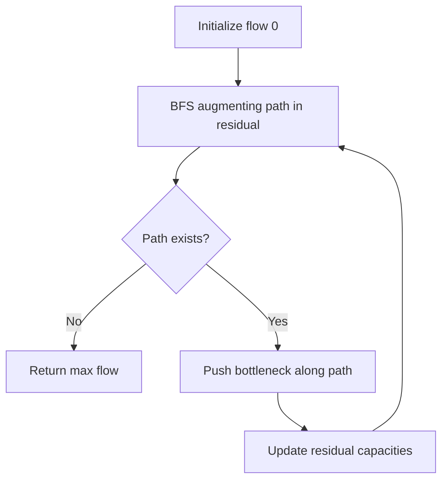
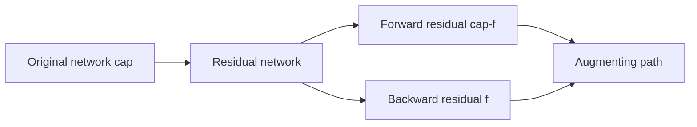
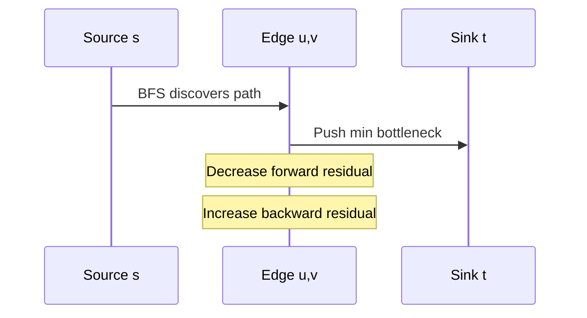

# Maximum Flow and Residual Networks

## Overview

The **maximum flow problem** asks: given a directed capacitated network with source `s` and sink `t`, what is the greatest total rate at which material can be sent from `s` to `t` without exceeding edge capacities? The **residual network** encodes how much additional flow each edge can carry and how much previously sent flow can be rerouted backward. Augmenting-path algorithms (Ford–Fulkerson, Edmonds–Karp) increase flow along `s→t` paths in the residual graph until no augmenting path remains.

This note covers flow mechanics and correctness—not graph storage layout ([[04-Data-Structures/08-Graphs-as-Representation/Adjacency Lists|Adjacency Lists]]) or min-cut duality proofs ([[05-Algorithms/10-Advanced-Graph-Algorithms/Min-Cut Duality|Min-Cut Duality]]).

## Learning Objectives

- Define flow feasibility, conservation, and capacity constraints
- Build and update residual capacities after each augmentation
- Implement Edmonds–Karp (BFS shortest augmenting path)
- Recognize when integer capacities guarantee termination
- Map production routing and capacity planning to max-flow formulations

## Prerequisites

- [[05-Algorithms/07-Graph-Traversal-and-DAGs/BFS|BFS]]
- [[05-Algorithms/08-Shortest-Paths/Shortest-Path Contracts and Relaxation|Shortest-Path Contracts and Relaxation]]
- [[04-Data-Structures/08-Graphs-as-Representation/Adjacency Lists|Adjacency Lists]]

## Difficulty

`advanced`

## Estimated Time

- Reading: 2.5 hours
- Exercises: 5 hours
- Mini project: 6 hours

## History

Lester Ford and Delbert Fulkerson formalized max-flow in 1956. Jack Edmonds and Richard Karp (1972) proved BFS augmenting paths yield polynomial `O(VE²)` time. Push-relabel and Dinic's algorithm improve practical scaling for large sparse networks.

## Problem It Solves

**Network bandwidth allocation**: route traffic through links with Mbps caps. **Bipartite assignment**: model as flow with unit capacities ([[05-Algorithms/10-Advanced-Graph-Algorithms/Bipartite Matching|Bipartite Matching]]). **Project selection with dependencies**: choose profitable projects under budget constraints via min-cut reduction. Wrong formulation (missing reverse edges, wrong conservation) yields silently inflated throughput.

## Internal Implementation

### Definitions

- **Flow** `f(u,v)`: amount on directed edge `(u,v)`, with `0 ≤ f(u,v) ≤ cap(u,v)`
- **Conservation**: at every vertex except `s,t`, inflow equals outflow
- **Residual capacity**: forward residual `cap - f`; backward residual `f` (undo flow)

### Edmonds–Karp loop

1. BFS in residual graph for shortest `s→t` path (by hop count)
2. Push bottleneck flow along path; update forward/backward residuals
3. Repeat until BFS finds no path



## Mermaid Diagrams

### Structure: flow vs residual



### Sequence: one augmentation



## Examples

### Minimal Example — Edmonds–Karp

```typescript
type Edge = { to: number; rev: number; cap: number; flow: number };

function addEdge(adj: Edge[][], u: number, v: number, cap: number): void {
  const fwd: Edge = { to: v, rev: adj[v].length, cap, flow: 0 };
  const back: Edge = { to: u, rev: adj[u].length, cap: 0, flow: 0 };
  adj[u].push(fwd);
  adj[v].push(back);
}

function edmondsKarp(adj: Edge[][], s: number, t: number): number {
  const n = adj.length;
  let total = 0;
  const parent: { edge: number; v: number }[] = Array(n);

  while (true) {
    parent.fill({ edge: -1, v: -1 });
    const q = [s];
    parent[s] = { edge: -1, v: s };
    for (let qi = 0; qi < q.length; qi++) {
      const u = q[qi];
      for (let i = 0; i < adj[u].length; i++) {
        const e = adj[u][i];
        if (parent[e.to].v === -1 && e.cap - e.flow > 0) {
          parent[e.to] = { edge: i, v: u };
          q.push(e.to);
        }
      }
    }
    if (parent[t].v === -1) break;

    let bottleneck = Number.POSITIVE_INFINITY;
    for (let v = t; v !== s; ) {
      const { edge, v: u } = parent[v];
      bottleneck = Math.min(bottleneck, adj[u][edge].cap - adj[u][edge].flow);
      v = u;
    }
    for (let v = t; v !== s; ) {
      const { edge, v: u } = parent[v];
      adj[u][edge].flow += bottleneck;
      const rev = adj[u][edge].rev;
      adj[v][rev].flow -= bottleneck;
      v = u;
    }
    total += bottleneck;
  }
  return total;
}
```

```python
from collections import deque


class Edge:
    __slots__ = ("to", "rev", "cap", "flow")

    def __init__(self, to: int, rev: int, cap: int) -> None:
        self.to = to
        self.rev = rev
        self.cap = cap
        self.flow = 0


def add_edge(adj: list[list[Edge]], u: int, v: int, cap: int) -> None:
    adj[u].append(Edge(v, len(adj[v]), cap))
    adj[v].append(Edge(u, len(adj[u]) - 1, 0))


def edmonds_karp(adj: list[list[Edge]], s: int, t: int) -> int:
    total = 0
    n = len(adj)
    while True:
        parent: list[tuple[int, int] | None] = [None] * n
        parent[s] = (-1, s)
        q: deque[int] = deque([s])
        while q:
            u = q.popleft()
            for i, e in enumerate(adj[u]):
                if parent[e.to] is None and e.cap - e.flow > 0:
                    parent[e.to] = (i, u)
                    q.append(e.to)
        if parent[t] is None:
            break
        bottleneck = float("inf")
        v = t
        while v != s:
            i, u = parent[v]  # type: ignore[misc]
            bottleneck = min(bottleneck, adj[u][i].cap - adj[u][i].flow)
            v = u
        v = t
        while v != s:
            i, u = parent[v]  # type: ignore[misc]
            adj[u][i].flow += bottleneck
            rev = adj[u][i].rev
            adj[v][rev].flow -= bottleneck
            v = u
        total += int(bottleneck)
    return total
```

### Production-Shaped Example

**CDN edge capacity planner**: model PoPs as vertices, backbone links as edges with Gbps caps, demand as multiple sources to a single sink. Use Edmonds–Karp for clarity on small topologies; switch to Dinic or push-relabel above ~10⁴ edges. Log residual snapshot on failure to diagnose bottleneck cuts. Integer capacities match discrete circuit counts; fractional flows require LP or capacity scaling.

## Correctness

**Invariant**: after each augmentation, `flow` remains feasible (capacities respected, conservation holds).

**Termination (integer capacities)**: each augmentation increases total flow by at least 1; bounded by sum of capacities leaving `s`.

**Optimality**: when no augmenting path exists, residual graph separates `s` from `t` via a cut whose capacity equals current flow—max-flow min-cut theorem ([[05-Algorithms/10-Advanced-Graph-Algorithms/Min-Cut Duality|Min-Cut Duality]]).

**Counterexample**: irrational capacities allow Ford–Fulkerson to non-terminate with adversarial path order—use Edmonds–Karp or capacity scaling in production.

## Complexity

| Algorithm | Time | Notes |
| --- | --- | --- |
| Ford–Fulkerson | `O(E · maxFlow)` | Path order dependent |
| Edmonds–Karp | `O(V E²)` | BFS shortest augmenting path |
| Dinic | `O(V² E)` | Layered networks, often faster in practice |
| Push-relabel | `O(V² √E)` | High-performance libraries |

Space `O(V + E)` for adjacency with reverse edges.

## Trade-offs

| Dimension | Edmonds–Karp | Dinic / push-relabel |
| --- | --- | --- |
| Implementation | Simple BFS loop | More intricate |
| Worst-case scaling | `O(V E²)` | Better on large sparse graphs |
| Debuggability | High | Moderate |
| Interview clarity | Preferred | Mention for production |

### When to Use

- Capacitated routing, assignment, project selection reductions
- Need certificate of optimality via min-cut
- Integer or rational capacities with polynomial algorithm

### When Not to Use

- Uncapacitated matching only → specialized Hopcroft–Karp may suffice
- Global min-cut without s/t → Stoer–Wagner or Karger (randomized)
- Distributed consensus or partition tolerance → [[09-System-Design/README|System Design]]

## Exercises

1. Trace Edmonds–Karp on a 4-vertex network by hand; verify residual after each push.
2. Prove flow value equals net outflow from `s` regardless of sink-side accounting.
3. Reduce maximum bipartite matching to max-flow with unit capacities.
4. Construct a graph where DFS augmenting paths yield `O(E · maxFlow)` iterations.
5. Implement min-cut extraction from final residual BFS reachable from `s`.

## Mini Project

Add max-flow solver to [[05-Algorithms/projects/Network Connectivity and MST Lab/README|Network Connectivity and MST Lab]] with residual visualization.

## Portfolio Project

Capacity planner CLI: ingest edge list, output max throughput and bottleneck cut set for ops review.

## Interview Questions

1. What is a residual network and why are reverse edges necessary?
2. State the max-flow min-cut theorem at a high level.
3. Edmonds–Karp time complexity and why BFS matters.
4. How do you detect if an edge is saturated in the final flow?
5. When does Ford–Fulkerson fail to terminate?

### Stretch / Staff-Level

1. Compare Dinic's blocking flow layers to Edmonds–Karp on unit-capacity networks (`O(E √V)` matching bounds).

## Common Mistakes

- Forgetting reverse edges in adjacency structure
- Violating conservation at intermediate vertices
- Using floating capacities without convergence guarantees
- Confusing max-flow with shortest path on edge weights

## Best Practices

- Store paired forward/backward edges with `rev` indices
- Assert `0 ≤ flow ≤ cap` in debug builds after each augmentation
- Return `{flowValue, minCutSide, saturatedEdges}` for operability
- Benchmark against library solvers on production-sized snapshots

## Summary

Maximum flow models throughput under capacity constraints. The residual network captures remaining forward capacity and undoable backward flow; repeated augmenting paths increase total flow until optimality, certified by an `s–t` cut. Edmonds–Karp provides a clear polynomial baseline; larger deployments adopt Dinic or push-relabel while preserving the same residual invariants.

## Further Reading

- [[05-Algorithms/10-Advanced-Graph-Algorithms/Min-Cut Duality|Min-Cut Duality]]
- [[05-Algorithms/10-Advanced-Graph-Algorithms/Bipartite Matching|Bipartite Matching]]
- [[05-Algorithms/01-Complexity-and-Analysis/Practical Constants Locality and Benchmark Design|Practical Constants Locality and Benchmark Design]]

## Related Notes

- [[05-Algorithms/07-Graph-Traversal-and-DAGs/BFS|BFS]]
- [[05-Algorithms/10-Advanced-Graph-Algorithms/Min-Cut Duality|Min-Cut Duality]]
- [[05-Algorithms/10-Advanced-Graph-Algorithms/Bipartite Matching|Bipartite Matching]]
- [[05-Algorithms/10-Advanced-Graph-Algorithms/Graph Algorithm Selection and Scaling Boundaries|Graph Algorithm Selection and Scaling Boundaries]]
- [[05-Algorithms/README|Algorithms]]

## Progress Checklist

- [ ] Explained from first principles
- [ ] Drew at least one Mermaid diagram
- [ ] Implemented a minimal version
- [ ] Documented trade-offs and non-goals
- [ ] Completed exercises
- [ ] Practiced interview questions aloud
- [ ] Linked prerequisites and dependents
