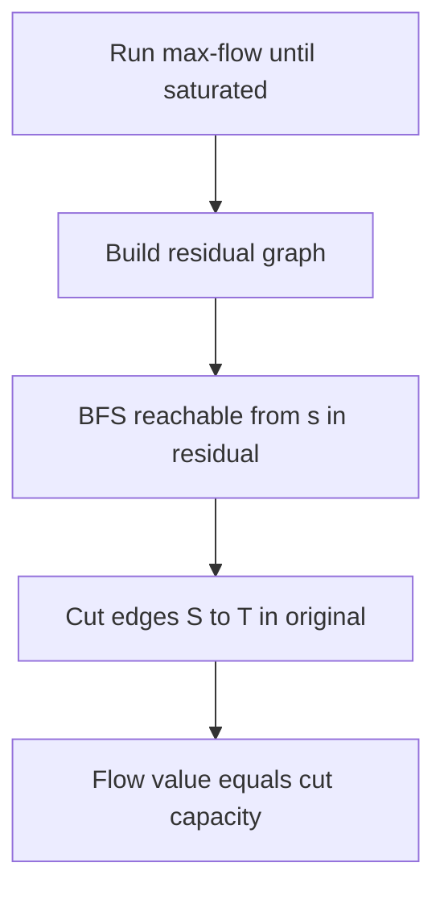
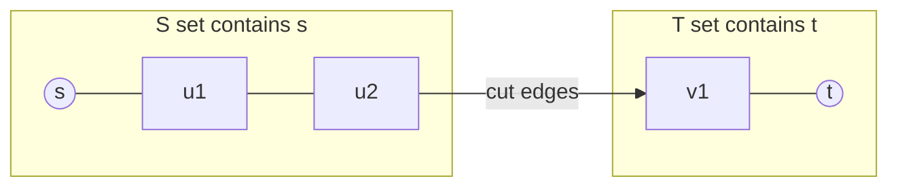
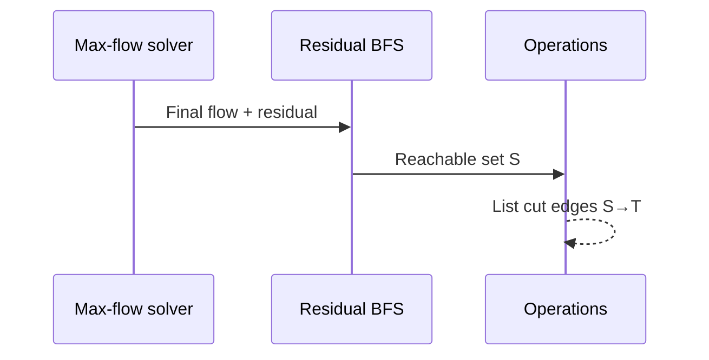

# Min-Cut Duality

## Overview

An **s–t cut** partitions vertices into sets `S` (containing `s`) and `T` (containing `t`). Its **capacity** is the sum of capacities of edges from `S` to `T`. The **max-flow min-cut theorem** states: maximum flow value from `s` to `t` equals minimum cut capacity separating them. This duality converts optimization questions ("how much can we route?") into structural certificates ("which bottleneck edges limit us?").

This note proves the duality relationship and extraction mechanics—not max-flow implementation details ([[05-Algorithms/10-Advanced-Graph-Algorithms/Maximum Flow and Residual Networks|Maximum Flow and Residual Networks]]).

## Learning Objectives

- Define s–t cuts and relate cut capacity to any feasible flow
- Prove weak duality (`flow ≤ cut`) and strong duality via residual reachability
- Extract min-cut from final residual BFS after max-flow
- Connect cut edges to security perimeters and failure isolation
- Distinguish s–t min-cut from global min-cut problems

## Prerequisites

- [[05-Algorithms/10-Advanced-Graph-Algorithms/Maximum Flow and Residual Networks|Maximum Flow and Residual Networks]]
- [[05-Algorithms/09-MST-and-Connectivity/Minimum Spanning Tree Contracts and Cut Property|Minimum Spanning Tree Contracts and Cut Property]]

## Difficulty

`advanced`

## Estimated Time

- Reading: 2 hours
- Exercises: 4 hours
- Mini project: 5 hours

## History

Ford and Fulkerson proved the theorem alongside their augmenting-path method (1956). The cut viewpoint influenced graph partitioning, image segmentation (Boykov–Kolmogorov), and security zone design in network architecture.

## Problem It Solves

**Security zoning**: minimum edges to monitor to separate trusted from untrusted zones equals max adversarial throughput if modeled correctly. **Failure analysis**: after max-flow, the min-cut identifies links whose removal stops all `s→t` communication. **Project selection**: profit maximization reduces to min-cut on a transformed network—wrong cut side breaks accounting.

## Internal Implementation

### Weak duality

Any flow crossing from `S` to `T` is bounded by cut capacity: `|f| ≤ cap(S,T)`.

### Strong duality

When augmenting paths are exhausted, let `S` = vertices reachable from `s` in the **residual graph**. No residual edge leaves `S` toward `T`, so all forward edges from `S` to `T` are saturated and backward edges from `T` to `S` are empty. Flow value equals sum of saturated forward cut edges = cut capacity.



## Mermaid Diagrams

### Structure: cut partitions flow



### Sequence: certificate extraction



## Examples

### Minimal Example — extract min-cut

```typescript
function minCutSide(
  adj: { to: number; cap: number; flow: number }[][],
  s: number,
): boolean[] {
  const n = adj.length;
  const reachable = Array(n).fill(false);
  const stack = [s];
  reachable[s] = true;
  while (stack.length) {
    const u = stack.pop()!;
    for (const e of adj[u]) {
      if (!reachable[e.to] && e.cap - e.flow > 0) {
        reachable[e.to] = true;
        stack.push(e.to);
      }
    }
  }
  return reachable;
}

function cutEdges(
  adj: { to: number; cap: number; flow: number }[][],
  reachable: boolean[],
): [number, number][] {
  const edges: [number, number][] = [];
  for (let u = 0; u < adj.length; u++) {
    if (!reachable[u]) continue;
    for (const e of adj[u]) {
      if (!reachable[e.to]) edges.push([u, e.to]);
    }
  }
  return edges;
}
```

```python
def min_cut_side(adj: list[list[tuple[int, int, int]]], s: int) -> list[bool]:
    """adj[u] = list of (v, cap, flow). Returns reachable-from-s in residual."""
    n = len(adj)
    reachable = [False] * n
    stack = [s]
    reachable[s] = True
    while stack:
        u = stack.pop()
        for v, cap, flow in adj[u]:
            if not reachable[v] and cap - flow > 0:
                reachable[v] = True
                stack.append(v)
    return reachable


def cut_edges(adj: list[list[tuple[int, int, int]]], reachable: list[bool]) -> list[tuple[int, int]]:
    edges: list[tuple[int, int]] = []
    for u, out in enumerate(adj):
        if not reachable[u]:
            continue
        for v, _cap, _flow in out:
            if not reachable[v]:
                edges.append((u, v))
    return edges
```

### Production-Shaped Example

**Microsegmentation audit**: after computing max east–west throughput between app tier and data tier, export min-cut link IDs to firewall ticket queue. Validate cut capacity equals measured max flow in staging. For **global** min-cut (any partition), do not reuse s–t extraction—use Stoer–Wagner or repeated randomized contraction ([[05-Algorithms/12-Randomized-Approximation-and-Online/Randomized Algorithms and Reproducible RNG|Randomized Algorithms and Reproducible RNG]]).

## Correctness

**Lemma (flow ≤ cut)**: for any feasible flow and any cut `(S,T)`, net flow from `s` to `t` cannot exceed capacity of edges from `S` to `T`.

**Theorem (equality at termination)**: when no augmenting path exists, reachable set `S` from residual BFS defines a cut with capacity equal to current flow value.

**Cut-minimality**: among all `s–t` cuts, this cut achieves minimum capacity because any cut must carry at least the max flow.

## Complexity

Extracting the cut after max-flow: `O(V + E)` BFS on residual graph. Combined with Edmonds–Karp: `O(V E²)` total. Cut size can be `O(E)` in worst case.

| Problem variant | Typical approach | Notes |
| --- | --- | --- |
| s–t min-cut | Max-flow + residual BFS | This note |
| Global min-cut | Stoer–Wagner `O(V³)` | Undirected, no fixed s,t |
| (s,t) min-cut with costs | Same as max-flow | Capacities on directed edges |

## Trade-offs

| Dimension | s–t min-cut via max-flow | Specialized global min-cut |
| --- | --- | --- |
| Problem shape | Fixed source and sink | Any partition |
| Certificate | Saturated cut edges | Single cut set |
| Implementation | Reuses flow infra | Separate algorithm |
| Production fit | Routing between zones | Cluster split analysis |

### When to Use

- Need both max throughput number and bottleneck edge set
- Reductions from matching, selection, or closure problems
- Verifying security boundaries with constructive witness

### When Not to Use

- Only need flow value, not cut → skip extraction overhead
- Undirected global min-cut without s/t → different algorithms
- Weighted vertex cuts or node-capacity networks → node-splitting transforms required

## Exercises

1. Prove weak duality: for any flow `f` and cut `(S,T)`, `|f| ≤ cap(S,T)`.
2. After max-flow on a small graph, mark residual reachable set and list cut edges by hand.
3. Show doubling all capacities doubles max flow and min-cut capacity.
4. Reduce "minimum edges to disconnect s from t" to unit-capacity max-flow.
5. Explain why backward residual edges must be ignored when defining the cut in the original graph.

## Mini Project

Extend max-flow lab to emit JSON `{flowValue, cutEdges, sideS}` for regression tests.

## Portfolio Project

Network segmentation report generator: max-flow + min-cut visualization for architecture reviews.

## Interview Questions

1. State the max-flow min-cut theorem precisely.
2. How do you extract a min-cut after running Edmonds–Karp?
3. Why does every cut capacity upper-bound every feasible flow?
4. Difference between s–t min-cut and global min-cut?
5. If you increase one edge capacity, can min-cut capacity decrease?

### Stretch / Staff-Level

1. Relate MST cut property ([[05-Algorithms/09-MST-and-Connectivity/Minimum Spanning Tree Contracts and Cut Property|Minimum Spanning Tree Contracts and Cut Property]]) to min-cut intuition in undirected graphs.

## Common Mistakes

- Including edges from `T` to `S` in cut capacity sum
- Using original graph reachability instead of residual reachability
- Assuming min-cut edges are exactly saturated forward edges without checking direction
- Confusing vertex separator with edge cut

## Best Practices

- Return cut as both vertex partition and edge list for downstream tooling
- Cross-check `sum(forward cut capacities) === flowValue`
- Document whether cut is minimal-cardinality or minimal-capacity (usually capacity)
- Log cut changes when capacities update in dynamic networks

## Summary

Min-cut duality turns max-flow optimization into a structural certificate: when flow is maximum, residual reachability from `s` defines a minimum-capacity cut whose edges are exactly the forward bottlenecks. Weak duality bounds all flows; strong duality proves equality at termination—essential for production diagnostics and reduction-based algorithm design.

## Further Reading

- [[05-Algorithms/10-Advanced-Graph-Algorithms/Maximum Flow and Residual Networks|Maximum Flow and Residual Networks]]
- [[05-Algorithms/09-MST-and-Connectivity/Minimum Spanning Tree Contracts and Cut Property|Minimum Spanning Tree Contracts and Cut Property]]

## Related Notes

- [[05-Algorithms/10-Advanced-Graph-Algorithms/Maximum Flow and Residual Networks|Maximum Flow and Residual Networks]]
- [[05-Algorithms/10-Advanced-Graph-Algorithms/Bipartite Matching|Bipartite Matching]]
- [[05-Algorithms/10-Advanced-Graph-Algorithms/Graph Algorithm Selection and Scaling Boundaries|Graph Algorithm Selection and Scaling Boundaries]]
- [[05-Algorithms/09-MST-and-Connectivity/Bridges Articulation Points and Connectivity Failure|Bridges Articulation Points and Connectivity Failure]]
- [[05-Algorithms/README|Algorithms]]

## Progress Checklist

- [ ] Explained from first principles
- [ ] Drew at least one Mermaid diagram
- [ ] Implemented a minimal version
- [ ] Documented trade-offs and non-goals
- [ ] Completed exercises
- [ ] Practiced interview questions aloud
- [ ] Linked prerequisites and dependents
