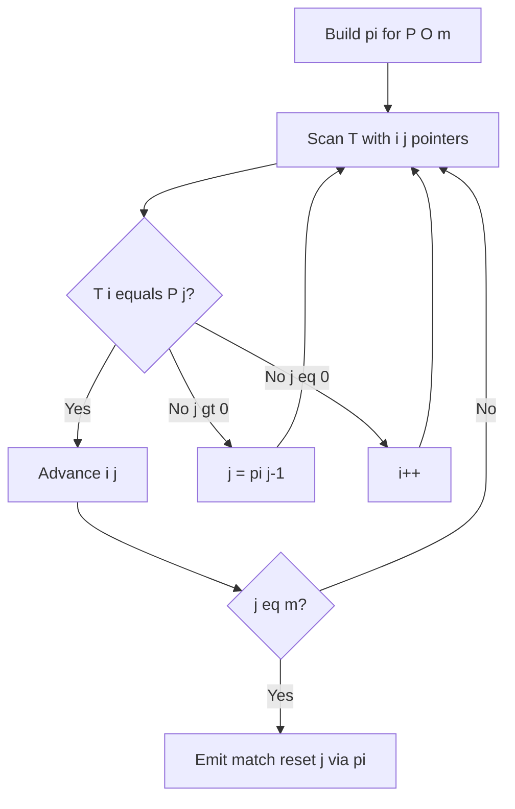
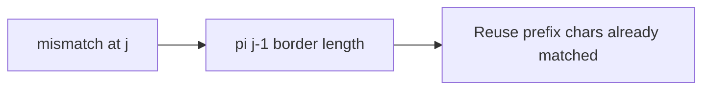
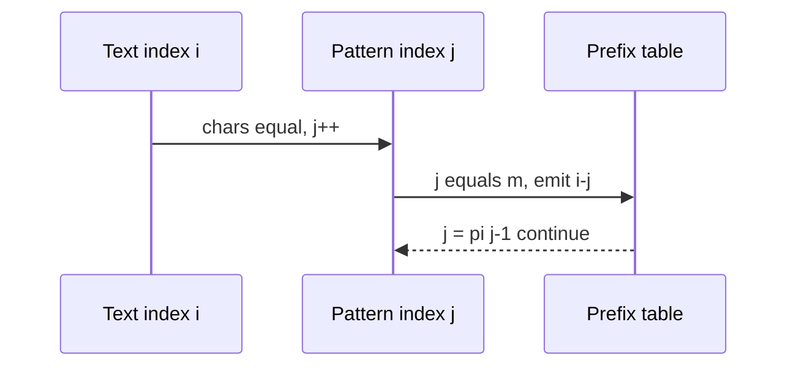

# KMP Prefix Function

## Overview

The **Knuth–Morris–Pratt (KMP)** algorithm matches pattern `P` in text `T` in `O(n + m)` time by precomputing the **prefix function** `π[i]`: the length of the longest proper prefix of `P[0..i]` that is also a suffix of that substring. On mismatch, KMP shifts the pattern using `π` instead of restarting from zero—never moving the text pointer backward.

Built on [[05-Algorithms/11-String-and-Sequence-Algorithms/Naive Matching and Prefix Structure|Naive Matching and Prefix Structure]].

## Learning Objectives

- Compute `π` in `O(m)` with two-pointer recurrence
- Run KMP search maintaining invariant on aligned prefix length
- Prove linear total time via amortized pointer movement
- Compare KMP vs Z-algorithm and rolling hash trade-offs
- Use KMP for single-pattern streaming search with fixed pattern

## Prerequisites

- [[05-Algorithms/11-String-and-Sequence-Algorithms/Naive Matching and Prefix Structure|Naive Matching and Prefix Structure]]
- [[05-Algorithms/00-Foundations-and-Correctness/Loop Invariants and Correctness Proofs|Loop Invariants and Correctness Proofs]]

## Difficulty

`intermediate`

## Estimated Time

- Reading: 1.5 hours
- Exercises: 3 hours
- Mini project: 4 hours

## History

Knuth, Morris, and Pratt published KMP in 1977, achieving linear time without backtracking in the text—critical for streaming tape models and still relevant for deterministic single-pattern search.

## Problem It Solves

**Intrusion detection signature scan** on network buffers: pattern fixed, text streams, need worst-case linear guarantee without hash collisions. **Repeated motif search** in bioinformatics pipelines where deterministic correctness beats expected-time hashing.

## Internal Implementation

### Prefix function construction

Maintain `length` = border length for current prefix; extend or fall back via `π[length-1]`.

### Search loop

Pointers `i` (text), `j` (pattern). On match, advance both; on mismatch with `j>0`, set `j = π[j-1]`; else advance `i`.



## Mermaid Diagrams

### Structure: border fallback chain



### Sequence: match and report



## Examples

### Minimal Example — KMP

```typescript
function buildPi(pattern: string): number[] {
  const m = pattern.length;
  const pi = Array(m).fill(0);
  for (let i = 1, len = 0; i < m; ) {
    if (pattern[i] === pattern[len]) pi[i++] = ++len;
    else if (len > 0) len = pi[len - 1];
    else pi[i++] = 0;
  }
  return pi;
}

function kmpSearch(text: string, pattern: string): number[] {
  if (pattern.length === 0) return [];
  const pi = buildPi(pattern);
  const hits: number[] = [];
  for (let i = 0, j = 0; i < text.length; ) {
    if (text[i] === pattern[j]) {
      i++;
      j++;
      if (j === pattern.length) {
        hits.push(i - j);
        j = pi[j - 1];
      }
    } else if (j > 0) j = pi[j - 1];
    else i++;
  }
  return hits;
}
```

```python
def build_pi(pattern: str) -> list[int]:
    m = len(pattern)
    pi = [0] * m
    length = 0
    i = 1
    while i < m:
        if pattern[i] == pattern[length]:
            length += 1
            pi[i] = length
            i += 1
        elif length:
            length = pi[length - 1]
        else:
            pi[i] = 0
            i += 1
    return pi


def kmp_search(text: str, pattern: str) -> list[int]:
    if not pattern:
        return []
    pi = build_pi(pattern)
    hits: list[int] = []
    j = 0
    for i, c in enumerate(text):
        while j and c != pattern[j]:
            j = pi[j - 1]
        if c == pattern[j]:
            j += 1
            if j == len(pattern):
                hits.append(i - j + 1)
                j = pi[j - 1]
    return hits
```

### Production-Shaped Example

**Static WAF rule**: compile `π` once per rule ID; scan request body chunks with carried `j` state across chunks—no text backtrack. For **many patterns**, prefer Aho–Corasick (multiple pattern automaton—beyond this note) or Rabin–Karp batching. Validate against naive matcher on regression corpus.

## Correctness

**Invariant (search)**: after processing `text[0..i-1]`, `j` equals length of longest prefix of `P` matching a suffix of processed text.

**On mismatch**: falling back to `π[j-1]` preserves matched prefix while trying next viable alignment—no valid match skipped.

**Termination**: `i` increases; `j` only decreases via `π` chain bounded by `m`. Total `O(n + m)`.

**Completeness**: every occurrence reported when loop finishes with standard reporting rule.

## Complexity

| Phase | Time | Space |
| --- | --- | --- |
| Build `π` | `O(m)` | `O(m)` |
| Search | `O(n)` | `O(1)` extra |
| Total | `O(n + m)` | `O(m)` |

No character of `T` is compared twice in a way that exceeds linear amortized bound.

## Trade-offs

| Dimension | KMP | Rabin–Karp | Z-algorithm |
| --- | --- | --- | --- |
| Worst-case | Deterministic linear | Hash collisions | Deterministic linear |
| Multi-pattern | Needs automaton ext | Natural batching | Less common |
| Preprocessing | `π` only | Hash params | Z on `P#T` |
| Numeric overflow | N/A | Mod arithmetic | N/A |

### When to Use

- Single pattern, streaming text, need guaranteed linear time
- Avoid probabilistic collision risk of hashing
- Carry search state across network chunks

### When Not to Use

- Very large static text, many queries → suffix structures ([[05-Algorithms/11-String-and-Sequence-Algorithms/Suffix Arrays and LCP Concepts|Suffix Arrays and LCP Concepts]])
- Dozens of patterns → Aho–Corasick
- Approximate/fuzzy match → DP edit distance ([[05-Algorithms/06-Dynamic-Programming/Longest Common Subsequence and Edit Distance|Longest Common Subsequence and Edit Distance]])

## Exercises

1. Compute `π` for `"aabaaab"` step by step.
2. Trace KMP on `T="ababaababa"`, `P="ababa"`; list comparisons count vs naive.
3. Prove `π[i] < i` for all `i > 0`.
4. Implement overlapping match reporting vs non-overlapping policy.
5. Show how KMP detects repeated prefix structure in failure function only.

## Mini Project

KMP module in [[05-Algorithms/projects/Text Search Toolkit/README|Text Search Toolkit]] with chunk-streaming API.

## Portfolio Project

WAF rule compiler storing serialized `π` arrays with versioned regression vectors.

## Interview Questions

1. What does `π[i]` mean in KMP?
2. Why never move text pointer backward?
3. Total time complexity and amortization sketch?
4. After full match at `j=m`, why set `j=π[j-1]`?
5. KMP vs Rabin–Karp when pattern length 10⁶?

### Stretch / Staff-Level

1. Build failure links for Aho–Corasick as multi-pattern generalization of `π`.

## Common Mistakes

- Off-by-one when reporting match index
- Infinite loop if `π` fallback missing when `j>0`
- Rebuilding `π` per text chunk instead of per pattern
- Expecting KMP to handle case-insensitive without normalization

## Best Practices

- Precompute `π` once per pattern; persist in compiled rule
- Test against naive on random + periodic adversarial strings
- Document overlapping match policy
- Pair with prefix note vocabulary for teach-back

## Summary

KMP achieves linear string matching by precomputing the prefix function and using it to shift the pattern on mismatches without backtracking in the text. Correctness rests on a loop invariant tying matched prefix length to the text scan index; production use favors KMP when deterministic worst-case guarantees matter for single-pattern streaming search.

## Further Reading

- [[05-Algorithms/11-String-and-Sequence-Algorithms/Z Algorithm|Z Algorithm]]
- [[05-Algorithms/11-String-and-Sequence-Algorithms/Rabin-Karp and Rolling Hash|Rabin-Karp and Rolling Hash]]

## Related Notes

- [[05-Algorithms/11-String-and-Sequence-Algorithms/Naive Matching and Prefix Structure|Naive Matching and Prefix Structure]]
- [[05-Algorithms/11-String-and-Sequence-Algorithms/Z Algorithm|Z Algorithm]]
- [[05-Algorithms/00-Foundations-and-Correctness/Loop Invariants and Correctness Proofs|Loop Invariants and Correctness Proofs]]
- [[05-Algorithms/README|Algorithms]]

## Progress Checklist

- [ ] Explained from first principles
- [ ] Drew at least one Mermaid diagram
- [ ] Implemented a minimal version
- [ ] Documented trade-offs and non-goals
- [ ] Completed exercises
- [ ] Practiced interview questions aloud
- [ ] Linked prerequisites and dependents
