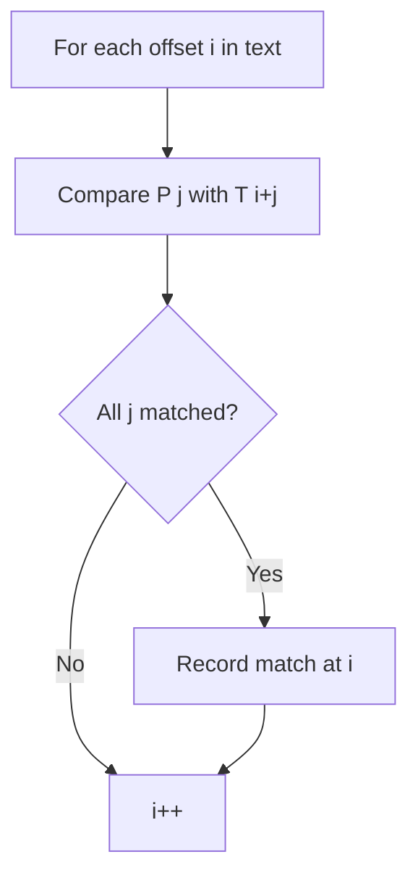
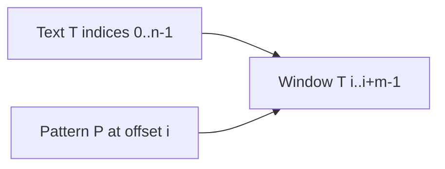
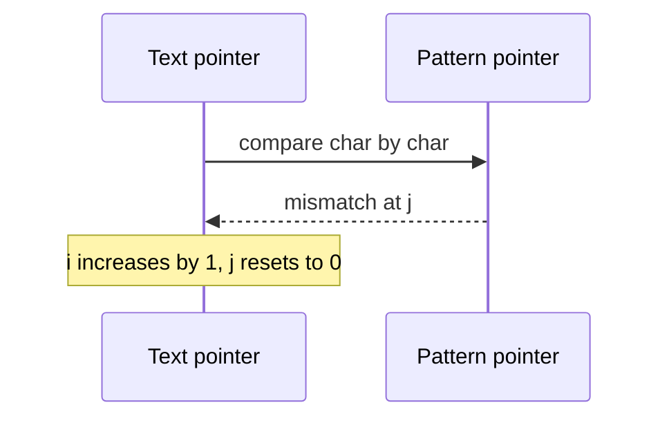

# Naive Matching and Prefix Structure

## Overview

**Naive string matching** compares a pattern `P` (length `m`) to every offset in text `T` (length `n`) by checking up to `m` characters per offset—`O(nm)` worst case. The inefficiency comes from **recomputing** overlap information after mismatches. **Prefix structure** (longest proper prefix that is also suffix) is the shared foundation for KMP, Z-algorithm, and advanced indexes—this note establishes that vocabulary before optimized matchers.

String storage as tries or suffix trees lives in [[04-Data-Structures/README|Data Structures]]; this track owns **matching algorithms**.

## Learning Objectives

- Implement naive matching with explicit mismatch handling
- Define prefixes, suffixes, and border overlap informally
- Identify worst-case inputs for naive matching (periodic strings)
- Motivate prefix tables as amortized skip metadata
- Choose naive vs advanced matchers by `n`, `m`, and query pattern

## Prerequisites

- [[01-Computer-Science/01-Information-and-Representation/Bits Bytes and Information|Bits Bytes and Information]]
- [[05-Algorithms/02-Searching-and-Selection/Linear Search and Sentinels|Linear Search and Sentinels]]

## Difficulty

`beginner`

## Estimated Time

- Reading: 1 hour
- Exercises: 2 hours
- Mini project: 3 hours

## History

Brute-force matching predates computing; Knuth–Morris–Pratt (1977) and later Z/Rabin–Karp exploited prefix structure to achieve linear time. Naive matching remains valid for tiny inputs, teaching, and as correctness oracle in tests.

## Problem It Solves

**Log grep on small files**: scan for error token—naive acceptable when `n·m` bounded. **Test oracle**: golden implementation for randomized string property tests. **Education**: exposes why overlap matters before KMP ([[05-Algorithms/11-String-and-Sequence-Algorithms/KMP Prefix Function|KMP Prefix Function]]).

## Internal Implementation

### Naive algorithm

For each start `i ∈ [0, n-m]`:
- Compare `P[j]` with `T[i+j]` for `j = 0..m-1`
- On full match, record `i`; on mismatch, increment `i`

### Prefix intuition

When mismatch at `P[j]`, if a **border** of length `b` exists (`P[0..b-1] === P[j-b..j-1]`), next alignment may skip to continue comparing from `P[b]` instead of restarting at `P[0]`.



## Mermaid Diagrams

### Structure: text and pattern alignment



### Sequence: mismatch restart (naive)



## Examples

### Minimal Example — naive matching

```typescript
function naiveMatch(text: string, pattern: string): number[] {
  const n = text.length;
  const m = pattern.length;
  const hits: number[] = [];
  if (m === 0) return hits;
  for (let i = 0; i <= n - m; i++) {
    let j = 0;
    while (j < m && text[i + j] === pattern[j]) j++;
    if (j === m) hits.push(i);
  }
  return hits;
}

function borderLength(pattern: string): number[] {
  const m = pattern.length;
  const pi = Array(m).fill(0);
  for (let i = 1, len = 0; i < m; ) {
    if (pattern[i] === pattern[len]) {
      pi[i++] = ++len;
    } else if (len > 0) {
      len = pi[len - 1];
    } else {
      pi[i++] = 0;
    }
  }
  return pi;
}
```

```python
def naive_match(text: str, pattern: str) -> list[int]:
    n, m = len(text), len(pattern)
    hits: list[int] = []
    if m == 0:
        return hits
    for i in range(n - m + 1):
        j = 0
        while j < m and text[i + j] == pattern[j]:
            j += 1
        if j == m:
            hits.append(i)
    return hits


def border_length(pattern: str) -> list[int]:
    m = len(pattern)
    pi = [0] * m
    length = 0
    i = 1
    while i < m:
        if pattern[i] == pattern[length]:
            length += 1
            pi[i] = length
            i += 1
        elif length:
            length = pi[length - 1]
        else:
            pi[i] = 0
            i += 1
    return pi
```

### Production-Shaped Example

**Config flag scanner** on 4 KB YAML snippets: naive match for `"feature_flag:"` is fine. **High-QPS log pipeline** on GB/s streams: use KMP or Rabin–Karp rolling hash ([[05-Algorithms/11-String-and-Sequence-Algorithms/Rabin-Karp and Rolling Hash|Rabin-Karp and Rolling Hash]]) with chunk boundaries. Always unit-test optimized matcher against naive on shared vectors in [[05-Algorithms/projects/Text Search Toolkit/README|Text Search Toolkit]].

## Correctness

**Naive**: enumerates all offsets; match declared iff all `m` characters equal at offset `i`. No false positives or negatives.

**Border/prefix table**: `pi[i]` equals length of longest proper prefix of `P[0..i]` that is also suffix of that substring—foundation for KMP's skip rule (proved in KMP note).

**Worst case**: `T = "aaaa...a"`, `P = "aaa...ab"` forces `O(nm)` comparisons.

## Complexity

| Algorithm | Time | Space |
| --- | --- | --- |
| Naive matching | `O(n m)` worst, `O(n + m)` best skew | `O(1)` extra |
| Prefix table build | `O(m)` | `O(m)` |

Average case on random ASCII often closer to `O(n)` for small `m`.

## Trade-offs

| Dimension | Naive | KMP / Z / rolling hash |
| --- | --- | --- |
| Implementation | Trivial | Moderate |
| Worst-case time | `O(nm)` | `O(n + m)` or expected linear |
| Oracle value | Gold standard | Must match naive tests |
| When `m` tiny | Often fastest constants | Overhead not worth it |

### When to Use

- Small `n`, `m`, or infrequent scans
- Reference implementation in tests
- Teaching prefix border concept before optimized algorithms

### When Not to Use

- Adversarial periodic inputs at scale
- Many patterns simultaneously → multi-pattern engines or indexes
- Substring dictionary on static corpus → suffix array ([[05-Algorithms/11-String-and-Sequence-Algorithms/Suffix Arrays and LCP Concepts|Suffix Arrays and LCP Concepts]])

## Exercises

1. Count character comparisons naive matching `T="ababcababa"`, `P="ababa"`.
2. Build prefix table for `"ababa"` by hand; verify borders at each index.
3. Construct `T,P` achieving `Θ(nm)` naive comparisons.
4. Prove naive matching correct via loop invariant on offset `i`.
5. When does `m=1` reduce naive to linear scan?

## Mini Project

Add naive + prefix-table builder to Text Search Toolkit with shared JSON vectors.

## Portfolio Project

Micro-benchmark report: naive vs KMP crossover point on your hardware for varying `m`.

## Interview Questions

1. Naive string matching complexity?
2. What is a border / prefix function informally?
3. Worst-case input for naive matching?
4. Why keep naive in production codebases?
5. Difference between substring and subsequence?

### Stretch / Staff-Level

1. Relate prefix table to automaton states in KMP—preview only.

## Common Mistakes

- Off-by-one on last valid offset (`n - m`, not `n`)
- Empty pattern handling (match every index vs none—define contract)
- Assuming average case equals worst case for security scanning
- Confusing prefix table with Z-array ([[05-Algorithms/11-String-and-Sequence-Algorithms/Z Algorithm|Z Algorithm]])

## Best Practices

- Define empty-pattern and case-folding policy in spec
- Use naive as test oracle for optimized matchers
- Precompute prefix table once when pattern fixed, text streams
- Cross-link to LCS note when matching is DP not substring scan ([[05-Algorithms/06-Dynamic-Programming/Longest Common Subsequence and Edit Distance|Longest Common Subsequence and Edit Distance]])

## Summary

Naive matching checks every text offset against the pattern—simple and correct but quadratic in worst case. Prefix structure captures overlap between pattern prefixes and suffixes, enabling linear-time matchers. Start naive for clarity and tests; upgrade when inputs or adversarial structure demand KMP, Z, or rolling hash.

## Further Reading

- [[05-Algorithms/11-String-and-Sequence-Algorithms/KMP Prefix Function|KMP Prefix Function]]
- [[05-Algorithms/11-String-and-Sequence-Algorithms/Z Algorithm|Z Algorithm]]

## Related Notes

- [[05-Algorithms/02-Searching-and-Selection/Linear Search and Sentinels|Linear Search and Sentinels]]
- [[05-Algorithms/11-String-and-Sequence-Algorithms/KMP Prefix Function|KMP Prefix Function]]
- [[05-Algorithms/06-Dynamic-Programming/Longest Common Subsequence and Edit Distance|Longest Common Subsequence and Edit Distance]]
- [[05-Algorithms/projects/Text Search Toolkit/README|Text Search Toolkit]]
- [[05-Algorithms/README|Algorithms]]

## Progress Checklist

- [ ] Explained from first principles
- [ ] Drew at least one Mermaid diagram
- [ ] Implemented a minimal version
- [ ] Documented trade-offs and non-goals
- [ ] Completed exercises
- [ ] Practiced interview questions aloud
- [ ] Linked prerequisites and dependents
