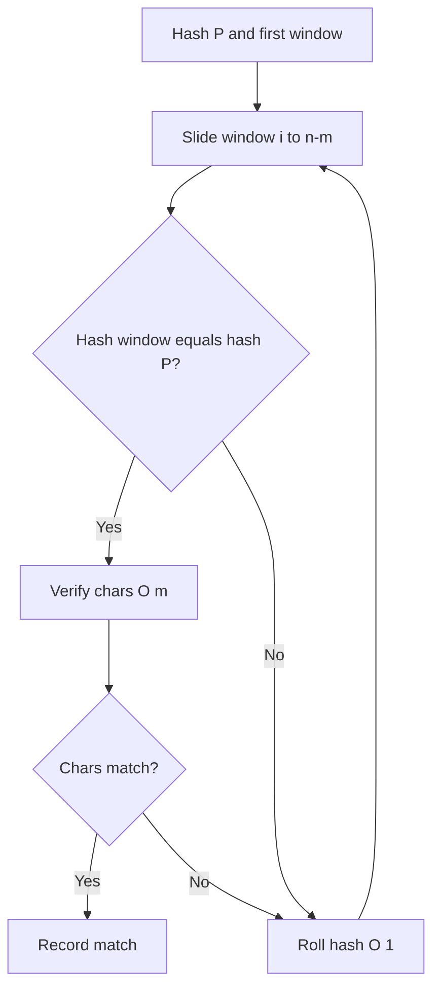
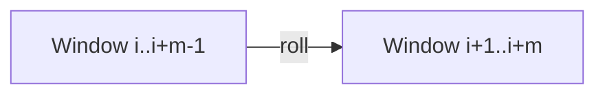
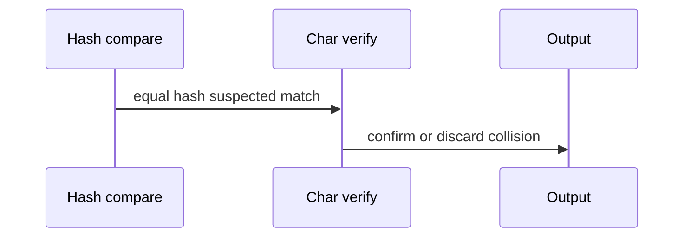

# Rabin-Karp and Rolling Hash

## Overview

**Rabin–Karp** matches by comparing **rolling hashes** of length-`m` windows in text `T` against hash of pattern `P`. Hash equality suggests a match; **verify** with direct character comparison to handle collisions. Expected time `O(n + m)` with good hash parameters; worst-case `O(nm)` if every window collides adversarially.

Rolling hash also powers substring equality queries, plagiarism detection, and duplicate file chunking—distinct from trie/suffix structures in [[04-Data-Structures/README|Data Structures]].

## Learning Objectives

- Implement polynomial rolling hash with modular arithmetic
- Update hash in `O(1)` per window shift
- Analyze collision probability and mandatory verification step
- Batch-match multiple patterns via shared hash map
- Choose primes/moduli for production reproducibility ([[05-Algorithms/12-Randomized-Approximation-and-Online/Randomized Algorithms and Reproducible RNG|Reproducible RNG]] for randomized base)

## Prerequisites

- [[05-Algorithms/11-String-and-Sequence-Algorithms/Naive Matching and Prefix Structure|Naive Matching and Prefix Structure]]
- [[01-Computer-Science/01-Information-and-Representation/Bits Bytes and Information|Bits Bytes and Information]]

## Difficulty

`intermediate`

## Estimated Time

- Reading: 1.5 hours
- Exercises: 3 hours
- Mini project: 4 hours

## History

Rabin and Karp (1987) applied fingerprinting to string search. Rolling hashes underpin rsync block signatures, Git pack hashing ideas, and competitive programming substring tricks.

## Problem It Solves

**Multi-pattern grep**: hash all patterns into a set; scan text once. **Plagiarism windows**: compare document chunks via hash buckets before expensive diff. **Streaming approximate filter**: cheap negative filter before KMP verify.

## Internal Implementation

### Polynomial hash

`H(s) = (s[0]·B^(m-1) + s[1]·B^(m-2) + ... ) mod M`

### Rolling update

Remove leading char, multiply by `B`, add trailing char, mod `M`. Precompute `B^(m-1) mod M`.



## Mermaid Diagrams

### Structure: window slide



### Sequence: hash then verify



## Examples

### Minimal Example — Rabin–Karp

```typescript
function rabinKarp(text: string, pattern: string, base = 256, mod = 1_000_000_007): number[] {
  const n = text.length;
  const m = pattern.length;
  const hits: number[] = [];
  if (m === 0 || m > n) return hits;

  let ph = 0;
  let wh = 0;
  let high = 1;
  for (let i = 0; i < m - 1; i++) high = (high * base) % mod;
  for (let i = 0; i < m; i++) {
    ph = (ph * base + pattern.charCodeAt(i)) % mod;
    wh = (wh * base + text.charCodeAt(i)) % mod;
  }
  for (let i = 0; i <= n - m; i++) {
    if (ph === wh) {
      let ok = true;
      for (let j = 0; j < m; j++) {
        if (text[i + j] !== pattern[j]) {
          ok = false;
          break;
        }
      }
      if (ok) hits.push(i);
    }
    if (i < n - m) {
      wh = (wh - text.charCodeAt(i) * high) % mod;
      wh = (wh * base + text.charCodeAt(i + m)) % mod;
      if (wh < 0) wh += mod;
    }
  }
  return hits;
}
```

```python
def rabin_karp(text: str, pattern: str, base: int = 256, mod: int = 1_000_000_007) -> list[int]:
    n, m = len(text), len(pattern)
    if m == 0 or m > n:
        return []
    high = pow(base, m - 1, mod)
    ph = wh = 0
    for i in range(m):
        ph = (ph * base + ord(pattern[i])) % mod
        wh = (wh * base + ord(text[i])) % mod
    hits: list[int] = []
    for i in range(n - m + 1):
        if ph == wh and text[i : i + m] == pattern:
            hits.append(i)
        if i < n - m:
            wh = (wh - ord(text[i]) * high) % mod
            wh = (wh * base + ord(text[i + m])) % mod
    return hits
```

### Production-Shaped Example

**Duplicate chunk finder**: rolling hash 64-byte windows, bucket by hash, confirm with SHA-256 on collisions only. Use **two moduli** or 64-bit random base to drive collision probability negligible; still verify bytes for legal evidence chain. Log hash parameters in config for reproducibility audits.

## Correctness

**Soundness**: reported matches verified by direct comparison—no false positives after verify.

**Completeness**: every true match has equal hash if hash function consistent—if hash differs, skip is safe.

**Collisions**: equal hash without match possible; verification restores correctness.

**Adversarial text**: crafted collisions force many verifies → quadratic; mitigate with double hashing or KMP fallback.

## Complexity

| Case | Time | Notes |
| --- | --- | --- |
| Expected | `O(n + m)` | Few collisions |
| Worst | `O(n m)` | All windows collide |
| Space | `O(1)` extra | Plus pattern set for multi-match |

## Trade-offs

| Dimension | Rabin–Karp | KMP |
| --- | --- | --- |
| Worst-case guarantee | No | Yes |
| Multi-pattern | Strong | Weak alone |
| Numeric care | Mod overflow | None |
| Verification | Required | Direct |

### When to Use

- Many patterns, one pass
- Rolling window fingerprinting (dedup, sync)
- Filter before expensive equality

### When Not to Use

- Adversarial inputs without double hash
- Cryptographic integrity (use SHA-256, not rolling hash)
- Need deterministic worst-case linear only

## Exercises

1. Roll hash by hand for `T="ababa"`, `P="aba"`, `B=10`, small mod.
2. Estimate collision probability with mod `10^9+7`, random text.
3. Implement two-moduli Rabin–Karp; measure false verify rate.
4. Extend to return all patterns from dictionary matching window.
5. Why subtract leading term before multiply in roll formula?

## Mini Project

Multi-pattern scanner in Text Search Toolkit using hash map of pattern hashes.

## Portfolio Project

Content-defined chunking prototype (rsync-style) with rolling hash boundaries.

## Interview Questions

1. How does rolling hash update in O(1)?
2. Why verify after hash match?
3. Worst-case complexity of Rabin–Karp?
4. Advantage over KMP for many patterns?
5. Double hashing purpose?

### Stretch / Staff-Level

1. Relate rolling hash to universal hashing families—collision bounds sketch.

## Common Mistakes

- Skipping verification on hash hit
- Negative mod mishandling in TypeScript/Python
- Single small modulus on adversarial input
- Using non-fixed random base across services (reproducibility break)

## Best Practices

- Always verify candidate windows
- Document `{base, mod}` in config; use two moduli for high stakes
- Fall back to KMP on pathological verify rates
- Separate rolling fingerprint from cryptographic hash

## Summary

Rabin–Karp accelerates string matching by comparing rolling polynomial hashes window-by-window, confirming candidates with direct character checks. Expected linear performance and natural multi-pattern batching come at the cost of collision handling and weaker worst-case guarantees than KMP.

## Further Reading

- [[05-Algorithms/11-String-and-Sequence-Algorithms/KMP Prefix Function|KMP Prefix Function]]
- [[05-Algorithms/12-Randomized-Approximation-and-Online/Randomized Algorithms and Reproducible RNG|Randomized Algorithms and Reproducible RNG]]

## Related Notes

- [[05-Algorithms/11-String-and-Sequence-Algorithms/KMP Prefix Function|KMP Prefix Function]]
- [[05-Algorithms/11-String-and-Sequence-Algorithms/Suffix Arrays and LCP Concepts|Suffix Arrays and LCP Concepts]]
- [[05-Algorithms/03-Sorting/Counting Radix and Bucket Sort|Counting Radix and Bucket Sort]]
- [[05-Algorithms/README|Algorithms]]

## Progress Checklist

- [ ] Explained from first principles
- [ ] Drew at least one Mermaid diagram
- [ ] Implemented a minimal version
- [ ] Documented trade-offs and non-goals
- [ ] Completed exercises
- [ ] Practiced interview questions aloud
- [ ] Linked prerequisites and dependents
