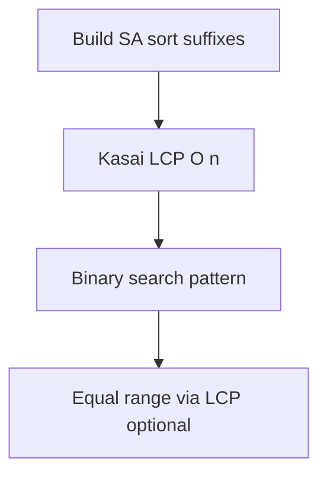
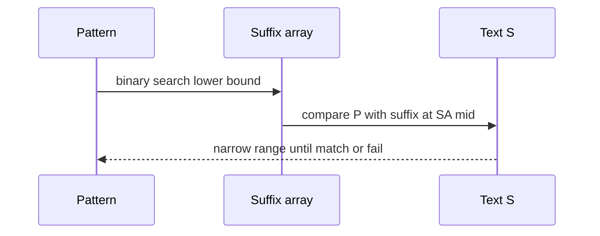

# Suffix Arrays and LCP Concepts

## Overview

A **suffix array** `SA` stores indices of all suffixes of string `S` in **lexicographic order**. With the **LCP array** (longest common prefix between adjacent suffixes in SA order), it supports powerful **offline** string queries: pattern search, repeated substring analysis, and building blocks toward suffix trees—without storing the full tree.

This note teaches **invariants and concepts** with diagrams; industrial construction (`O(n log n)` or `O(n)`) may use library implementations. Trie/suffix-tree **storage** → [[04-Data-Structures/README|Data Structures]].

## Learning Objectives

- Define suffix array and LCP array precisely
- Explain why sorted suffix indices enable binary search for patterns
- Sketch Kasai `O(n)` LCP from suffix array
- Relate LCP to longest repeated substring problems
- Choose suffix array vs KMP/rolling hash by query/static trade-off

## Prerequisites

- [[05-Algorithms/03-Sorting/Merge Sort|Merge Sort]]
- [[05-Algorithms/11-String-and-Sequence-Algorithms/Naive Matching and Prefix Structure|Naive Matching and Prefix Structure]]

## Difficulty

`advanced`

## Estimated Time

- Reading: 2 hours
- Exercises: 4 hours
- Mini project: 5 hours

## History

Manber and Myers (1990s) developed efficient suffix array construction. Kasai et al. (2001) linear LCP algorithm. Suffix arrays replaced suffix trees in many bioinformatics pipelines due to memory efficiency.

## Problem It Solves

**Static corpus indexing**: build once on 100 MB log archive; answer thousands of substring queries. **Repeat detection**: mining longest repeated substrings via LCP maxima. Wrong tool: streaming single-pass scan → KMP/Rabin–Karp instead.

## Internal Implementation

### Suffix array

`SA[k]` = starting index of k-th smallest suffix lexicographically.

### Pattern search

Binary search on `SA` comparing `P` with `S[SA[mid]..]` as key.

### LCP array

`LCP[0]=0`; `LCP[i]` = length of common prefix of suffixes at `SA[i-1]` and `SA[i]`.

**Kasai idea**: walk suffixes in original order; decrement running match length using inverse suffix array rank.



## Mermaid Diagrams

### Structure: suffix ordering


### Sequence: pattern binary search



## Examples

### Minimal Example — build SA naively + search

```typescript
function buildSuffixArrayNaive(s: string): number[] {
  const n = s.length;
  return Array.from({ length: n }, (_, i) => i).sort((a, b) =>
    s.slice(a).localeCompare(s.slice(b)),
  );
}

function suffixArraySearch(s: string, sa: number[], pattern: string): number[] {
  const n = s.length;
  let lo = 0;
  let hi = n;
  while (lo < hi) {
    const mid = (lo + hi) >> 1;
    const suffix = s.slice(sa[mid]);
    if (suffix < pattern) lo = mid + 1;
    else hi = mid;
  }
  const hits: number[] = [];
  for (let i = lo; i < n; i++) {
    if (!s.slice(sa[i]).startsWith(pattern)) break;
    hits.push(sa[i]);
  }
  return hits;
}
```

```python
def build_suffix_array_naive(s: str) -> list[int]:
    return sorted(range(len(s)), key=lambda i: s[i:])


def lcp_kasai(s: str, sa: list[int]) -> list[int]:
    n = len(s)
    rank = [0] * n
    for i, pos in enumerate(sa):
        rank[pos] = i
    lcp = [0] * n
    k = 0
    for i in range(n):
        if rank[i] == 0:
            k = 0
            continue
        j = sa[rank[i] - 1]
        while i + k < n and j + k < n and s[i + k] == s[j + k]:
            k += 1
        lcp[rank[i]] = k
        if k:
            k -= 1
    return lcp
```

### Production-Shaped Example

**Log archaeology service**: nightly build SA + LCP on rotated logs (`n≈10⁸`) using specialized `O(n)` builder (libdivsufsort class), store SA on disk mmap'd. Queries binary search + expand range. **Do not** use naive `O(n² log n)` sort in production. For live tail grep, use Rabin–Karp streaming path ([[05-Algorithms/11-String-and-Sequence-Algorithms/Rabin-Karp and Rolling Hash|Rabin-Karp]]).

## Correctness

**Suffix order**: `SA` permutation of `[0..n-1]` with lexicographic non-decreasing suffix keys.

**Binary search**: standard lower-bound finds first suffix starting with `P` if any exist; scan forward while prefix matches.

**LCP invariant**: `LCP[i]` equals longest common prefix of adjacent entries in SA order—enables repeat detection: max LCP equals longest repeated substring length (among adjacent SA neighbors, sufficient for at least one repeat witness).

## Complexity

| Operation | Naive teaching | Production |
| --- | --- | --- |
| Build SA | `O(n² log n)` sort | `O(n log n)` or `O(n)` |
| Build LCP (Kasai) | `O(n)` | `O(n)` |
| Pattern search | `O(m log n + occ)` | Same |
| Space | `O(n)` | `O(n)` |

## Trade-offs

| Dimension | Suffix array | KMP / Rabin–Karp |
| --- | --- | --- |
| Preprocessing | Heavy | Light |
| Query many | Fast | Rescan text |
| Dynamic text | Rebuild | Natural |
| Implementation | Complex builders | Simpler |

### When to Use

- Static or rarely changing large text
- Many substring / repeat queries
- Memory acceptable for `O(n)` index

### When Not to Use

- Single-pass streaming only
- Frequent text updates without incremental index
- Small `n` where scan suffices

## Exercises

1. Build SA by hand for `"banana$"`.
2. Run Kasai LCP on same string; identify longest repeat via max LCP.
3. Binary search steps for pattern `"na"` in `"banana$"`.
4. Why append sentinel `$` in bioinformatics strings?
5. Compare SA memory to explicit suffix tree nodes asymptotically.

## Mini Project

Suffix array + LCP builder (naive OK for toolkit) in Text Search Toolkit with pattern search API.

## Portfolio Project

Static log index service: mmap SA, HTTP substring query, rebuild job metrics.

## Interview Questions

1. What is a suffix array?
2. Purpose of LCP array?
3. Pattern search complexity with SA?
4. Kasai algorithm time?
5. SA vs suffix tree trade-off?

### Stretch / Staff-Level

1. Outline doubling construction (`O(n log n)`)—rank pairs of length `2^k`.

## Common Mistakes

- Naive SA build on large `n` in production
- Forgetting sentinel for identical suffix prefixes
- Assuming max LCP over all pairs without explaining adjacent-SA witness
- Using SA on continuously mutating buffer without rebuild strategy

## Best Practices

- Append unique sentinel smaller than all chars
- Store `{SA, LCP, n, buildVersion}` metadata
- Use library `O(n)` construction at scale
- Pair static index with streaming matcher for live tail

## Summary

Suffix arrays lexicographically sort suffix start indices, enabling `O(m log n)` pattern search on static text. The LCP array captures longest common prefixes between neighbors in SA order—key for repeat analysis and advanced string indexes. Conceptual mastery of invariants matters; production adopts linear-time construction and mmap storage.

## Further Reading

- [[05-Algorithms/11-String-and-Sequence-Algorithms/Rabin-Karp and Rolling Hash|Rabin-Karp and Rolling Hash]]
- [[05-Algorithms/03-Sorting/External Sorting Concepts and Production Selection|External Sorting Concepts and Production Selection]]

## Related Notes

- [[05-Algorithms/03-Sorting/Merge Sort|Merge Sort]]
- [[05-Algorithms/11-String-and-Sequence-Algorithms/KMP Prefix Function|KMP Prefix Function]]
- [[05-Algorithms/11-String-and-Sequence-Algorithms/Rabin-Karp and Rolling Hash|Rabin-Karp and Rolling Hash]]
- [[05-Algorithms/projects/Text Search Toolkit/README|Text Search Toolkit]]
- [[05-Algorithms/README|Algorithms]]

## Progress Checklist

- [ ] Explained from first principles
- [ ] Drew at least one Mermaid diagram
- [ ] Implemented a minimal version
- [ ] Documented trade-offs and non-goals
- [ ] Completed exercises
- [ ] Practiced interview questions aloud
- [ ] Linked prerequisites and dependents
