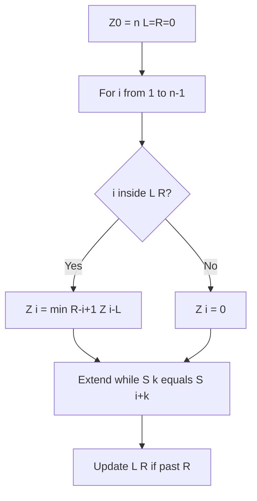
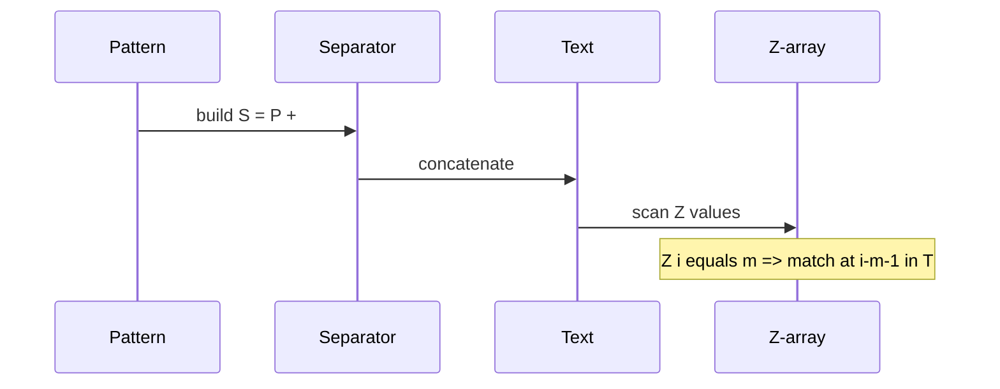

# Z Algorithm

## Overview

The **Z-algorithm** computes the **Z-array** for a string `S`: `Z[i]` is the length of the longest substring starting at `i` that matches a prefix of `S`. For pattern matching, form `S = P + "#" + T` (separator not in alphabet); matches occur where `Z[i] = |P|`. Like KMP, total time is **linear**, but Z exposes **global prefix similarity** in one pass—useful for analysis and some construction problems.

## Learning Objectives

- Compute Z-array in `O(n)` using `[L, R]` farthest Z-box
- Match pattern via concatenated string technique
- Relate Z-values to prefix borders and periodicity detection
- Compare Z vs KMP implementation clarity and use cases
- Apply Z to string periodicity and compression preprocessing

## Prerequisites

- [[05-Algorithms/11-String-and-Sequence-Algorithms/Naive Matching and Prefix Structure|Naive Matching and Prefix Structure]]
- [[05-Algorithms/11-String-and-Sequence-Algorithms/KMP Prefix Function|KMP Prefix Function]]

## Difficulty

`intermediate`

## Estimated Time

- Reading: 1.5 hours
- Exercises: 3 hours
- Mini project: 4 hours

## History

Gusfield popularized the Z-algorithm in string algorithm curricula as a dual view to KMP prefix functions. It appears in competitive programming and suffix-array construction intuition.

## Problem It Solves

**Pattern matching with prefix diagnostics**: need both match positions and how much of prefix each suffix shares—Z on concatenated string answers in one array. **Period detection**: string has period `p` iff `Z[p] = n - p` under conditions on full string.

## Internal Implementation

### Z-box invariant

Maintain interval `[L, R]` of the current rightmost Z-segment aligned with prefix. For position `i`:
- If inside box, seed from symmetric `Z[i-L]`
- Extend by naive compare while characters match
- Update `[L,R]` when extending past `R`



## Mermaid Diagrams

### Structure: Z-box alignment


### Sequence: pattern match via concat



## Examples

### Minimal Example — Z-array + search

```typescript
function zArray(s: string): number[] {
  const n = s.length;
  const z = Array(n).fill(0);
  let l = 0,
    r = 0;
  for (let i = 1; i < n; i++) {
    if (i <= r) z[i] = Math.min(r - i + 1, z[i - l]);
    while (i + z[i] < n && s[z[i]] === s[i + z[i]]) z[i]++;
    if (i + z[i] - 1 > r) {
      l = i;
      r = i + z[i] - 1;
    }
  }
  return z;
}

function zSearch(text: string, pattern: string): number[] {
  const m = pattern.length;
  if (m === 0) return [];
  const sep = "\0";
  const s = pattern + sep + text;
  const z = zArray(s);
  const hits: number[] = [];
  for (let i = m + 1; i < s.length; i++) {
    if (z[i] === m) hits.push(i - m - 1);
  }
  return hits;
}
```

```python
def z_array(s: str) -> list[int]:
    n = len(s)
    z = [0] * n
    l = r = 0
    for i in range(1, n):
        if i <= r:
            z[i] = min(r - i + 1, z[i - l])
        while i + z[i] < n and s[z[i]] == s[i + z[i]]:
            z[i] += 1
        if i + z[i] - 1 > r:
            l, r = i, i + z[i] - 1
    return z


def z_search(text: str, pattern: str) -> list[int]:
    if not pattern:
        return []
    sep = "\0"
    combined = pattern + sep + text
    z = z_array(combined)
    m = len(pattern)
    return [i - m - 1 for i in range(m + 1, len(combined)) if z[i] == m]
```

### Production-Shaped Example

**Genomics motif scan**: alphabet ACGT—use `$` separator guaranteed absent. Z on `P$T` for batch offline analysis; for streaming live feeds prefer KMP carrying `j` state. Memory `O(m + n)` for concatenated string—avoid materializing full concat for multi-GB text; use KMP or rolling hash instead.

## Correctness

**Z-box lemma**: values copied from symmetric positions inside `[L,R]` are valid lower bounds; extension completes exact longest prefix match.

**Amortized analysis**: `r` only increases; total character comparisons `O(n)`.

**Pattern reduction**: match at text index `k` iff longest prefix match of `P` starting at `P#T[m+1+k]` has length `m`.

## Complexity

| Operation | Time | Space |
| --- | --- | --- |
| Z-array on length `n` | `O(n)` | `O(n)` |
| Pattern search | `O(m + n)` | `O(m + n)` concat |

## Trade-offs

| Dimension | Z-algorithm | KMP |
| --- | --- | --- |
| Extra memory | Full Z on concat | `π` size `m` |
| Insight | Global prefix similarity | Local failure function |
| Streaming | Poor (needs concat) | Good |
| Period analysis | Natural | Via `π` |

### When to Use

- Offline analysis needing Z-array itself
- Educational parallel to prefix function
- Period / repetition detection on full string

### When Not to Use

- Streaming text without storing concat
- Memory-tight multi-GB scans
- Multi-pattern dictionaries

## Exercises

1. Compute Z for `"aabxaabxcaabxaabxay"` by hand for first five indices.
2. Prove total extension inner loop is `O(n)`.
3. Derive period `p` condition from Z-array.
4. Compare comparison counts Z vs KMP on same inputs.
5. Why must separator not appear in `T` or `P`?

## Mini Project

Add Z matcher + period detector to Text Search Toolkit; compare to KMP vectors.

## Portfolio Project

Repeat-region report for log deduplication using Z-threshold clusters.

## Interview Questions

1. Define `Z[i]` precisely.
2. Role of `[L, R]` Z-box?
3. How reduce matching to Z on concatenated string?
4. Z vs KMP time and space?
5. Detect smallest period using Z?

### Stretch / Staff-Level

1. Sketch how Z intuition appears in suffix array doubling constructions.

## Common Mistakes

- Separator character appearing in text
- Forgetting `Z[0]` is usually undefined or `n`—do not use for matching
- Quadratic implementation without box optimization
- Using Z on streaming API without memory budget

## Best Practices

- Choose separator outside alphabet explicitly in spec
- Fall back to KMP for chunked streaming
- Cross-validate matches with naive on test corpus
- Export Z-array only when downstream analysis needs it

## Summary

The Z-algorithm computes longest prefix matches for every suffix in linear time using a Z-box invariant. Pattern matching embeds `P#T` and reads off positions where Z equals pattern length. Z shines in offline analysis and period detection; KMP or rolling hash often fit streaming production constraints better.

## Further Reading

- [[05-Algorithms/11-String-and-Sequence-Algorithms/Suffix Arrays and LCP Concepts|Suffix Arrays and LCP Concepts]]
- [[05-Algorithms/11-String-and-Sequence-Algorithms/KMP Prefix Function|KMP Prefix Function]]

## Related Notes

- [[05-Algorithms/11-String-and-Sequence-Algorithms/KMP Prefix Function|KMP Prefix Function]]
- [[05-Algorithms/11-String-and-Sequence-Algorithms/Rabin-Karp and Rolling Hash|Rabin-Karp and Rolling Hash]]
- [[05-Algorithms/11-String-and-Sequence-Algorithms/Naive Matching and Prefix Structure|Naive Matching and Prefix Structure]]
- [[05-Algorithms/README|Algorithms]]

## Progress Checklist

- [ ] Explained from first principles
- [ ] Drew at least one Mermaid diagram
- [ ] Implemented a minimal version
- [ ] Documented trade-offs and non-goals
- [ ] Completed exercises
- [ ] Practiced interview questions aloud
- [ ] Linked prerequisites and dependents
