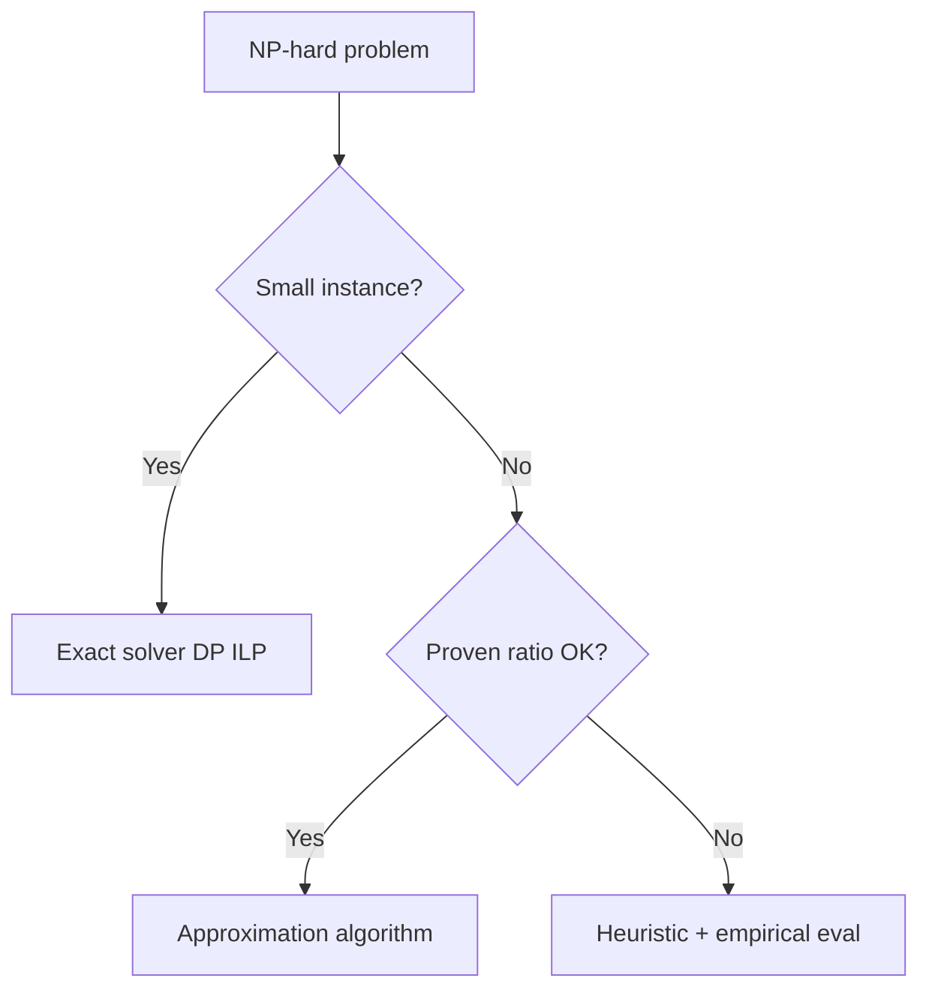
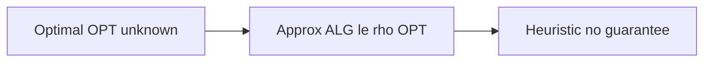
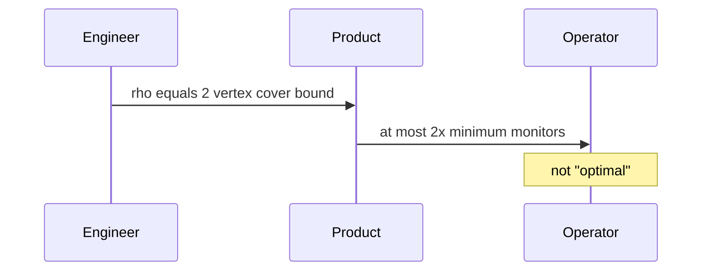

# Approximation Ratios and Heuristics

## Overview

When problems are **NP-hard** (TSP, vertex cover, set cover), exact optimality may be intractable at production scale. **Approximation algorithms** guarantee output within factor **ρ** of optimal (`ALG ≤ ρ·OPT` for minimization). **Heuristics** lack proven ratios but may perform well empirically—must document that optimality is **not** guaranteed.

This note teaches ratio contracts and common patterns—not full complexity theory ([[01-Computer-Science/08-Languages-and-Computation/Computational Complexity Primer|Computational Complexity Primer]]).

## Learning Objectives

- Define approximation ratio for minimization and maximization
- Analyze 2-approximation vertex cover via maximal matching
- Distinguish heuristic, approximation, PTAS, and exact
- Communicate optimality gaps to stakeholders
- Choose OR-Tools/heuristics with SLA and certificate strategy

## Prerequisites

- [[05-Algorithms/05-Greedy-Algorithms/Greedy Choice and Exchange Arguments|Greedy Choice and Exchange Arguments]]
- [[05-Algorithms/10-Advanced-Graph-Algorithms/Eulerian and Hamiltonian Distinctions|Eulerian and Hamiltonian Distinctions]]
- [[05-Algorithms/12-Randomized-Approximation-and-Online/Randomized Algorithms and Reproducible RNG|Randomized Algorithms and Reproducible RNG]]

## Difficulty

`advanced`

## Estimated Time

- Reading: 2 hours
- Exercises: 4 hours
- Mini project: 5 hours

## History

Christofides (1976) gave 3/2 TSP approximation for metric spaces. LP rounding and primal-dual methods expanded approximation toolkit. Production logistics relies on heuristics with empirical gaps when ratios insufficient.

## Problem It Solves

**Overnight delivery route** on 500 stops: exact TSP infeasible; Christofides or local search with documented gap. **Monitor placement**: vertex cover 2-approx from matching—provable 2× overhead vs unknown optimal. Failure mode: marketing "optimal routes" when heuristic with no bound.

## Internal Implementation

### Ratio definition (minimization)

`ρ-approximation`: for all instances, `ALG(I) ≤ ρ · OPT(I)`.

### Vertex cover 2-approx

Take all endpoints of a **maximal matching**—each edge covered; size ≤ 2·|M| ≤ 2·OPT.

### Heuristic without proof

Local search, genetic algorithms, simulated annealing—benchmark on historical data; report percentile gap vs known optimum on small samples.



## Mermaid Diagrams

### Structure: solution quality layers



### Sequence: stakeholder communication



## Examples

### Minimal Example — 2-approx vertex cover

```typescript
function vertexCover2Approx(n: number, edges: [number, number][]): Set<number> {
  const adj: Set<number>[] = Array.from({ length: n }, () => new Set());
  for (const [u, v] of edges) {
    adj[u].add(v);
    adj[v].add(u);
  }
  const cover = new Set<number>();
  const used = Array(n).fill(false);
  for (let u = 0; u < n; u++) {
    if (used[u]) continue;
    for (const v of adj[u]) {
      if (used[v]) continue;
      cover.add(u);
      cover.add(v);
      used[u] = used[v] = true;
      break;
    }
  }
  return cover;
}
```

```python
def vertex_cover_2approx(n: int, edges: list[tuple[int, int]]) -> set[int]:
    adj: list[set[int]] = [set() for _ in range(n)]
    for u, v in edges:
        adj[u].add(v)
        adj[v].add(u)
    cover: set[int] = set()
    used = [False] * n
    for u in range(n):
        if used[u]:
            continue
        for v in adj[u]:
            if used[v]:
                continue
            cover.update((u, v))
            used[u] = used[v] = True
            break
    return cover
```

### Production-Shaped Example

**Metric TSP routing**: use OR-Tools with time limit; on instances ≤15 stops run exact Held–Karp for benchmark; report `(heuristic_cost / exact_opt - 1)` rolling average. If average gap >15%, escalate to better metaheuristic—still not a proven ρ unless Christodides metric conditions met ([[05-Algorithms/10-Advanced-Graph-Algorithms/Eulerian and Hamiltonian Distinctions|Eulerian and Hamiltonian Distinctions]]).

## Correctness

**Approximation proof obligation**: show for every instance `ALG ≤ ρ OPT`—exchange argument or LP dual ([[05-Algorithms/05-Greedy-Algorithms/Greedy Choice and Exchange Arguments|Greedy Exchange]]).

**Vertex cover example**: matching `M` has |M| ≤ OPT; cover size ≤ 2|M|.

**Heuristic**: no universal proof—correctness means **feasible** solution (valid cover/route) not optimality.

## Complexity

| Approach | Time typical | Guarantee |
| --- | --- | --- |
| Vertex cover 2-approx | `O(V + E)` | Factor 2 |
| Christodides TSP | Poly | 3/2 metric |
| Held–Karp exact | `O(n² 2ⁿ)` | Optimal small n |
| Local search | Variable | None |

## Trade-offs

| Dimension | Approximation | Heuristic |
| --- | --- | --- |
| Guarantee | Proven ρ | Empirical only |
| Implementation | Often simpler | Tuning-heavy |
| Stakeholder trust | Mathematical | Needs benchmarks |
| Best when | Hard constraint on gap | Time limits dominate |

### When to Use

- NP-hard problem at scale with acceptable bounded gap
- Need defensible SLA ("within 2× optimal monitors")
- Small subproblems for exact oracle in CI

### When Not to Use

- Regulatory optimality required without proof
- Instance sizes where exact ILP finishes in SLA
- Claiming optimality without certificate

## Exercises

1. Prove maximal matching vertex cover is 2-approximation.
2. Construct instance where greedy set cover is Ω(log n) worse than OPT.
3. When does Christodides apply—state metric triangle inequality need.
4. Benchmark OR-Tools TSP vs exact on n=12; report gap distribution.
5. Write user-facing doc distinguishing heuristic vs 2-approx.

## Mini Project

Vertex cover approx vs ILP exact on random graphs for gap histogram.

## Portfolio Project

Routing service README section: "Quality guarantees" with ρ or empirical gap stats.

## Interview Questions

1. Define 2-approximation for minimization.
2. Vertex cover 2-approx idea?
3. Heuristic vs approximation difference?
4. Christodides ratio and prerequisites?
5. How validate heuristic in production?

### Stretch / Staff-Level

1. Sketch LP relaxation dual for set cover log n approx—high level only.

## Common Mistakes

- Calling heuristic "optimal"
- Applying Christodides without metric property
- No feasibility check on heuristic output
- Ignoring inapproximability—some problems have no constant ρ unless P=NP

## Best Practices

- State problem class (NP-hard) and chosen guarantee explicitly
- Run exact solver on sampled small instances for gap telemetry
- Pair with [[05-Algorithms/13-Production-Selection-and-Interview-Patterns/Profiling Correctness and Regression Gates|Regression Gates]] on feasibility invariants
- Document time limit vs quality trade-off in API

## Summary

Approximation algorithms trade perfect optimality for provable factor guarantees on NP-hard problems; heuristics may perform better empirically but require honest benchmarking without ratio claims. Production routing and placement need explicit contracts—ρ-bound, feasible heuristic, or exact—aligned with stakeholder expectations.

## Further Reading

- [[05-Algorithms/10-Advanced-Graph-Algorithms/Eulerian and Hamiltonian Distinctions|Eulerian and Hamiltonian Distinctions]]
- [[05-Algorithms/05-Greedy-Algorithms/When Greedy Fails|When Greedy Fails]]

## Related Notes

- [[05-Algorithms/05-Greedy-Algorithms/Greedy Choice and Exchange Arguments|Greedy Choice and Exchange Arguments]]
- [[05-Algorithms/10-Advanced-Graph-Algorithms/Eulerian and Hamiltonian Distinctions|Eulerian and Hamiltonian Distinctions]]
- [[05-Algorithms/04-Divide-Conquer-and-Backtracking/Branch-and-Bound Concepts|Branch-and-Bound Concepts]]
- [[05-Algorithms/12-Randomized-Approximation-and-Online/Online Streaming and Competitive Trade-offs|Online Streaming and Competitive Trade-offs]]
- [[05-Algorithms/README|Algorithms]]

## Progress Checklist

- [ ] Explained from first principles
- [ ] Drew at least one Mermaid diagram
- [ ] Implemented a minimal version
- [ ] Documented trade-offs and non-goals
- [ ] Completed exercises
- [ ] Practiced interview questions aloud
- [ ] Linked prerequisites and dependents
