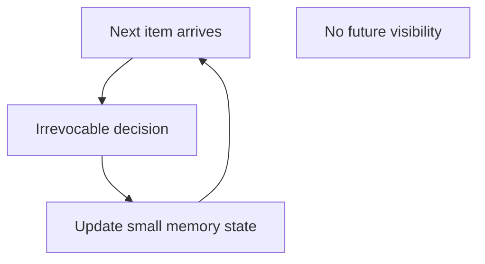
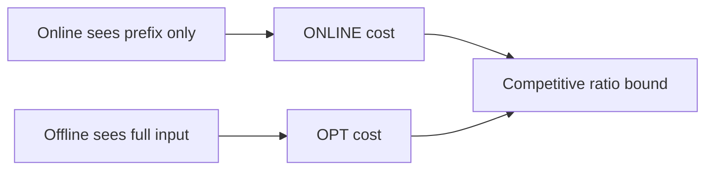
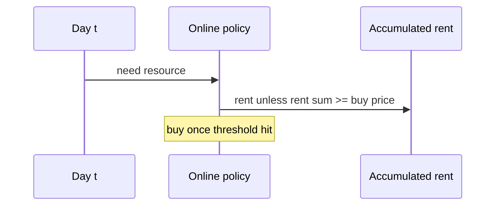

# Online Streaming and Competitive Trade-offs

## Overview

**Online algorithms** process input **one piece at a time** and must decide irrevocably without seeing the future. **Streaming algorithms** restrict memory sublinear in input size. **Competitive ratio** compares online cost to optimal offline cost: `CR = sup_I (ONLINE(I) / OPT(I))` for minimization.

Distributed stream processors (Flink, Kafka) → [[09-System-Design/README|System Design]]; this note covers algorithmic contracts and ratio reasoning in single-process settings.

## Learning Objectives

- Define online vs offline and competitive ratio
- Analyze ski-rental and caching toy models
- Relate reservoir sampling to streaming memory bounds
- Identify adversarial order inputs breaking naive online policies
- Document when amortized offline preprocessing beats strict online

## Prerequisites

- [[05-Algorithms/12-Randomized-Approximation-and-Online/Reservoir Sampling|Reservoir Sampling]]
- [[05-Algorithms/01-Complexity-and-Analysis/Worst Average Expected and Amortized Cases|Worst Average Expected and Amortized Cases]]
- [[05-Algorithms/05-Greedy-Algorithms/Greedy Choice and Exchange Arguments|Greedy Choice and Exchange Arguments]]

## Difficulty

`advanced`

## Estimated Time

- Reading: 2 hours
- Exercises: 3.5 hours
- Mini project: 4 hours

## History

Sleator and Tarjan (1985) formalized competitive analysis for paging. Online matching and secretary problems shaped pricing and allocation theory. Modern observability pipelines inherit streaming memory constraints from this literature.

## Problem It Solves

**Cache eviction** without knowing future references. **CDN lease vs buy** (ski-rental): choose rental until buy becomes cheaper without knowing trip length. **Metric sampling**: reservoir for unbiased subset with O(k) memory ([[05-Algorithms/12-Randomized-Approximation-and-Online/Reservoir Sampling|Reservoir Sampling]]). Wrong model: assuming you can reorder stream offline.

## Internal Implementation

### Ski-rental (2-competitive)

Rent until total rent equals buy cost, then buy. Worst case ratio 2 vs offline optimum.

### Streaming frequency sketch (concept)

Count-min sketch uses sublinear memory with error—probabilistic guarantees; distinct from exact offline counts.

### Adversary

Offline adversary knows algorithm; chooses worst order consistent with revealed prefix.



## Mermaid Diagrams

### Structure: online vs offline



### Sequence: ski-rental decision



## Examples

### Minimal Example — ski-rental + reservoir link

```typescript
function skiRental(days: number, rentPerDay: number, buyPrice: number): number {
  let cost = 0;
  let owned = false;
  for (let d = 1; d <= days; d++) {
    if (!owned) {
      if (cost + rentPerDay >= buyPrice) {
        cost = buyPrice;
        owned = true;
      } else {
        cost += rentPerDay;
      }
    }
  }
  return cost;
}

function countDistinctApprox(stream: number[], buckets: number): Map<number, number> {
  const freq = new Map<number, number>();
  for (const x of stream) {
    const b = x % buckets;
    freq.set(b, (freq.get(b) ?? 0) + 1);
  }
  return freq; // toy; production uses Count-Min Sketch
}
```

```python
def ski_rental(days: int, rent_per_day: float, buy_price: float) -> float:
    cost = 0.0
    owned = False
    for _ in range(days):
        if owned:
            continue
        if cost + rent_per_day >= buy_price:
            cost = buy_price
            owned = True
        else:
            cost += rent_per_day
    return cost


def reservoir_then_summarize(stream, k: int, rng) -> list:
    from collections import Counter

    sample = []
    for i, item in enumerate(stream, start=1):
        if i <= k:
            sample.append(item)
        else:
            j = rng.randint(1, i)
            if j <= k:
                sample[j - 1] = item
    return Counter(sample).most_common(5)
```

### Production-Shaped Example

**Auto-scaling lease policy**: compare reserved instances (buy) vs on-demand (rent) using ski-rental threshold with hysteresis to avoid flapping—competitive analysis informs threshold, not replaces workload forecasting ([[09-System-Design/README|System Design]]). **Log tail**: reservoir sample + approximate distinct via HyperLogLog in Redis—document error bounds vs exact offline set.

## Correctness

**Ski-rental proof sketch**: offline either buys immediately or never; online threshold strategy costs at most 2× either case.

**Reservoir**: unbiased sample—not competitive ratio problem but streaming memory correctness ([[05-Algorithms/12-Randomized-Approximation-and-Online/Reservoir Sampling|Reservoir Sampling]] proof).

**Paging LRU**: competitive ratio `O(log cache size)` vs optimal offline (Sleator–Tarjan)—state without full proof here.

## Complexity

| Problem | Memory | Competitive ratio / guarantee |
| --- | --- | --- |
| Reservoir sample k | `O(k)` | Exact uniform sample |
| Ski-rental | `O(1)` | 2-competitive |
| Count-min sketch | `O(1/ε · log 1/δ)` | Approx frequency |
| Offline OPT | Often `O(n)` | Baseline |

## Trade-offs

| Dimension | Online | Offline batch |
| --- | --- | --- |
| Latency | Immediate decision | Wait for full input |
| Optimality | Bounded CR or heuristic | True OPT possible |
| Memory | Often sublinear | May need O(n) |
| Adversary risk | Must design for worst order | Order irrelevant |

### When to Use

- Decisions must happen before stream ends
- Memory bounded sublinear in n
- Provable competitive ratio acceptable vs OPT

### When Not to Use

- Full data already available—run offline optimizer
- Need exact distinct/frequency without error budget
- Distributed exactly-once aggregation semantics—system design layer

## Exercises

1. Prove ski-rental 2-competitive against offline optimum.
2. Give stream order where greedy caching hits worst-case ratio.
3. Simulate reservoir + compare mean to population on biased stream.
4. Define competitive ratio for maximization problems.
5. When does "amortized online" differ from competitive analysis?

## Mini Project

Ski-rental simulator with adversarial day sequences vs offline OPT plot.

## Portfolio Project

Streaming analytics doc: which metrics exact vs approximate vs sampled.

## Interview Questions

1. Online vs offline algorithm?
2. Ski-rental competitive ratio?
3. Why reservoir sampling for streams?
4. What is an adversary in competitive analysis?
5. LRU paging competitive result (qualitative)?

### Stretch / Staff-Level

1. Relate secretary problem (1/e) to hiring pipeline with recall constraints.

## Common Mistakes

- Applying offline DP to streaming API without rework
- Ignoring item order adversary
- Confusing competitive ratio with approximation ratio ([[05-Algorithms/12-Randomized-Approximation-and-Online/Approximation Ratios and Heuristics|Approximation Ratios]])
- Exact distinct counts on infinite stream without sketch error budget

## Best Practices

- State online irrevocability in API contracts
- Pair sketches with documented ε-δ error
- Benchmark online policy against offline OPT on logged replays
- Cross-link System Design for distributed stream semantics

## Summary

Online and streaming algorithms decide under partial information and memory limits; competitive ratio quantifies worst-case overhead versus offline optimum. Ski-rental and reservoir sampling exemplify irrevocable and memory-bounded policies—production systems must match problem model (online vs batch) and communicate guarantees honestly.

## Further Reading

- [[05-Algorithms/12-Randomized-Approximation-and-Online/Reservoir Sampling|Reservoir Sampling]]
- [[05-Algorithms/12-Randomized-Approximation-and-Online/Approximation Ratios and Heuristics|Approximation Ratios and Heuristics]]

## Related Notes

- [[05-Algorithms/12-Randomized-Approximation-and-Online/Reservoir Sampling|Reservoir Sampling]]
- [[05-Algorithms/02-Searching-and-Selection/Order Statistics Median and Top-K Trade-offs|Order Statistics Median and Top-K Trade-offs]]
- [[05-Algorithms/13-Production-Selection-and-Interview-Patterns/From In-Memory Algorithms to Production Systems|From In-Memory Algorithms to Production Systems]]
- [[05-Algorithms/README|Algorithms]]

## Progress Checklist

- [ ] Explained from first principles
- [ ] Drew at least one Mermaid diagram
- [ ] Implemented a minimal version
- [ ] Documented trade-offs and non-goals
- [ ] Completed exercises
- [ ] Practiced interview questions aloud
- [ ] Linked prerequisites and dependents
