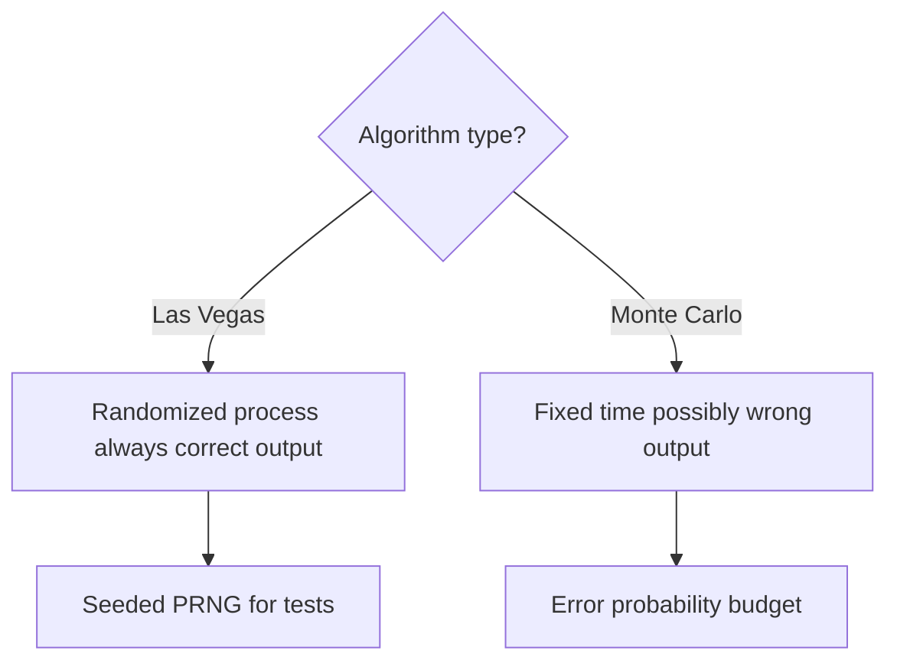
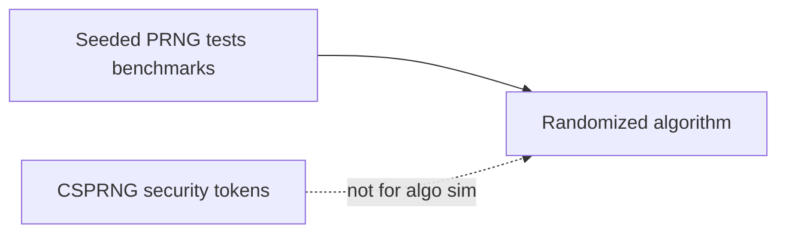
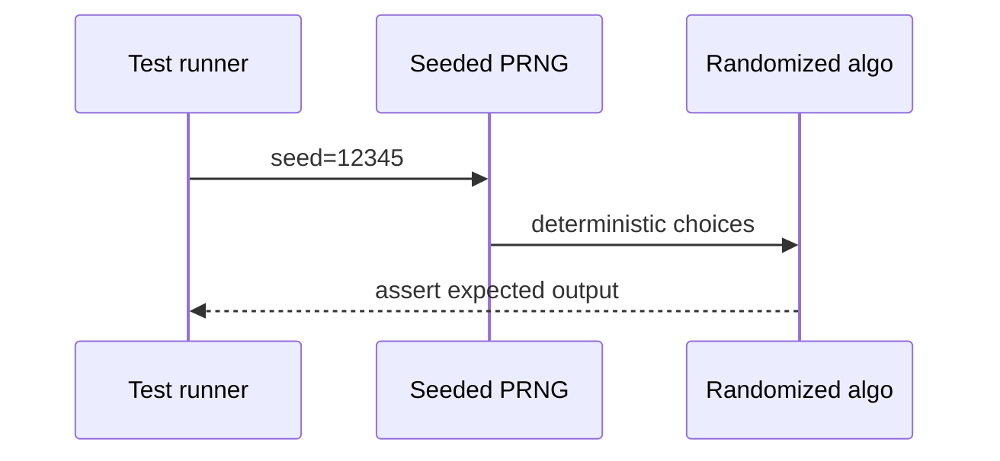

# Randomized Algorithms and Reproducible RNG

## Overview

**Randomized algorithms** use explicit random choices during execution. **Las Vegas** algorithms always return correct output; runtime is random (e.g., quicksort with random pivot). **Monte Carlo** algorithms may err with bounded probability; runtime deterministic (e.g., Miller–Rabin primality). Production requires **reproducible RNG**: seeded PRNG streams, logged seeds, and separation of crypto-random vs simulation-random sources.

Distributed consensus randomness → [[09-System-Design/08-Coordination-Consensus-and-Locks/Consensus Intuition Raft and Paxos for Designers|Consensus Intuition Raft and Paxos for Designers]]; this note covers in-memory algorithmic use.

## Learning Objectives

- Distinguish Las Vegas vs Monte Carlo contracts
- Analyze expected complexity vs worst-case adversarial inputs
- Implement seeded PRNG wrappers for tests and benchmarks
- Document error probability budgets for Monte Carlo outputs
- Avoid accidental non-determinism in CI regression gates

## Prerequisites

- [[05-Algorithms/01-Complexity-and-Analysis/Worst Average Expected and Amortized Cases|Worst Average Expected and Amortized Cases]]
- [[01-Computer-Science/09-Correctness-and-Reliability/Invariants Assertions and Contracts|Invariants Assertions and Contracts]]

## Difficulty

`intermediate`

## Estimated Time

- Reading: 1.5 hours
- Exercises: 3 hours
- Mini project: 4 hours

## History

Randomized quicksort (Hoare, 1960s) showed expected `O(n log n)` without deterministic pivot rules. Karger's min-cut (1993) and Freivalds' matrix verification exemplify Monte Carlo speed with proof obligations on error rates.

## Problem It Solves

**Global min-cut approximation** via Karger contractions. **Quickselect** expected linear time. **Property testing** on large data where exact is expensive. Failures occur when teams use `Math.random()` without seeds in tests, causing flaky CI and unreproducible benchmarks.

## Internal Implementation

### PRNG discipline

- Tests: fixed seed (`42`) per case
- Benchmarks: seed sweep with reported variance
- Production sampling: crypto RNG for security; seeded for simulations only

### Las Vegas template

Repeat randomized step until valid certificate; expected iterations bounded.

### Monte Carlo template

Compute answer with randomness; accept error prob `ε`; amplify by independent runs (`k` runs → error `(1-ε)^k`).



## Mermaid Diagrams

### Structure: RNG layers



### Sequence: reproducible test run



## Examples

### Minimal Example — seeded shuffle + Las Vegas retry

```typescript
function mulberry32(seed: number): () => number {
  return () => {
    seed |= 0;
    seed = (seed + 0x6d2b79f5) | 0;
    let t = Math.imul(seed ^ (seed >>> 15), 1 | seed);
    t = (t + Math.imul(t ^ (t >>> 7), 61 | t)) ^ t;
    return ((t ^ (t >>> 14)) >>> 0) / 4294967296;
  };
}

function randomizedQuickselect(arr: number[], k: number, rng: () => number): number {
  const a = arr.slice();
  function select(lo: number, hi: number): number {
    if (lo === hi) return a[lo];
    const pivotIdx = lo + Math.floor(rng() * (hi - lo + 1));
    const pivot = a[pivotIdx];
    [a[pivotIdx], a[hi]] = [a[hi], a[pivotIdx]];
    let store = lo;
    for (let i = lo; i < hi; i++) if (a[i] < pivot) [a[store++], a[i]] = [a[i], a[store]];
    [a[store], a[hi]] = [a[hi], a[store]];
    if (k === store) return a[store];
    return k < store ? select(lo, store - 1) : select(store + 1, hi);
  }
  return select(0, a.length - 1);
}
```

```python
import random


class SeededRng:
    def __init__(self, seed: int) -> None:
        self._rng = random.Random(seed)

    def random(self) -> float:
        return self._rng.random()

    def randint(self, a: int, b: int) -> int:
        return self._rng.randint(a, b)


def monte_carlo_pi(samples: int, rng: SeededRng) -> float:
    inside = 0
    for _ in range(samples):
        x, y = rng.random(), rng.random()
        if x * x + y * y <= 1.0:
            inside += 1
    return 4.0 * inside / samples
```

### Production-Shaped Example

**A/B experiment simulator**: seeded PRNG per scenario ID for reproducible variance reports. **Security token generation**: never use mulberry32—use OS CSPRNG. Log `{algorithm, seed, version}` in benchmark artifacts linked to [[05-Algorithms/13-Production-Selection-and-Interview-Patterns/Profiling Correctness and Regression Gates|Profiling Correctness and Regression Gates]].

## Correctness

**Las Vegas**: output always satisfies postconditions; prove expected termination and expected time.

**Monte Carlo**: output wrong with prob `≤ ε`; amplify by repetition; document confidence.

**Reproducibility**: same seed + same PRNG algorithm + same platform integer semantics ⇒ same choices (watch 32-bit vs 64-bit).

**Not correctness**: "looks random" without seed discipline in tests.

## Complexity

| Algorithm class | Typical measure | Example |
| --- | --- | --- |
| Las Vegas | Expected time | Randomized quicksort `O(n log n)` expected |
| Monte Carlo | Error + fixed time | Freivalds `O(n²)` matrix check, error `1/2` |
| Amplification | `k` runs | Error → `(1/2)^k` |

Worst-case adversarial inputs may degrade Las Vegas (quicksort `O(n²)` bad pivots)—use introsort fallback ([[05-Algorithms/03-Sorting/Quicksort Partitioning and Introspective Fallbacks|Quicksort Partitioning]]).

## Trade-offs

| Dimension | Deterministic | Randomized |
| --- | --- | --- |
| Worst-case bounds | Often clearer | May be poor |
| Expected performance | May be suboptimal | Often simpler |
| Test reproducibility | Easy | Needs seeds |
| Adversarial inputs | Predictable risk | Pivot/permutation attacks |

### When to Use

- Expected linear time simpler than deterministic (quickselect)
- Approximation with provable error decay (Monte Carlo)
- Sampling sketches ([[05-Algorithms/12-Randomized-Approximation-and-Online/Reservoir Sampling|Reservoir Sampling]])

### When Not to Use

- Regulated correctness without error budget documentation
- Cryptographic unpredictability from PRNG
- Hard real-time with strict worst-case latency without fallback

## Exercises

1. Prove expected `O(n log n)` for randomized quicksort on distinct keys.
2. Run Monte Carlo π estimate; measure error vs sample count.
3. Design test harness fixing seed; demonstrate flake without seed.
4. Karger min-cut: why repeat improves success probability?
5. Distinguish when to use `crypto.randomBytes` vs seeded PRNG.

## Mini Project

Seeded RNG wrapper shared by all algorithm labs with JSON `{seed, engine}` metadata.

## Portfolio Project

Benchmark report: deterministic vs randomized quickselect on adversarial arrays with seed sweeps.

## Interview Questions

1. Las Vegas vs Monte Carlo?
2. Why seed RNG in tests?
3. Expected vs worst-case for randomized quicksort?
4. How reduce Monte Carlo error probability?
5. When is randomized algorithm wrong choice in production?

### Stretch / Staff-Level

1. Derive success probability after `t` Karger min-cut runs on `n` vertices.

## Common Mistakes

- Unseeded `Math.random()` in unit tests
- Using Monte Carlo output without error bounds
- Crypto and simulation RNG confusion
- Assuming expected time equals worst-case SLA

## Best Practices

- Centralize `SeededRng` module; ban bare random in tests
- Document error probability for Monte Carlo decisions
- Pair randomized core with deterministic fallback for adversarial paths
- Log seeds in CI artifacts for failure replay

## Summary

Randomized algorithms trade deterministic worst-case clarity for often simpler expected-time behavior or fixed-time approximate answers. Las Vegas guarantees correctness; Monte Carlo guarantees speed with bounded error. Production adoption requires seeded reproducibility, explicit error budgets, and separation from cryptographic randomness.

## Further Reading

- [[05-Algorithms/12-Randomized-Approximation-and-Online/Reservoir Sampling|Reservoir Sampling]]
- [[05-Algorithms/03-Sorting/Quicksort Partitioning and Introspective Fallbacks|Quicksort Partitioning and Introspective Fallbacks]]

## Related Notes

- [[05-Algorithms/01-Complexity-and-Analysis/Worst Average Expected and Amortized Cases|Worst Average Expected and Amortized Cases]]
- [[05-Algorithms/02-Searching-and-Selection/Quickselect and Partition-Based Selection|Quickselect and Partition-Based Selection]]
- [[05-Algorithms/12-Randomized-Approximation-and-Online/Approximation Ratios and Heuristics|Approximation Ratios and Heuristics]]
- [[05-Algorithms/13-Production-Selection-and-Interview-Patterns/Profiling Correctness and Regression Gates|Profiling Correctness and Regression Gates]]
- [[05-Algorithms/README|Algorithms]]

## Progress Checklist

- [ ] Explained from first principles
- [ ] Drew at least one Mermaid diagram
- [ ] Implemented a minimal version
- [ ] Documented trade-offs and non-goals
- [ ] Completed exercises
- [ ] Practiced interview questions aloud
- [ ] Linked prerequisites and dependents
